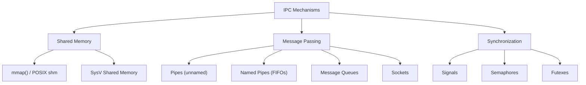
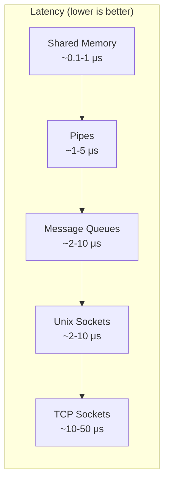
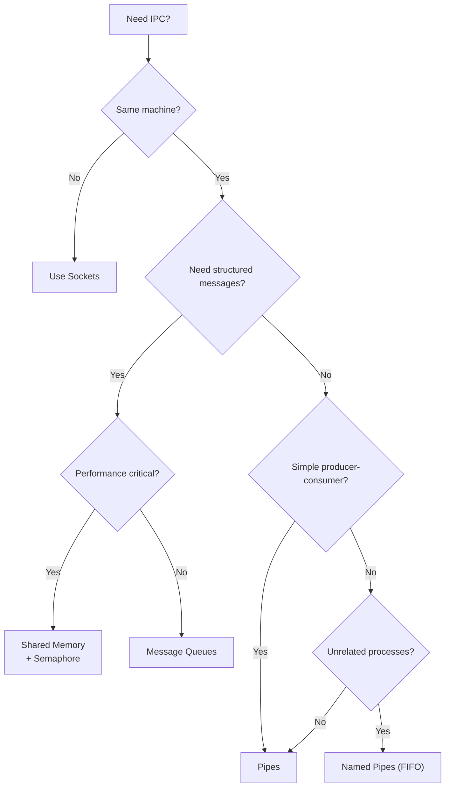
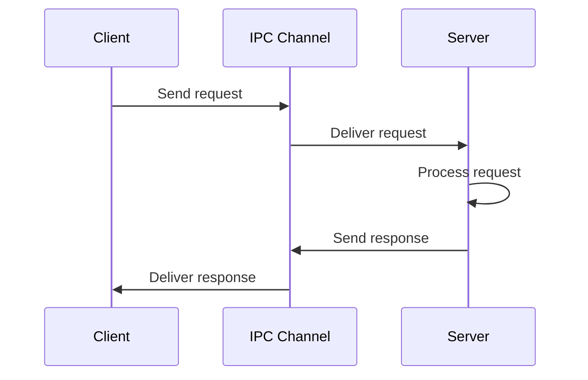
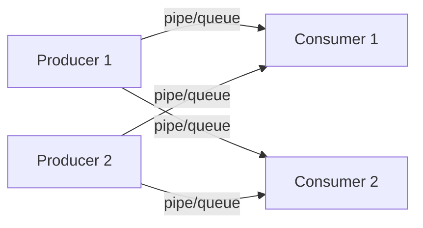
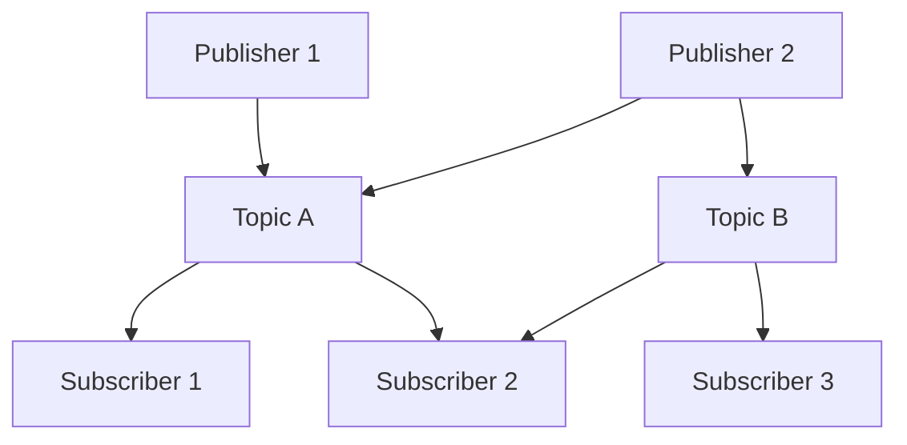

# Inter-Process Communication (IPC)

## Overview

**Inter-Process Communication (IPC)** refers to mechanisms that allow processes to exchange data and synchronize their actions. Since each process has its own address space, processes cannot directly access each other's memory — they need OS-provided IPC mechanisms.

> **Interview one-liner:** "IPC is the set of OS mechanisms that allow isolated processes to communicate and coordinate, since they can't directly access each other's memory."

## Why is IPC Needed?

1. **Data sharing:** Multiple processes need access to the same data
2. **Computation speedup:** Break a task into parallel sub-tasks
3. **Modularity:** Separate concerns into different processes
4. **Service composition:** Databases, web servers, and microservices communicating
5. **Event notification:** One process needs to signal another

## Classification of IPC Mechanisms



## Comparison Table

| Mechanism | Data Transfer | Speed | Complexity | Network Support | Direction |
|-----------|--------------|-------|------------|-----------------|-----------|
| **Pipes** | Byte stream | Fast | Low | No | Unidirectional |
| **Named Pipes (FIFO)** | Byte stream | Fast | Low | No | Unidirectional |
| **Message Queues** | Structured messages | Medium | Medium | No | Bidirectional |
| **Shared Memory** | Shared address space | Fastest | High | No | Bidirectional |
| **Sockets** | Byte stream/datagrams | Medium | Medium | Yes | Bidirectional |
| **Signals** | Signal number only | Fast | Low | Yes (TCP) | Asynchronous |

## Performance Comparison



## Choosing the Right IPC Mechanism



## Detailed Mechanisms

| Mechanism | Page |
|-----------|------|
| [Pipes](./ipc-pipes.md) | Unnamed and named pipes |
| [Message Queues](./ipc-message-queues.md) | POSIX and SysV message queues |
| [Shared Memory](./ipc-shared-memory.md) | Fastest IPC via shared address space |
| [Sockets](./ipc-sockets.md) | Network-capable IPC |
| [Signals](./ipc-signals.md) | Asynchronous notifications |

## IPC in Linux

### Viewing IPC Resources

```bash
# List all IPC resources
ipcs

# Output:
# ------ Shared Memory Segments --------
# key        shmid      owner      perms      bytes      nattch     status
# 0x00000000 0          root       644        80         2
#
# ------ Semaphore Arrays --------
# key        semid      owner      perms      nsems
#
# ------ Message Queues --------
# key        msqid      owner      perms      used-bytes   messages

# Detailed info
ipcs -l    # System limits
ipcs -u    # Current usage

# Remove IPC resources
ipcrm -m <shmid>    # Remove shared memory
ipcrm -q <msqid>    # Remove message queue
ipcrm -s <semid>    # Remove semaphore
```

### IPC Limits

```bash
# View IPC limits
cat /proc/sys/kernel/msgmni    # Max message queues
cat /proc/sys/kernel/msgmax    # Max message size
cat /proc/sys/kernel/shmmax    # Max shared memory segment size
cat /proc/sys/kernel/shmmni    # Max shared memory segments
cat /proc/sys/kernel/sem       # Semaphore limits
```

## IPC Patterns

### 1. Client-Server



### 2. Pipeline (Producer-Consumer)



### 3. Pub-Sub (Publish-Subscribe)



## Interview Questions

### Beginner

**Q1: What is IPC and why is it needed?**  
A: IPC (Inter-Process Communication) is the set of mechanisms that allow processes to exchange data. It's needed because processes have isolated address spaces — they cannot directly access each other's memory.

**Q2: Name three IPC mechanisms.**  
A: Pipes (byte stream between related processes), shared memory (fastest — processes map the same physical memory), and message queues (structured messages with priorities).

**Q3: What is the fastest IPC mechanism?**  
A: Shared memory — processes read/write to the same physical memory with no kernel involvement after setup. Only needs synchronization (semaphores/mutexes) to prevent races.

### Intermediate

**Q4: Compare pipes and message queues.**  
A: Pipes: byte stream, unidirectional, no message boundaries, related processes only (unnamed), simple API. Message queues: structured messages, bidirectional, message boundaries preserved, can be accessed by unrelated processes, supports priorities.

**Q5: When would you use sockets over shared memory?**  
A: Use sockets when: 1) Processes are on different machines (network), 2) Need connection-oriented communication, 3) Want standard networking APIs. Use shared memory when: on the same machine, need maximum performance, willing to handle synchronization manually.

**Q6: How do you handle synchronization with shared memory?**  
A: Shared memory itself provides no synchronization. Common approaches: 1) POSIX semaphores (`sem_wait`/`sem_post`), 2) Mutexes (via `pthread_mutex` with `PTHREAD_PROCESS_SHARED`), 3) Futexes (lightweight kernel-assisted locks), 4) Spinlocks (for very short critical sections), 5) Memory barriers for lock-free algorithms.

### FAANG-Level

**Q7: Design an IPC system for a high-frequency trading platform.**  
A: Requirements: ultra-low latency (<1 μs), high throughput, reliability. Design: 1) **Shared memory** for market data feed — lock-free ring buffer with single-producer/single-consumer, 2) **Memory barriers** (not mutexes) for synchronization, 3) **Huge pages** to avoid TLB misses, 4) **CPU affinity** to pin reader/writer to specific cores, 5) **Busy-polling** (no context switches), 6) **DPDK** or kernel bypass for network I/O, 7) Use `io_uring` for async I/O when blocking is acceptable.

**Q8: How would you implement a microservice communication framework?**  
A: 1) **Local services:** Unix domain sockets or shared memory with a serialization layer (protobuf/flatbuffers), 2) **Remote services:** gRPC (HTTP/2 + protobuf) or custom TCP with framing, 3) **Service discovery:** DNS or dedicated registry (etcd, Consul), 4) **Reliability:** Retry with exponential backoff, circuit breakers, timeouts, 5) **Serialization:** Protobuf (compact, fast) or MessagePack, 6) **Load balancing:** Client-side (round-robin) or server-side (envoy).

**Q9: Compare Linux IPC mechanisms performance-wise and explain the kernel overhead.**  
A: **Shared memory** (~0.1-1 μs): Setup requires syscall (`shmget`/`mmap`), but actual data transfer is user-space memcpy. Kernel overhead: page table setup, TLB shootdown on unmap. **Pipes** (~1-5 μs): Each read/write is a syscall. Kernel copies data from kernel buffer. **Unix sockets** (~2-10 μs): Similar to pipes but with socket overhead. **Message queues** (~2-10 μs): Syscall per send/receive, kernel manages queue. **TCP sockets** (~10-50 μs): Full TCP stack overhead. Optimization: `io_uring` can batch multiple IPC operations into a single syscall.

## Common Mistakes

1. **Not handling partial reads/writes:** Pipes and sockets are byte streams — a single `write()` may require multiple `read()` calls.
2. **Forgetting synchronization with shared memory:** Without proper locking, shared memory leads to data races.
3. **Using pipes for bidirectional communication:** Pipes are unidirectional. Use two pipes or sockets.
4. **Ignoring IPC resource leaks:** Shared memory segments and message queues persist until explicitly removed. Always clean up with `ipcrm` or `shmctl(IPC_RMID)`.
5. **Assuming message queues are FIFO:** Message queues support priorities — higher-priority messages are dequeued first.

## Summary

| Mechanism | Speed | Direction | Related Processes? | Network? |
|-----------|-------|-----------|-------------------|----------|
| Pipes | Fast | Unidirectional | Yes (parent-child) | No |
| Named Pipes | Fast | Unidirectional | No | No |
| Message Queues | Medium | Bidirectional | No | No |
| Shared Memory | Fastest | Bidirectional | No | No |
| Sockets | Medium | Bidirectional | No | Yes |
| Signals | Fast | Asynchronous | No | No (mostly) |

## Cross-References

- [Pipes](./ipc-pipes.md) - Detailed pipe mechanics
- [Message Queues](./ipc-message-queues.md) - Structured message passing
- [Shared Memory](./ipc-shared-memory.md) - Fastest IPC mechanism
- [Sockets](./ipc-sockets.md) - Network-capable IPC
- [Signals](./ipc-signals.md) - Asynchronous notifications
- [Synchronization](../synchronization/README.md) - Coordination primitives
- [Threads](../threads/README.md) - Threads share memory (no IPC needed)
