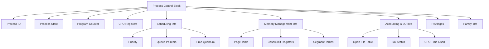
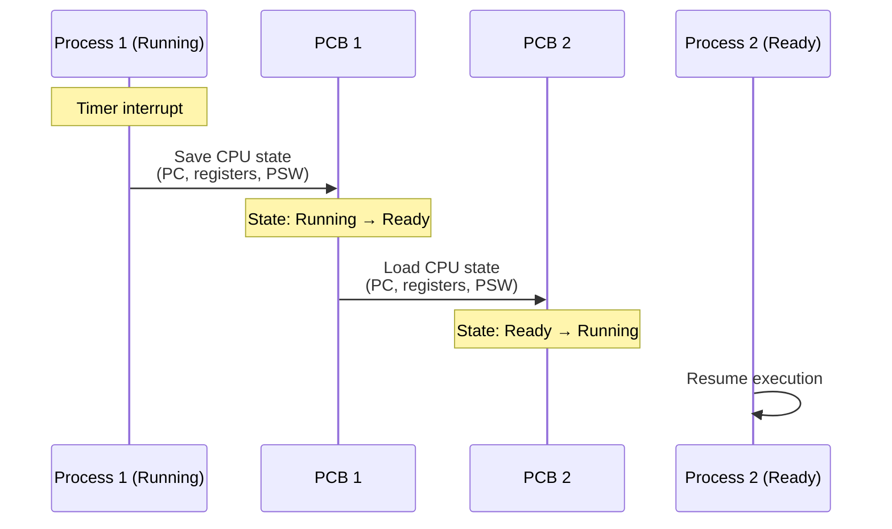

# Process Control Block (PCB)

## Overview

The **Process Control Block (PCB)** is a data structure maintained by the operating system kernel for every process. It contains all the information the OS needs to manage and track a process. Also called a **task descriptor** (Linux: `struct task_struct`) or **process entry**.

> **Interview one-liner:** "The PCB is the OS's representation of a process — it stores everything the kernel needs to know about a process, from its state and registers to its memory layout and open files."

## Why is the PCB Needed?

When the OS performs a **context switch**, it must save the entire state of the current process and load the state of the next process. The PCB is where this state is stored. Without it, the OS couldn't:
- Pause and resume processes
- Schedule processes on the CPU
- Track resource usage
- Enforce security and access control

## PCB Structure



## Detailed PCB Fields

### 1. Process Identification

| Field | Description |
|-------|-------------|
| **PID** | Unique process identifier |
| **PPID** | Parent process ID |
| **UID / GID** | User and group IDs (owner) |
| **Session ID** | Session group for terminal management |
| **Process Group ID** | For job control |

### 2. Process State

| Field | Description |
|-------|-------------|
| **State** | Current state: New, Ready, Running, Waiting, Terminated |
| **Exit code** | Status when terminated |

### 3. CPU Information (Saved on Context Switch)

| Field | Description |
|-------|-------------|
| **Program Counter (PC)** | Address of next instruction to execute |
| **CPU Registers** | General-purpose registers, stack pointer, frame pointer |
| **CPU State / PSW** | Processor status word (flags, mode bits) |
| **Floating Point Registers** | FPU/SSE/AVX register state |

### 4. Scheduling Information

| Field | Description |
|-------|-------------|
| **Priority** | Static or dynamic priority value |
| **Scheduling policy** | SCHED_FIFO, SCHED_RR, SCHED_OTHER (CFS) |
| **Time quantum** | Remaining time slice |
| **Queue pointers** | Links to ready/wait queue |
| **Nice value** | User-adjustable priority (-20 to 19) |

### 5. Memory Management Information

| Field | Description |
|-------|-------------|
| **Page table** | Virtual-to-physical address mapping |
| **Base and limit registers** | For simple memory protection |
| **Segment table** | For segmentation-based systems |
| **Memory map** | List of virtual memory areas (VMAs) |
| **brk pointer** | End of heap |

### 6. I/O and Accounting

| Field | Description |
|-------|-------------|
| **Open file table** | List of open file descriptors |
| **I/O status** | Pending I/O operations |
| **CPU time used** | Total CPU time consumed |
| **Wall clock time** | Real time since process start |
| **Page faults** | Number of page faults |
| **Signal mask** | Blocked signals |
| **Signal handlers** | Handler function pointers |

### 7. Privileges and Security

| Field | Description |
|-------|-------------|
| **Capabilities** | Linux capabilities (CAP_NET_ADMIN, etc.) |
| **Credential** | UID, GID, supplementary groups |
| **Security context** | SELinux/AppArmor labels |

### 8. Family Information

| Field | Description |
|-------|-------------|
| **Parent pointer** | Pointer to parent's PCB |
| **Children list** | List of child PCBs |
| **Sibling pointer** | Next sibling in parent's children list |
| **Thread group** | List of threads (if multi-threaded) |

## Linux Implementation: `task_struct`

In Linux, the PCB is implemented as `struct task_struct` in `<linux/sched.h>`. It's one of the largest data structures in the kernel (~6KB+).

```c
// Simplified structure (Linux kernel)
struct task_struct {
    // State
    volatile long state;           // -1 to TASK_MAX
    int exit_state;
    
    // Identification
    pid_t pid;
    pid_t tgid;                    // Thread group ID
    struct task_struct *real_parent;
    struct task_struct *parent;
    
    // Scheduling
    int prio, static_prio, normal_prio;
    unsigned int policy;
    const struct sched_class *sched_class;
    struct sched_entity se;
    
    // Memory
    struct mm_struct *mm;          // Memory descriptor
    struct mm_struct *active_mm;
    
    // Files
    struct files_struct *files;    // Open file table
    
    // Signals
    struct signal_struct *signal;
    struct sighand_struct *sighand;
    sigset_t blocked, real_blocked;
    
    // Credentials
    const struct cred *cred;
    
    // CPU state
    struct thread_struct thread;   // CPU-specific state
    
    // ... hundreds more fields
};
```

### How to View PCB Info in Linux

```bash
# Process state, memory, credentials
cat /proc/<PID>/status

# Open file descriptors
ls -la /proc/<PID>/fd

# Memory map
cat /proc/<PID>/maps

# Scheduling info
cat /proc/<PID>/sched

# Signal info
cat /proc/<PID>/status | grep -i sig

# All available info
ls /proc/<PID>/
```

## PCB and Context Switching



During a context switch:
1. Timer interrupt occurs (or syscall/blocking I/O)
2. Current process's registers are saved to its PCB
3. PCB is placed in appropriate queue (ready or wait)
4. Scheduler selects next process
5. Next process's PCB state is loaded into CPU registers
6. Execution resumes at the saved program counter

## PCB Storage and Access

- PCBs are stored in a **linked list** or **hash table** in kernel memory
- In Linux, a circular doubly-linked list and a PID hash table
- The `current` macro gives the PCB of the currently running process

```c
// In Linux kernel code
struct task_struct *current_task = current;
printk("Current PID: %d\n", current_task->pid);
```

## Interview Questions

### Beginner

**Q1: What is a PCB and why is it needed?**  
A: A PCB is a kernel data structure that stores all information about a process. It's needed for context switching (saving/restoring process state), scheduling (priority, time quantum), resource tracking (open files, memory), and security (credentials, permissions).

**Q2: What information is stored in the PCB?**  
A: Process ID, process state, program counter, CPU registers, scheduling info (priority, policy), memory management info (page table), I/O info (open files), accounting info (CPU time used), and security credentials.

**Q3: Where is the PCB stored?**  
A: In kernel space (not accessible to user processes). In Linux, it's the `task_struct` allocated in kernel memory, organized in a linked list and hash table for efficient access.

### Intermediate

**Q4: How does the PCB relate to context switching?**  
A: During a context switch, the OS saves the current process's CPU state (registers, PC) into its PCB, then loads the next process's state from its PCB into the CPU. The PCB is the "snapshot" of a process at any point in time.

**Q5: How large is a PCB? Does size matter?**  
A: Linux `task_struct` is ~6-8KB (varies by kernel version). Size matters because: 1) More PCBs = more kernel memory overhead, 2) Context switch involves reading/writing PCB data, 3) Cache efficiency during traversal. Modern kernels optimize by keeping frequently-accessed fields at the beginning of the struct.

**Q6: What happens to the PCB when a process terminates?**  
A: The PCB transitions to a zombie state — most resources are freed, but the PCB remains (with exit code and timing info) until the parent calls `wait()`. After `wait()`, the PCB is deallocated. If the parent doesn't call `wait()`, the zombie PCB persists (resource leak).

### FAANG-Level

**Q7: How does Linux's `task_struct` handle thread groups?**  
A: All threads in a process share the same `mm_struct` (memory), `files_struct` (file descriptors), and `signal_struct`. Each thread has its own `task_struct` with a unique `pid` but shares the same `tgid` (thread group ID, which equals the main thread's PID). `getpid()` returns `tgid`; `gettid()` returns `pid`. The threads are linked via the `thread_group` list.

**Q8: Design a PCB for a real-time operating system.**  
A: Key additions over a standard PCB: 1) **Deadline** and **period** fields for periodic tasks, 2) **Worst-case execution time (WCET)**, 3) **Priority ceiling** for priority inheritance protocol, 4) **Resource reservation** (CPU budget per period), 5) **Deterministic memory allocation** (no dynamic allocation), 6) **Interrupt latency tracking**. See: Rate-Monotonic Analysis (RMA) and Earliest Deadline First (EDF).

**Q9: How would you optimize PCB access for high-frequency context switches?**  
A: 1) **Cache line alignment:** Place frequently accessed fields (state, priority, PC, registers) in the same cache line, 2) **Split PCB:** Hot data (scheduling, state) in one struct, cold data (accounting, I/O) in another, 3) **Per-CPU PCB cache:** Keep the last N PCBs in per-CPU cache, 4) **Lock-free state transitions:** Use atomic operations for state changes, 5) **NUMA-aware allocation:** Allocate PCB on the same NUMA node as the CPU that runs the process most.

## Common Mistakes

1. **Confusing PCB with process memory:** The PCB is metadata *about* the process stored in kernel space. The process's own memory (code, data, heap, stack) is separate.
2. **Assuming PCB is fixed size:** While `task_struct` has a fixed size, the data it points to (open file table, page table) is dynamically sized.
3. **Forgetting PCB persists as zombie:** After `exit()`, the PCB isn't immediately freed — it waits for `wait()`.
4. **Thinking user code can access PCB:** The PCB is in kernel space. User code accesses process info through `/proc` or system calls.

## Summary

| Aspect | Key Point |
|--------|-----------|
| Definition | Kernel data structure storing all process information |
| Purpose | Context switching, scheduling, resource tracking, security |
| Linux Name | `struct task_struct` (~6-8KB) |
| Location | Kernel memory (not accessible from user space) |
| Contents | PID, state, PC, registers, priority, page table, open files, credentials |
| Lifecycle | Created with process → updated during execution → zombie on exit → freed on `wait()` |

## Cross-References

- [Process States](./states.md) - The state field in the PCB
- [Context Switching](./context-switching.md) - How PCB is used during switches
- [Process Creation](./creation.md) - How PCBs are created
- [Scheduling](../scheduling/README.md) - How scheduler uses PCB fields
- [Threads](../threads/README.md) - How threads share PCB data


## Cross References

- [Process States](../os/processes/states.md)
- [Context Switching](../os/processes/context-switching.md)
- [Registers](../arch/cpu/registers.md)
