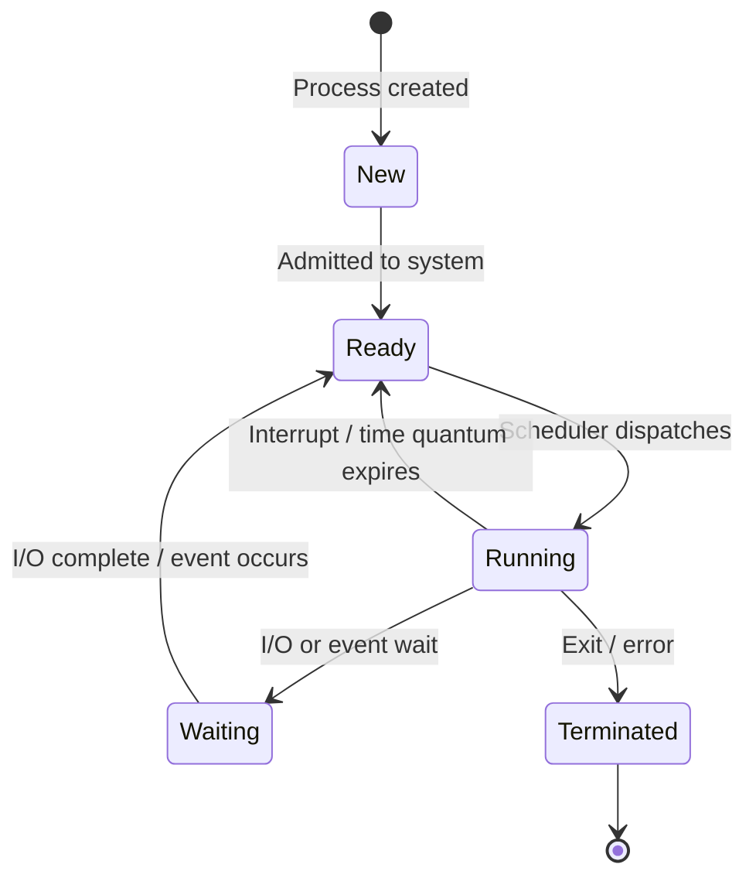
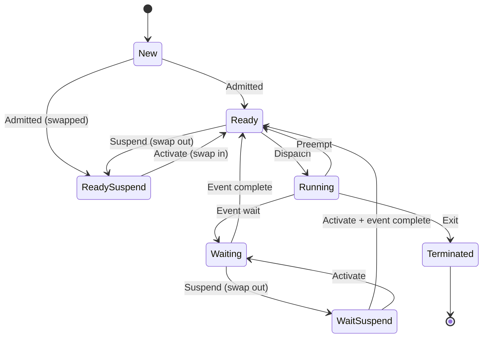
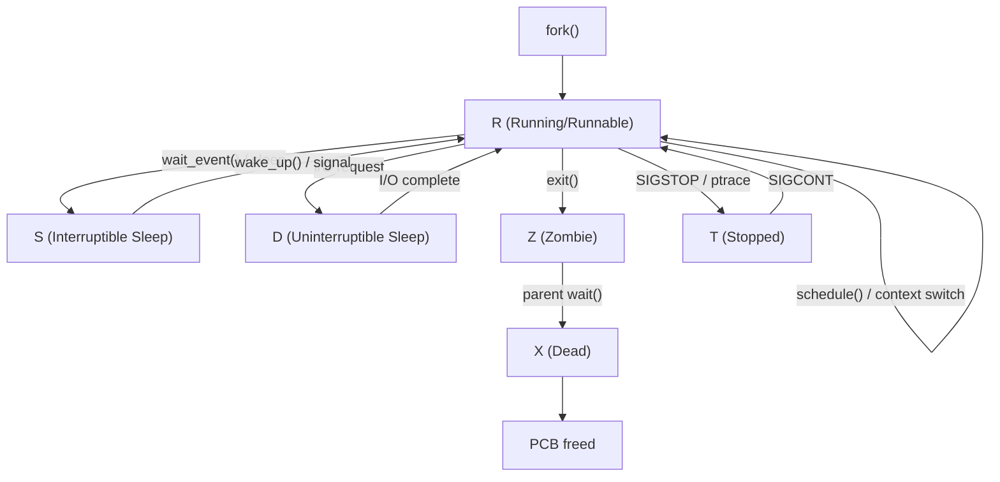
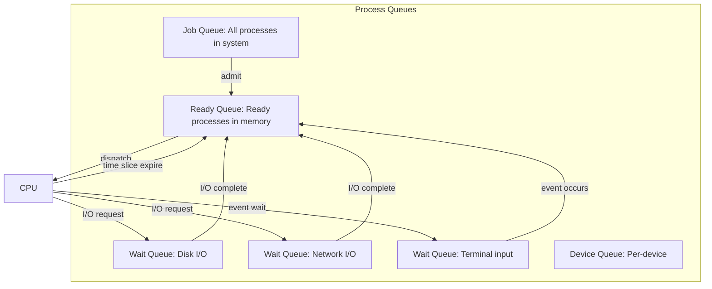

# Process States

## Overview

A process transitions through several states during its lifetime. The OS uses these states to manage process scheduling, resource allocation, and execution. Understanding process states is fundamental to understanding how the OS works.

## The Five-State Process Model



### State Descriptions

| State | Description | Location |
|-------|-------------|----------|
| **New** | Process is being created (allocating PCB, memory) | Being set up |
| **Ready** | Process is ready to run, waiting for CPU | Ready queue |
| **Running** | Process is executing on the CPU | CPU |
| **Waiting (Blocked)** | Process is waiting for an event (I/O, signal) | Wait queue |
| **Terminated** | Process has finished execution | Being cleaned up |

### State Transitions Explained

| Transition | Trigger | Example |
|------------|---------|---------|
| New → Ready | OS admits process | `fork()` completes, child added to ready queue |
| Ready → Running | Scheduler dispatches | Scheduler picks highest-priority ready process |
| Running → Ready | Preemption | Timer interrupt, higher-priority process arrives |
| Running → Waiting | I/O or event request | `read()` from disk, `wait()` for child, `sleep()` |
| Waiting → Ready | Event completion | Disk I/O completes, signal arrives, child exits |
| Running → Terminated | Process exits | `exit()` call, fatal signal (SIGKILL), `return` from `main()` |

## Extended Seven-State Model

Real OS implementations use more states for efficiency:



### Additional States

| State | Description |
|-------|-------------|
| **Ready (Suspended)** | Ready but swapped out to disk; must be swapped in before running |
| **Waiting (Suspended)** | Waiting and swapped out to disk |

**Why suspended states?** When memory is full, the OS can **swap out** processes to disk to free RAM for other processes. This is part of **medium-term scheduling**.

## Linux Process States

Linux uses a more granular set of states (visible in `ps` and `/proc`):

```
┌─────────────────────────────────────────────────────────────┐
│                    Linux Process States                      │
├──────────┬──────────────────────────────────────────────────┤
│ State    │ Description                                      │
├──────────┼──────────────────────────────────────────────────┤
│ R        │ Running or runnable (on run queue)               │
│ S        │ Sleeping (interruptible — can be woken by signal)│
│ D        │ Disk sleep (uninterruptible — waiting for I/O)   │
│ Z        │ Zombie (terminated, waiting for parent to reap)  │
│ T        │ Stopped (by signal or debugger)                  │
│ t        │ Traced (stopped by debugger)                     │
│ X        │ Dead (should never be seen)                      │
│ I        │ Idle (kernel thread, Linux 4.14+)               │
└──────────┴──────────────────────────────────────────────────┘
```

```bash
# View process states
ps aux
# USER  PID  %CPU %MEM  VSZ   RSS TTY STAT START TIME COMMAND
# root    1  0.0  0.1 169440 10340 ?   Ss   Jul01 0:05 /sbin/init

# STAT column: S=sleeping, R=running, D=disk sleep, Z=zombie, T=stopped
# Additional modifiers: s=session leader, +=foreground, l=multi-threaded, < =high priority
```

### Linux State Transitions



### `D` State — The Uninterruptible Sleep

The `D` state is unique to Linux. A process in `D` state:
- Is waiting for I/O (typically disk)
- **Cannot be interrupted by signals** (not even SIGKILL)
- Will only wake up when the I/O completes

```bash
# Find D-state processes
ps aux | awk '$8 ~ /D/'

# Common cause: NFS server down, slow disk, kernel bug
# If many D-state processes: check disk health, NFS mounts
```

## Process Queues

The OS maintains queues for each state:



### Queue Implementation

```c
// Simplified ready queue (linked list)
struct process_node {
    struct pcb *process;
    struct process_node *next;
};

struct ready_queue {
    struct process_node *head;
    struct process_node *tail;
    int count;
};

void enqueue(struct ready_queue *q, struct pcb *p) {
    struct process_node *node = malloc(sizeof(struct process_node));
    node->process = p;
    node->next = NULL;
    if (q->tail) q->tail->next = node;
    else q->head = node;
    q->tail = node;
    q->count++;
}

struct pcb *dequeue(struct ready_queue *q) {
    if (!q->head) return NULL;
    struct process_node *node = q->head;
    q->head = node->next;
    if (!q->head) q->tail = NULL;
    struct pcb *p = node->process;
    free(node);
    q->count--;
    return p;
}
```

## Illustrative Example

```c
#include <stdio.h>
#include <unistd.h>
#include <sys/wait.h>

int main() {
    printf("Process %d: State = NEW\n", getpid());
    
    pid_t pid = fork();
    
    if (pid == 0) {
        // Child: READY → RUNNING
        printf("Child %d: State = RUNNING\n", getpid());
        
        // RUNNING → WAITING (sleep)
        printf("Child %d: State = WAITING (sleeping)\n", getpid());
        sleep(2);
        
        // WAITING → READY → RUNNING
        printf("Child %d: State = RUNNING (awake)\n", getpid());
        
        // RUNNING → TERMINATED
        printf("Child %d: State = TERMINATED\n", getpid());
        exit(0);
    } else {
        // Parent: WAITING for child
        printf("Parent %d: State = WAITING (for child)\n", getpid());
        wait(NULL);
        printf("Parent %d: State = RUNNING (child reaped)\n", getpid());
    }
    
    return 0;
}
```

## Interview Questions

### Beginner

**Q1: What are the five basic process states?**  
A: New (being created), Ready (waiting for CPU), Running (executing on CPU), Waiting/Blocked (waiting for I/O or event), Terminated (finished execution).

**Q2: What causes a process to move from Running to Ready?**  
A: Preemption — either a timer interrupt (time quantum expires) or a higher-priority process becomes ready (e.g., I/O completes for a high-priority process).

**Q3: What is the difference between Ready and Waiting states?**  
A: Ready means the process has everything it needs to execute except the CPU. Waiting means the process is blocked on some event (I/O, signal, lock) and cannot proceed even if the CPU were available.

### Intermediate

**Q4: Why does Linux have an uninterruptible sleep (D state)?**  
A: The D state exists for processes waiting on hardware operations that must complete atomically. If the process could be interrupted, it might leave hardware in an inconsistent state. Common during disk I/O or certain kernel operations. A process in D state cannot be killed (even with SIGKILL) — it must wait for the I/O to complete.

**Q5: What is the difference between short-term, medium-term, and long-term scheduling?**  
A: **Long-term (admission):** Controls which processes are admitted to the system (job queue → ready queue). **Short-term (CPU):** Selects which ready process runs next (ready queue → CPU). **Medium-term (swapping):** Swaps processes in/out of memory to manage multiprogramming (ready → suspended ready).

**Q6: Explain the suspended states. Why do they exist?**  
A: Suspended states (Ready-Suspend, Waiting-Suspend) exist when processes are swapped out to disk. Reasons: 1) Memory is overcommitted — need to free RAM, 2) OS suspends a low-priority process to run a higher-priority one, 3) User/debugger explicitly suspends a process (SIGSTOP). Suspended processes cannot be dispatched until swapped back in.

### FAANG-Level

**Q7: How does Linux handle a process stuck in D state indefinitely?**  
A: 1) **Diagnosis:** `cat /proc/<PID>/stack` shows the kernel function it's stuck in, 2) **Root cause:** Usually a buggy driver or hung NFS mount, 3) **Mitigation:** For NFS, use `soft` mount option or `timeo`/`retrans` settings, 4) **Recovery:** Fix the underlying issue (driver bug, disk failure). The process cannot be killed. In extreme cases, a reboot is required. Linux 2.6.25+ introduced `TASK_KILLABLE` state (D with TASK_WAKEKILL) that can receive SIGKILL.

**Q8: Design a state machine for a process in a real-time system with priority inheritance.**  
A: Add states: **Priority-Boosted** (temporarily elevated priority due to priority inheritance), **Deadline-Missed** (exceeded its deadline). Transitions: Running → Priority-Boosted when a higher-priority task blocks on a resource held by this task. Priority-Boosted → Running (normal priority) when the resource is released. Running → Deadline-Missed when current time > deadline. The scheduler must handle Deadline-Missed by either aborting, logging, or triggering a recovery action.

**Q9: How does the Linux OOM killer interact with process states?**  
A: When the system is critically low on memory, the OOM (Out of Memory) killer selects a process to kill. 1) It scores processes based on memory usage, priority, and runtime, 2) Sends SIGKILL to the selected process, 3) The process transitions Running → Terminated, 4) If the process is in D state, SIGKILL is queued but not delivered until it leaves D state, 5) `/proc/<PID>/oom_score` and `/proc/<PID>/oom_score_adj` control selection. Setting `oom_score_adj = -1000` protects a process.

## Common Mistakes

1. **Confusing Ready and Waiting:** Ready = can run if CPU available. Waiting = cannot run even if CPU available (blocked on event).
2. **Assuming a process is always in exactly one state:** A process transitions continuously. The "state" is a snapshot at a point in time.
3. **Forgetting about suspended states:** Real OSes swap processes to disk. A "ready" process might not be in memory.
4. **Confusing Linux `S` (interruptible sleep) with `D` (uninterruptible sleep):** `S` can be woken by signals; `D` cannot. This is critical for understanding why a process won't die with `kill -9`.
5. **Thinking zombie is a "running" state:** A zombie has terminated — it's just waiting for its parent to collect its exit status. It uses no CPU or memory (only a PCB entry).

## Summary

| State | Can Run? | In Memory? | Waiting For |
|-------|----------|------------|-------------|
| New | No | Being allocated | PCB/memory setup |
| Ready | Yes | Yes | CPU |
| Running | N/A (is running) | Yes | — |
| Waiting | No | Yes | I/O or event |
| Terminated | No | Being cleaned up | Parent to `wait()` |
| Ready (Suspended) | Yes | No (on disk) | Memory + CPU |
| Waiting (Suspended) | No | No (on disk) | Memory + event |

## Cross-References

- [Process Control Block](./pcb.md) - Data structure holding process state
- [Context Switching](./context-switching.md) - How states change during CPU switches
- [Scheduling](../scheduling/README.md) - How the scheduler picks from the ready queue
- [Zombie & Orphan](./zombie-orphan.md) - The zombie state in detail
- [Virtual Memory](../virtual-memory/README.md) - Swapping and suspended states


## Cross References

- [PCB](../os/processes/pcb.md)
- [Context Switching](../os/processes/context-switching.md)
- [Process Creation](../os/processes/creation.md)
- [CPU Scheduling](../os/scheduling/README.md)
