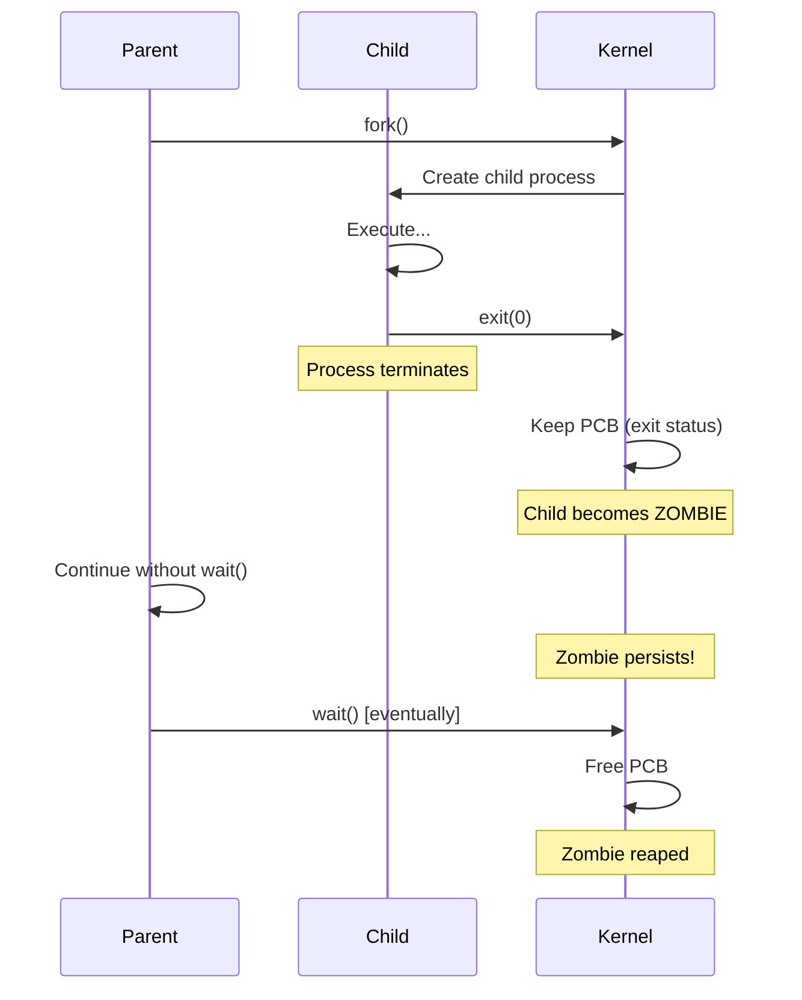
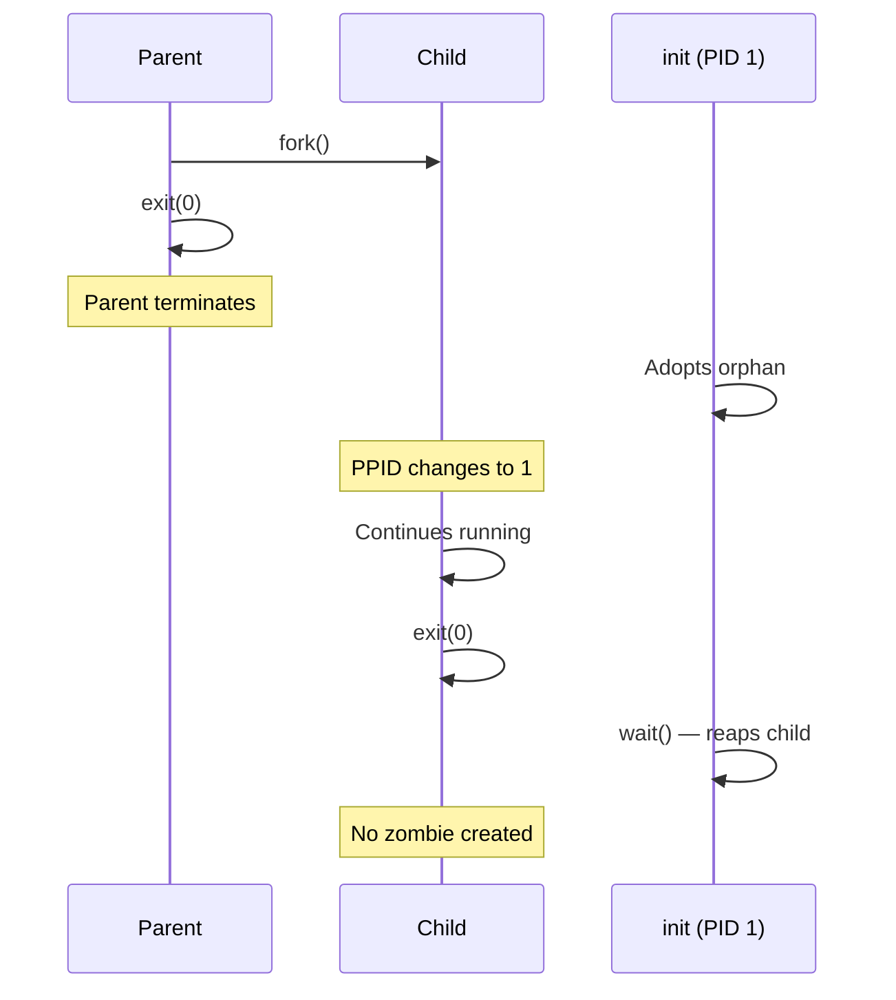

# Zombie and Orphan Processes

## Overview

When processes terminate, their parent must collect their exit status. If this doesn't happen correctly, **zombie** or **orphan** processes result. Understanding these states is essential for writing robust system software.

## Zombie Processes

A **zombie** is a terminated process whose exit status has **not yet been collected** by its parent (via `wait()`). The process has stopped executing, but its entry remains in the process table.

### How Zombies are Created



### Example: Creating a Zombie

```c
#include <stdio.h>
#include <stdlib.h>
#include <unistd.h>

int main() {
    pid_t pid = fork();
    
    if (pid == 0) {
        // Child exits immediately
        printf("Child (PID %d) exiting\n", getpid());
        exit(0);
    } else {
        // Parent continues without wait()
        printf("Parent (PID %d): child is %d\n", getpid(), pid);
        printf("Run 'ps' in another terminal to see zombie\n");
        sleep(30);  // Parent sleeps — child remains zombie
    }
    
    return 0;
}
```

```bash
# In another terminal:
ps aux | grep 'Z'
# USER  PID  %CPU %MEM  VSZ RSS TTY STAT START TIME COMMAND
# user  1234 0.0  0.0  0   0   ?   Z    ...  0:00 [defunct]
```

### Zombie Characteristics

| Property | Value |
|----------|-------|
| CPU usage | Zero (not scheduled) |
| Memory usage | Zero (memory freed) |
| Process table entry | Occupied (PID still reserved) |
| State | `Z` in `ps` |
| Visible in | `/proc/<PID>/status` (State: Z (zombie)) |
| Can be killed | No — `kill` has no effect (already dead) |

### Why Zombies Exist

The zombie state preserves the child's **exit status** until the parent reads it. This is by design:
1. Parent calls `wait()` → receives exit code
2. Parent knows if child succeeded or failed
3. OS frees the PCB after `wait()` returns

### Reaping Zombies

```c
// Method 1: Blocking wait
int status;
pid_t pid = wait(&status);

// Method 2: Non-blocking wait
pid_t pid = waitpid(child_pid, &status, WNOHANG);

// Method 3: Wait for all children
while (waitpid(-1, &status, WNOHANG) > 0) {
    // Reaped a zombie
}

// Method 4: SIGCHLD handler (async)
void sigchld_handler(int sig) {
    while (waitpid(-1, NULL, WNOHANG) > 0);
}
signal(SIGCHLD, sigchld_handler);
```

## Orphan Processes

An **orphan** is a running process whose parent has terminated. Orphans are automatically adopted by **init** (PID 1) or **systemd**.

### How Orphans are Created



### Example: Creating an Orphan

```c
#include <stdio.h>
#include <stdlib.h>
#include <unistd.h>

int main() {
    pid_t pid = fork();
    
    if (pid == 0) {
        // Child: sleep to ensure parent exits first
        sleep(2);
        printf("Child: PID=%d, PPID=%d\n", getpid(), getppid());
        // PPID will be 1 (init/systemd)
        exit(0);
    } else {
        // Parent exits immediately
        printf("Parent (PID %d) exiting\n", getpid());
        exit(0);
    }
    
    return 0;
}
```

### Orphan Characteristics

| Property | Value |
|----------|-------|
| Parent | init/systemd (PID 1) |
| PPID | 1 |
| Zombie? | No — init always calls `wait()` |
| Running? | Yes — continues normally |
| Impact | Minimal — init handles cleanup |

## Daemon Processes (Intentional Orphans)

Daemon processes are intentionally orphaned — they detach from the terminal and run in the background. The classic `fork()` twice pattern creates a daemon:

```c
#include <stdio.h>
#include <stdlib.h>
#include <unistd.h>
#include <sys/stat.h>

int main() {
    // First fork
    pid_t pid = fork();
    if (pid > 0) exit(0);  // Parent exits
    
    // Child becomes session leader
    setsid();
    
    // Second fork (prevent terminal reattachment)
    pid = fork();
    if (pid > 0) exit(0);  // First child exits
    
    // Grandchild is now a daemon
    chdir("/");
    umask(0);
    
    // Close standard file descriptors
    close(STDIN_FILENO);
    close(STDOUT_FILENO);
    close(STDERR_FILENO);
    
    // Daemon work here
    while (1) {
        // Do background work
        sleep(10);
    }
    
    return 0;
}
```

See [Daemons](./daemons.md) for full details.

## Zombie Prevention

### Method 1: Always Call `wait()`

```c
pid_t pid = fork();
if (pid > 0) {
    int status;
    waitpid(pid, &status, 0);  // Guaranteed no zombie
}
```

### Method 2: SIGCHLD Handler

```c
void reap_children(int sig) {
    // WNOHANG: non-blocking — reap all terminated children
    while (waitpid(-1, NULL, WNOHANG) > 0);
}

signal(SIGCHLD, reap_children);
```

### Method 3: `SA_NOCLDWAIT` Flag

```c
struct sigaction sa;
sa.sa_handler = SIG_DFL;
sa.sa_flags = SA_NOCLDWAIT;  // Don't create zombies
sigaction(SIGCHLD, &sa, NULL);
```

### Method 4: Double Fork (Detach)

```c
if (fork() > 0) exit(0);  // Parent exits
setsid();                   // New session
if (fork() > 0) exit(0);  // First child exits
// Grandchild is adopted by init — init reaps it
```

## Zombie Accumulation Problem

```bash
# Count zombies
ps aux | awk '$8=="Z"' | wc -l

# Zombies consume PIDs — too many can prevent new processes
cat /proc/sys/kernel/pid_max    # Max PID value (32768 default)
```

If a program leaks zombies:
- Eventually runs out of PIDs
- `fork()` fails with `EAGAIN`
- System becomes unresponsive

## Interview Questions

### Beginner

**Q1: What is a zombie process?**  
A: A zombie is a terminated process whose exit status hasn't been collected by its parent (via `wait()`). It occupies a process table entry but uses no CPU or memory. It's cleaned up when the parent calls `wait()` or the parent itself terminates.

**Q2: What is an orphan process?**  
A: An orphan is a running process whose parent has terminated. It's automatically adopted by init (PID 1), which will call `wait()` when it exits. Orphans continue running normally.

**Q3: How do you kill a zombie process?**  
A: You can't kill a zombie — it's already dead. To remove it: 1) Kill the parent (`kill -9 <parent_pid>`) — init adopts and reaps the zombie, or 2) Fix the parent to call `wait()`.

### Intermediate

**Q4: What is the difference between a zombie and an orphan?**  
A: Zombie: child has exited, parent hasn't called `wait()`. Child is dead, PCB entry remains. Orphan: parent has exited, child is still running. Child is alive, adopted by init. Key: zombie = dead child, orphan = live child.

**Q5: Why does the zombie state exist at all?**  
A: The zombie state preserves the child's exit status (exit code, termination signal) until the parent reads it with `wait()`. This allows the parent to know whether the child succeeded or failed. Without it, the parent would have no way to determine the child's outcome.

**Q6: Explain the double-fork technique.**  
A: 1) Parent forks → child 1, 2) Parent exits (or continues), 3) Child 1 calls `setsid()` to become session leader, 4) Child 1 forks → child 2 (the daemon), 5) Child 1 exits, 6) Child 2 is now orphaned (adopted by init), running in its own session with no controlling terminal. The second fork ensures the daemon can never reacquire a terminal.

### FAANG-Level

**Q7: A production server is leaking 10 zombies per minute. Diagnose and fix.**  
A: **Diagnosis:** 1) `ps aux | awk '$8=="Z"'` to identify zombies, 2) Check parent PID — find the buggy parent process, 3) `cat /proc/<parent_pid>/status` to see if it's handling SIGCHLD, 4) Check if parent has `wait()` calls or SIGCHLD handler. **Fix:** 1) Quick fix: add SIGCHLD handler with `waitpid(-1, NULL, WNOHANG)`, 2) Better: use `signal(SIGCHLD, SIG_IGN)` (Linux-specific, auto-reaps), 3) Best: fix the fork/wait logic, 4) Mitigation: monitor zombie count, alert if exceeding threshold.

**Q8: Design a process manager that never leaks zombies.**  
A: 1) Use `prctl(PR_SET_CHILD_SUBREAPER)` to make the manager the reaper for all orphaned descendants, 2) Install SIGCHLD handler that calls `waitpid(-1, &status, WNOHANG)` in a loop, 3) Track all child PIDs in a hash table, 4) Periodically scan `/proc` for unexpected children, 5) Use cgroups with `memory.oom_group` to kill entire process trees, 6) Set `SA_NOCLDWAIT` as a safety net.

**Q9: How do container runtimes handle zombie processes?**  
A: Container runtimes (Docker, containerd) use an init process (like `tini` or `dumb-init`) as PID 1 inside the container. This init: 1) Reaps zombie processes created by the application, 2) Forwards signals to the main process, 3) Handles orphan adoption within the container namespace. Without an init, the application itself becomes PID 1 and may not reap zombies correctly (PID 1 has special signal handling — default signal handlers are disabled).

## Common Mistakes

1. **Ignoring SIGCHLD:** If the parent doesn't call `wait()` or handle SIGCHLD, every child becomes a zombie.
2. **Only calling `wait()` once:** If the parent creates multiple children, it must call `wait()` for each. Use `while (waitpid(-1, NULL, WNOHANG) > 0)` to reap all.
3. **Using `wait()` in SIGCHLD handler without `WNOHANG`:** Can block in the signal handler (very bad). Always use `WNOHANG`.
4. **Forgetting that `signal()` behavior varies:** On some systems, `signal()` resets the handler. Use `sigaction()` for portable behavior.
5. **Killing the parent to fix zombies:** This works (init reaps them) but may have side effects if the parent is important.

## Summary

| Aspect | Zombie | Orphan |
|--------|--------|--------|
| State | Terminated | Running |
| Parent | Still alive (hasn't `wait()`) | Dead |
| Resources | PCB entry only | Normal (CPU, memory) |
| Reaped by | Parent (via `wait()`) | init (PID 1) |
| Killable | No (already dead) | Yes (normal kill) |
| Problem | PID exhaustion | None (init handles it) |
| Prevention | `wait()`, SIGCHLD handler | Not needed (handled by init) |

## Cross-References

- [Process Creation](./creation.md) - `fork()`, `wait()`, `exit()`
- [Process States](./states.md) - The zombie state
- [Daemons](./daemons.md) - Intentional orphans
- [Signals](./ipc-signals.md) - SIGCHLD signal
- [Process Control Block](./pcb.md) - What remains for zombies
