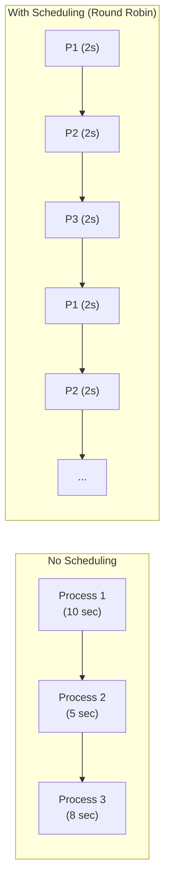
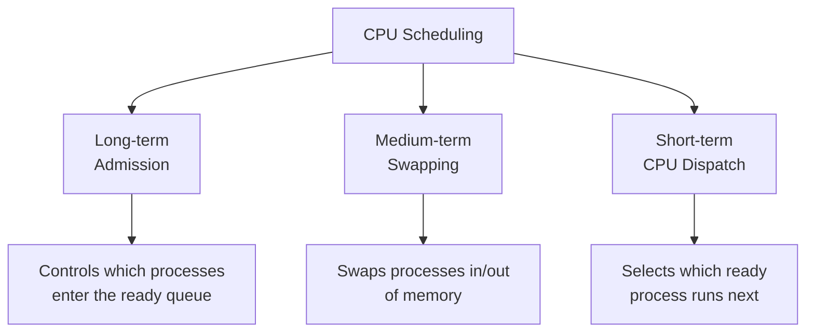
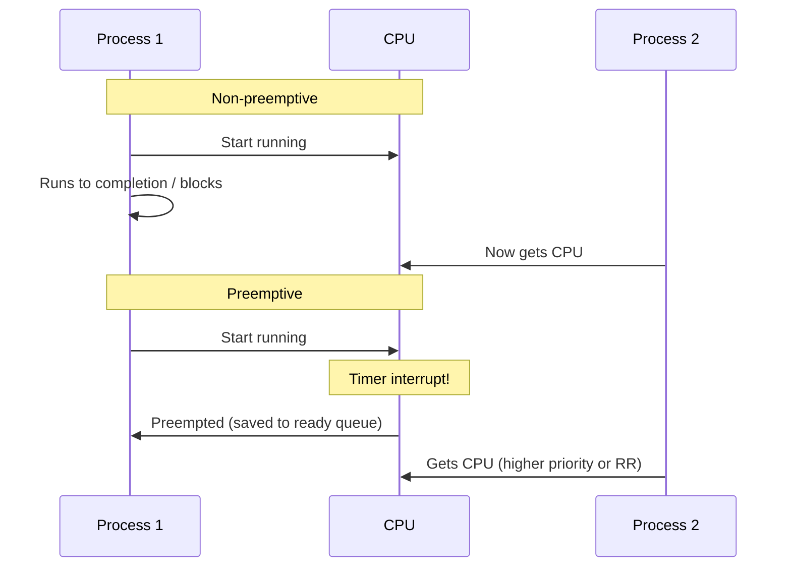
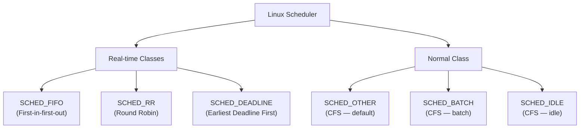

# CPU Scheduling

## What is CPU Scheduling?

**CPU scheduling** is the process by which the OS decides which process/thread from the **ready queue** gets to use the CPU next. Since most systems have more processes than CPUs, the scheduler multiplexes CPU time among them.

> **Interview one-liner:** "CPU scheduling is the OS algorithm that decides which ready process gets the CPU next — optimizing for throughput, response time, fairness, and CPU utilization."

## Why Scheduling Matters

With one CPU and N processes:
- **Without scheduling:** One process runs to completion, others starve
- **With scheduling:** Processes take turns (time-sharing), giving the illusion of parallelism



## Scheduling Criteria

| Criterion | Definition | Optimization Goal |
|-----------|-----------|-------------------|
| **CPU Utilization** | % of time CPU is busy | Maximize (keep CPU busy) |
| **Throughput** | Processes completed per unit time | Maximize (more work done) |
| **Turnaround Time** | Total time from submission to completion | Minimize |
| **Waiting Time** | Time spent in ready queue | Minimize |
| **Response Time** | Time from submission to first response | Minimize (for interactive) |

### Formulas

```
Turnaround Time = Completion Time - Arrival Time
Waiting Time    = Turnaround Time - Burst Time (CPU execution time)
Response Time   = First Run Time - Arrival Time
```

## Types of Scheduling



| Level | Controls | Frequency | Impact |
|-------|----------|-----------|--------|
| **Long-term** | Which jobs admitted to system | Low (seconds-minutes) | Degree of multiprogramming |
| **Medium-term** | Which processes swapped in/out | Medium (seconds) | Memory management |
| **Short-term** | Which ready process runs next | High (milliseconds) | CPU allocation |

## Preemptive vs Non-Preemptive

| Type | Description | Example Algorithms |
|------|-------------|-------------------|
| **Non-preemptive** | Process runs until it voluntarily releases CPU | FCFS, SJF (non-preemptive) |
| **Preemptive** | OS can forcibly take CPU from process | Round Robin, SRTF, Priority (preemptive) |



## Scheduling Algorithms Overview

| Algorithm | Type | Starvation | Optimality |
|-----------|------|------------|------------|
| [FCFS](./fcfs.md) | Non-preemptive | No | Simple, not optimal |
| [SJF](./sjf.md) | Both | Yes (long jobs) | Optimal average wait |
| [Round Robin](./round-robin.md) | Preemptive | No | Fair, good response |
| [Priority](./priority.md) | Both | Yes (low priority) | Flexible |
| [Multilevel Queue](./multilevel-queue.md) | Both | Possible | Process categorization |
| [Multilevel Feedback](./multilevel-feedback.md) | Preemptive | Possible | Adaptive |
| [CFS](./linux-cfs.md) | Preemptive | No | Linux default |
| [Real-time](./realtime.md) | Preemptive | No | Deadline guarantees |

## Scheduling in Different Contexts

| Context | Typical Algorithm | Priority |
|---------|------------------|----------|
| Desktop | CFS (Linux), MLFQ (Windows) | Interactive > Background |
| Server | CFS with nice values | Throughput-sensitive |
| Real-time | EDF, RMS | Deadline/period |
| Batch | FCFS, SJF | Throughput |
| Embedded | Round Robin, Priority | Deterministic |

## Linux Scheduling Classes



**Priority order:** SCHED_DEADLINE > SCHED_FIFO/SCHED_RR > SCHED_OTHER/SCHED_BATCH > SCHED_IDLE

```bash
# View scheduling policy
chrt -p <PID>

# Set real-time priority
chrt -f 50 ./my_program    # SCHED_FIFO, priority 50
chrt -r 50 ./my_program    # SCHED_RR, priority 50

# Set nice value (CFS)
nice -n 10 ./my_program    # Lower priority
nice -n -10 ./my_program   # Higher priority (requires root)
renice -5 -p <PID>         # Change priority
```

## Interview Questions

### Beginner

**Q1: What is CPU scheduling?**  
A: CPU scheduling is the process of selecting which process from the ready queue gets the CPU next. It's needed because there are typically more processes than CPUs, and the OS must share CPU time fairly and efficiently.

**Q2: What is the difference between preemptive and non-preemptive scheduling?**  
A: In non-preemptive scheduling, a process runs until it voluntarily releases the CPU (completes or blocks). In preemptive scheduling, the OS can forcibly take the CPU away (via timer interrupt) to give it to another process.

**Q3: What is turnaround time?**  
A: Turnaround time = Completion time - Arrival time. It's the total time a process spends in the system (waiting + executing). Lower is better.

### Intermediate

**Q4: Which scheduling algorithm minimizes average waiting time?**  
A: Shortest Job First (SJF) is provably optimal for minimizing average waiting time. However, it requires knowing burst times in advance (not always possible) and can starve long jobs.

**Q5: Why is Round Robin good for interactive systems?**  
A: Round Robin gives each process a fixed time quantum, ensuring no process monopolizes the CPU. This provides good response time for interactive users. The time quantum must be balanced — too short causes excessive context switches, too long degrades to FCFS.

**Q6: What scheduling algorithm does Linux use by default?**  
A: Linux uses CFS (Completely Fair Scheduler) for normal processes. It uses a red-black tree sorted by virtual runtime (vruntime), giving each process a fair share of CPU proportional to its weight (nice value). Real-time processes use SCHED_FIFO or SCHED_RR.

### FAANG-Level

**Q7: Design a scheduler for a mixed workload of web servers, batch jobs, and real-time tasks.**  
A: Use multilevel feedback queue: 1) **Level 1 (Real-time):** SCHED_DEADLINE for hard real-time, SCHED_FIFO for soft real-time, 2) **Level 2 (Interactive):** CFS with nice values for web servers (I/O-bound, gets priority boost after waking from I/O), 3) **Level 3 (Batch):** SCHED_BATCH for batch jobs (lower priority, longer time slices), 4) **Level 4 (Idle):** SCHED_IDLE for background tasks. Processes move between levels based on behavior (I/O-bound → interactive, CPU-bound → batch).

**Q8: How would you implement a scheduler for a container orchestration system?**  
A: Two-level scheduling: 1) **Node level:** CFS within each node, cgroup CPU shares/quotas per container, 2) **Cluster level:** Kubernetes scheduler places pods based on resource requests/limits, affinity/anti-affinity, 3) **Fairness:** Dominant Resource Fairness (DRF) across users/teams, 4) **Preemption:** Evict lower-priority pods when resources are scarce, 5) **Topology-aware:** NUMA-aware scheduling for performance-critical workloads, 6) **Real-time:** CPU pinning + SCHED_FIFO for latency-sensitive containers.

**Q9: Explain the theoretical foundations of real-time scheduling.**  
A: **Rate Monotonic (RM):** Static priority = 1/period. Optimal among fixed-priority algorithms. Schedulable if Σ(Ci/Ti) ≤ n(2^(1/n) - 1) ≈ 0.693 for n tasks. **Earliest Deadline First (EDF):** Dynamic priority = nearest deadline. Optimal among all algorithms. Schedulable if Σ(Ci/Ti) ≤ 1.0 (100% CPU). **LLF (Least Laxity First):** Priority = (deadline - current_time - remaining_time). Preemptive. All assume: periodic tasks, independent, no resource sharing. Priority Inversion Protocol handles resource sharing.

## Common Mistakes

1. **Confusing turnaround time with waiting time:** Turnaround = waiting + burst + I/O time. Waiting = time in ready queue only.
2. **Assuming FCFS is fair:** FCFS is fair in order but not in outcome — short jobs behind a long job wait excessively (convoy effect).
3. **Ignoring arrival time:** Many textbook problems assume all processes arrive at time 0. Real scheduling must handle staggered arrivals.
4. **Forgetting that SJF requires burst time prediction:** In practice, exponential averaging is used: τ(n+1) = α·t(n) + (1-α)·τ(n), where t(n) is actual burst and τ(n) is predicted.
5. **Not considering context switch overhead:** Frequent context switches (small quantum in RR) waste CPU time. Always factor in switch time.

## Summary

| Algorithm | Preemptive | Starvation | Best For |
|-----------|-----------|------------|----------|
| FCFS | No | No | Simple batch |
| SJF | Optional | Yes | Minimum avg wait |
| Round Robin | Yes | No | Interactive systems |
| Priority | Optional | Yes | Mixed workloads |
| MLQ | Both | Possible | Categorized processes |
| MLFQ | Yes | Possible | General purpose |
| CFS | Yes | No | Linux default |
| EDF | Yes | No | Real-time |

## Cross-References

- [FCFS](./fcfs.md) - First Come First Served
- [SJF](./sjf.md) - Shortest Job First
- [Round Robin](./round-robin.md) - Time-sliced scheduling
- [Priority](./priority.md) - Priority-based scheduling
- [Multilevel Queue](./multilevel-queue.md) - Multiple queues
- [Multilevel Feedback](./multilevel-feedback.md) - Adaptive MLQ
- [Linux CFS](./linux-cfs.md) - Completely Fair Scheduler
- [Real-time](./realtime.md) - Deadline-based scheduling
- [Metrics](./metrics.md) - Scheduling performance measures
- [Context Switching](../processes/context-switching.md) - Switching overhead


## Cross References

- [CPU Architecture](../arch/cpu/README.md)
- [Process States](../os/processes/states.md)
- [Context Switching](../os/processes/context-switching.md)
- [Thread Pools](../concurrency/thread-pools.md)
