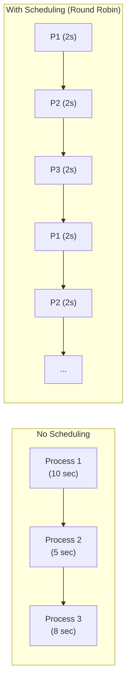
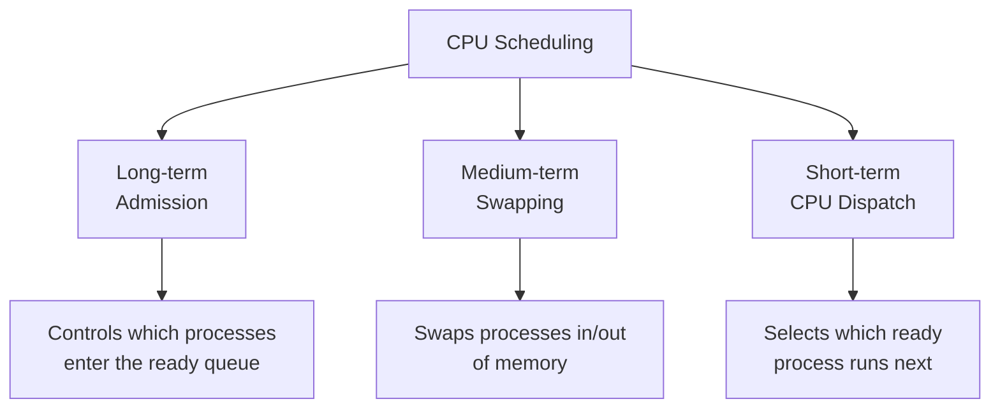
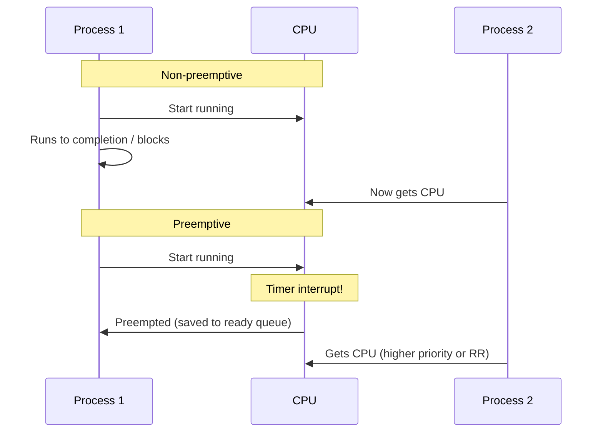
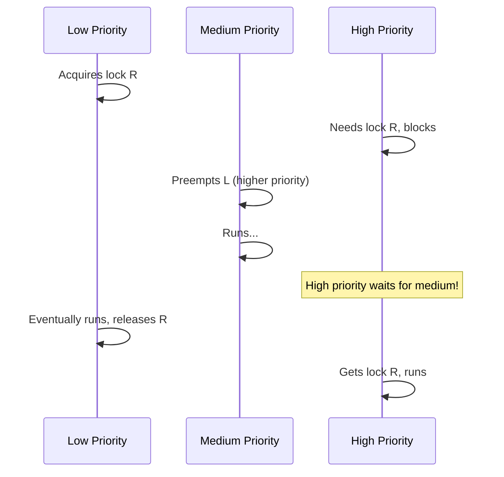
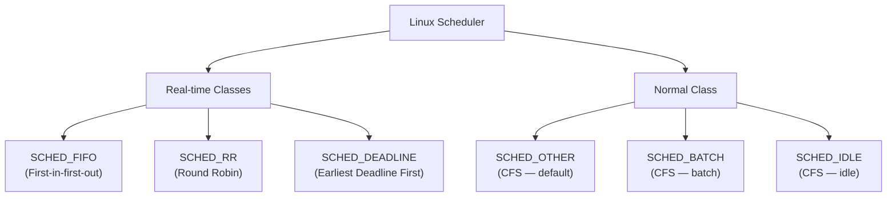
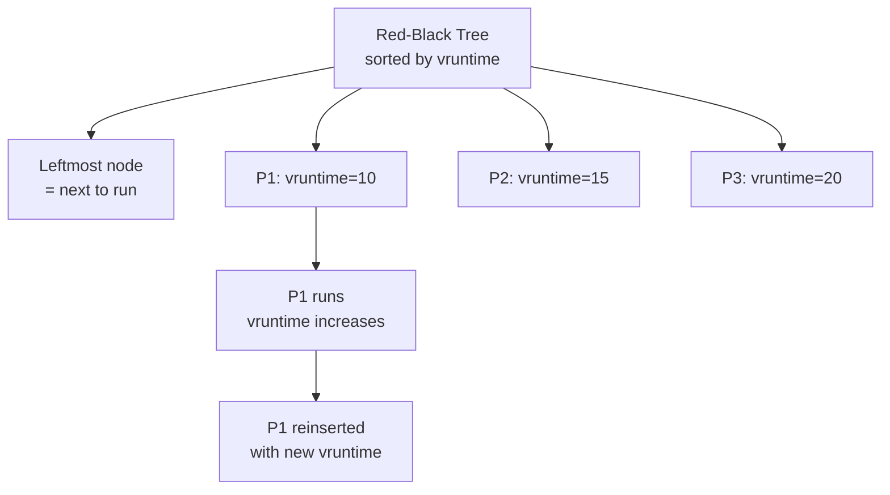

# CPU Scheduling

## What is CPU Scheduling?

**CPU scheduling** is the process by which the OS decides which process/thread from the **ready queue** gets to use the CPU next. Since most systems have more processes than CPUs, the scheduler multiplexes CPU time among them.

> **Interview one-liner:** "CPU scheduling is the OS algorithm that decides which ready process gets the CPU next — optimizing for throughput, response time, fairness, and CPU utilization."

## Why Scheduling Matters

With one CPU and N processes:
- **Without scheduling:** One process runs to completion, others starve
- **With scheduling:** Processes take turns (time-sharing), giving the illusion of parallelism



## Scheduling Criteria

When designing or evaluating a scheduling algorithm, these criteria matter:

| Criterion | Definition | Optimization Goal | Importance |
|-----------|-----------|-------------------|------------|
| **CPU Utilization** | % of time CPU is busy | Maximize (keep CPU busy) | High — wasted CPU is wasted money |
| **Throughput** | Processes completed per unit time | Maximize (more work done) | High — measures productivity |
| **Turnaround Time** | Total time from submission to completion | Minimize | Medium — user wants fast completion |
| **Waiting Time** | Time spent in ready queue | Minimize | High — idle waiting is unproductive |
| **Response Time** | Time from submission to first response | Minimize (for interactive) | Critical for interactive systems |

### Formulas

```
Turnaround Time = Completion Time - Arrival Time
Waiting Time    = Turnaround Time - Burst Time (CPU execution time)
Response Time   = First Run Time - Arrival Time

CPU Utilization = (Busy Time / Total Time) × 100%
Throughput      = Number of Processes Completed / Total Time
```

### Example Calculation

Consider three processes:

| Process | Arrival | Burst Time |
|---------|---------|------------|
| P1 | 0 | 10 |
| P2 | 1 | 5 |
| P3 | 2 | 8 |

**FCFS scheduling:**
```
Timeline:  |P1 (0-10)|P2 (10-15)|P3 (15-23)|
P1: Turnaround = 10-0 = 10, Waiting = 10-10 = 0
P2: Turnaround = 15-1 = 14, Waiting = 14-5 = 9
P3: Turnaround = 23-2 = 21, Waiting = 21-8 = 13
Average Waiting = (0+9+13)/3 = 7.33
```

**SJF (non-preemptive) scheduling:**
```
Timeline:  |P1 (0-10)|P2 (10-15)|P3 (15-23)|
Same as FCFS because P1 arrives first and is running.
But if all arrive at time 0:
Timeline:  |P2 (0-5)|P3 (5-13)|P1 (13-23)|
P1: Waiting = 13, P2: Waiting = 0, P3: Waiting = 5
Average Waiting = (13+0+5)/3 = 6.0 (better!)
```

## Types of Scheduling



| Level | Controls | Frequency | Impact |
|-------|----------|-----------|--------|
| **Long-term** | Which jobs admitted to system | Low (seconds-minutes) | Degree of multiprogramming |
| **Medium-term** | Which processes swapped in/out | Medium (seconds) | Memory management |
| **Short-term** | Which ready process runs next | High (milliseconds) | CPU allocation |

## Preemptive vs Non-Preemptive

| Type | Description | Example Algorithms |
|------|-------------|-------------------|
| **Non-preemptive** | Process runs until it voluntarily releases CPU | FCFS, SJF (non-preemptive) |
| **Preemptive** | OS can forcibly take CPU from process | Round Robin, SRTF, Priority (preemptive) |



## Scheduling Algorithms Comparison

| Algorithm | Type | Starvation | Optimality | Complexity | Best For |
|-----------|------|------------|------------|------------|----------|
| [FCFS](./fcfs.md) | Non-preemptive | No | Simple, not optimal | O(1) | Simple batch |
| [SJF](./sjf.md) | Both | Yes (long jobs) | Optimal avg wait | O(n log n) | Minimum avg wait |
| [Round Robin](./round-robin.md) | Preemptive | No | Fair, good response | O(1) | Interactive systems |
| [Priority](./priority.md) | Both | Yes (low priority) | Flexible | O(log n) | Mixed workloads |
| [Multilevel Queue](./multilevel-queue.md) | Both | Possible | Process categorization | O(1) per queue | Categorized processes |
| [Multilevel Feedback](./multilevel-feedback.md) | Preemptive | Possible | Adaptive | O(1) per queue | General purpose |
| [CFS](./linux-cfs.md) | Preemptive | No | Linux default | O(log n) | Linux default |
| [Real-time](./realtime.md) | Preemptive | No | Deadline guarantees | O(1) | Real-time systems |

## The Convoy Effect

The **convoy effect** occurs when many short processes are stuck behind a single long-running (CPU-bound) process in FCFS scheduling:

```mermaid
gantt
    title Convoy Effect (FCFS)
    dateFormat X
    axisFormat %s
    
    section CPU
    P1 (Long, 30s)     :p1, 0, 30
    P2 (Short, 2s)     :p2, 30, 32
    P3 (Short, 1s)     :p3, 32, 33
    P4 (Short, 3s)     :p4, 33, 36
```



**Problem:** P2, P3, P4 wait 30, 31, 32 seconds respectively for just 2+1+3 = 6 seconds of CPU work.

**Solution:** Use preemptive scheduling (Round Robin, SRTF) to break up long processes.

**Real-world analogy:** A semi-truck at a toll booth — all cars behind it wait for the truck to pay, even though cars could process much faster.

**Impact:**
- Average waiting time is very high
- I/O devices sit idle while CPU-bound process runs
- When I/O-bound processes finally run, they quickly block for I/O, leaving CPU idle
- System throughput drops dramatically

## Starvation and Fairness

**Starvation** occurs when a process waits indefinitely because other processes are always preferred:

| Algorithm | Starvation Risk | Cause | Solution |
|-----------|----------------|-------|----------|
| SJF | Yes | Long jobs never run if short jobs keep arriving | Aging |
| Priority | Yes | Low-priority processes starve | Aging (increase priority over time) |
| FCFS | No | All processes eventually run | N/A |
| Round Robin | No | Time quantum guarantees CPU | N/A |

### Aging Solution

**Aging** gradually increases the priority of waiting processes:

```python
# Priority aging formula
def update_priority(process, current_time):
    wait_time = current_time - process.last_run_time
    process.effective_priority = process.base_priority + (wait_time // AGING_INTERVAL)
    # After enough waiting, even low-priority process gets high priority
```

### Priority Inversion

A subtle form of starvation where a **high-priority process** is indirectly blocked by a **low-priority process**:



**Solutions:**
- **Priority Inheritance Protocol (PIP):** Low-priority process temporarily inherits high priority
- **Priority Ceiling Protocol (PCP):** Each resource has a ceiling priority; process runs at ceiling when holding it
- **Real-world:** Mars Pathfinder (1997) experienced priority inversion; fixed with priority inheritance

## Scheduling in Different Contexts

| Context | Typical Algorithm | Priority |
|---------|------------------|----------|
| Desktop | CFS (Linux), MLFQ (Windows) | Interactive > Background |
| Server | CFS with nice values | Throughput-sensitive |
| Real-time | EDF, RMS | Deadline/period |
| Batch | FCFS, SJF | Throughput |
| Embedded | Round Robin, Priority | Deterministic |

## Linux Scheduling Classes



**Priority order:** SCHED_DEADLINE > SCHED_FIFO/SCHED_RR > SCHED_OTHER/SCHED_BATCH > SCHED_IDLE

```bash
# View scheduling policy
chrt -p <PID>

# Set real-time priority
chrt -f 50 ./my_program    # SCHED_FIFO, priority 50
chrt -r 50 ./my_program    # SCHED_RR, priority 50

# Set nice value (CFS)
nice -n 10 ./my_program    # Lower priority
nice -n -10 ./my_program   # Higher priority (requires root)
renice -5 -p <PID>         # Change priority

# View scheduler debug info (CFS)
cat /proc/sched_debug

# View process scheduling stats
cat /proc/<PID>/sched
```

## Completely Fair Scheduler (CFS) Deep Dive

CFS is the default Linux scheduler for `SCHED_NORMAL` processes. It aims to give each process a **fair share** of CPU time proportional to its weight (determined by nice value).

**Key idea:** Track each process's **virtual runtime** (vruntime). The process with the **lowest vruntime** runs next. All processes converge to equal vruntime over time.



**CFS properties:**
- O(log n) scheduling decision (red-black tree)
- No explicit time quantum — preempted when vruntime exceeds others by threshold
- Nice value affects weight: lower nice → higher weight → larger CPU share
- Interactive processes get priority boosts after sleeping (I/O wait)

## Interview Questions

### Beginner

**Q1: What is CPU scheduling?**  
A: CPU scheduling is the process of selecting which process from the ready queue gets the CPU next. It's needed because there are typically more processes than CPUs, and the OS must share CPU time fairly and efficiently.

**Q2: What is the difference between preemptive and non-preemptive scheduling?**  
A: In non-preemptive scheduling, a process runs until it voluntarily releases the CPU (completes or blocks). In preemptive scheduling, the OS can forcibly take the CPU away (via timer interrupt) to give it to another process.

**Q3: What is turnaround time?**  
A: Turnaround time = Completion time - Arrival time. It's the total time a process spends in the system (waiting + executing). Lower is better.

### Intermediate

**Q4: Which scheduling algorithm minimizes average waiting time?**  
A: Shortest Job First (SJF) is provably optimal for minimizing average waiting time. However, it requires knowing burst times in advance (not always possible) and can starve long jobs.

**Q5: What is the convoy effect? How do you solve it?**  
A: The convoy effect occurs in FCFS when many short processes wait behind one long-running process, leading to poor average waiting time and low I/O device utilization. Solutions: use preemptive scheduling (Round Robin, SRTF) to break up long processes, or use SJF to prioritize short jobs.

**Q6: What scheduling algorithm does Linux use by default?**  
A: Linux uses CFS (Completely Fair Scheduler) for normal processes. It uses a red-black tree sorted by virtual runtime (vruntime), giving each process a fair share of CPU proportional to its weight (nice value). Real-time processes use SCHED_FIFO or SCHED_RR.

### FAANG-Level

**Q7: Design a scheduler for a mixed workload of web servers, batch jobs, and real-time tasks.**  
A: Use multilevel feedback queue: 1) **Level 1 (Real-time):** SCHED_DEADLINE for hard real-time, SCHED_FIFO for soft real-time, 2) **Level 2 (Interactive):** CFS with nice values for web servers (I/O-bound, gets priority boost after waking from I/O), 3) **Level 3 (Batch):** SCHED_BATCH for batch jobs (lower priority, longer time slices), 4) **Level 4 (Idle):** SCHED_IDLE for background tasks. Processes move between levels based on behavior (I/O-bound → interactive, CPU-bound → batch).

**Q8: How would you implement a scheduler for a container orchestration system?**  
A: Two-level scheduling: 1) **Node level:** CFS within each node, cgroup CPU shares/quotas per container, 2) **Cluster level:** Kubernetes scheduler places pods based on resource requests/limits, affinity/anti-affinity, 3) **Fairness:** Dominant Resource Fairness (DRF) across users/teams, 4) **Preemption:** Evict lower-priority pods when resources are scarce, 5) **Topology-aware:** NUMA-aware scheduling for performance-critical workloads, 6) **Real-time:** CPU pinning + SCHED_FIFO for latency-sensitive containers.

**Q9: Explain the theoretical foundations of real-time scheduling.**  
A: **Rate Monotonic (RM):** Static priority = 1/period. Optimal among fixed-priority algorithms. Schedulable if Σ(Ci/Ti) ≤ n(2^(1/n) - 1) ≈ 0.693 for n tasks. **Earliest Deadline First (EDF):** Dynamic priority = nearest deadline. Optimal among all algorithms. Schedulable if Σ(Ci/Ti) ≤ 1.0 (100% CPU). **LLF (Least Laxity First):** Priority = (deadline - current_time - remaining_time). Preemptive. All assume: periodic tasks, independent, no resource sharing. Priority Inversion Protocol handles resource sharing.

## Common Mistakes

1. **Confusing turnaround time with waiting time:** Turnaround = waiting + burst + I/O time. Waiting = time in ready queue only.
2. **Assuming FCFS is fair:** FCFS is fair in order but not in outcome — short jobs behind a long job wait excessively (convoy effect).
3. **Ignoring arrival time:** Many textbook problems assume all processes arrive at time 0. Real scheduling must handle staggered arrivals.
4. **Forgetting that SJF requires burst time prediction:** In practice, exponential averaging is used: τ(n+1) = α·t(n) + (1-α)·τ(n), where t(n) is actual burst and τ(n) is predicted.
5. **Not considering context switch overhead:** Frequent context switches (small quantum in RR) waste CPU time. Always factor in switch time.
6. **Confusing priority inversion with starvation:** Starvation is indefinite waiting; priority inversion is a specific bug where high-priority is blocked by low-priority indirectly.

## Summary

| Algorithm | Preemptive | Starvation | Best For |
|-----------|-----------|------------|----------|
| FCFS | No | No | Simple batch |
| SJF | Optional | Yes | Minimum avg wait |
| Round Robin | Yes | No | Interactive systems |
| Priority | Optional | Yes | Mixed workloads |
| MLQ | Both | Possible | Categorized processes |
| MLFQ | Yes | Possible | General purpose |
| CFS | Yes | No | Linux default |
| EDF | Yes | No | Real-time |

## Cross-References

- [FCFS](./fcfs.md) - First Come First Served
- [SJF](./sjf.md) - Shortest Job First
- [Round Robin](./round-robin.md) - Time-sliced scheduling
- [Priority](./priority.md) - Priority-based scheduling
- [Multilevel Queue](./multilevel-queue.md) - Multiple queues
- [Multilevel Feedback](./multilevel-feedback.md) - Adaptive MLQ
- [Linux CFS](./linux-cfs.md) - Completely Fair Scheduler
- [Real-time](./realtime.md) - Deadline-based scheduling
- [Metrics](./metrics.md) - Scheduling performance measures
- [Context Switching](../processes/context-switching.md) - Switching overhead

## References

- Silberschatz, A., Galvin, P.B., Gagne, G. *Operating System Concepts*, 10th Edition. Wiley, 2018. (Chapters 5-6: CPU Scheduling)
- Love, R. *Linux Kernel Development*, 3rd Edition. Addison-Wesley, 2010. (Chapter 4: Process Scheduling)
- Bovet, D.P., Cesati, M. *Understanding the Linux Kernel*, 3rd Edition. O'Reilly, 2005. (Chapter 7: Process Scheduling)
- Liu, C.L., Layland, J.W. "Scheduling Algorithms for Multiprogramming in a Hard-Real-Time Environment." *Journal of the ACM*, 20(1), 1973. (RM and EDF foundations)
- `man 2 sched_setscheduler` — Linux scheduling manual pages
- Linux kernel source: `kernel/sched/` — CFS implementation
