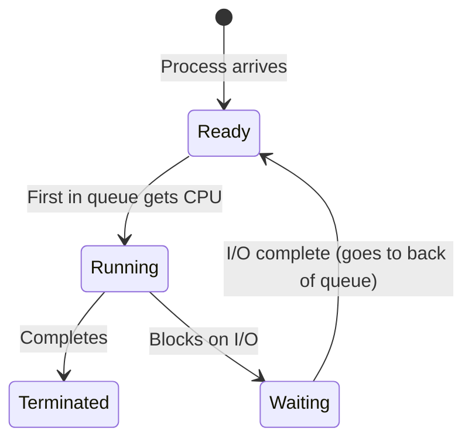
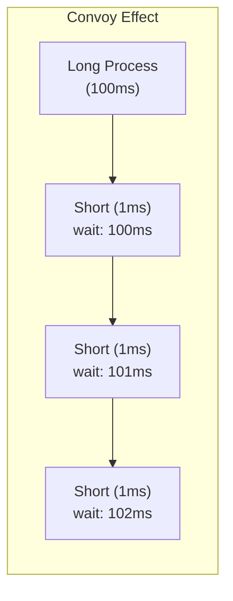

# First Come First Served (FCFS)

## Overview

**FCFS (First Come First Served)** is the simplest scheduling algorithm — processes are executed in the order they arrive in the ready queue. It's non-preemptive: once a process gets the CPU, it runs to completion or until it blocks.

> **Interview one-liner:** "FCFS is the simplest scheduler — processes run in arrival order, non-preemptively. Easy to implement but suffers from the convoy effect."

## How It Works



## Algorithm

```
1. Processes are added to the ready queue in arrival order
2. The process at the head of the queue gets the CPU
3. It runs until completion or blocking (non-preemptive)
4. Next process at head gets the CPU
```

## Example

| Process | Arrival Time | Burst Time |
|---------|-------------|------------|
| P1 | 0 | 24 |
| P2 | 1 | 3 |
| P3 | 2 | 3 |

### Gantt Chart

```
Time:  0         12        24  27  30
       |----P1----|----P2----|P3|
       [0        24][24    27][27 30]
```

### Calculations

| Process | Arrival | Burst | Completion | Turnaround | Waiting |
|---------|---------|-------|------------|------------|---------|
| P1 | 0 | 24 | 24 | 24 | 0 |
| P2 | 1 | 3 | 27 | 26 | 23 |
| P3 | 2 | 3 | 30 | 28 | 25 |

```
Average Turnaround Time = (24 + 26 + 28) / 3 = 26.0
Average Waiting Time    = (0 + 23 + 25) / 3   = 16.0
```

### What if we reorder?

If P2 and P3 run first (shortest jobs):

```
Time:  0   3   6        30
       |P2|P3|----P1----|
```

| Process | Completion | Turnaround | Waiting |
|---------|------------|------------|---------|
| P1 | 30 | 30 | 6 |
| P2 | 3 | 2 | 0 |
| P3 | 6 | 4 | 1 |

```
Average Waiting Time = (6 + 0 + 1) / 3 = 2.33
```

FCFS gives 16.0; reordered gives 2.33 — a massive difference!

## Convoy Effect

The **convoy effect** occurs when short processes are stuck behind a long-running process:

```
Long CPU-bound process holds CPU:
[P1: 100ms] [P2: 1ms] [P3: 1ms] [P4: 1ms]

FCFS: P1 runs 100ms, then P2, P3, P4
P2 waits 100ms for 1ms of work!
```



**Impact:**
- Average waiting time is very high
- CPU utilization drops (short processes are I/O-bound but waiting)
- I/O devices sit idle while CPU-bound process runs
- Overall system throughput decreases

## Implementation

```python
def fcfs(processes):
    """
    processes: list of (pid, arrival_time, burst_time)
    """
    processes.sort(key=lambda x: x[1])  # Sort by arrival time
    
    current_time = 0
    results = []
    
    for pid, arrival, burst in processes:
        if current_time < arrival:
            current_time = arrival  # CPU idle until arrival
        
        start_time = current_time
        completion_time = current_time + burst
        turnaround = completion_time - arrival
        waiting = turnaround - burst
        
        results.append({
            'pid': pid,
            'arrival': arrival,
            'burst': burst,
            'start': start_time,
            'completion': completion_time,
            'turnaround': turnaround,
            'waiting': waiting
        })
        
        current_time = completion_time
    
    return results
```

## Advantages and Disadvantages

| Advantages | Disadvantages |
|------------|---------------|
| Simple to implement | Convoy effect |
| Fair (first come, first served) | High average waiting time |
| No starvation | Not suitable for interactive systems |
| No overhead (no preemption) | Non-preemptive — bad for responsiveness |
| Predictable order | Short jobs suffer behind long jobs |

## Real-World Usage

- **Batch systems:** Where order matters and jobs are similar in length
- **Print queues:** First document submitted prints first
- **Simple embedded systems:** Where complexity isn't warranted
- **NOT used for:** General-purpose OS scheduling (too simplistic)

## Interview Questions

### Beginner

**Q1: What is FCFS scheduling?**  
A: FCFS executes processes in the order they arrive. The first process to request the CPU gets it first. It's non-preemptive — once a process starts, it runs until completion or blocking.

**Q2: What is the convoy effect?**  
A: When a long CPU-bound process monopolizes the CPU, many short processes are forced to wait, causing high average waiting time and poor I/O device utilization.

### Intermediate

**Q3: Is FCFS preemptive or non-preemptive?**  
A: Non-preemptive. Once a process gets the CPU, it runs until it completes or voluntarily releases the CPU (e.g., for I/O). The OS cannot forcibly take the CPU away.

**Q4: Calculate the average waiting time for: P1(24), P2(3), P3(3) arriving at times 0, 0, 0.**  
A: FCFS order: P1(24), P2(3), P3(3). Waiting: P1=0, P2=24, P3=27. Average = (0+24+27)/3 = 17.0.

**Q5: How does FCFS perform compared to SJF?**  
A: FCFS has higher average waiting time than SJF. SJF is provably optimal for minimizing average waiting time. FCFS can be arbitrarily bad if a very long process arrives before many short ones.

### FAANG-Level

**Q6: Where is FCFS-like scheduling used in modern systems?**  
A: 1) **I/O scheduling:** CFQ (Completely Fair Queuing) used FCFS for I/O requests within a process, 2) **Network:** FIFO queuing in routers, 3) **Message queues:** FIFO ordering, 4) **Batch processing:** Hadoop/Spark job scheduling (FIFO scheduler), 5) **Within priorities:** CFS uses FCFS within the same nice value (vruntime ordering).

**Q7: How would you mitigate the convoy effect while keeping FCFS-like fairness?**  
A: 1) **Shortest Job First approximation:** Predict burst times using exponential averaging, 2) **Multilevel feedback queue:** Move long-running processes to lower-priority queues, 3) **Preemptive SJF (SRTF):** Allow preemption if new shorter job arrives, 4) **Aging:** Increase priority of waiting processes over time, 5) **Time slicing:** Use Round Robin (FCFS with time limits).

## Common Mistakes

1. **Forgetting arrival times:** Many examples assume all processes arrive at t=0. With different arrival times, FCFS behaves differently.
2. **Confusing FCFS with Round Robin:** FCFS has no time quantum — processes run to completion.
3. **Assuming FCFS is always bad:** For batch systems with similar-length jobs, FCFS is fine and simple.
4. **Not considering I/O:** If processes do I/O, the CPU is released and the process goes to the back of the queue when I/O completes.

## Summary

| Property | Value |
|----------|-------|
| Type | Non-preemptive |
| Data structure | FIFO queue |
| Starvation | No |
| Convoy effect | Yes (main weakness) |
| Implementation | Simple |
| Best for | Batch systems, simple scenarios |
| Average waiting time | Often high |

## Cross-References

- [SJF](./sjf.md) - Better average waiting time
- [Round Robin](./round-robin.md) - FCFS with time quantum
- [Scheduling Overview](./README.md) - All algorithms
- [Metrics](./metrics.md) - How to evaluate scheduling


## Cross References

- [SJF](../os/scheduling/sjf.md)
- [Round Robin](../os/scheduling/round-robin.md)
- [Scheduling Metrics](../os/scheduling/metrics.md)
- [CPU Architecture](../arch/cpu/README.md)
