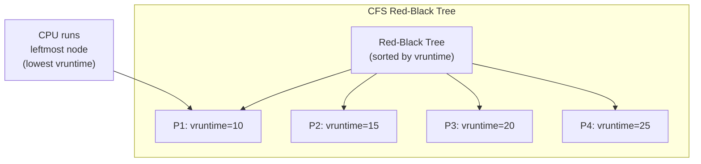
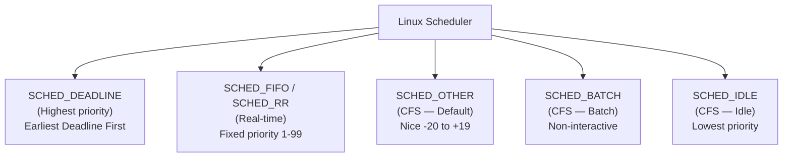
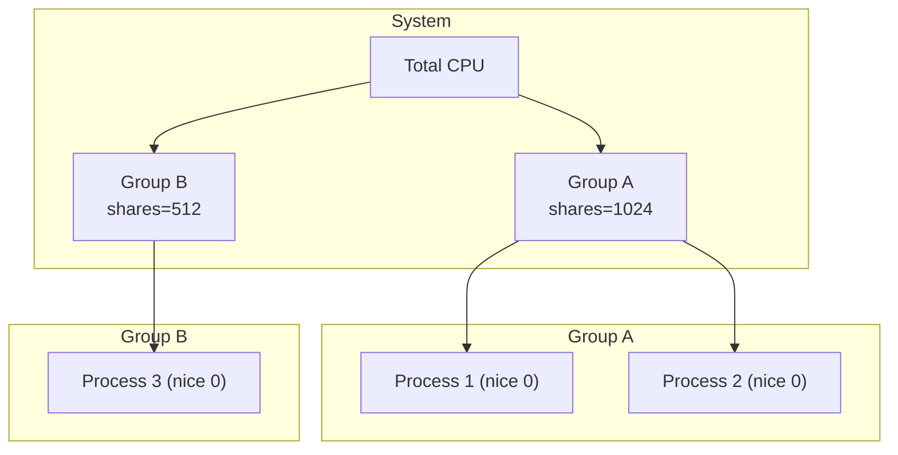

# Linux CFS (Completely Fair Scheduler)

## Overview

The **Completely Fair Scheduler (CFS)** is the default process scheduler in Linux since kernel 2.6.23 (2007). It replaced the O(1) scheduler. CFS aims to distribute CPU time **proportionally** among processes based on their **nice values** (weights), using a concept called **virtual runtime**.

> **Interview one-liner:** "CFS is Linux's default scheduler — it tracks virtual runtime (vruntime) for each process and always schedules the process with the lowest vruntime, ensuring fair CPU distribution proportional to nice values."

## Core Concept: Virtual Runtime

**Virtual runtime (vruntime)** tracks how much CPU time a process has received, weighted by its priority:

```
vruntime += actual_runtime × (NICE_0_WEIGHT / process_weight)
```

- **NICE_0_WEIGHT** = 1024 (weight of nice 0)
- **process_weight** = weight corresponding to the process's nice value
- Higher nice → higher weight → vruntime grows slower → gets more CPU

### Weight Table

| Nice | Weight | CPU Share (relative) |
|------|--------|---------------------|
| -20 | 88761 | 100% (highest priority) |
| -10 | 34820 | 39% |
| 0 | 1024 | 12% |
| 10 | 310 | 3.5% |
| 19 | 15 | 0.17% (lowest priority) |

```python
# Weight lookup (simplified)
def weight_from_nice(nice):
    # Linux kernel uses a precomputed table
    # Approximate formula:
    return 1024 * (1.25 ** (-nice))
```

## How CFS Works



### Algorithm

1. Maintain a red-black tree of all runnable processes, sorted by vruntime
2. The **leftmost node** (smallest vruntime) is always selected to run
3. As a process runs, its vruntime increases
4. When vruntime exceeds others, it moves right in the tree
5. New processes and sleeping processes get a "boost" — their vruntime is set to the minimum in the tree

### Key Properties

| Property | Value |
|----------|-------|
| Data structure | Red-black tree (augmented) |
| Scheduling complexity | O(1) pick next, O(log n) insert/remove |
| Fairness | Proportional to weight (nice value) |
| Target latency | Time for all processes to run once |
| Minimum granularity | 1ms (minimum time slice) |

## Time Slice Calculation

```
time_slice = target_latency × (process_weight / total_weight)

Example:
  target_latency = 6ms
  P1 (nice 0, weight 1024)
  P2 (nice 0, weight 1024)
  
  P1 time_slice = 6ms × (1024 / 2048) = 3ms
  P2 time_slice = 6ms × (1024 / 2048) = 3ms
```

With different nice values:
```
P1 (nice -10, weight 34820)
P2 (nice 10, weight 310)

Total weight = 34820 + 310 = 35130

P1 time_slice = 6ms × (34820 / 35130) = 5.95ms
P2 time_slice = 6ms × (310 / 35130) = 0.05ms
```

P1 gets ~99% of CPU, P2 gets ~1% — proportional to their weights.

## CFS and Nice Values

```bash
# View nice value
ps -o pid,ni,comm -p <PID>

# Set nice value at start
nice -n 10 ./my_program       # Lower priority
nice -n -10 ./my_program      # Higher priority (requires root)

# Change nice of running process
renice -5 -p <PID>

# View vruntime (requires kernel debugging)
cat /proc/<PID>/sched | grep vruntime
```

### CFS Nice-to-Weight Mapping

```c
// Linux kernel: kernel/sched/core.c
// Nice range: -20 to +19
// Weight range: 88761 to 15

static const int sched_prio_to_weight[40] = {
 /* -20 */     88761,     71755,     56483,     46273,     36291,
 /* -15 */     29154,     23254,     18705,     14949,     11916,
 /* -10 */      9548,      7620,      6100,      4904,      3906,
 /*  -5 */      3121,      2501,      1991,      1586,      1277,
 /*   0 */      1024,       820,       655,       526,       423,
 /*   5 */       335,       272,       215,       172,       137,
 /*  10 */       110,        87,        70,        56,        45,
 /*  15 */        36,        29,        23,        18,        15,
};
```

## CFS Scheduling Classes



**Scheduling order:** Deadline > Real-time > CFS > Batch > Idle

```bash
# Check scheduling policy
chrt -p <PID>

# Set real-time policy
chrt -f 50 ./my_program    # SCHED_FIFO, priority 50
chrt -r 50 ./my_program    # SCHED_RR, priority 50

# Set batch policy
chrt -b 0 ./my_program     # SCHED_BATCH
```

## CFS with Groups (cgroups)

CFS supports **group scheduling** via cgroups — fair CPU allocation between groups:

```bash
# Create cgroup
mkdir /sys/fs/cgroup/cpu/mygroup

# Set CPU shares (weight)
echo 512 > /sys/fs/cgroup/cpu/mygroup/cpu.shares

# Add process to cgroup
echo <PID> > /sys/fs/cgroup/cpu/mygroup/cgroup.procs

# Docker example
docker run --cpu-shares=512 myimage
```



Group A gets 1024/(1024+512) = 67% of CPU
Group B gets 512/(1024+512) = 33% of CPU

## CFS vs O(1) Scheduler

| Aspect | O(1) Scheduler | CFS |
|--------|---------------|-----|
| Data structure | 140 bitmap queues | Red-black tree |
| Time slice | Fixed per priority | Proportional to weight |
| Fairness | Approximate | Precise (vruntime) |
| Interactive bonus | Explicit heuristics | Natural (I/O → low vruntime) |
| Complexity | O(1) | O(log n) insert, O(1) pick |
| Starvation | Possible | No (vruntime guarantees) |
| Tuning | Complex (interactivity estimator) | Simple (nice values) |

## Viewing CFS Internals

```bash
# Process scheduling info
cat /proc/<PID>/sched
# se.vruntime: 12345.678
# se.sum_exec_runtime: 5000.123
# nr_switches: 1500
# nr_voluntary_switches: 1200
# nr_involuntary_switches: 300

# Scheduler statistics
cat /proc/schedstat
# time 1234567890
# ...

# Tunable parameters
cat /proc/sys/kernel/sched_latency_ns        # Target latency (6ms default)
cat /proc/sys/kernel/sched_min_granularity_ns # Min time slice (0.75ms)
cat /proc/sys/kernel/sched_wakeup_granularity_ns # Wakeup preemption threshold
```

## Interview Questions

### Beginner

**Q1: What is CFS?**  
A: CFS (Completely Fair Scheduler) is Linux's default scheduler. It tracks virtual runtime for each process and always runs the process with the lowest vruntime, ensuring fair CPU distribution proportional to nice values.

**Q2: What is virtual runtime?**  
A: Virtual runtime (vruntime) is a weighted measure of CPU time a process has received. Processes with higher nice values (lower priority) accumulate vruntime faster, so they get less CPU. The process with the lowest vruntime is scheduled next.

### Intermediate

**Q3: How does CFS handle nice values?**  
A: Nice values (-20 to +19) map to weights. A process with nice -20 has weight 88761; nice +19 has weight 15. Vruntime increases as: vruntime += runtime × (1024 / weight). Higher weight → slower vruntime growth → gets more CPU time.

**Q4: What data structure does CFS use?**  
A: A red-black tree augmented with subtree vruntime sums. The leftmost node (minimum vruntime) is cached for O(1) pick-next. Insert and remove are O(log n). This is efficient for both operations.

**Q5: How does CFS handle sleeping processes?**  
A: When a process wakes up after sleeping, its vruntime is set to the minimum vruntime in the tree (or slightly less). This gives it a scheduling boost, ensuring it gets CPU quickly after waking — good for interactive responsiveness.

### FAANG-Level

**Q6: How would you tune CFS for a latency-sensitive application?**  
A: 1) **Reduce sched_latency_ns:** Shorter target latency = more frequent preemption = lower latency, 2) **Increase nice value:** Negative nice for priority boost, 3) **SCHED_FIFO:** For real-time guarantees (bypasses CFS entirely), 4) **CPU pinning:** `taskset -c 0,1 ./app` to pin to specific cores, 5) **Isolate CPUs:** `isolcpus=2,3` kernel parameter to dedicate cores, 6) **cgroups:** Dedicated CPU shares for the application, 7) **NO_HZ_FULL:** Reduce timer interrupts on isolated cores.

**Q7: Explain CFS group scheduling and when it's useful.**  
A: Group scheduling makes CFS fair at the **group level** first, then within each group. Each cgroup has a weight (cpu.shares). CFS allocates CPU to groups proportionally, then distributes within each group. Useful for: 1) Multi-tenant systems (fair between users), 2) Containers (Docker cpu-shares), 3) Desktop (prevent one app from starving others), 4) Server (isolate different services).

**Q8: Compare CFS with Windows scheduler and macOS GCD.**  
A: **Linux CFS:** Red-black tree, vruntime-based, nice values, O(log n). **Windows:** 32 priority levels, priority-based preemptive, dynamic priority boost for interactive processes, quantum-based RR within each level. **macOS GCD:** Not a kernel scheduler — it's a user-space work distribution system. The kernel scheduler is similar to CFS but with Mach-based scheduling. GCD manages thread pools and dispatches work items. Key difference: CFS is proportional fairness; Windows is strict priority with heuristics; GCD is work distribution.

## Common Mistakes

1. **Confusing nice values with priority:** Nice values affect weight, not direct priority. A nice +19 process still runs if it's the only runnable process.
2. **Thinking CFS uses time quanta:** CFS doesn't have fixed quanta. Time slices are calculated dynamically based on target_latency and weights.
3. **Ignoring group scheduling:** In containerized environments, cgroup cpu.shares affects scheduling more than nice values.
4. **Not understanding vruntime:** It's not wall-clock time — it's weighted CPU time. Two processes with the same nice value get equal vruntime growth.

## Summary

| Property | Value |
|----------|-------|
| Data structure | Red-black tree (sorted by vruntime) |
| Fairness metric | Virtual runtime (weighted CPU time) |
| Time slice | Proportional to weight |
| Complexity | O(1) pick, O(log n) insert/remove |
| Starvation | No (vruntime guarantees fairness) |
| Default target latency | 6ms |
| Default min granularity | 0.75ms |
| Replaced | O(1) scheduler (kernel 2.6.23) |

## Cross-References

- [Scheduling Overview](./README.md) - All algorithms
- [Priority](./priority.md) - Nice values and priority
- [MLFQ](./multilevel-feedback.md) - What CFS replaced
- [Real-time](./realtime.md) - SCHED_FIFO/RR (above CFS)
- [Scheduling Metrics](./metrics.md) - Evaluating performance


## Cross References

- [Multilevel Feedback](../os/scheduling/multilevel-feedback.md)
- [Red-Black Trees](../dbms/indexing/b-tree.md)
- [Scheduling Metrics](../os/scheduling/metrics.md)
- [Process States](../os/processes/states.md)
