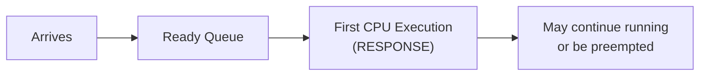
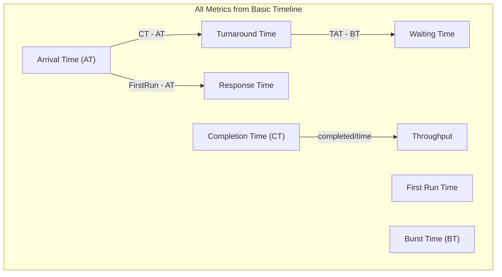
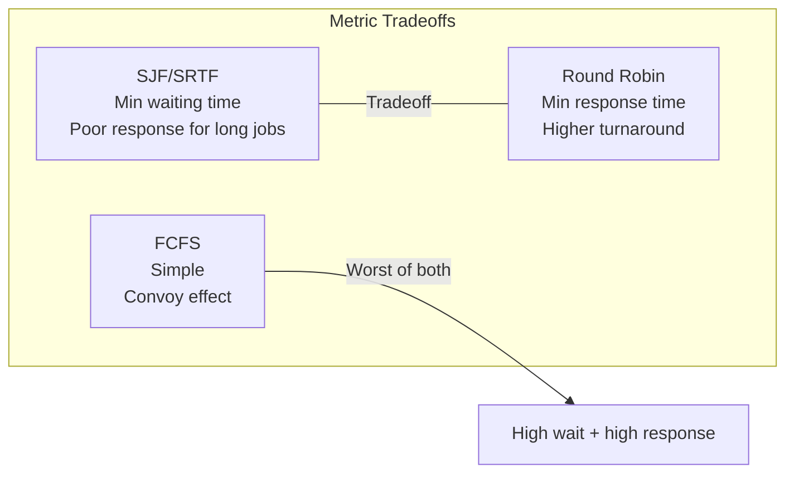
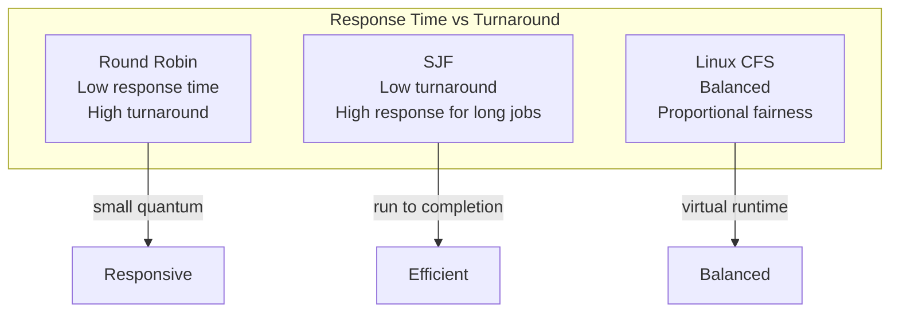

# Scheduling Metrics

## Overview

Scheduling metrics are the quantitative measures used to **evaluate and compare** CPU scheduling algorithms. Choosing the right metric depends on the system's goals — a batch system optimizes for throughput, an interactive system for response time, and a real-time system for deadline compliance.

> **Interview one-liner:** "Scheduling metrics — turnaround time, waiting time, response time, and throughput — quantify how well a scheduler performs. The right metric depends on whether you care about efficiency, fairness, or responsiveness."

## Core Metrics

### 1. Turnaround Time (TAT)

**Definition:** Total time from process submission to completion.

```
Turnaround Time = Completion Time - Arrival Time
                = Waiting Time + Burst Time + I/O Time
```


**What it measures:** How long the user/process must wait from submission to result. Lower is better.

**Example:**

| Process | Arrival | Burst | Completion | Turnaround |
|---------|---------|-------|------------|------------|
| P1 | 0 | 6 | 6 | 6 - 0 = 6 |
| P2 | 2 | 4 | 10 | 10 - 2 = 8 |
| P3 | 4 | 2 | 12 | 12 - 4 = 8 |

Average TAT = (6 + 8 + 8) / 3 = **7.33**

### 2. Waiting Time (WT)

**Definition:** Total time a process spends in the ready queue (not executing, not doing I/O).

```
Waiting Time = Turnaround Time - Burst Time
             = Completion Time - Arrival Time - Burst Time
```


**What it measures:** Time wasted waiting for CPU. Lower is better. This is the metric SJF optimizes.

**Example:**

| Process | Arrival | Burst | Completion | Turnaround | Waiting |
|---------|---------|-------|------------|------------|---------|
| P1 | 0 | 6 | 6 | 6 | 6 - 6 = 0 |
| P2 | 2 | 4 | 10 | 8 | 8 - 4 = 4 |
| P3 | 4 | 2 | 12 | 8 | 8 - 2 = 6 |

Average WT = (0 + 4 + 6) / 3 = **3.33**

### 3. Response Time (RT)

**Definition:** Time from process submission to **first execution** (not completion).

```
Response Time = First Run Time - Arrival Time
```



**What it measures:** How quickly the system reacts. Critical for interactive systems. Lower is better.

**Why it differs from waiting time:** A process may wait, execute partially (time slice), wait again, then execute more. Response time counts only until the first execution starts.

**Example (Round Robin, quantum=3):**

| Process | Arrival | Burst | First Run | Response Time |
|---------|---------|-------|-----------|---------------|
| P1 | 0 | 10 | 0 | 0 - 0 = 0 |
| P2 | 1 | 5 | 3 | 3 - 1 = 2 |
| P3 | 2 | 3 | 6 | 6 - 2 = 4 |

Average RT = (0 + 2 + 4) / 3 = **2.0**

### 4. Throughput

**Definition:** Number of processes completed per unit time.

```
Throughput = Number of processes completed / Total time
```

**What it measures:** System productivity. Higher is better.

**Example:**

```
5 processes completed in 30 time units
Throughput = 5 / 30 = 0.167 processes/time unit
```

**Throughput vs turnaround:** High throughput doesn't guarantee low turnaround. A system could batch 100 short jobs (high throughput) while one long job waits forever (high turnaround).

### 5. CPU Utilization

**Definition:** Percentage of time the CPU is doing useful work.

```
CPU Utilization = (Total time - Idle time) / Total time × 100%
```

**Goal:** Keep as close to 100% as possible. Idle CPU wastes money and energy.

```bash
# Linux: monitor CPU utilization
mpstat 1
# %usr  %sys  %iowait  %idle
#  45     5      10      40

# Or using top/htop
top -bn1 | grep "Cpu(s)"
```

## Metric Relationships



### Summary Table

| Metric | Formula | Optimized By | Best For |
|--------|---------|-------------|----------|
| Turnaround Time | CT - AT | SJF, SRTF | Batch systems |
| Waiting Time | TAT - BT | SJF (provably optimal) | Efficiency |
| Response Time | First Run - AT | RR (small quantum) | Interactive systems |
| Throughput | completed / time | FCFS (low overhead) | Batch processing |
| CPU Utilization | busy / total × 100% | All (minimize idle) | Cost efficiency |

## Detailed Comparison Across Algorithms

### Example Workload

| Process | Arrival | Burst |
|---------|---------|-------|
| P1 | 0 | 8 |
| P2 | 1 | 4 |
| P3 | 2 | 9 |
| P4 | 3 | 5 |

### FCFS (P1 → P2 → P3 → P4)

By arrival order: P1(0) → P2(1) → P3(2) → P4(3).

```
Time:  0        8  12      21      26
       |---P1---|P2|---P3---|---P4---|
```

| Process | CT | TAT | WT | RT |
|---------|-----|-----|-----|-----|
| P1 | 8 | 8 | 0 | 0 |
| P2 | 12 | 11 | 7 | 7 |
| P3 | 21 | 19 | 10 | 10 |
| P4 | 26 | 23 | 18 | 18 |

**Avg TAT:** 15.25 | **Avg WT:** 8.75 | **Avg RT:** 8.75

### SJF (Non-preemptive)

At t=0: only P1 → runs. At t=8: P2(4), P3(9), P4(5) → P2 first.

```
Time:  0        8 12  17      26
       |---P1---|P2|P4|---P3---|
```

| Process | CT | TAT | WT | RT |
|---------|-----|-----|-----|-----|
| P1 | 8 | 8 | 0 | 0 |
| P2 | 12 | 11 | 7 | 7 |
| P3 | 26 | 24 | 15 | 15 |
| P4 | 17 | 14 | 9 | 9 |

**Avg TAT:** 14.25 | **Avg WT:** 7.75 | **Avg RT:** 7.75

*(Same as FCFS because P1 is the only available process at t=0)*

### SRTF (Preemptive SJF)

```
Time:  0 1   5     10    17    26
       |P|P2-|---P4-|----P1-|----P3-|
```

- t=0: P1 arrives, runs (rem 8)
- t=1: P2 arrives (rem 4) < P1 (rem 7) → preempt, run P2
- t=5: P2 done. P1(7), P3(9), P4(5) → run P4
- t=10: P4 done. P1(7), P3(9) → run P1
- t=17: P1 done. Run P3
- t=26: P3 done

| Process | CT | TAT | WT | RT |
|---------|-----|-----|-----|-----|
| P1 | 17 | 17 | 9 | 0 |
| P2 | 5 | 4 | 0 | 0 |
| P3 | 26 | 24 | 15 | 15 |
| P4 | 10 | 7 | 2 | 2 |

**Avg TAT:** 13.0 | **Avg WT:** 6.5 | **Avg RT:** 4.25

### Round Robin (quantum=3)

```
Time:  0  3  6  9  12  15  18  21  24  26
       |P1|P2|P3|P4|P1|P2|P3|P4|P1|P3|
```

- t=0-3: P1 (rem=5)
- t=3-6: P2 (rem=1)
- t=6-9: P3 (rem=6)
- t=9-12: P4 (rem=2)
- t=12-15: P1 (rem=2)
- t=15-16: P2 (rem=0) → done
- t=16-19: P3 (rem=3)
- t=19-21: P4 (rem=0) → done
- t=21-23: P1 (rem=0) → done
- t=23-26: P3 (rem=0) → done

| Process | CT | TAT | WT | RT |
|---------|-----|-----|-----|-----|
| P1 | 23 | 23 | 15 | 0 |
| P2 | 16 | 15 | 11 | 2 |
| P3 | 26 | 24 | 15 | 4 |
| P4 | 21 | 18 | 13 | 6 |

**Avg TAT:** 20.0 | **Avg WT:** 13.5 | **Avg RT:** 3.0

### Priority (Preemptive, lower=higher)

| Process | Arrival | Burst | Priority |
|---------|---------|-------|----------|
| P1 | 0 | 8 | 3 |
| P2 | 1 | 4 | 1 |
| P3 | 2 | 9 | 4 |
| P4 | 3 | 5 | 2 |

```
Time:  0 1     5     10    17      26
       |P|P2---|---P4-|----P1-|----P3-|
```

- t=0: P1 runs (prio 3, only process)
- t=1: P2 arrives (prio 1) → preempt P1 (rem 7), run P2
- t=5: P2 done. P1(7,prio3), P3(9,prio4), P4(5,prio2) → run P4 (prio 2)
- t=10: P4 done. P1(7,prio3), P3(9,prio4) → run P1
- t=17: P1 done. Run P3
- t=26: P3 done

| Process | CT | TAT | WT | RT |
|---------|-----|-----|-----|-----|
| P1 | 17 | 17 | 9 | 0 |
| P2 | 5 | 4 | 0 | 0 |
| P3 | 26 | 24 | 15 | 15 |
| P4 | 10 | 7 | 2 | 2 |

**Avg TAT:** 13.0 | **Avg WT:** 6.5 | **Avg RT:** 4.25

### Algorithm Comparison Summary

| Algorithm | Avg TAT | Avg WT | Avg RT | Starvation |
|-----------|---------|--------|--------|------------|
| FCFS | 15.25 | 8.75 | 8.75 | No |
| SJF | 14.25 | 7.75 | 7.75 | Yes |
| SRTF | 13.0 | 6.5 | 4.25 | Yes |
| RR (q=3) | 20.0 | 13.5 | 3.0 | No |
| Priority | 13.0 | 6.5 | 4.25 | Yes |

**Key observations:**
- **SJF/SRTF** minimize waiting time (SJF is provably optimal)
- **RR** minimizes response time at the cost of higher turnaround
- **FCFS** has poor metrics for mixed workloads
- There's a fundamental **tradeoff between turnaround and response time**



## Fairness Metrics

### Jain's Fairness Index

Measures how fairly CPU time is distributed among n processes:

```
J = (Σxᵢ)² / (n · Σxᵢ²)

Where xᵢ = CPU time received by process i
```

| Value | Meaning |
|-------|---------|
| J = 1.0 | Perfect fairness (all equal) |
| J → 1/n | One process gets everything |
| J ≥ 0.9 | Generally considered fair |

**Example:** 4 processes, CPU time = [25, 25, 25, 25]
J = (100)² / (4 × 2500) = 10000/10000 = **1.0** (perfect)

**Example:** 4 processes, CPU time = [100, 0, 0, 0]
J = (100)² / (4 × 10000) = 10000/40000 = **0.25** (unfair)

```python
def jains_fairness_index(cpu_times):
    """Calculate Jain's Fairness Index"""
    n = len(cpu_times)
    sum_x = sum(cpu_times)
    sum_x2 = sum(x**2 for x in cpu_times)
    return (sum_x ** 2) / (n * sum_x2)

# Perfect fairness
print(jains_fairness_index([25, 25, 25, 25]))  # 1.0

# Unfair
print(jains_fairness_index([100, 0, 0, 0]))     # 0.25

# Moderate
print(jains_fairness_index([40, 30, 20, 10]))   # 0.87
```

### Proportional Fairness

Each process gets CPU proportional to its weight:

```
CPU_i = (weight_i / Σweight_j) × Total_time
```

Linux CFS uses this approach — nice values map to weights, and vruntime ensures proportional sharing.

## Real-World Metrics in Linux

### Measuring with /proc

```bash
# Per-process scheduling stats
cat /proc/<PID>/schedstat
# <cpu_time> <run_queue_wait_time> <num_timeslices>

# Example:
# 123456789 9876543 1500
# CPU time: 123.456789 seconds
# Wait time: 9.876543 seconds  
# Timeslices: 1500

# Per-process status (context switches)
cat /proc/<PID>/status | grep -E "voluntary|nonvoluntary"
# voluntary_ctxt_switches: 1500
# nonvoluntary_ctxt_switches: 42
```

### Measuring with perf

```bash
# Scheduling latency histogram
perf sched latency

# Output:
#   Task               | Runtime ms | Switches | Average delay | Maximum delay
#   -------------------|------------|----------|---------------|--------------
#   my_program         | 1234.56    | 500      | 0.012 ms      | 0.500 ms
#   kworker/0:1        | 567.89     | 200      | 0.005 ms      | 0.100 ms

# Record scheduling events
perf sched record -- sleep 10
perf sched latency
perf sched map          # Visual timeline of which CPU runs which task
perf sched timehist     # Per-event timestamp history
```

### Measuring with time

```bash
# Basic timing
time ./my_program
# real    0m5.123s    # Wall clock time (includes I/O, other processes)
# user    0m4.567s    # CPU time in user mode
# sys     0m0.456s    # CPU time in kernel mode

# Interpretation:
# real > user + sys → process waited (I/O or other processes)
# real ≈ user + sys → CPU-bound (no waiting)
# user >> sys → mostly computation
# sys >> user → mostly system calls
```

### Measuring with vmstat

```bash
vmstat 1
# procs -----------memory---------- ---swap-- -----io---- -system-- ------cpu-----
#  r  b   swpd   free   buff  cache   si   so    bi    bo   in   cs us sy id wa
#  2  0      0 512000  64000 1024000   0    0     0     0  500 2000 45  5 48  2
#  r = processes waiting for CPU (run queue length)
#  cs = context switches per second
#  us = user CPU %, sy = system CPU %, id = idle %, wa = I/O wait %
```

### Scheduling Latency in Practice

```bash
# Benchmark scheduling latency
cyclictest -t1 -p80 -i1000 -l10000
# Measures time between expected and actual wakeup
# Output: min/avg/max latency in microseconds

# Latency vs throughput tradeoff
# - Lower latency → more context switches → lower throughput
# - Higher latency → fewer context switches → higher throughput
```

## Metric Tradeoffs

### The Fundamental Tradeoff



### Quantum Size Impact on RR

| Quantum | Avg Response Time | Avg Turnaround | Context Switches |
|---------|------------------|----------------|------------------|
| 1ms | Very low | Very high | Very high |
| 10ms | Low | High | Moderate |
| 100ms | Moderate | Moderate | Low |
| ∞ (FCFS) | High | Depends | None |

```python
def analyze_quantum_impact(processes, quantum):
    """Show how quantum affects metrics"""
    # Simulate RR and compute metrics
    n = len(processes)
    total_response = 0
    total_turnaround = 0
    switches = 0
    
    # ... (RR simulation)
    
    return {
        'avg_response': total_response / n,
        'avg_turnaround': total_turnaround / n,
        'context_switches': switches
    }

# Sweep quantum values
for q in [1, 2, 5, 10, 20, 50, 100]:
    metrics = analyze_quantum_impact(processes, q)
    print(f"Q={q}: RT={metrics['avg_response']:.1f}, "
          f"TAT={metrics['avg_turnaround']:.1f}, "
          f"Switches={metrics['context_switches']}")
```

### Starvation Analysis

| Algorithm | Can Starve? | Metric Impact |
|-----------|-------------|---------------|
| FCFS | No | High avg waiting (convoy effect) |
| SJF | Yes (long jobs) | Optimal avg waiting, but unfair |
| RR | No | Higher avg turnaround, but fair |
| Priority | Yes (low priority) | Good for high-priority, terrible for low |
| MLFQ | Possible (mitigated by aging) | Adapts to workload |

## Advanced Metrics

### Weighted Metrics

Not all processes are equal. Weighted metrics account for importance:

```
Weighted TAT = Σ(wᵢ × TATᵢ) / Σwᵢ

Where wᵢ = importance weight of process i
```

### Fairness-Adjusted Metrics

```
Fairness-Adjusted Throughput = Throughput × Jain's Fairness Index

This penalizes schedulers that achieve high throughput by starving some processes.
```

### Energy-Aware Metrics

Modern schedulers also consider energy:

```
Energy-Delay Product (EDP) = Energy × Delay
Energy-Delay² Product (ED²P) = Energy × Delay²

Lower EDP = better energy-efficiency tradeoff
```

Linux's `schedutil` governor uses CPU utilization to scale frequency, optimizing energy.

## Interview Questions

### Beginner

**Q1: What is turnaround time?**  
A: Turnaround time is the total time from when a process arrives to when it completes. Formula: TAT = Completion Time - Arrival Time. It includes waiting time, execution time, and I/O time.

**Q2: What is the difference between turnaround time and waiting time?**  
A: Turnaround time = total time from arrival to completion. Waiting time = time spent in the ready queue (not executing). Waiting Time = Turnaround Time - Burst Time.

**Q3: Which scheduling algorithm minimizes average waiting time?**  
A: Shortest Job First (SJF) is provably optimal for minimizing average waiting time among non-preemptive algorithms. Shortest Remaining Time First (SRTF, preemptive SJF) is optimal among all algorithms.

### Intermediate

**Q4: Why might a scheduler optimize for response time instead of turnaround time?**  
A: Interactive systems (desktop, mobile, web servers) need fast response — the user should see something quickly. Batch systems optimize turnaround — total processing time matters more. A scheduler that runs jobs to completion (low turnaround) gives poor response to interactive users.

**Q5: How do you measure scheduling overhead?**  
A: 1) Context switch count (`/proc/PID/status`), 2) Scheduling latency (`perf sched latency`), 3) Run queue wait time (`/proc/PID/schedstat`), 4) Voluntary vs involuntary switches, 5) `cyclictest` for worst-case latency, 6) `vmstat` for system-wide context switch rate.

**Q6: What is Jain's Fairness Index?**  
A: A metric (0 to 1) measuring how fairly CPU time is distributed. J = (Σxᵢ)² / (n × Σxᵢ²). J=1 means perfect fairness (all equal). Used to evaluate whether a scheduler treats processes equitably.

**Q7: Explain the turnaround time vs response time tradeoff.**  
A: SJF/SRTF minimize turnaround time but give poor response time to long jobs (they must wait for all shorter jobs). RR gives excellent response time (every process gets CPU quickly) but increases turnaround (context switches add overhead, processes take longer to complete). The optimal choice depends on the workload: batch → minimize turnaround; interactive → minimize response time.

### FAANG-Level

**Q8: Design metrics for a cloud scheduler serving 10,000 tenants.**  
A: Key metrics: 1) **P50/P95/P99 latency** per tenant (not just average), 2) **SLA compliance rate** (% of requests meeting deadline), 3) **Fairness index** across tenants (Jain's), 4) **Resource utilization** (CPU, memory, network), 5) **Preemption rate** (too high = instability), 6) **Tail latency** (99th percentile matters more than average), 7) **Cost efficiency** (work done per dollar), 8) **Isolation metric** (one tenant's load shouldn't affect another's latency).

**Q9: How would you benchmark a new scheduler implementation?**  
A: 1) **Synthetic workloads:** Vary CPU burst lengths, arrival patterns, I/O ratios, 2) **Real workloads:** Use traces from production (Google/Azure traces available), 3) **Metrics:** P50/P95/P99 latency, throughput, fairness, energy, 4) **Baselines:** Compare against CFS, EEVDF, and FIFO, 5) **Stress testing:** Overload conditions, 1000+ processes, NUMA effects, 6) **Tools:** `perf sched`, `cyclictest`, `schbench`, custom microbenchmarks, 7) **Statistical rigor:** Multiple runs, confidence intervals, not just single measurements.

**Q10: How does Linux CFS balance throughput and latency?**  
A: CFS uses virtual runtime (vruntime) — each process's vruntime increases proportional to actual CPU time / weight. The process with lowest vruntime runs next. This naturally balances: 1) **Throughput:** No fixed quantum — processes run until preempted by a lower-vruntime process, 2) **Latency:** Target latency (default 6ms) ensures all processes get CPU within that window, 3) **Granularity:** Minimum granularity (0.75ms) prevents excessive context switches, 4) **Nice values:** Map to weights that control proportional sharing. The sched_latency_ns and min_granularity_ns sysctls control the tradeoff.

## Common Mistakes

1. **Confusing turnaround with waiting time:** Turnaround = completion - arrival. Waiting = turnaround - burst. They're different!
2. **Not accounting for arrival time:** Assuming all processes arrive at t=0 makes problems trivial. Real systems have staggered arrivals.
3. **Using average as the only metric:** Average metrics hide outliers. A scheduler with avg response 10ms but P99 of 500ms is worse than one with avg 15ms but P99 of 20ms. Always report percentiles.
4. **Ignoring context switch overhead:** In calculations, don't forget to add context switch time between processes. A switch of 1ms with 50 switches adds 50ms of pure overhead.
5. **Optimizing one metric blindly:** Minimizing turnaround (SJF) may starve long jobs. Minimizing response time (small RR quantum) increases total completion time. Good schedulers balance multiple metrics.
6. **Forgetting I/O in turnaround:** Turnaround includes I/O waiting time. A process that does a lot of I/O has high turnaround but may have low CPU waiting time.

## Summary

| Metric | Formula | Optimize For | Best Algorithm |
|--------|---------|-------------|----------------|
| Turnaround Time | CT - AT | Batch processing | SJF/SRTF |
| Waiting Time | TAT - BT | CPU efficiency | SJF |
| Response Time | First Run - AT | Interactive systems | RR |
| Throughput | completed/time | Batch throughput | FCFS |
| CPU Utilization | busy/total | Cost efficiency | All |
| Fairness | Jain's Index | Equitable sharing | RR, CFS |

| Metric Type | Single Number? | Good for Interviews? | Good for Production? |
|-------------|---------------|---------------------|---------------------|
| Average | Yes | Yes | No (hides outliers) |
| P50 (Median) | Yes | Yes | Yes |
| P95/P99 | Yes | Yes (FAANG) | Yes (tail latency) |
| Min/Max | Yes | Edge cases | Yes |

## Cross-References

- [FCFS](./fcfs.md) - Simplest algorithm, baseline metrics
- [SJF](./sjf.md) - Optimal waiting time
- [Round Robin](./round-robin.md) - Best response time
- [Priority](./priority.md) - Weighted metrics
- [Real-time Scheduling](./realtime.md) - Deadline-based metrics
- [Linux CFS](./linux-cfs.md) - Real-world balanced scheduler
- [Context Switching](../processes/context-switching.md) - Overhead measurement
