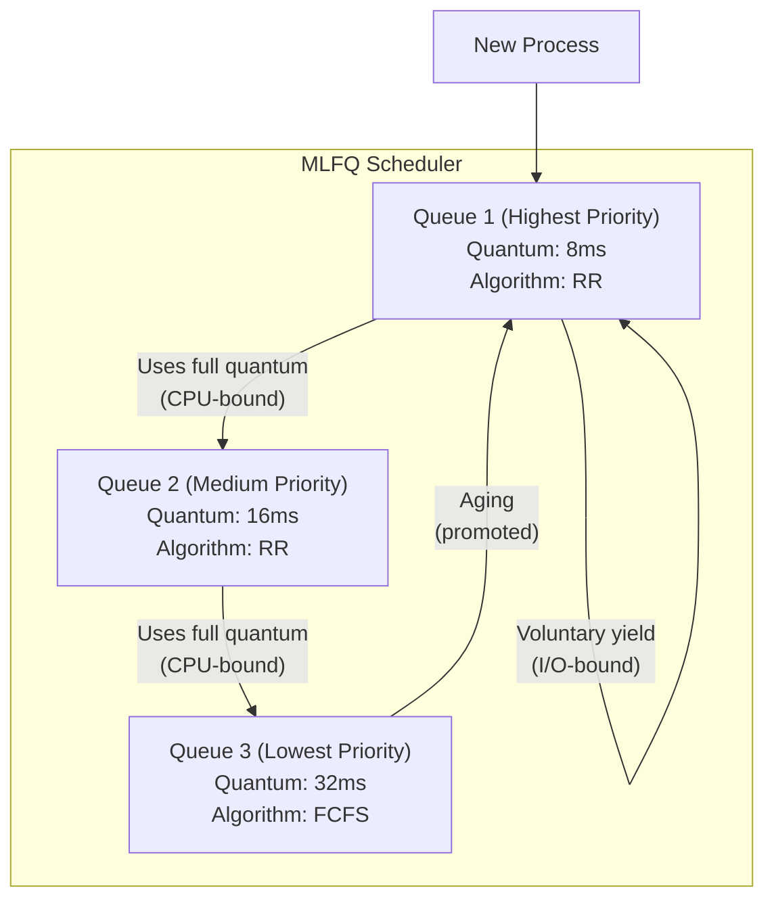

# Multilevel Feedback Queue (MLFQ)

## Overview

**Multilevel Feedback Queue (MLFQ)** is an adaptive scheduling algorithm that allows processes to **move between queues** based on their behavior. Unlike multilevel queue (fixed assignment), MLFQ observes how processes use the CPU and adjusts their priority dynamically.

> **Interview one-liner:** "MLFQ is the most sophisticated scheduling algorithm — it uses multiple queues with different time quanta, and processes move up or down based on their CPU behavior (I/O-bound → high priority, CPU-bound → low priority)."

## Key Principles

1. **Multiple queues** with different priorities and time quanta
2. **Processes move between queues** based on behavior
3. **I/O-bound processes stay in high-priority queues** (good response time)
4. **CPU-bound processes drop to low-priority queues** (don't hog CPU)
5. **Aging prevents starvation** (processes eventually promoted)

## Queue Structure



## Rules

### Rule 1: Higher-priority queue first
If Q1 has processes, run them before Q2, Q3, etc.

### Rule 2: Round Robin within each queue
Processes within the same queue are scheduled using RR with that queue's quantum.

### Rule 3: New processes enter the highest queue
A newly arriving process starts in Q1.

### Rule 4: Demotion on full quantum usage
If a process uses its entire time quantum, it's CPU-bound → move to next lower queue.

### Rule 5: No demotion on voluntary yield
If a process yields (blocks for I/O) before its quantum expires, it stays in the current queue (or is promoted).

### Rule 6: Aging (promotion)
After a fixed time period, promote processes from lower queues to prevent starvation.

## Example

| Process | Type | Arrival | Burst |
|---------|------|---------|-------|
| P1 | I/O-bound | 0 | 1 (CPU) + 5 (I/O) + 1 (CPU) |
| P2 | CPU-bound | 0 | 20 |
| P3 | Interactive | 6 | 2 (CPU) + 3 (I/O) + 2 (CPU) |

**MLFQ Configuration:**
- Q1: quantum=4, highest priority
- Q2: quantum=8, medium priority
- Q3: FCFS, lowest priority

### Execution Trace

```
Time 0-1:   P1 runs in Q1 (uses 1, yields for I/O → stays in Q1)
Time 1-5:   P2 runs in Q1 (quantum=4, uses 4 → demoted to Q2)
Time 5-9:   P1 doing I/O, P2 runs in Q2 (quantum=8, uses 4 more, total Q2=4 → still Q2)
Time 6:     P3 arrives in Q1, P2 still running in Q2
Time 9-11:  P3 runs in Q1 (uses 2, yields for I/O → stays in Q1)
Time 11-15: P2 continues in Q2 (uses 4 more, total Q2=8 → demoted to Q3)
...
```

## Time Allocation Table

| Queue | Quantum | Priority | Who stays? |
|-------|---------|----------|-----------|
| Q1 | 8ms | Highest | I/O-bound (yield before quantum) |
| Q2 | 16ms | Medium | Moderate CPU usage |
| Q3 | 32ms/FCFS | Lowest | CPU-bound (always use full quantum) |

## Gaming the System

**Problem:** A process can game MLFQ by doing unnecessary I/O right before its quantum expires to stay in a high-priority queue.

**Solution: Rule 7 — Priority Boosting**

```
After time S (e.g., 1 second), ALL processes move to Q1
```

This ensures:
- CPU-bound processes can't be starved forever
- Gaming is less effective (process eventually gets boosted anyway)
- System adapts to changing workload

```python
def mlqf_schedule(queues, boost_interval):
    last_boost = 0
    
    while processes_remain():
        current_time += 1
        
        # Rule 7: Boost all processes periodically
        if current_time - last_boost >= boost_interval:
            boost_all_to_q1(queues)
            last_boost = current_time
        
        # Rule 1: Serve highest priority queue
        for queue in queues:
            if not queue.is_empty():
                process = queue.front()
                quantum = queue.quantum
                
                # Rule 2: RR within queue
                run_time = min(quantum, process.remaining)
                current_time += run_time
                process.remaining -= run_time
                
                if process.remaining == 0:
                    # Process completed
                    remove(process)
                elif process.yielded():
                    # Rule 5: Stay in queue (I/O-bound)
                    pass
                else:
                    # Rule 4: Demote (used full quantum)
                    next_queue = get_next_lower_queue(queue)
                    next_queue.add(process)
                
                break
```

## Linux MLFQ Implementation (Historical)

The O(1) scheduler (Linux 2.6.0-2.6.22) used MLFQ:

```
140 priority levels:
  0-99:   Real-time priorities
  100-139: Normal priorities (nice -20 to +19 maps to 100-139)

Each priority level has its own queue (140 queues total)
Bitmap for O(1) queue selection
```

## Comparison with Other Algorithms

| Algorithm | Adaptive? | Starvation? | Complexity | Best For |
|-----------|-----------|-------------|------------|----------|
| FCFS | No | No | O(1) | Batch |
| SJF | No | Yes | O(n) | Minimum wait |
| RR | No | No | O(1) | Interactive |
| Priority | No | Yes | O(1) | Mixed |
| MLQ | No | Possible | O(1) | Categorized |
| **MLFQ** | **Yes** | **Prevented by aging** | **O(1)** | **General purpose** |

## Interview Questions

### Beginner

**Q1: What is MLFQ scheduling?**  
A: MLFQ uses multiple queues with different priorities and time quanta. Processes start in the highest queue and move down if they're CPU-bound (use full quantum). I/O-bound processes stay in high queues. This adapts to process behavior automatically.

**Q2: How does MLFQ prevent starvation?**  
A: Through periodic priority boosting — after a fixed time, all processes are moved to the highest queue. This ensures lower-priority processes eventually get CPU time.

### Intermediate

**Q3: How does MLFQ distinguish between I/O-bound and CPU-bound processes?**  
A: By observing behavior: if a process voluntarily yields (blocks for I/O) before its quantum expires, it's I/O-bound → stays in high queue. If it uses the full quantum, it's CPU-bound → demoted to lower queue.

**Q4: What is gaming in MLFQ and how do you prevent it?**  
A: Gaming: a process does unnecessary I/O right before its quantum expires to stay in a high-priority queue. Prevention: 1) Priority boosting (periodic reset), 2) Track total CPU time (not just current quantum), 3) Use better CPU-bound detection.

**Q5: How do you configure the queues in MLFQ?**  
A: Key parameters: 1) Number of queues (3-7 typical), 2) Quantum per queue (doubling: 8, 16, 32ms), 3) Demotion policy (full quantum usage), 4) Promotion policy (aging interval), 5) Boost interval. The exact values depend on workload — interactive systems want shorter quanta at the top.

### FAANG-Level

**Q6: Design an MLFQ scheduler for a mixed desktop/server workload.**  
A: 1) **Q1 (8ms):** Desktop apps, terminal, browser — RR, highest priority, 2) **Q2 (32ms):** Background compilation, indexing — RR, medium priority, 3) **Q3 (128ms):** Batch jobs, backups — FCFS, lowest priority, 4) **Demotion:** Process uses full quantum → drop one queue, 5) **Promotion:** Process does I/O → stay/boost. Aging: every 10s, boost all to Q1, 6) **Nice values:** Adjust quantum within each queue (nice -20 → double quantum), 7) **Cgroups integration:** Per-group MLFQ for container isolation.

**Q7: Compare MLFQ with CFS. Which is better?**  
A: **MLFQ:** Discrete queues, explicit demotion/promotion, can be tuned, but complex rules and gaming potential. **CFS:** Continuous (no discrete queues), virtual runtime tracks fairness precisely, no demotion rules (just vruntime ordering), simpler conceptually. **CFS is generally better** because: 1) No gaming (vruntime can't be faked), 2) Proportional fairness (not just priority levels), 3) Simpler tuning (just nice values), 4) O(log n) scheduling. MLFQ's advantage: explicit control over process categories.

**Q8: How would you implement MLFQ for a real-time + general-purpose system?**  
A: 1) Real-time processes bypass MLFQ entirely (SCHED_FIFO/RR with fixed priorities), 2) MLFQ handles only SCHED_OTHER processes, 3) Real-time tasks can preempt any MLFQ process, 4) MLFQ queues: Q1 for interactive (short quantum), Q2 for normal, Q3 for batch, 5) Strict isolation: real-time CPU reservation (cgroup cpu.rt_runtime_us), 6) Deadline scheduler (SCHED_DEADLINE) for periodic real-time tasks with EDF within the real-time class.

## Common Mistakes

1. **No aging/boosting:** Without periodic promotion, lower queues starve.
2. **Too many queues:** Adds complexity without benefit. 3-5 queues is typical.
3. **Wrong quantum doubling:** Quantum should roughly double between queues.
4. **Ignoring gaming:** Processes can exploit I/O to stay in high queues.
5. **Not adjusting to workload:** MLFQ parameters need tuning for specific workloads.

## Summary

| Rule | Description |
|------|-------------|
| 1 | Higher-priority queue served first |
| 2 | RR within each queue |
| 3 | New processes enter highest queue |
| 4 | Demote if full quantum used (CPU-bound) |
| 5 | Stay/boost if yield before quantum (I/O-bound) |
| 6 | Aging prevents starvation |
| 7 | Periodic boost resets priorities |

## Cross-References

- [Multilevel Queue](./multilevel-queue.md) - Fixed version (no movement)
- [Round Robin](./round-robin.md) - Per-queue algorithm
- [Priority](./priority.md) - Priority between queues
- [Linux CFS](./linux-cfs.md) - Linux's replacement for MLFQ
- [SJF](./sjf.md) - What MLFQ approximates for short jobs
