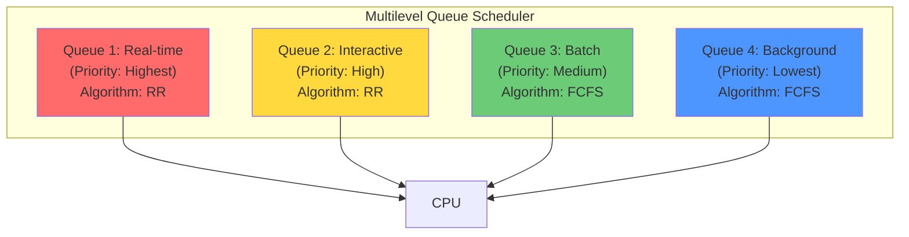

# Multilevel Queue Scheduling

## Overview

**Multilevel queue scheduling** partitions the ready queue into several separate queues, each with its own scheduling algorithm. Processes are permanently assigned to a queue based on their type (e.g., interactive, batch, real-time).

> **Interview one-liner:** "Multilevel queue scheduling divides processes into separate queues by type — each queue has its own scheduling policy, with fixed priority between queues."

## How It Works



## Queue Configuration

| Queue | Priority | Processes | Scheduling |
|-------|----------|-----------|------------|
| **System/Real-time** | Highest | Interrupt handlers, real-time tasks | RR (small quantum) |
| **Interactive** | High | Interactive processes (editors, shells) | RR (medium quantum) |
| **Batch** | Medium | Batch jobs, compilations | FCFS |
| **Background** | Lowest | Backup, indexers | FCFS |

## Scheduling Policies Between Queues

### Fixed Priority (Strict)

Higher-priority queues are always served first:

```python
def schedule_fixed_priority(queues):
    for queue in queues:  # Highest priority first
        if not queue.is_empty():
            return queue.dequeue()
    return None  # All empty
```

**Problem:** Lower queues may starve if higher queues are never empty.

### Time Slicing

Each queue gets a fraction of CPU time:

```
Queue 1 (Real-time):     50% of CPU
Queue 2 (Interactive):   30% of CPU
Queue 3 (Batch):         15% of CPU
Queue 4 (Background):     5% of CPU
```

```python
def schedule_time_slice(queues, time_slot):
    # Within each time slice, serve queue based on allocation
    total_weight = sum(q.weight for q in queues)
    for queue in queues:
        queue_share = queue.weight / total_weight
        # Run processes from this queue for queue_share * time_slot
```

## Example

| Process | Type | Arrival | Burst |
|---------|------|---------|-------|
| P1 | Real-time | 0 | 5 |
| P2 | Interactive | 1 | 3 |
| P3 | Batch | 2 | 8 |
| P4 | Interactive | 3 | 2 |

**Configuration:**
- Queue 1 (Real-time): RR, quantum=2, priority 1 (highest)
- Queue 2 (Interactive): RR, quantum=4, priority 2
- Queue 3 (Batch): FCFS, priority 3 (lowest)

### Gantt Chart

```
Time:  0  2  4  5  8  10    18
       |P1|P1|P2|P4|P2|---P3---|
       [Q1][Q1][Q2][Q2][Q2][  Q3  ]
```

- t=0-4: P1 runs in Q1 (RR, quantum=2, two rounds to complete)
- t=4-8: Q1 empty, serve Q2. P2(3) and P4(2) run with RR (quantum=4)
- t=8-18: Q1 and Q2 empty, serve Q3. P3 runs FCFS.

## Process Movement Between Queues

In **multilevel queue**, processes stay in their assigned queue permanently. But you can add rules:

```python
# Process starts in interactive queue
# If it uses full CPU quantum → demoted to batch queue
# If it does I/O before quantum expires → stays in interactive

def check_demotion(process, quantum_used):
    if quantum_used >= quantum:
        demote_to_batch(process)  # CPU-bound → lower priority
    # I/O-bound processes stay in high-priority queue
```

This is the bridge to [Multilevel Feedback Queue](./multilevel-feedback.md).

## Implementation

```python
from collections import deque

class MultilevelQueue:
    def __init__(self):
        self.queues = [
            {'name': 'real-time', 'queue': deque(), 'algorithm': 'rr', 'quantum': 2, 'priority': 1},
            {'name': 'interactive', 'queue': deque(), 'algorithm': 'rr', 'quantum': 4, 'priority': 2},
            {'name': 'batch', 'queue': deque(), 'algorithm': 'fcfs', 'quantum': None, 'priority': 3},
        ]
    
    def add_process(self, process, queue_idx):
        self.queues[queue_idx]['queue'].append(process)
    
    def schedule(self):
        for q in self.queues:
            if q['queue']:
                return q['queue'].popleft()
        return None
```

## Advantages and Disadvantages

| Advantages | Disadvantages |
|------------|---------------|
| Simple implementation | Starvation of lower queues |
| Separates process types | Inflexible (processes fixed in queue) |
| Different policies per queue | Hard to configure queue boundaries |
| Low overhead | May not adapt to changing behavior |
| Clear priority structure | Between-queue policy is complex |

## Interview Questions

### Beginner

**Q1: What is multilevel queue scheduling?**  
A: The ready queue is divided into multiple queues, each with a different priority and scheduling algorithm. Processes are permanently assigned to a queue based on their type (real-time, interactive, batch).

**Q2: How does it differ from simple priority scheduling?**  
A: In priority scheduling, there's one queue sorted by priority. In multilevel queue, there are multiple separate queues, each with its own scheduling algorithm (RR, FCFS, etc.), and a policy for choosing between queues.

### Intermediate

**Q3: How do you prevent starvation in lower-priority queues?**  
A: 1) **Time slicing:** Allocate a percentage of CPU to each queue, 2) **Aging:** Move processes to higher-priority queues after waiting too long, 3) **Periodic boosting:** Temporarily promote lower queues.

**Q4: What scheduling algorithm would you use for each queue?**  
A: Real-time: RR (small quantum for responsiveness). Interactive: RR (medium quantum for fairness). Batch: FCFS (throughput, no preemption overhead). Background: FCFS (lowest priority, runs when nothing else).

**Q5: How do you determine which queue a process belongs to?**  
A: Based on: 1) Process type (system calls, flags), 2) Behavior (I/O-bound → interactive, CPU-bound → batch), 3) User assignment (nice values), 4) Historical behavior (demotion/promotion in MLFQ).

### FAANG-Level

**Q6: Design a multilevel queue system for a cloud provider.**  
A: 1) **Tier 1 (Premium):** Guaranteed latency SLA, preemptive priority, dedicated CPU cores, 2) **Tier 2 (Standard):** Best-effort latency, CFS-based, shared cores, 3) **Tier 3 (Spot):** Cheapest, runs when tiers 1-2 are idle, can be preempted, 4) **Scheduling:** Time-slicing between tiers with configurable weights, 5) **Isolation:** cgroups for CPU/memory, network QoS, 6) **Monitoring:** Track per-tier utilization and SLA compliance.

**QQ7: How would you implement fair scheduling across queues?**  
A: Use **Virtual Clock** or **Weighted Fair Queuing (WFQ):** Each queue has a weight. Virtual time advances based on real time / total weight. Each queue gets CPU proportional to its weight. Processes within a queue use the queue's algorithm. This prevents starvation while respecting priority differences.

## Common Mistakes

1. **Starvation:** Lower-priority queues may never get CPU. Always implement time slicing or aging.
2. **Fixed assignments:** Processes may change behavior (I/O-bound becomes CPU-bound). Use MLFQ for adaptability.
3. **Wrong algorithm per queue:** Using FCFS for interactive queues gives poor response time.
4. **Ignoring inter-queue fairness:** Time-slicing prevents one queue from monopolizing CPU.

## Summary

| Aspect | Key Point |
|--------|-----------|
| Structure | Multiple queues, each with own algorithm |
| Queue selection | Fixed priority or time-slicing |
| Process assignment | Based on type (permanent) |
| Main advantage | Simple, clear separation |
| Main disadvantage | Starvation of lower queues |

## Cross-References

- [Multilevel Feedback](./multilevel-feedback.md) - Adaptive version
- [Priority](./priority.md) - Priority between queues
- [Round Robin](./round-robin.md) - Common per-queue algorithm
- [Linux CFS](./linux-cfs.md) - Linux's approach


## Cross References

- [Multilevel Feedback](multilevel-feedback.md)
- [Priority Scheduling](priority.md)
- [Round Robin](round-robin.md)
