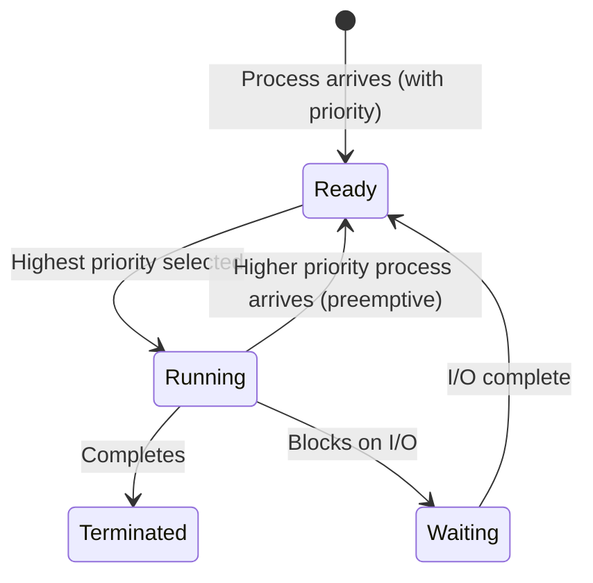
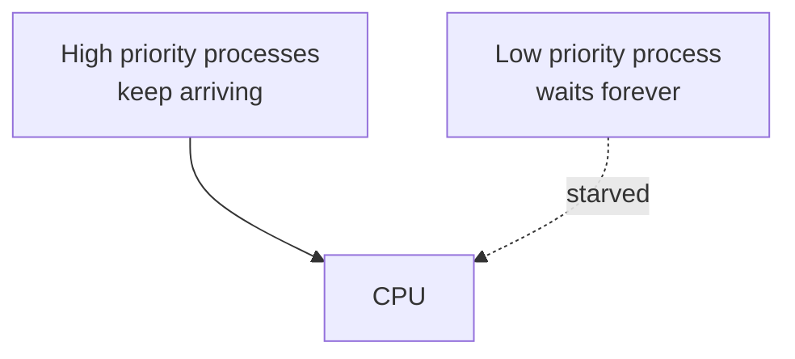
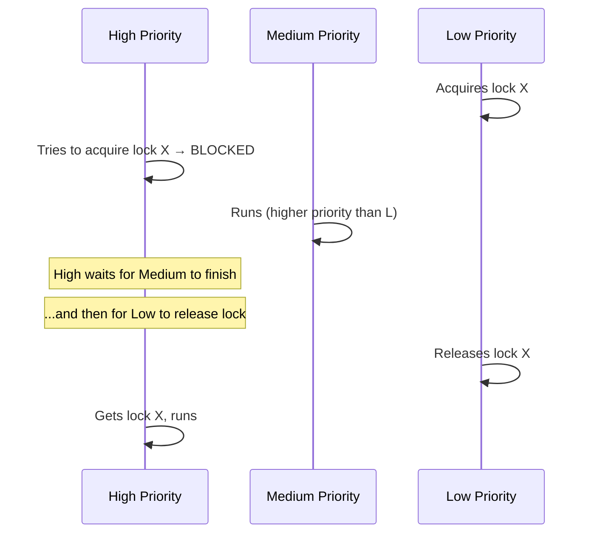

# Priority Scheduling

## Overview

**Priority scheduling** assigns each process a **priority**, and the CPU is allocated to the process with the highest priority. It can be preemptive or non-preemptive.

> **Interview one-liner:** "Priority scheduling runs the highest-priority process first — it's flexible and supports mixed workloads but can starve low-priority processes without aging."

## How It Works



## Priority Assignment

| Source | Method | Example |
|--------|--------|---------|
| **OS** | Based on resource usage | I/O-bound → high, CPU-bound → low |
| **User** | Nice values | `nice -n -20` (highest), `nice -n 19` (lowest) |
| **System** | Fixed by process type | Real-time > Interactive > Batch |

### Linux Priority

```bash
# Nice values: -20 (highest priority) to 19 (lowest)
nice -n 10 ./my_program       # Start with lower priority
renice -5 -p <PID>            # Change priority

# Real-time priorities: 1 (lowest) to 99 (highest)
chrt -f 50 ./my_program       # SCHED_FIFO, priority 50
chrt -r 50 ./my_program       # SCHED_RR, priority 50

# View priority
ps -o pid,ni,pri,comm -p <PID>
```

## Example

| Process | Arrival | Burst | Priority |
|---------|---------|-------|----------|
| P1 | 0 | 10 | 3 |
| P2 | 1 | 1 | 1 |
| P3 | 2 | 2 | 4 |
| P4 | 3 | 1 | 5 |
| P5 | 4 | 5 | 2 |

*Lower number = higher priority*

### Non-preemptive Priority

```
Time:  0     10 11  13    14     19
       |--P1--|P2|--P3--|P4|---P5---|
```

P1 arrives first (only one available), runs to completion. Then P2 (priority 1), P3 (priority 4), P4 (priority 5), P5 (priority 2).

### Preemptive Priority

```
Time:  0  1  2  3  4     9  10 12 13    23
       |P1|P2|P3|P4|---P5---|P3|P1 remaining--|
```

- t=0: P1 runs (priority 3)
- t=1: P2 arrives (priority 1) → preempt P1, run P2
- t=2: P2 done. P1(3), P3(4) → P1 runs (higher priority)
- t=3: P4 arrives (priority 5) → lower than P1, continue
- t=4: P5 arrives (priority 2) → preempt P1, run P5
- t=9: P5 done. P1(3), P3(4), P4(5) → P1 runs
- ...continues

## Starvation Problem

Low-priority processes may **never** execute:



### Solution: Aging

Gradually increase the priority of waiting processes:

```python
def effective_priority(base_priority, wait_time, aging_rate=0.01):
    """Priority decreases (higher importance) as wait time increases"""
    return max(0, base_priority - (wait_time * aging_rate))

# Example: Process with priority 10, waits 500 time units
# effective = 10 - (500 * 0.01) = 5
# After 1000 time units: effective = 0 (highest priority)
```

## Priority Inversion

**Priority inversion** occurs when a high-priority process waits for a resource held by a low-priority process, while a medium-priority process runs:



### Solutions

#### Priority Inheritance Protocol (PIP)

When high-priority process blocks on a lock held by low-priority:
- Temporarily boost low-priority process to high-priority
- Low-priority runs, releases lock quickly
- Priority reverts after lock release

```c
// POSIX priority inheritance mutex
pthread_mutex_t mutex;
pthread_mutexattr_t attr;
pthread_mutexattr_init(&attr);
pthread_mutexattr_setprotocol(&attr, PTHREAD_PRIO_INHERIT);
pthread_mutex_init(&mutex, &attr);
```

#### Priority Ceiling Protocol (PCP)

Each lock has a **ceiling priority** = highest priority of any process that may use it:
- When a process acquires a lock, its priority is boosted to the ceiling
- Prevents priority inversion proactively

## Implementation

```python
def priority_scheduling(processes, preemptive=False):
    """
    processes: list of (pid, arrival, burst, priority)
    Lower priority number = higher priority
    """
    processes.sort(key=lambda x: x[1])
    n = len(processes)
    remaining = {p[0]: p[2] for p in processes}
    completed = {}
    current_time = 0
    
    while len(completed) < n:
        # Find available processes
        available = [p for p in processes 
                     if p[0] not in completed and p[1] <= current_time]
        
        if not available:
            current_time = min(p[1] for p in processes if p[0] not in completed)
            continue
        
        # Select highest priority (lowest number)
        available.sort(key=lambda x: x[3])
        pid, arrival, burst, priority = available[0]
        
        if preemptive:
            run_time = 1  # Run one unit, recheck
        else:
            run_time = remaining[pid]
        
        current_time += run_time
        remaining[pid] -= run_time
        
        if remaining[pid] == 0:
            completed[pid] = {
                'completion': current_time,
                'turnaround': current_time - arrival,
                'waiting': current_time - arrival - burst
            }
    
    return completed
```

## Interview Questions

### Beginner

**Q1: What is priority scheduling?**  
A: Each process is assigned a priority. The CPU is given to the highest-priority process. It can be preemptive (high-priority arriving process preempts current) or non-preemptive.

**Q2: What is starvation in priority scheduling?**  
A: Low-priority processes may never execute if high-priority processes keep arriving. Solution: aging — gradually increase the priority of waiting processes.

### Intermediate

**Q3: What is priority inversion?**  
A: When a high-priority process waits for a lock held by a low-priority process, and a medium-priority process runs instead of the low-priority one (which could release the lock). The high-priority process effectively runs at the priority of the low-priority process.

**Q4: How does priority inheritance solve priority inversion?**  
A: When a high-priority process blocks on a lock held by a low-priority process, the low-priority process temporarily inherits the high priority. This prevents medium-priority processes from preempting it, so it releases the lock faster.

**Q5: What is the difference between static and dynamic priority?**  
A: Static priority is assigned at creation and doesn't change. Dynamic priority changes based on behavior (e.g., aging, I/O boosts). Linux uses static nice values plus dynamic adjustments.

### FAANG-Level

**Q6: Design a priority system for a real-time operating system.**  
A: 1) **Fixed priorities** for hard real-time tasks (Rate Monotonic: priority = 1/period), 2) **Dynamic priorities** for soft real-time (Earliest Deadline First), 3) **Priority ceiling protocol** for shared resources (prevents priority inversion and deadlocks), 4) **Interrupt priorities** separate from task priorities, 5) **Priority inheritance** for mutexes, 6) **No priority inversion window** — use non-preemptive sections or ceiling protocol.

**Q7: How does Linux handle priority for different scheduling classes?**  
A: Linux has scheduling classes: SCHED_DEADLINE (highest) > SCHED_FIFO/SCHED_RR > SCHED_OTHER/SCHED_BATCH > SCHED_IDLE. Within SCHED_FIFO/RR, real-time priority 1-99. Within SCHED_OTHER (CFS), nice -20 to 19 maps to weight, which affects vruntime accumulation rate. The kernel always schedules the highest-priority class first.

**Q8: Explain the Mars Pathfinder priority inversion incident.**  
A: In 1997, the Mars Pathfinder experienced priority inversion: a high-priority bus management task blocked on a mutex held by a low-priority meteorological data task, while a medium-priority communication task kept running. This caused system resets. Fix: enabling priority inheritance on the mutex (which was available but not enabled). Lesson: always use priority inheritance for real-time mutexes.

## Common Mistakes

1. **Confusing priority direction:** Lower number = higher priority (Linux) vs higher number = higher priority (some textbooks). Always clarify.
2. **Forgetting aging:** Without aging, low-priority processes starve.
3. **Ignoring priority inversion:** Critical bug in real-time systems (Mars Pathfinder).
4. **Not handling equal priorities:** When priorities are equal, use FCFS or Round Robin as tiebreaker.

## Summary

| Property | Value |
|----------|-------|
| Type | Preemptive or Non-preemptive |
| Starvation | Yes (low priority) |
| Solution for starvation | Aging |
| Priority inversion | Problem with shared resources |
| Solution for inversion | Priority inheritance / ceiling |

## Cross-References

- [FCFS](./fcfs.md) - Equal priority tiebreaker
- [Round Robin](./round-robin.md) - Time-sliced priority scheduling
- [Multilevel Queue](./multilevel-queue.md) - Multiple priority levels
- [Real-time](./realtime.md) - Priority for deadlines
- [Linux CFS](./linux-cfs.md) - How Linux handles nice values
