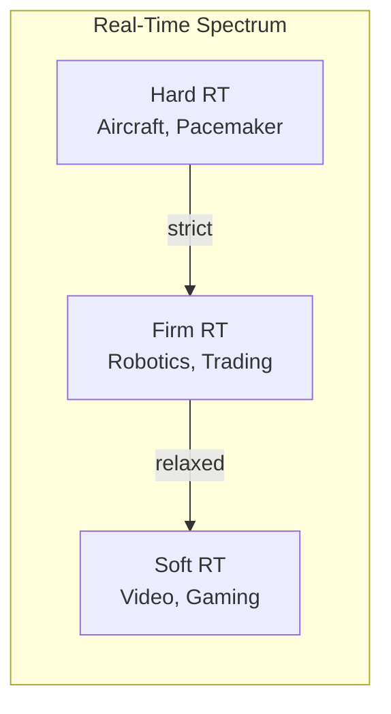
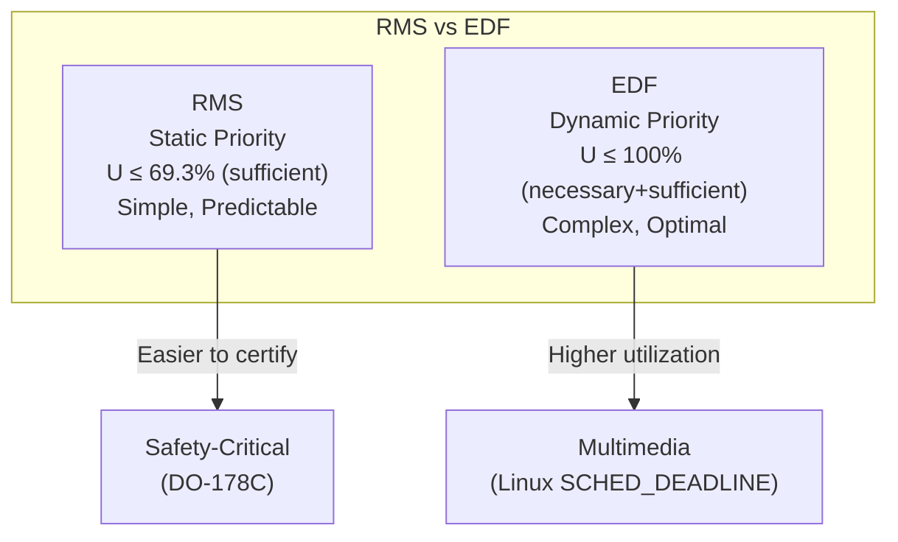
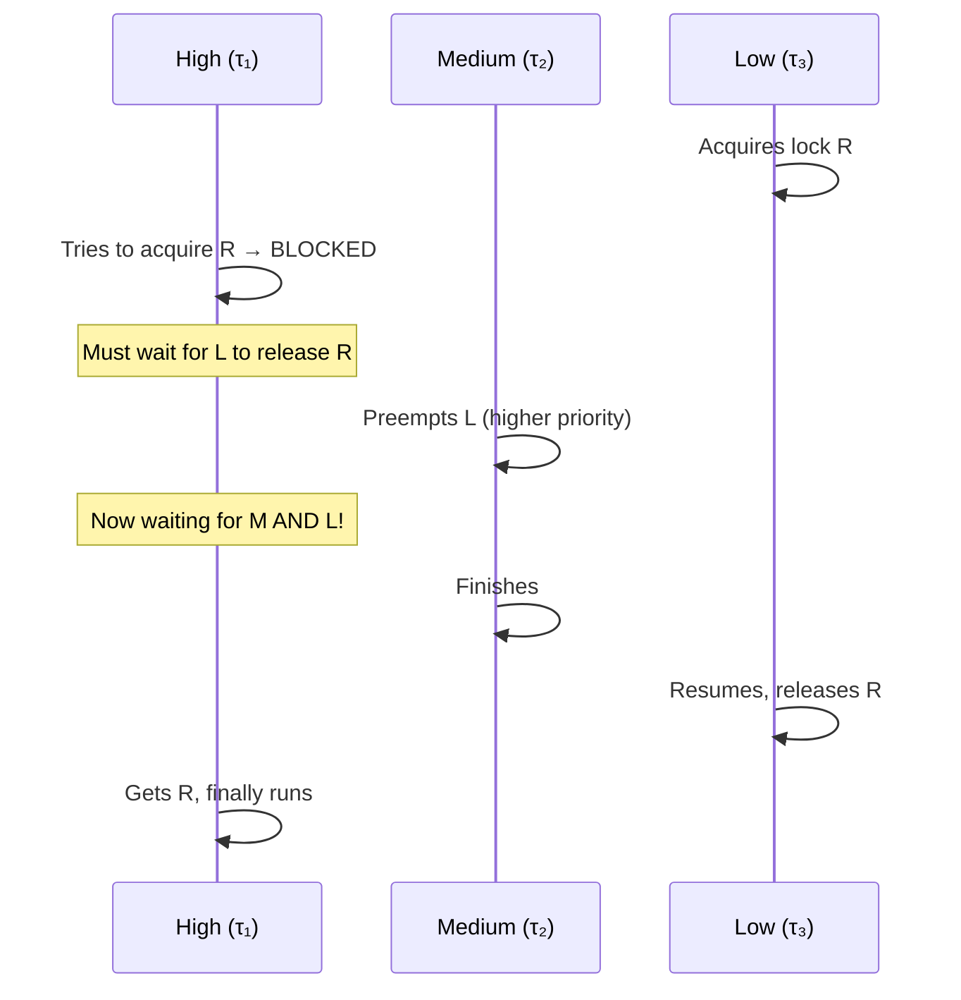
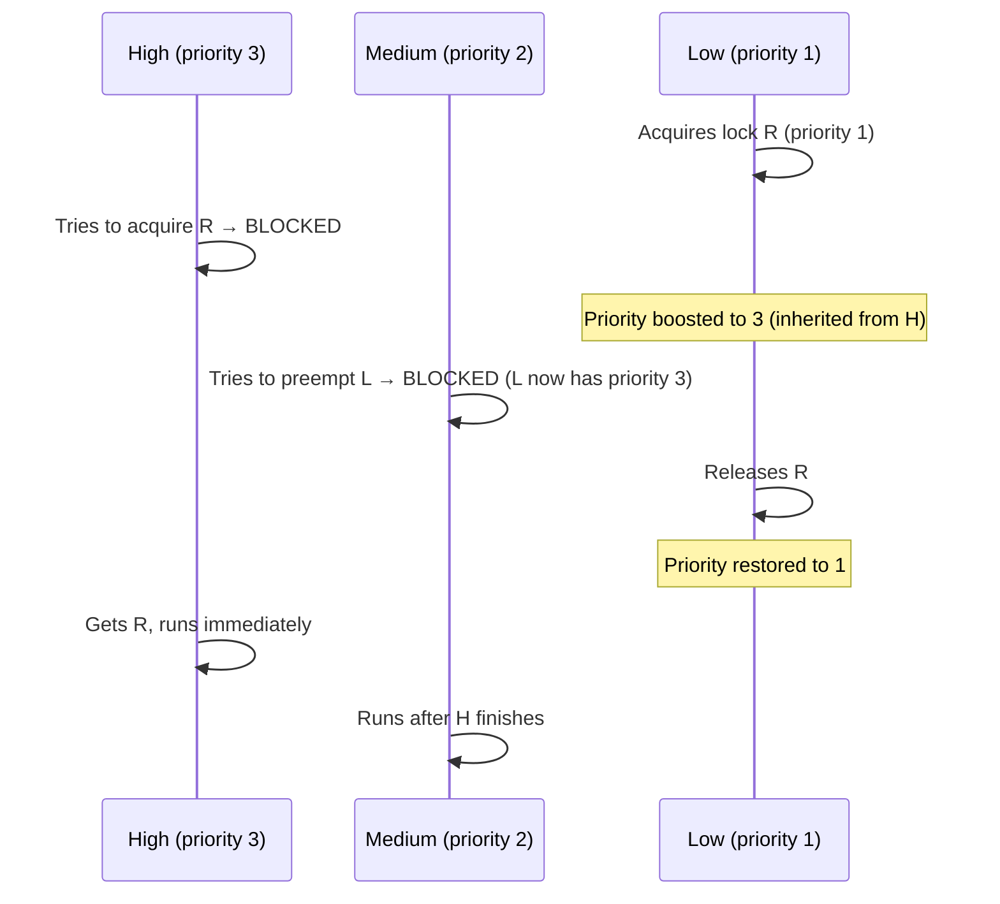
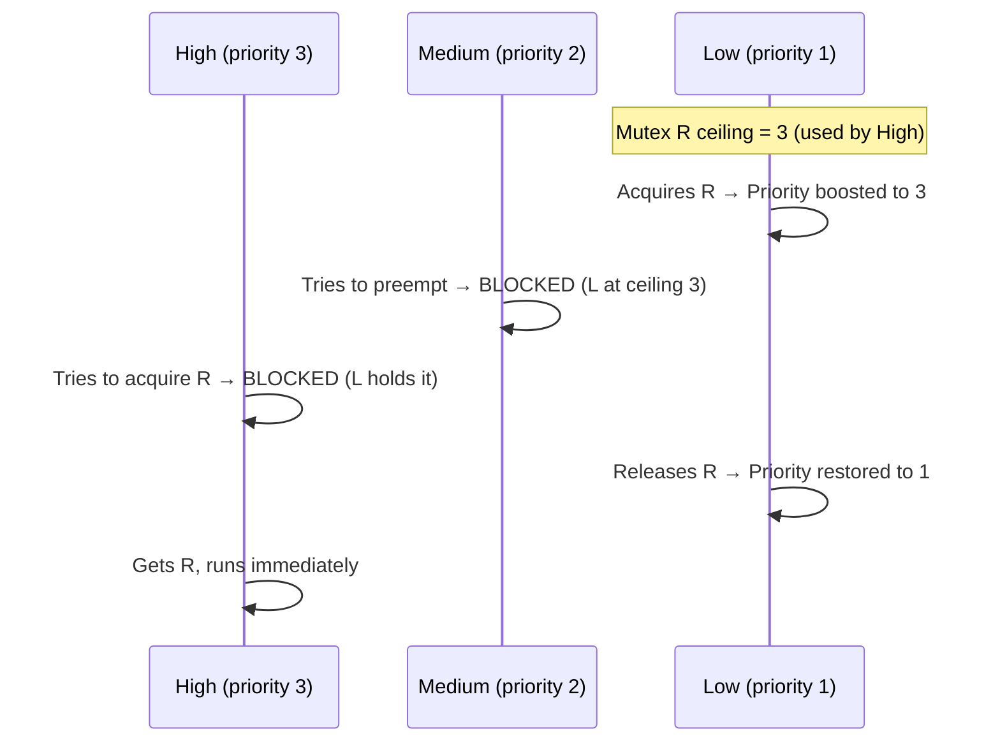
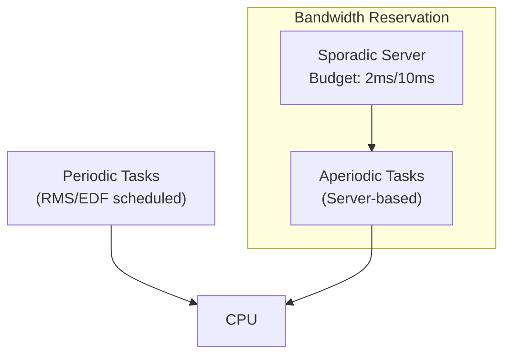

# Real-Time Scheduling

## Overview

**Real-time scheduling** is designed for systems where correctness depends not only on the result of a computation but also on **when** the result is produced. Unlike general-purpose schedulers that optimize for throughput or fairness, real-time schedulers guarantee that deadlines are met.

> **Interview one-liner:** "Real-time scheduling guarantees deadline compliance — RMS assigns static priorities based on period, EDF dynamically picks the earliest deadline, and priority inheritance prevents inversion."

## Hard vs Soft Real-Time

| Property | Hard Real-Time | Soft Real-Time |
|----------|---------------|----------------|
| **Deadline** | Absolute — missing it is a system failure | Best-effort — occasional misses are tolerable |
| **Examples** | Aircraft control, pacemakers, ABS brakes | Video streaming, online gaming, VoIP |
| **Guarantee** | Worst-case execution time (WCET) verified | Statistical guarantee (e.g., 99th percentile) |
| **Scheduling** | Deterministic, priority-based | Proportional share, best-effort |
| **Consequence of miss** | Catastrophic failure | Degraded quality |



## Real-Time Task Model

A periodic real-time task is characterized by:

| Parameter | Symbol | Description |
|-----------|--------|-------------|
| **Period** | T | Time between successive releases |
| **Execution Time** | C | Worst-case execution time (WCET) |
| **Deadline** | D | Time by which task must complete |
| **Utilization** | U = C/T | Fraction of CPU time required |

### Example: Three Tasks

| Task | Period (T) | Execution (C) | Utilization (U) |
|------|-----------|---------------|-----------------|
| τ₁ | 10 | 2 | 0.20 |
| τ₂ | 15 | 4 | 0.27 |
| τ₃ | 35 | 5 | 0.14 |

**Total utilization:** U = 0.20 + 0.27 + 0.14 = **0.61** (61%)

## Rate Monotonic Scheduling (RMS)

### Concept

**RMS** assigns **static priorities** based on task periods: **shorter period = higher priority**. It is the optimal static-priority scheduling algorithm for periodic tasks.

> **Key insight:** A task with a shorter period must run more frequently, so it gets higher priority.

### Algorithm

```
1. Assign priority to each task: priority ∝ 1/period
2. Shorter period → higher priority
3. At each scheduling point, run the highest-priority ready task
4. Priorities are fixed (do not change at runtime)
```

### Schedulability Test

RMS guarantees all deadlines are met if:

```
U ≤ n(2^(1/n) - 1)

Where n = number of tasks
```

| n | Bound U ≤ |
|---|-----------|
| 1 | 1.000 |
| 2 | 0.828 |
| 3 | 0.780 |
| 4 | 0.757 |
| 5 | 0.744 |
| ∞ | ln(2) ≈ 0.693 |

**Practical rule:** If total utilization ≤ **69.3%**, RMS always succeeds regardless of the number of tasks.

### RMS Example

Tasks: τ₁(T=4, C=1), τ₂(T=5, C=2), τ₃(T=10, C=2)

Priorities: τ₁ > τ₂ > τ₃ (shorter period = higher priority)

U = 1/4 + 2/5 + 2/10 = 0.25 + 0.40 + 0.20 = **0.85**

Since n=3, bound = 0.780. U=0.85 > 0.780, so the **sufficient test fails**, but RMS may still succeed (the test is sufficient, not necessary).

```
Time:  0  1  2  3  4  5  6  7  8  9  10  11  12  13  14  15  16  17  18  19  20
       |τ1|τ2|τ2|  |τ1|τ2|τ2|τ3|τ3|  |τ1 |τ1 |τ2 |τ2 |   |τ1 |τ2 |τ2 |τ3 |τ3 |τ1 |

t=0: τ1 releases (highest priority) → runs 0-1
t=1: τ2 releases → runs 1-3
t=3: Idle (no task ready)
t=4: τ1 releases (period=4) → runs 4-5
     τ2 releases (period=5) → runs 5-7
t=7: τ3 released at t=0 → runs 7-9 (completes within deadline of 10)
t=9: Idle
t=10: τ1 releases → runs 10-11
      τ2 releases at t=10 (period=5×2) → runs 11-13
      τ3 releases at t=10 (period=10×1) → runs 13-15 (deadline=20, OK)
t=15: τ1 releases → runs 15-16
      τ2 releases at t=15 → runs 16-18
t=18: Idle
t=20: τ1 releases → runs 20-21
      ...
```

All deadlines met! RMS succeeded even though U > 0.780.

```mermaid
gantt
    title RMS Scheduling Example
    dateFormat X
    axisFormat %s

    section τ₁ (P=4,C=1)
    t=0-1   : 0, 1
    t=4-5   : 4, 5
    t=10-11 : 10, 11
    t=15-16 : 15, 16
    t=20-21 : 20, 21

    section τ₂ (P=5,C=2)
    t=1-3   : 1, 3
    t=5-7   : 5, 7
    t=11-13 : 11, 13
    t=16-18 : 16, 18

    section τ₃ (P=10,C=2)
    t=7-9   : 7, 9
    t=13-15 : 13, 15
    t=18-20 : 18, 20
```



## Earliest Deadline First (EDF)

### Concept

**EDF** assigns **dynamic priorities** based on absolute deadline: the task with the **closest deadline** runs first. It is the **optimal** dynamic-priority scheduling algorithm.

> **Key insight:** At every scheduling point, pick the task whose deadline is nearest.

### Algorithm

```
1. At each scheduling point, compute absolute deadline for all ready tasks
2. Run the task with the earliest (smallest) absolute deadline
3. Preempt current task if a new task arrives with an earlier deadline
4. Priorities change dynamically as deadlines approach
```

### Schedulability Test

EDF guarantees all deadlines are met if and only if:

```
U = Σ(Cᵢ/Tᵢ) ≤ 1.0
```

**EDF achieves 100% CPU utilization** — it's the theoretically optimal algorithm.

### EDF Example

Same tasks: τ₁(T=4, C=1), τ₂(T=5, C=2), τ₃(T=10, C=2)

U = 0.25 + 0.40 + 0.20 = 0.85 ≤ 1.0 → **EDF guarantees all deadlines met**

```
t=0: τ1(deadline=4), τ2(deadline=5), τ3(deadline=10)
     → Run τ1 (earliest deadline 4) → runs 0-1

t=1: τ2(deadline=5), τ3(deadline=10)
     → Run τ2 (deadline 5) → runs 1-3

t=3: τ3(deadline=10)
     → Run τ3 → runs 3-5

t=4: τ1 released (deadline=8) — preempts τ3 (deadline 10 > 8)
     → Run τ1 → runs 4-5

t=5: τ2 released (deadline=10), τ3 remaining=1 (deadline=10)
     → Tie: both deadline 10. Run τ2 (or τ3) → runs 5-7

t=7: τ3 remaining=1 (deadline=10)
     → Run τ3 → runs 7-8 (completes, deadline 10 ✓)

t=8: τ1 released (deadline=12)
     → Run τ1 → runs 8-9

t=9: τ2 released (deadline=15)
     → Run τ2 → runs 9-11

...continues, all deadlines met
```

### EDF vs RMS Comparison

| Property | RMS | EDF |
|----------|-----|-----|
| Priority | Static (period-based) | Dynamic (deadline-based) |
| Optimality | Optimal among static-priority | Optimal among all algorithms |
| Max utilization | ~69.3% (sufficient) | 100% |
| Implementation | Simpler (fixed priorities) | More complex (dynamic) |
| Overrun behavior | Graceful degradation | Domino effect (all tasks miss deadlines) |
| Predictability | Higher (deterministic) | Lower (depends on workload) |
| Industry use | Avionics, automotive (ARINC 653) | Linux SCHED_DEADLINE, video encoding |



## Priority Inversion Problem

### What Is Priority Inversion?

Priority inversion occurs when a high-priority task is blocked waiting for a resource held by a low-priority task, while medium-priority tasks preempt the low-priority task. The high-priority task effectively runs at the priority of the lowest task — it's "inverted."



### Unbounded Priority Inversion

If many medium-priority tasks arrive, the high-priority task can wait indefinitely:

```
High-priority task blocked on lock held by Low
    → Medium₁ preempts Low
    → Medium₂ preempts Low
    → Medium₃ preempts Low
    → ...
    → High may wait arbitrarily long!
```

### Mars Pathfinder Incident (1997)

The most famous real-world priority inversion:

1. **Bus Management task** (high priority) blocked on mutex held by **Meteorological task** (low priority)
2. **Communication task** (medium priority) kept preempting the Meteorological task
3. High-priority task couldn't run → system resets (watchdog timeout)
4. **Fix:** Enabled priority inheritance on the mutex (available in VxWorks but not enabled)
5. **Lesson:** Always use priority inheritance in real-time systems

## Solutions to Priority Inversion

### 1. Priority Inheritance Protocol (PIP)

**Rule:** When a high-priority task blocks on a mutex, the task holding the mutex temporarily **inherits** the high priority.



**Properties:**
- Only the blocking task's priority is boosted
- Transitive: if task A blocks B which blocks C, C inherits A's priority
- Does **not** prevent deadlocks
- Used in POSIX (`PTHREAD_PRIO_INHERIT`), Linux, VxWorks

### 2. Priority Ceiling Protocol (PCP)

**Rule:** Each mutex has a **ceiling priority** = the highest priority of any task that may lock it. When a task acquires a mutex, its priority is immediately boosted to the ceiling.



**Properties:**
- Prevents priority inversion **proactively** (no need to wait for blocking)
- Also prevents deadlocks (a task can only acquire a mutex if its ceiling > current lock ceiling)
- More conservative — may unnecessarily block medium-priority tasks
- Used in real-time operating systems (RTEMS, QNX)

### 3. Priority Inheritance vs Ceiling

| Property | Priority Inheritance (PIP) | Priority Ceiling (PCP) |
|----------|---------------------------|------------------------|
| When boost occurs | On blocking (reactive) | On lock acquisition (proactive) |
| Deadlock prevention | No | Yes |
| Blocking bound | At most n blocks (n = number of locks) | At most 1 block per lock |
| Overhead | Lower (only boosts on conflict) | Higher (always boosts to ceiling) |
| Complexity | Simpler | More complex (need ceiling analysis) |

## Linux SCHED_DEADLINE

Linux implements EDF via `SCHED_DEADLINE`, introduced in kernel 3.14:

```c
#include <sched.h>

struct sched_attr {
    uint32_t size;
    uint32_t sched_policy;
    uint64_t sched_flags;
    int32_t  sched_nice;
    uint32_t sched_priority;
    uint64_t sched_runtime;   // Execution time (C)
    uint64_t sched_deadline;  // Relative deadline (D)
    uint64_t sched_period;    // Period (T)
};

// Set SCHED_DEADLINE for current thread
struct sched_attr attr = {
    .size = sizeof(attr),
    .sched_policy = SCHED_DEADLINE,
    .sched_runtime = 2000000,    // 2ms
    .sched_deadline = 5000000,   // 5ms
    .sched_period = 10000000,    // 10ms
};

sched_setattr(0, &attr, 0);
```

### Bandwidth Reclamation

Linux SCHED_DEADLINE uses **CBS (Constant Bandwidth Server)** to reclaim unused bandwidth:

```
If a task finishes early, its unused runtime is "recharged"
This allows other DEADLINE tasks to use the freed CPU time
Prevents the 100% utilization limitation in practice
```

### Using chrt for Real-Time

```bash
# SCHED_FIFO with priority 80
chrt -f 80 ./my_realtime_task

# SCHED_RR with priority 50
chrt -r 50 ./my_realtime_task

# View scheduling policy
chrt -p <PID>

# Show all real-time processes
ps -eo pid,cls,rtprio,comm | grep -E "RT|FF|RR"
```

## Aperiodic and Sporadic Tasks

Not all real-time tasks are periodic:

| Type | Characteristics | Example |
|------|----------------|---------|
| **Periodic** | Fixed period T, regular releases | Sensor sampling every 100ms |
| **Aperiodic** | Irregular arrivals, may have deadlines | Network packet processing |
| **Sporadic** | Aperiodic with minimum inter-arrival time | Button press (debounced) |

### Handling Aperiodic Tasks

**Server-based approaches:**
- **Polling server:** Periodic task that checks for aperiodic requests
- **Sporadic server:** Reserves bandwidth for aperiodic tasks
- **Constant Bandwidth Server (CBS):** Used by Linux SCHED_DEADLINE



## Implementation: RMS Scheduler

```python
import math

class RMSTask:
    def __init__(self, name, period, execution):
        self.name = name
        self.period = period
        self.execution = execution
        self.remaining = 0
        self.deadline = 0
        self.priority = 1 / period  # RMS: shorter period = higher priority

def rms_schedulability_test(tasks):
    """Check if task set is schedulable under RMS"""
    n = len(tasks)
    total_utilization = sum(t.execution / t.period for t in tasks)
    
    # Liu & Layland bound
    bound = n * (2 ** (1/n) - 1)
    
    return total_utilization <= bound, total_utilization, bound

def rms_simulate(tasks, hyperperiod, verbose=False):
    """Simulate RMS scheduling for one hyperperiod"""
    # Hyperperiod = LCM of all periods
    timeline = []
    
    # Initialize task releases
    next_release = {t.name: 0 for t in tasks}
    deadlines = {t.name: 0 for t in tasks}
    remaining = {t.name: 0 for t in tasks}
    
    for t in range(hyperperiod):
        # Release tasks
        for task in tasks:
            if t == next_release[task.name]:
                remaining[task.name] = task.execution
                deadlines[task.name] = t + task.period
                next_release[task.name] += task.period
        
        # Select highest-priority ready task
        ready = [task for task in tasks if remaining[task.name] > 0]
        if ready:
            ready.sort(key=lambda x: x.priority, reverse=True)  # Higher priority first
            selected = ready[0]
            remaining[selected.name] -= 1
            timeline.append(selected.name)
            
            if verbose:
                print(f"t={t}: {selected.name} "
                      f"(remaining={remaining[selected.name]}, "
                      f"deadline={deadlines[selected.name]})")
            
            # Check deadline miss
            if remaining[selected.name] == 0 and t + 1 > deadlines[selected.name]:
                print(f"DEADLINE MISS: {selected.name} at t={t+1}, "
                      f"deadline was {deadlines[selected.name]}")
        else:
            timeline.append("IDLE")
            if verbose:
                print(f"t={t}: IDLE")
    
    return timeline

# Example
tasks = [
    RMSTask("τ1", period=4, execution=1),
    RMSTask("τ2", period=5, execution=2),
    RMSTask("τ3", period=10, execution=2),
]

schedulable, util, bound = rms_schedulability_test(tasks)
print(f"Utilization: {util:.3f}, Bound: {bound:.3f}, Schedulable: {schedulable}")

# Hyperperiod = LCM(4, 5, 10) = 20
from math import gcd
def lcm(a, b):
    return a * b // gcd(a, b)

hyperperiod = 20
timeline = rms_simulate(tasks, hyperperiod)
print(f"Timeline: {timeline}")
```

## Implementation: EDF Scheduler

```python
def edf_simulate(tasks, hyperperiod, verbose=False):
    """Simulate EDF scheduling for one hyperperiod"""
    from math import gcd
    
    def lcm(a, b):
        return a * b // gcd(a, b)
    
    # Initialize
    next_release = {t.name: 0 for t in tasks}
    deadlines = {t.name: 0 for t in tasks}
    remaining = {t.name: 0 for t in tasks}
    
    timeline = []
    
    for t in range(hyperperiod):
        # Release tasks
        for task in tasks:
            if t == next_release[task.name]:
                remaining[task.name] = task.execution
                deadlines[task.name] = t + task.period
                next_release[task.name] += task.period
        
        # Select task with earliest deadline
        ready = [task for task in tasks if remaining[task.name] > 0]
        if ready:
            ready.sort(key=lambda x: deadlines[x.name])
            selected = ready[0]
            remaining[selected.name] -= 1
            timeline.append(selected.name)
            
            if verbose:
                print(f"t={t}: {selected.name} "
                      f"(deadline={deadlines[selected.name]})")
        else:
            timeline.append("IDLE")
    
    return timeline

tasks = [
    RMSTask("τ1", period=4, execution=1),
    RMSTask("τ2", period=5, execution=2),
    RMSTask("τ3", period=10, execution=2),
]

timeline = edf_simulate(tasks, 20)
print(f"EDF Timeline: {timeline}")
```

## Real-Time Linux (PREEMPT_RT)

The Linux kernel has a real-time patch (`PREEMPT_RT`) that makes most of the kernel preemptible:

| Feature | Standard Linux | PREEMPT_RT |
|---------|---------------|------------|
| Kernel preemption | Voluntary/Full | Full (all sections) |
| Max latency | ~1-10 ms | ~10-100 μs |
| Interrupt handling | In kernel context | Threads (schedulable) |
| Spinlocks | Disable preemption | Convert to RT-mutexes |
| Use case | General purpose | Industrial control, audio |

```bash
# Check if PREEMPT_RT is active
uname -v
# #1 SMP PREEMPT_RT Debian 6.1.x

# Check kernel latency
cyclictest -t1 -p80 -i1000 -l10000
# Measures worst-case scheduling latency

# Set CPU governor for deterministic performance
echo performance | sudo tee /sys/devices/system/cpu/cpu*/cpufreq/scaling_governor
```

## Interview Questions

### Beginner

**Q1: What is real-time scheduling?**  
A: Real-time scheduling ensures tasks complete before their deadlines. Hard real-time systems cannot miss deadlines (catastrophic failure), while soft real-time systems tolerate occasional misses (degraded quality).

**Q2: What is the difference between RMS and EDF?**  
A: RMS assigns fixed priorities based on task periods (shorter period = higher priority). EDF assigns dynamic priorities based on deadlines (earliest deadline first). RMS is simpler; EDF achieves higher CPU utilization (up to 100%).

**Q3: What is priority inversion?**  
A: When a high-priority task is blocked on a resource held by a low-priority task, and medium-priority tasks preempt the low-priority task. The high-priority task effectively waits for all medium-priority tasks to finish.

### Intermediate

**Q4: What is the RMS schedulability bound?**  
A: For n periodic tasks, RMS guarantees all deadlines are met if total utilization U ≤ n(2^(1/n) - 1). For large n, this approaches ln(2) ≈ 69.3%. This is a sufficient but not necessary condition — task sets with higher utilization may still be schedulable.

**Q5: How does priority inheritance work?**  
A: When a high-priority task blocks on a mutex held by a low-priority task, the low-priority task temporarily inherits the high priority. This prevents medium-priority tasks from preempting it, allowing it to release the mutex faster. Priority reverts after the mutex is released.

**Q6: What is the hyperperiod?**  
A: The hyperperiod is the LCM of all task periods. It's the interval after which the schedule repeats. For tasks with periods 4, 5, and 10, the hyperperiod is LCM(4,5,10) = 20.

**Q7: What happens when EDF encounters an overload?**  
A: In overload conditions (U > 1.0), EDF can experience a **domino effect** — missing one deadline causes subsequent deadlines to be missed unpredictably. RMS degrades more gracefully: only the lowest-priority task misses deadlines. This is why safety-critical systems often prefer RMS.

### FAANG-Level

**Q8: Design a real-time scheduler for an autonomous vehicle.**  
A: 1) **Safety-critical tasks** (braking, steering): SCHED_DEADLINE with WCET-verified budgets, pinned to dedicated CPU cores, 2) **Sensor fusion** (LIDAR, camera): Periodic tasks on SCHED_FIFO, 3) **Path planning**: Soft real-time, SCHED_OTHER with nice -20, 4) **Priority ceiling** for all shared resources (prevents inversion and deadlock), 5) **Watchdog task** at highest priority monitors system health, 6) **CPU isolation** (`isolcpus` kernel param) for RT cores, 7) **Memory locking** (`mlockall`) to prevent page faults, 8) **PREEMPT_RT kernel** for deterministic latency.

**Q9: How does Linux SCHED_DEADLINE implement EDF with bandwidth reservation?**  
A: SCHED_DEADLINE uses the **Constant Bandwidth Server (CBS)** algorithm: 1) Each task has (runtime, deadline, period) parameters, 2) Tasks are scheduled via EDF, 3) When a task finishes early, its remaining budget is "recharged" (bandwidth reclamation), 4) Admission control rejects tasks if total bandwidth > 100%, 5) Uses a red-black tree sorted by absolute deadline, 6) Overflow handling: tasks that miss deadlines get their deadlines postponed to prevent domino effects, 7) Integration with CFS: DEADLINE tasks always preempt CFS tasks.

**Q10: Compare real-time scheduling in Linux vs an RTOS like FreeRTOS/VxWorks.**  
A: **Linux (PREEMPT_RT):** General-purpose OS with RT extensions, ~10-100μs latency, supports full POSIX, complex but feature-rich, certification is difficult (Linux Foundation working on it). **FreeRTOS:** Minimal RTOS, ~1-10μs latency, simple API (xTaskCreate, vTaskDelay), limited features, easy to certify (MISRA-C compliant). **VxWorks:** Industrial RTOS, ~1-10μs latency, DO-178C certifiable, POSIX-compliant, used in aerospace/defense. **Key tradeoff:** Linux offers more features but higher and less predictable latency. RTOS offers deterministic behavior but limited functionality.

## Common Mistakes

1. **Confusing hard and soft real-time:** Hard real-time requires worst-case guarantees; soft real-time needs average-case performance. The scheduling approach differs fundamentally.
2. **Using EDF without overload protection:** EDF can collapse under overload (domino effect). Use bandwidth reservation or admission control.
3. **Forgetting WCET analysis:** Real-time guarantees depend on worst-case execution time, not average-case. WCET analysis must account for cache, pipeline, and branch prediction effects.
4. **Not using priority inheritance:** Without it, priority inversion can cause unbounded delays (Mars Pathfinder).
5. **Assuming "fast enough" is real-time:** A fast system isn't necessarily real-time. Real-time means **predictable** — worst-case latency matters, not average.
6. **Ignoring interrupt latency:** In real-time systems, interrupt handling latency is critical. Use threaded interrupts and CPU isolation.

## Summary

| Algorithm | Priority | Max Utilization | Optimality | Complexity |
|-----------|----------|-----------------|------------|------------|
| **RMS** | Static (1/period) | ~69.3% (sufficient) | Optimal static-priority | Low |
| **EDF** | Dynamic (deadline) | 100% (necessary+sufficient) | Optimal overall | Medium |
| **LLF** | Dynamic (laxity) | 100% | Optimal | High (more preemptions) |

| Solution | Problem Solved | Mechanism |
|----------|---------------|-----------|
| Priority Inheritance | Priority inversion (reactive) | Boost holder's priority on blocking |
| Priority Ceiling | Priority inversion + deadlock (proactive) | Boost priority on lock acquisition |
| Bandwidth Reclamation | Wasted CPU time | Recharge unused runtime |

## Cross-References

- [Priority Scheduling](./priority.md) - Priority inversion background
- [Round Robin](./round-robin.md) - Time-sliced scheduling
- [Linux CFS](./linux-cfs.md) - Linux's default scheduler
- [Scheduling Metrics](./metrics.md) - Measuring scheduler performance
- [Synchronization: Mutexes](../synchronization/mutex.md) - Priority inheritance mutexes
- [Synchronization: Semaphores](../synchronization/semaphores.md) - RT semaphore usage


## Cross References

- [Priority Scheduling](priority.md)
- [CPU Architecture](../../arch/cpu/README.md)
- [Interrupts](../io/interrupts.md)
