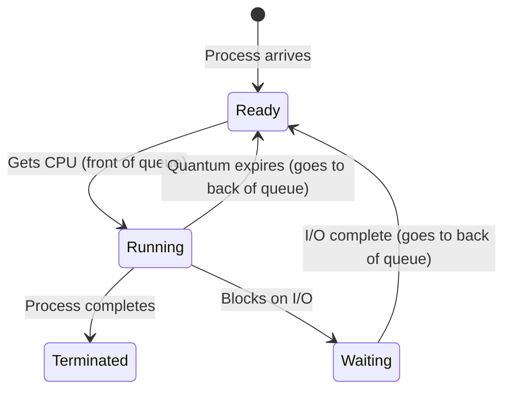
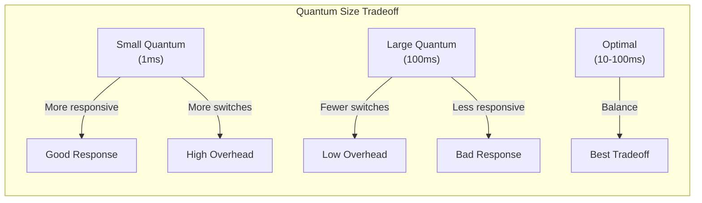

# Round Robin (RR) Scheduling

## Overview

**Round Robin (RR)** is a preemptive scheduling algorithm where each process gets a fixed **time quantum** (time slice). After the quantum expires, the process is preempted and moved to the back of the ready queue.

> **Interview one-liner:** "Round Robin gives each process a fixed time slice — it's fair and provides good response time for interactive systems, but the quantum size must be carefully tuned."

## How It Works



## Algorithm

```
1. Processes are added to a FIFO ready queue
2. Process at head gets CPU for at most 'quantum' time units
3. If process completes within quantum → done
4. If process doesn't complete → preempt, add to back of queue
5. If process blocks for I/O → move to wait queue
6. Repeat
```

## Example

| Process | Arrival | Burst |
|---------|---------|-------|
| P1 | 0 | 24 |
| P2 | 0 | 3 |
| P3 | 0 | 3 |

**Time Quantum = 4**

### Gantt Chart

```
Time:  0    4    7   10    14    18    22    26    30
       |-P1-|-P2-|P3-|---P1--|---P1--|---P1--|---P1--|
       [0  4][4 7][7 10][10 14][14 18][18 22][22 26][26 30]
```

- t=0-4: P1 runs (quantum expires, 20 remaining)
- t=4-7: P2 runs (completes, 0 remaining)
- t=7-10: P3 runs (completes, 0 remaining)
- t=10-14: P1 runs (16 remaining)
- t=14-18: P1 runs (12 remaining)
- t=18-22: P1 runs (8 remaining)
- t=22-26: P1 runs (4 remaining)
- t=26-30: P1 runs (completes)

### Calculations

| Process | Arrival | Burst | Completion | Turnaround | Waiting |
|---------|---------|-------|------------|------------|---------|
| P1 | 0 | 24 | 30 | 30 | 6 |
| P2 | 0 | 3 | 7 | 7 | 4 |
| P3 | 0 | 3 | 10 | 10 | 7 |

```
Average Waiting Time = (6 + 4 + 7) / 3 = 5.67
Average Turnaround   = (30 + 7 + 10) / 3 = 15.67
```

## Effect of Time Quantum

| Quantum | Behavior | Pros | Cons |
|---------|----------|------|------|
| **Very large** | Becomes FCFS | No overhead | Poor response time |
| **Very small** | Frequent context switches | Very responsive | High overhead |
| **Optimal** | Balance | Good response + low overhead | Depends on workload |



### Rule of Thumb

```
80% of CPU bursts should be shorter than the quantum
```

If most bursts are 10ms, set quantum to 10-20ms.

## Context Switch Overhead

With quantum `q` and context switch time `s`:

```
Effective CPU utilization = q / (q + s)

Example: q = 10ms, s = 1ms
Utilization = 10 / 11 = 90.9%

Example: q = 1ms, s = 1ms
Utilization = 1 / 2 = 50% (half the CPU is wasted!)
```

## Implementation

```python
from collections import deque

def round_robin(processes, quantum):
    """
    processes: list of (pid, arrival_time, burst_time)
    quantum: time slice
    """
    processes.sort(key=lambda x: x[1])
    n = len(processes)
    
    ready_queue = deque()
    current_time = 0
    remaining = {p[0]: p[2] for p in processes}
    arrival_map = {p[0]: p[1] for p in processes}
    results = {}
    idx = 0  # Next process to arrive
    
    # Add initially available processes
    while idx < n and processes[idx][1] <= current_time:
        ready_queue.append(processes[idx][0])
        idx += 1
    
    while ready_queue or idx < n:
        if not ready_queue:
            # No process ready, advance to next arrival
            current_time = processes[idx][1]
            while idx < n and processes[idx][1] <= current_time:
                ready_queue.append(processes[idx][0])
                idx += 1
        
        pid = ready_queue.popleft()
        run_time = min(quantum, remaining[pid])
        
        current_time += run_time
        remaining[pid] -= run_time
        
        # Add newly arrived processes before the current one
        while idx < n and processes[idx][1] <= current_time:
            ready_queue.append(processes[idx][0])
            idx += 1
        
        if remaining[pid] > 0:
            ready_queue.append(pid)  # Not done, go to back
        else:
            # Process completed
            turnaround = current_time - arrival_map[pid]
            waiting = turnaround - burst_map[pid]
            results[pid] = {
                'completion': current_time,
                'turnaround': turnaround,
                'waiting': waiting
            }
    
    return results
```

## Variants

### Weighted Round Robin

Different processes get different time slices based on priority:

```python
# Weight-based quantum
quantum = base_quantum * weight
# weight=1: 10ms, weight=2: 20ms, weight=4: 40ms
```

### Virtual Round Robin

Uses virtual time to handle variable-rate processes:

```
Virtual time advances based on actual CPU usage
Processes with lower virtual time get priority
Similar to CFS's virtual runtime concept
```

## RR vs Other Algorithms

| Aspect | RR | FCFS | SJF |
|--------|-----|------|-----|
| Preemptive | Yes | No | No (SRTF: Yes) |
| Fairness | High | Medium | Low (starves long jobs) |
| Response time | Good | Poor | Good for short jobs |
| Throughput | Medium | High (no overhead) | High |
| Starvation | No | No | Yes |
| Overhead | Context switches | None | Prediction |

## Interview Questions

### Beginner

**Q1: What is Round Robin scheduling?**  
A: Round Robin gives each process a fixed time quantum. When the quantum expires, the process is preempted and moved to the back of the ready queue. It's fair, simple, and provides good response time for interactive systems.

**Q2: How does the time quantum affect RR performance?**  
A: Too small: excessive context switches, overhead dominates. Too large: degenerates to FCFS, poor response time. Optimal: 80% of bursts should be shorter than the quantum. Typical: 10-100ms.

### Intermediate

**Q3: What is the turnaround time formula for RR?**  
A: Turnaround time depends on the quantum and number of processes. With n processes and quantum q, a process of burst b takes approximately ceil(b/q) rounds to complete, with each round being n*q time (plus any processes that finish earlier).

**Q4: Why might RR have higher average turnaround than SJF?**  
A: RR spreads CPU time across all processes, so even short processes take multiple quanta. SJF runs short processes to completion immediately. RR's fairness comes at the cost of higher average turnaround.

**Q5: How do you choose the right quantum?**  
A: Consider: 1) Context switch time (quantum should be much larger), 2) Typical burst length (80% should fit in one quantum), 3) Response time requirements (smaller = more responsive), 4) System load (more processes = longer effective turnaround). Typical values: 10-100ms.

### FAANG-Level

**Q6: How does Linux CFS relate to Round Robin?**  
A: CFS is not RR — it uses virtual runtime (vruntime) and a red-black tree. But it shares RR's fairness goal. CFS doesn't use a fixed quantum; instead, each process gets CPU proportional to its weight (nice value). Processes with less vruntime are scheduled first. This is more flexible than RR's fixed quantum and avoids the quantum tuning problem.

**Q7: Design a scheduler for a multi-tenant cloud system.**  
A: Weighted Round Robin across tenants, with CFS within each tenant. 1) Each tenant has a weight based on their SLA (pay more = higher weight), 2) Tenant's virtual time advances based on CPU usage / weight, 3) Within a tenant, processes use CFS, 4) Use cgroups (Linux) for isolation, 5) Burst credits: unused CPU can be accumulated and used later, 6) Fair queuing at the network level (WFQ) for network isolation.

**Q8: Compare RR with lottery scheduling.**  
A: **RR:** Fixed quantum, strict ordering, deterministic. **Lottery scheduling:** Random selection based on tickets, probabilistic fairness, flexible. Lottery advantages: no starvation naturally (probabilistic), easy to implement proportional sharing, responsive to load changes. RR advantages: deterministic, simpler to reason about, no randomness in scheduling decisions. Both aim for fair CPU sharing but with different mechanisms.

## Common Mistakes

1. **Not accounting for context switch time:** In calculations, add context switch overhead between processes.
2. **Assuming all processes arrive at time 0:** With staggered arrivals, the ready queue changes dynamically.
3. **Confusing turnaround with waiting:** Turnaround = completion - arrival. Waiting = turnaround - burst.
4. **Quantum too small:** If quantum < context switch time, system spends more time switching than executing.
5. **Ignoring I/O:** When a process blocks for I/O, it leaves the ready queue and the next process gets CPU immediately (no waiting for quantum to expire).

## Summary

| Property | Value |
|----------|-------|
| Type | Preemptive |
| Key parameter | Time quantum |
| Fairness | High |
| Response time | Good (depends on quantum) |
| Starvation | No |
| Overhead | Context switches |
| Best for | Interactive, time-sharing systems |

## Cross-References

- [FCFS](./fcfs.md) - RR with infinite quantum
- [SJF](./sjf.md) - Better average turnaround
- [Priority](./priority.md) - Alternative scheduling basis
- [Multilevel Feedback](./multilevel-feedback.md) - RR per queue level
- [Linux CFS](./linux-cfs.md) - Linux's fair scheduler
- [Metrics](./metrics.md) - Evaluating scheduling


## Cross References

- [FCFS](fcfs.md)
- [Multilevel Queue](multilevel-queue.md)
- [Scheduling Metrics](metrics.md)
- [Timer Interrupts](../io/interrupts.md)
