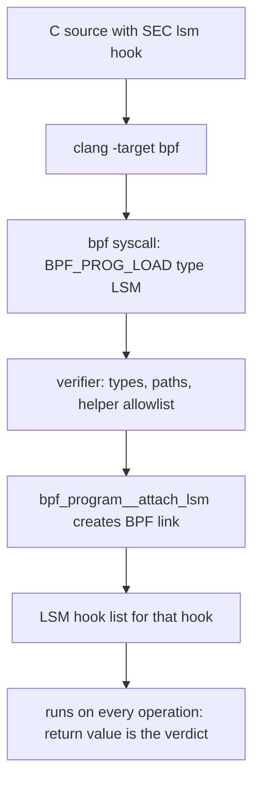
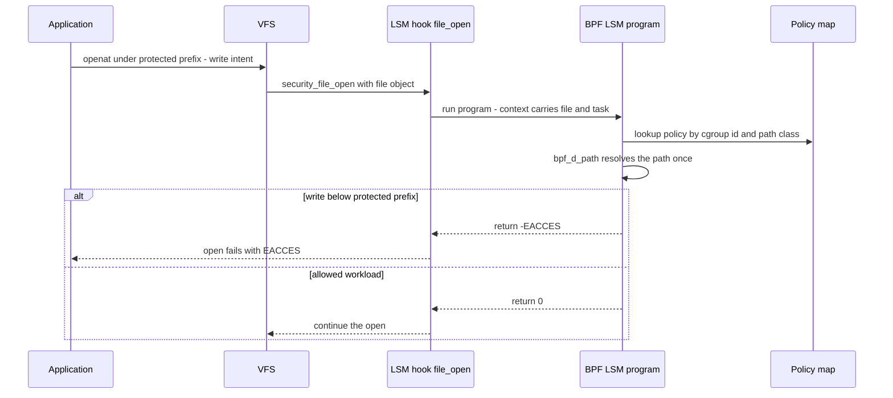

# BPF LSM Internals: Programmable MAC Policies on LSM Hooks

## Overview

BPF LSM, merged in Linux 5.7 (2020) behind `CONFIG_BPF_LSM`, lets an eBPF program *be* the
security policy: programs of type `BPF_PROG_TYPE_LSM` attach to the kernel's LSM hooks (file
open, inode permission, task allocation, socket creation, ...) and their return value becomes
the access decision — 0 allows, a negative errno denies. It turns mandatory access control from
a compiled policy language (SELinux TE rules, AppArmor path profiles) into verifiable code with
maps for state, replaceable at runtime through BPF links. This page covers the attachment
mechanics, a worked deny-writes-under-/etc policy, mutable-policy design, and the production
deployments (Tetragon, KubeArmor, Tracee) — complementing the overview pages in the Linux tree
and the eBPF foundations in [../kernel/ebpf.md](../kernel/ebpf.md).

> **Interview one-liner:** "BPF LSM is MAC as code: same hooks SELinux uses, but the policy is a verified BPF program you can replace per-cgroup without reloading a system-wide policy."

## Attachment Mechanics

BPF LSM is a *minor* LSM in the kernel's stacking scheme: it must be listed in the `lsm=` boot
parameter (e.g. `lsm=lockdown,yama,bpf`) or its hooks never fire — the single most common
deployment failure. Programs are written in C with a `SEC("lsm/<hook_name>")` section, compiled
to BPF object files, loaded with `bpf(2)` (`BPF_PROG_LOAD`, type `BPF_PROG_TYPE_LSM`), and
attached with the libbpf helper `bpf_program__attach_lsm()`, which creates a BPF link pinning
the program to the hook's BTF id. Loading requires `CAP_BPF` plus `CAP_MAC_ADMIN`, because
unlike tracing programs a denial here changes security outcomes. Multiple programs can attach to
the same hook — the LSM framework runs its hook list in order, and a denial short-circuits the
operation like any other LSM's denial.

Hook order follows the `lsm=` list, and within BPF LSM the per-hook program list appends in
attach order; `cat /sys/kernel/security/lsm` prints the live ordering on a running system. Links
should be pinned under `/sys/fs/bpf` (`bpftool link pin`), because an unpinned link dies with
its
loader process — a policy that silently unloads when the deployment daemon restarts is a classic
incident. The program context is BTF-typed: `BPF_PROG(file_open, struct file *file)` receives
the same
arguments the C hook would, so policies read real kernel objects (`file`, `inode`, `cred`)
rather than scraping tracepoint fields. Return-value semantics follow the LSM contract — 0 to
allow, `-EACCES`/`-EPERM` to deny — and some hooks are marked unsuitable for denial, where the
return value is advisory only. Since 5.10 a subset of hooks accepts sleepable programs
(`BPF_F_SLEEPABLE`), which is the prerequisite for helpers like `bpf_d_path()` that need to walk
mount structures; non-sleepable programs run under RCU and may only use preallocated or
spinlock-protected maps.



## A Worked Policy: Block Writes under /etc

```c
#include "vmlinux.h"
#include <bpf/bpf_helpers.h>
#include <bpf/bpf_tracing.h>

SEC("lsm/file_open")
int BPF_PROG(deny_etc_writes, struct file *file)
{
    char buf[64] = {};
    /* Sleepable-safe path read; only valid on the d_path allowlist of hooks. */
    bpf_d_path(&file->f_path, buf, sizeof(buf));

    if ((file->f_mode & FMODE_WRITE) &&
        __builtin_memcmp(buf, "/etc/", 5) == 0)
        return -EACCES;          /* LSM verdict: open-for-write denied */

    return 0;
}

char _license[] SEC("license") = "GPL";
```

Load and attach it without writing loader code: `bpftool prog load deny_etc.bpf.o
/sys/fs/bpf/deny_etc_w` auto-attaches LSM programs from their section names, or use `bpftool
prog attach`/libbpf explicitly. Three honesty notes belong in any review of this example. First,
`bpf_d_path()` is only callable from an allowlisted set of hooks (`file_open`,
`file_permission`, `mmap_file`, and a few others), and it reports the path as resolved *at that
moment* — a file moved into /etc after opening keeps its fd, so steady-state enforcement also
wants the `file_permission` hook where each `write` is re-checked. Second, prefix comparison is
a demo shortcut: a real policy compares resolved paths against a map of protected prefixes and
handles `/etc2`-style adjacency and bind mounts. Third, open-time denial is the cheap hook; the
`FMODE_WRITE` check catches intent at open, which is where LSM customarily mediates, and the
object identity (not the name) is what the kernel tracks afterward.

This example is the canonical "what BPF LSM buys you" demo: the same check in SELinux needs a
type transition and labeling infrastructure, in AppArmor a profile with path globs, and in a
kernel module a full MAC module with a compiled-in policy — while BPF LSM needs ~20 lines plus
root to deploy per-host or per-cgroup.

## Mutable MAC: Maps, Links, and Per-Cgroup Policy

Traditional MAC updates policy globally and coarsely: SELinux policy reloads via `semodule`
touch the whole system, AppArmor profile replacement re-parses profile sets. BPF LSM's update
model is finer-grained. *Data* changes are map updates — a policy matrix (protected prefixes,
allowed binaries, per-container flags) lives in a hash map, and updating an entry re-targets
every attached program with no verifier re-run and no attach churn. *Logic* changes replace the
program: loading a new program and attaching it (or atomically replacing via link
destroy/re-attach) swaps the decision code while the map state survives, giving hot policy
iteration without downtime.

Since 5.19, LSM programs can also attach per-cgroup, which is the deployment shape for
containers: one program, verdicts driven by `bpf_get_current_cgroup_id()` lookups into a
cgroup-local-storage or hash map, so each pod gets a different policy without per-pod program
copies. That is the internal design behind "per-pod MAC" tools below. The flip side of
mutability is trust: whoever holds `CAP_BPF + CAP_MAC_ADMIN` can rewrite the security policy of
the host, so the capability boundary *is* the policy boundary — a consideration SELinux
encapsulates differently (policy is loaded by a trusted userland from a signed store).

## gVisor-Style System-Call-Adjacent Policy in BPF

[gVisor](https://gvisor.dev/) implements a userspace kernel: the sandboxed process makes
syscalls into an interceptor (ptrace or KVM platform) that re-implements enough of Linux to
judge each request in a separate trust domain. "gVisor-like policy in BPF" means approximating
that judge at the LSM layer instead of moving syscalls out of the kernel: a default-deny posture
across a broad hook set — `file_open`, `file_permission`, `inode_unlink`, `bprm_check_security`,
`socket_create`, `ptrace_access_check`, `task_alloc`, `mmap_file` — with grants expressed
per-cgroup and per-path-class in maps. The syscall surface is still cut by seccomp (the ABI
layer), while BPF LSM judges the *objects* behind the syscalls (the object layer); the two
compose because seccomp runs earlier in the entry path and cannot see paths, exactly the
division described in [./seccomp.md](./seccomp.md).

The honest comparison: gVisor's boundary is architectural (a different kernel), so a kernel
0-day does not reach the sandboxed process; BPF LSM runs in the same kernel, so it constrains
but does not relocate the attack surface. Its advantage is cost — no syscall redirection
overhead, no compatibility gap — and deployability on stock hosts. That trade (architectural
isolation vs in-kernel policy) is a recurring interview question for container security roles.



## Compared with Traditional MAC

| Property | BPF LSM | SELinux | AppArmor | Landlock |
|---|---|---|---|---|
| Policy form | BPF program + maps | TE rules, compiled modules | path-glob profiles | rulesets built by the process |
| Scope | per-hook programs, per-cgroup | system-wide | per-profile (domain) | self-imposed domain |
| Update model | replace program / update map | `semodule` reload | profile reload | add a layer (monotonic) |
| Authoring skill | C + verifier literacy | policy language + labeling | glob syntax | C/syscall literacy |
| Unprivileged use | no (CAP_MAC_ADMIN) | no | no | yes |
| Audit story | whatever your program logs | AVC denials via auditd | DENIED audit records | Landlock audit (ABI 7+) |

SELinux's expressive power comes with real complexity: type enforcement needs every object
labeled (`restorecon`, policy modules, transitions), and a realistic system policy is thousands
of rules whose interactions are analyzed with dedicated tooling — years of distro engineering
sit behind `targeted` policy. BPF LSM inverts the trade: no global label namespace and no policy
language, but arbitrary logic (time-of-day, per-cgroup, hashes of executables, ring-buffer
corroboration) that static rule languages cannot express, at the price of writing and
maintaining verified code. A useful formulation for interviews: SELinux is *declarative and
system-wide*, BPF LSM is *imperative and targeted* — and Landlock (previous page) is the
unprivileged, self-imposed corner of the same design space.

## Hook Selection Cheat-Sheet

Policy correctness starts with choosing hooks that actually mediate the operation being
restricted:

| Hook | Fires on | Typical policy use |
|---|---|---|
| `bprm_check_security` | `execve` of a new binary | per-cgroup executable allowlists |
| `file_open` | completion of `open(2)` | gate paths at open time (cheap, first contact) |
| `file_permission` | each read/write on an open fd | steady-state re-check; defeats fd-holding drift |
| `mmap_file` | mapping a file into memory | W^X and executable-mapping policy |
| `inode_unlink` / `inode_rename` | namespace-destructive operations | protect system trees from deletion or relocation |
| `socket_create` / `socket_bind` / `socket_connect` | socket lifecycle | per-cgroup egress gating at the object level |
| `ptrace_access_check` | `ptrace` attach and introspection | block cross-container debugging |
| `task_alloc` | process/thread creation | fork-bomb and workload-placement controls |

The `file_open` + `file_permission` pairing deserves emphasis: open-time checks are cheap and
catch intent, but an fd is a capability that outlives the path it was opened through, so durable
protection re-consults the policy on every I/O. Choosing one hook and claiming "X is now
blocked"
is the most common design error in BPF LSM policies; the hook set *is* the coverage claim.

## Production Deployments and Caveats

- **Cilium [Tetragon](https://tetragon.io/)** — eBPF-based security observability and enforcement ([github.com/cilium/tetragon](https://github.com/cilium/tetragon)): policies attach to fentry/kprobes and LSM hooks, with synchronous enforcement for exec, file, and network events, and Kubernetes CRDs for per-pod policy.
- **[KubeArmor](https://github.com/kubearmor/KubeArmor)** — per-pod/container policy enforcement; uses LSMs (AppArmor/SELinux/BPF LSM) depending on host support, which makes it a practical study in LSM-availability fallbacks.
- **[Tracee](https://github.com/aquasecurity/tracee)** (Aqua) — eBPF tracing with policy-based event selection and enforcement stages; useful for seeing detection-first workflows that graduate into enforcement.
- **Custom in-house policies** — the quiet majority: blocking specific known-bad operations (writes to paths a given daemon must never touch, `ptrace` of protected processes) where a kernel module would be too heavy and SELinux policy too invasive.

Caveats to weigh honestly. *Hook coverage*: LSM hooks are a fixed set (on the order of 200+ in
recent kernels); operations without a hook are outside the policy, so a "deny X" claim is only
as good as the hooks that mediate X. *TOCTOU*: hooks receive resolved objects, which removes the
classic path-string race, but objects still move — renames, bind-mount-over, and fd-holding
across policy changes mean open-time decisions do not bind forever; steady-state hooks
(`file_permission`) are the mitigation. *Performance*: every operation in scope pays the
program; sleepable programs add tail latency; broad policies on hot hooks need the same
profiling discipline as any datapath. *Fragility*: kernel struct layout changes break programs,
mitigated by CO-RE/BTF recompiles, and the verifier rejects programs on helper/kfunc changes —
policy code follows kernel-lifecycle discipline. *Semantics*: some hooks cannot meaningfully
deny (their caller is past the point of no return), and a denial mid-composite-operation can
leave partial state, so hook choice is part of policy correctness.

## Deployment Checklist

- Confirm `CONFIG_BPF_LSM` is set and `bpf` appears in `cat /sys/kernel/security/lsm` — no boot flag, no enforcement.
- Pin every BPF link (`bpftool link pin`) and treat unpinned policies as unloaded-by-accident.
- Ship CO-RE objects with a kernel-version CI matrix; verifier and kfunc changes are release events for policy code.
- Test expected denials end-to-end (not just attach success), and emit decision logs to a ring-buffer map for audit.
- Reserve `BPF_F_SLEEPABLE` for hooks that need it; profile hot hooks because every operation in scope pays the program.
- Decide the `file_open` vs `file_permission` split explicitly per protected path — open-only policies leak through long-lived fds.

## Interview Questions

1. **What must be true for a BPF LSM program's denials to actually fire?** Three things: the
   kernel is built with `CONFIG_BPF_LSM`, the boot parameter `lsm=` includes `bpf` (it is not
   in the default list), and the program is loaded with the right capabilities (`CAP_BPF`
   plus `CAP_MAC_ADMIN`) and attached with a BPF link. Forgetting the boot parameter is the
   canonical failure — the program loads fine, attaches fine, and never runs. Verify with
   `bpftool prog show` (attached status) and by testing an expected denial rather than
   trusting attach success.
2. **How does BPF LSM make policy "mutable" compared to SELinux, and what are the security
   implications?** Logic changes by replacing the attached program (links make this atomic),
   and data changes by map updates — no verifier re-run, no system-wide reload, per-cgroup
   targeting since 5.19. SELinux policy updates are global, declarative, and auditable as a
   single loaded policy; BPF policies are as mutable as the scripts that load them. The
   implication is that the trust boundary moves into the capabilities that can load programs
   (`CAP_BPF`/`CAP_MAC_ADMIN`) and the integrity of the loader pipeline — get that wrong and
   "policy" becomes whatever ran last.
3. **Why is a BPF LSM check at `file_open` not sufficient to keep a process from writing to a
   protected file?** The open-time hook judges the transition to an open fd; once granted,
   the fd is a stable capability to the object even if the path is later moved into the
   protected prefix. Complete enforcement pairs `file_open` with `file_permission`, which
   re-consults the policy on each read/write, or checks at every relevant LSM hook the
   operation can take. The residual risk is object-identity drift — renames and mount-over
   events between checks — which is why real policies log path changes and re-derive
   decisions per operation rather than caching "allowed" forever.
4. **Compare enforcing "containers cannot write to host /etc" via BPF LSM versus gVisor.**
   BPF LSM does it in-kernel: a hook program matches the cgroup and resolved path and returns
   `-EACCES`, at nanosecond-scale cost, on a stock host — but the container still runs
   against the host kernel, so a kernel exploit is not contained. gVisor relocates the
   boundary: syscalls are served by a userspace kernel in a separate trust domain, so most
   kernel bugs are unreachable, at the cost of syscall overhead and ABI compatibility gaps.
   Same policy intent, different threat models — in-kernel policy constrains behavior,
   architectural isolation constrains reach.
5. **What classes of bugs should you expect when deploying BPF LSM policies, given the
   verifier?** The verifier guarantees memory safety and termination, not policy correctness:
   prefix-match errors, missed hook coverage, and TOCTOU between checks all pass verification
   happily. Kernel-side, struct-layout drift breaks programs (CO-RE mitigates), helper/kfunc
   changes require rebuilds, and hook-availability differs by kernel version — policy code
   needs the same CI matrix as the kernels it targets. Operationally, sleepable programs on
   hot hooks show up as tail-latency regressions, so policies need performance tests, not
   just correctness tests.
6. **Where do Tetragon/KubeArmor actually hook, and why does it matter for what they can
   enforce?** Tetragon attaches fentry/kprobe programs for synchronous event observation and
   enforcement, including LSM hooks for object-level decisions; KubeArmor selects among
   AppArmor/SELinux/BPF LSM per host. The mechanism determines the guarantee: kprobe-based
   "enforcement" modifies return paths after the fact and has windows, while LSM-hook
   enforcement denies before the operation executes. That distinction — detect-after versus
   deny-before — is the first question to ask of any eBPF security product.

## Key Takeaways

- BPF LSM (5.7+, `CONFIG_BPF_LSM`) puts verified BPF programs on LSM hooks; the program's return value is the access verdict.
- Deployment triple-check: `CONFIG_BPF_LSM`, `lsm=` boot parameter including `bpf`, and `CAP_BPF`+`CAP_MAC_ADMIN` for loading.
- Programs receive BTF-typed kernel objects (`file`, `cred`); `bpf_d_path()` is hook-allowlisted and often pairs with sleepable programs (5.10+).
- Mutability is two-layered: map updates retune policy data live; program replacement swaps logic atomically; per-cgroup attach (5.19+) gives per-container MAC without per-container code.
- The design point is object-level judgment that seccomp cannot do and label-based MAC cannot express as arbitrary logic — at in-kernel cost, without gVisor's architectural relocation of the attack surface.
- Hook coverage is the policy's true scope: no hook, no enforcement; open-time checks need steady-state companions (`file_permission`) against fd-holding and rename drift.
- Production reality: Tetragon, KubeArmor, and Tracee productized this; custom policies mostly deny narrow known-bad operations where modules are too heavy and distro MAC too invasive.

## References

- Kernel docs, BPF LSM programs (attachment, examples): <https://docs.kernel.org/bpf/prog_lsm.html>
- Kernel BPF documentation index: <https://docs.kernel.org/bpf/>
- LSM admin guide (LSM list, `lsm=` boot parameter): <https://docs.kernel.org/admin-guide/LSM/index.html>
- bpf(2) man page: <https://man7.org/linux/man-pages/man2/bpf.2.html>
- eBPF project overview: <https://ebpf.io/>
- Tetragon: <https://tetragon.io/> and <https://github.com/cilium/tetragon>
- KubeArmor: <https://github.com/kubearmor/KubeArmor>
- Tracee (Aqua Security): <https://github.com/aquasecurity/tracee>
- gVisor (userspace kernel sandbox, the contrast case): <https://gvisor.dev/>
- LWN (BPF LSM merge and design coverage): <https://lwn.net/>

## Cross-References

- [eBPF](../kernel/ebpf.md) — verifier, maps, CO-RE/BTF foundations this builds on
- [seccomp Internals](./seccomp.md) — the ABI-layer sandbox that composes with object-level LSM policy
- [Landlock Internals](./landlock.md) — the unprivileged, self-imposed LSM sibling
- [SELinux](../security/selinux.md) — the declarative MAC contrast case
- [eBPF Deep Dive](../kernel-advanced/ebpf-deep.md) — verifier internals and program lifecycle
- [BPF LSM (Linux tree)](../../linux/security/bpf-lsm.md) — overview page with hook framework details
- [Cilium eBPF](../../networks/advanced/cilium-ebpf.md) — the networking side of the same eBPF platform
- [eBPF Security](../../linux/kernel/security/bpf-lsm.md) — second Linux-tree treatment with deployment notes
