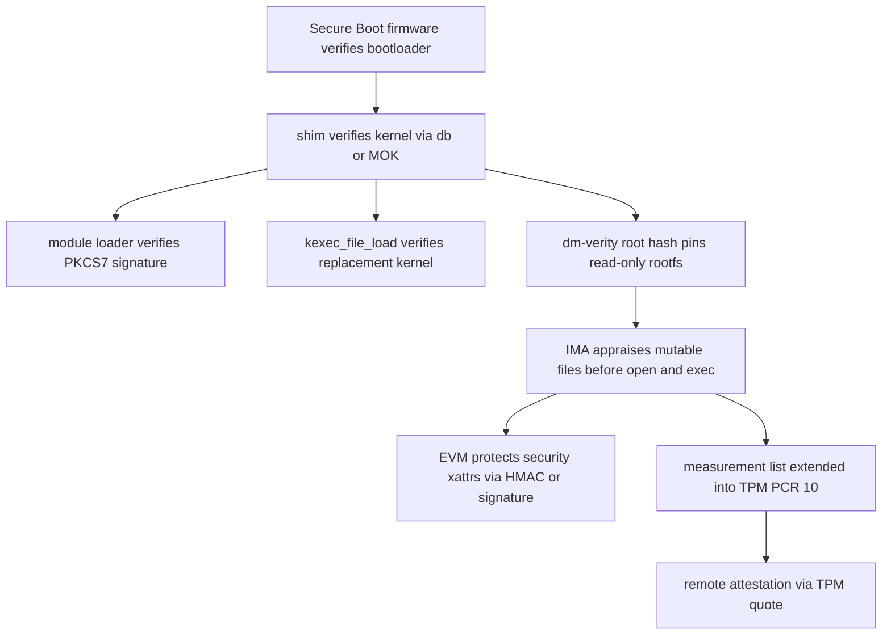

# IMA, EVM, and Code Signing Internals: Appraisal, Measurement, and the dm-verity Chain

## Overview

The kernel integrity subsystem — IMA (Integrity Measurement Architecture, merged 2.6.30/2009)
plus EVM (Extended Verification Module) — enforces and records *file-level integrity*: IMA can
measure (hash every qualifying file into a TPM-extended log) and/or appraise (verify a hash or
signature before an open/exec succeeds), while EVM protects the security xattrs those decisions
depend on. Around it sit the code-signing mechanisms that anchor the boot-to-runtime chain:
signed kernel modules (`CONFIG_MODULE_SIG`), signed kexec via `kexec_file_load(2)`, and
dm-verity's block-level Merkle trees for read-only root filesystems. This page is the internals
companion to the IMA overview in [../../linux/security/ima.md](../../linux/security/ima.md); the
syscall-sandbox pages of this directory ([./seccomp.md](./seccomp.md),
[./landlock.md](./landlock.md)) restrict what running code can *do* — this page establishes what
that code *is*.

> **Interview one-liner:** "Measurement proves what ran — a TPM-extended hash log for attestation; appraisal decides what may run — deny the open if the hash or signature does not match. EVM protects the metadata appraisal reads; dm-verity protects the blocks underneath."

## Measurement vs Appraisal

IMA hooks file lifecycle events — exec (`bprm_check_security`), `mmap` with `PROT_EXEC`, and
policy-selected opens — and for each qualifying file computes a digest (SHA-1 default,
`ima_hash=sha256` in modern deployments) into a per-inode cache (`iint`), which is invalidated
when the file is written. Measurement appends `(digest, path, template-data)` to the runtime
measurement list (`/sys/kernel/security/ima/ascii_runtime_measurements`) and extends the digest
into a TPM Platform Configuration Register (PCR 10 by default, `CONFIG_TPM`), making the log
tamper-evident without trusting the log itself: a remote verifier can check a TPM quote against
PCR 10 and replay the list to confirm consistency. Appraisal is the enforcement twin: before the
open/exec, IMA fetches the `security.ima` xattr — either a bare digest or a PKCS#7 signature —
and denies (`EACCES`/`EPERM`) if it does not match the file content or is missing under policy.

| Mechanism | Layer | Enforces? | Tamper evidence | Typical scope |
|---|---|---|---|---|
| IMA measurement | file | no (records) | TPM-extended PCR + list replay | every exec/qualified open |
| IMA appraisal | file | yes (deny open/exec) | digest/signature per file | policy-selected paths, system binaries |
| EVM | xattrs | yes (deny metadata ops) | HMAC or PKCS#7 over `security.*` | metadata integrity for appraisal |
| dm-verity | block | yes (EIO on mismatch) | Merkle tree to a signed root hash | read-only volumes, images |
| fs-verity | file (per-inode) | yes (read verified) | Merkle tree in the file itself | individual large files, image stores |

Policy rules select what participates: `measure`/`appraise` rules with `func=BPRM_CHECK
mask=MAY_EXEC`, `fowner`, `uid`, `obj_type` (SELinux label), `fsmagic` exclusions for
pseudo-filesystems, and `appraise_type=imasig` to require signatures rather than bare hashes.
Boot-time posture is set with `ima_policy=tcb|secure_boot|...` and
`ima_appraise=enforce|fix|off`; `fix` mode is the bootstrapping state that *writes* correct
`security.ima` xattrs instead of denying, intended for migration and easily the most dangerous
mode to leave on. Distros that ship IMA-appraisal-enabled configs (Ubuntu, Fedora variants)
demonstrate the operational reality: appraisal without signed content distribution produces
unbootable updates, so appraisal is always paired with a signing pipeline.

A measurement-list entry is small and greppable — PCR index, entry digest, template name,
template data — which is why verifiers can replay it cheaply:

```text
10 3ea2b41f... ima-ng sha256:ac1f... boot_aggregate
10 9c02bd71... ima-ng sha256:5e44... /usr/bin/bash
10 1f77a90c... ima-ng sha256:c02d... /usr/lib/x86_64-linux-gnu/libc.so.6
```

The first column is the PCR (10), the second is the digest of the template data itself, and the
last fields are the algorithm-digest and the file identity. `ima-sig` templates add the file's
signature to each entry, letting a remote verifier check signatures offline without the files.

## Policy Rules in Practice

IMA policy is an ordered rule list — first match wins — combining an action (`measure`,
`appraise`, `dont_measure`, `dont_appraise`) with selectors; writing to
`/sys/kernel/security/ima/policy` replaces the builtin policy once:

```text
# Measure every execution into the log and PCR 10
measure func=BPRM_CHECK mask=MAY_EXEC template=ima-ng
# Executables must carry a valid signature (appraise with signature)
appraise func=BPRM_CHECK mask=MAY_EXEC appraise_type=imasig
# Appraise files by SELinux label
appraise obj_type=bin_t appraise_type=imasig
# Skip pseudo-filesystems (by on-disk magic number)
dont_appraise fsmagic=0x9fa0
dont_measure fsmagic=0x64626764
```

Boot-time posture knobs, worth memorizing as a set:

| Boot parameter | Effect |
|---|---|
| `ima_policy=tcb` / `secure_boot` | builtin measurement/appraisal baselines |
| `ima_appraise=enforce` / `fix` / `off` | appraisal posture (`fix` writes missing xattrs) |
| `ima_hash=sha256` | digest algorithm (SHA-1 default, legacy) |
| `ima_template=ima-ng` / `ima-sig` | measurement-list entry template |
| `evm=hmac` / `x509` / `fix` | EVM protection mode |
| `module.sig_enforce=1` | module-signature enforcement for this boot |
| `lockdown=integrity` | implies module-sig + signed-kexec enforcement |

## EVM: Protecting the Metadata Appraisal Reads

Appraisal compares file content against `security.ima` — but xattrs are just as writable as
content, so an attacker with write access can relabel (`security.selinux`), strip capabilities
(`security.capability`), or swap the appraisal hash. EVM closes that hole by storing
`security.evm`, an HMAC (keyed, symmetric) or PKCS#7 (asymmetric) computation over the protected
xattr set, checked on metadata operations. The HMAC key lives in a kernel keyring (imported with
`evmctl import`/`keyctl`), which works for machine-local trust; the PKCS#7 mode verifies against
X.509 certificates in the system trusted keyrings, which is the fleet-manageable option. Boot
parameter `evm=fix|x509|hmac` selects the posture, and EVM verdicts surface as
`PASS`/`FAIL`/`INTEGRITY` states on metadata checks.

The design split matters for interviews: IMA appraisal answers "is this file's content what we
signed?", EVM answers "are its labels and metadata what we deployed?", and only the combination
resists an attacker who can write both content and xattrs. EVM's HMAC mode has a known
limitation — every machine needs the same key, so compromise of one node's key lets you forge
EVM on any node using that key — which is why signature (x509) mode is the recommendation for
fleets.

## Kernel Module Signing and Signed kexec

Module signing is the compile-time anchor: `CONFIG_MODULE_SIG` makes the build sign modules
(PKCS#7 over the module, `scripts/sign-file` with an X.509 key from `CONFIG_MODULE_SIG_KEY`),
and the kernel verifies each module's signature against the builtin and secondary trusted
keyrings at load time. Enforcement has three levers: `CONFIG_MODULE_SIG_FORCE`, the boot
parameter `module.sig_enforce=1`, and the implicit enforcement that comes with kernel lockdown
in integrity mode. Without enforcement, an unsigned or wrongly-signed module load taints the
kernel — the `E` (unsigned module) and `O` (out-of-tree) flags visible in
`/proc/sys/kernel/tainted` — which is how production fleets detect drift even where enforcement
is off. Distro-managed machines add the shim/MOK layer: the Machine Owner Key enrolled via
`mokutil` joins the platform keyring so self-built modules verify under Secure Boot.

| Knob | Effect |
|---|---|
| `CONFIG_MODULE_SIG` | build-time signing infrastructure, embedded cert |
| `CONFIG_MODULE_SIG_FORCE` | always enforce; unsigned load = `EKEYREJECTED` |
| `module.sig_enforce=1` | boot-param enforcement, per-boot |
| lockdown=integrity | implies module-sig enforcement; blocks unsigned kexec |
| `CONFIG_KEXEC_FILE` / `CONFIG_KEXEC_SIG` | enables the signed-kernel-loading path |

kexec is the corresponding boot-chain concern: the legacy `kexec_load(2)` accepts arbitrary
kernel images into memory, which under lockdown would let root replace the running kernel
without any signature check. `kexec_file_load(2)` was added, in the man page's words, *"to
provide support for systems where kexec loading should be restricted to only kernels that are
signed"* — it verifies the image's PKCS#7 signature against the system trusted keyrings before
loading, and lockdown's integrity mode refuses the legacy syscall entirely. `CONFIG_IMA_KEXEC`
extends the measurement list across such a soft reboot so attestation continuity survives the
kernel swap — a detail that ties kexec back into the IMA story.

## Key Rotation with keyctl

The relevant keyrings form the rotation surface:

| Keyring | Holds | Rotation action |
|---|---|---|
| `.builtin_trusted_keys` | compiled-in CA/key | requires kernel rebuild — plan around it |
| `.secondary_trusted_keys` | runtime-added trusted keys | `keyctl padd asymmetric ...` |
| `.platform` / MOK | Secure Boot / shim-enrolled keys | `mokutil --import` (UEFI-adjacent) |
| `.ima` | IMA appraisal signing keys | `keyctl padd asymmetric <desc> %keyring:.ima` |
| user key `evm-key` | EVM HMAC key | `evmctl import` / `keyctl add user` |
| `.blacklist` | revoked cert serials / key IDs | blacklist entry for the retired key |

A sane rotation runbook has four phases. **Enroll**: load the new certificate into `.ima` (and
`.secondary_trusted_keys` for module/kexec verification) with `keyctl padd asymmetric
ima-ca-2027 %keyring:.ima < ima-ca-2027.x509` — trusted keyrings accept only keys that link to a
trusted CA, which is why you enroll a CA, not leaf keys. **Re-sign**: rebuild/re-sign artifacts
(modules, IMA-signed files, kexec images) under the new key and deploy through the normal update
channel; during the window both keys validate. **Revoke**: `keyctl revoke $(keyctl search
%keyring:.ima asymmetric old-ca)` and add the old cert's serial to `.blacklist` so even a
captured old key cannot re-sign. **Retire**: after full fleet rollout, drop the old cert from
secondary keyrings. The asymmetry to remember: EVM HMAC keys cannot be meaningfully "rotated"
per artifact (every file's xattr was computed under the old key), so HMAC fleets rotate by
importing the new key and re-generating every xattr in `evm=fix`-style maintenance — one more
reason signature mode wins for fleets.

## The dm-verity + IMA Validation Chain

dm-verity operates one layer below IMA: it builds a Merkle tree of SHA-256 hashes over a block
device's data blocks, with the tree's root hash (256 bits) deployed out-of-band — in the kernel
command line, a signed superblock, or a signed metadata object (tooling: `veritysetup` from the
[cryptsetup](https://gitlab.com/cryptsetup/cryptsetup) project). Every block read is hashed and
verified up the tree; a mismatch returns `EIO` rather than data. Because the root hash pins the
entire tree, a single signed constant authenticates gigabytes — this is the mechanism under
[Android Verified Boot](https://source.android.com/docs/security/verifiedboot) for the system
partition and under ChromeOS verified boot. fs-verity is the per-file analogue (Merkle tree
inside the file, root hash in an xattr), suited to image stores and large assets; recent kernels
let IMA appraise fs-verity digests/signatures directly, avoiding the re-hash-on-read cost for
verity-enabled files.

The chain, end to end: firmware (Secure Boot) verifies the bootloader; the bootloader (shim)
verifies the kernel via db/MOK keys; the running kernel verifies modules (`CONFIG_MODULE_SIG`)
and replacement kernels (`kexec_file_load`); dm-verity pins the read-only rootfs blocks to a
signed root hash; IMA appraises the *mutable* remainder — files on writable volumes, and
anything outside verity coverage — against `security.ima` signatures; EVM guarantees the
metadata IMA based decisions on was not relabeled; and IMA measurement extends everything into
TPM PCR 10 so a remote verifier can attest what actually booted and ran. Each layer has a
defined failure mode (EIO, EACCES, EKEYREJECTED, taint), and each covers the others' gaps:
verity cannot handle mutable files, IMA without EVM can be defeated by xattr swaps, and
signatures without the TPM log give enforcement but not attestation.



## Namespaces and Containers

Keyrings are namespaced — every user namespace gets its own user/session/process keyrings — so
containers can hold per-container keys without seeing the host's. IMA itself is not: the
measurement list, the appraisal policy, and the appraisal state are host-global, which makes
per-tenant IMA on shared hosts an open engineering problem. The IMA-namespace patch series
(per-user-namespace IMA instances with private measurement lists and appraisal policies, Stefan
Berger/IBM) has circulated since 2018-2022 and is *not merged in mainline* as of this writing —
`CONFIG_IMA_NS` does not exist in the mainline Kconfig — so be suspicious of sources claiming
containerized IMA is a solved kernel feature. What containers get today: a host-wide appraisal
policy (often keying off SELinux/AppArmor labels or mount paths), the host's single measurement
list, and per-container keyrings for application keys.

The container-image answer has therefore shifted to fs-verity-based stores rather than IMA:
per-file verity Merkle trees inside image layers (and composites like composefs built on them)
give image-store integrity without any IMA policy machinery, with IMA left to host-level
binaries. For interviews, the sharp summary is: *namespaces isolate what code can see,
seccomp/Landlock restrict what it can call, but integrity attestation of containers remains a
host-level function on mainline kernels today.*

## Operational Costs

- **Hash-on-read**: appraisal computes a digest on first policy-matching open per inode (cached in `iint` until the file is written). Arithmetic envelope: at ~1-2 GB/s software SHA-256, a 100 MB library costs 50-100 ms on its first open — invisible for the boot path amortized over years, a visible latency spike when a cache-cold big library is first execed or after every rewrite. This is the "hash-on-read overhead" to quote, with the caveat that it is per-file-per-boot, not per-read.
- **TPM extend latency**: each measurement extends PCR 10, and discrete TPMs are slow — extend-class operations historically ran hundreds of milliseconds on TPM 1.2 parts (firmware TPMs are millisecond-class). A policy measuring every exec can stall boot for minutes on such hardware, which is why measurement policies are tuned (`func=BPRM_CHECK` rather than every open) and why `IMA_MEASURE_PCR_IDX`/hash choices matter.
- **Measurement list growth**: the log grows without bound on long-lived systems; readers must snapshot and periodically drain it, and `CONFIG_IMA_KEXEC` exists precisely because the list must survive soft reboots to keep attestation continuous.
- **EVM/fix modes**: `ima_appraise=fix` and `evm=fix` write missing metadata instead of denying — indispensable for migration, catastrophic left on, since any writer can mint valid-looking xattrs.
- **Mitigation direction**: appraisal against fs-verity digests (no content re-hash), digest-list proposals to avoid per-file policy lookups, and keeping appraisal policy narrow (`imasig` on executable paths) are the standard cost-control levers.

## Interview Questions

1. **What is the difference between IMA measurement and appraisal, and what does each buy
   you?** Measurement records: every policy-matching file's digest goes into the runtime
   measurement list and is extended into TPM PCR 10, giving tamper-evident *evidence* of what
   ran — the substrate for remote attestation via TPM quote. Appraisal enforces: before
   open/exec, the `security.ima` xattr digest or PKCS#7 signature is checked and mismatching
   files are denied with `EACCES`. They compose — appraised fleets still measure, so the
   verifier can confirm the enforcing system actually measured what it claims. Measurement
   without appraisal is audit; appraisal without measurement is enforcement with no
   attestation story.
2. **Why is EVM necessary if IMA already appraises file contents?** Appraisal's decision
   inputs are xattrs — `security.ima` itself, plus SELinux labels and capabilities — and
   xattrs are attacker-writable alongside content. Without EVM, an attacker who cannot forge
   a file's hash signature can instead relabel it or swap the appraisal xattr, defeating the
   policy. EVM stores an HMAC or PKCS#7 computation over the protected xattr set in
   `security.evm` and is checked on metadata operations. The HMAC mode's shared-key weakness
   across a fleet is why x509 signature mode is the recommended posture.
3. **Walk the validation chain for a container host from power-on to a process opening a
   file.** Secure Boot firmware verifies the bootloader; shim verifies the kernel against
   db/MOK keys; the kernel verifies modules via `CONFIG_MODULE_SIG` and kexec images via
   `kexec_file_load`; dm-verity (if deployed) verifies every rootfs block against a signed
   Merkle root, returning EIO on corruption; IMA appraises files on writable volumes against
   `security.ima` signatures before open/exec, with EVM protecting those xattrs from
   relabeling; and IMA measurement extends everything into PCR 10 for remote attestation.
   Each stage has a distinct failure mode — EIO, EKEYREJECTED, EACCES, taint — and each
   covers the others' blind spots, e.g. verity cannot cover mutable files and IMA needs EVM
   for its metadata.
4. **How does kernel module signing enforcement work, and what happens without it?** The
   build signs each module (PKCS#7 via `scripts/sign-file`) and the loader verifies against
   the builtin/secondary trusted keyrings at insert time. Enforcement comes from
   `CONFIG_MODULE_SIG_FORCE`, `module.sig_enforce=1`, or lockdown integrity mode; a failing
   load returns `EKEYREJECTED` instead of tainting. Without enforcement, unsigned modules
   still load but set the `E` (and `O`) taint flags in `/proc/sys/kernel/tainted` — a
   detection signal, not a control. Distro fleets under Secure Boot bridge self-built modules
   through MOK enrollment so the platform trusts their key.
5. **How would you rotate the keys an IMA appraisal fleet trusts?** Enroll the new CA into
   the `.ima` (and `.secondary_trusted_keys`) keyrings with `keyctl padd asymmetric` —
   trusted keyrings only accept keys chaining to an already-trusted CA; then re-sign and
   deploy artifacts under the new key so both keys validate during the window; then revoke
   the old key with `keyctl revoke` plus a `.blacklist` entry so a leaked old key is dead;
   finally retire it after full rollout. The gotcha is EVM HMAC keys, which are per-machine
   secrets baked into every file's xattr — rotation means importing the new key and
   regenerating every xattr, which is the standard argument for EVM signature mode. And
   remember the compiled-in `.builtin_trusted_keys` cannot be rotated without a kernel
   rebuild, so long-lived fleets should put rotatable trust in the secondary keyring from day
   one.
6. **Where does dm-verity end and IMA begin, and why do you need both?** dm-verity
   authenticates *blocks* of an immutable volume against one signed Merkle root — cheap (one
   root hash pins gigabytes), total (every read verified), but only for read-only content,
   failing with EIO. IMA authenticates *files* on writable storage against per-file
   signatures, handles the mutable remainder, and produces the attestation log — but costs a
   hash per new/rewritten file and needs EVM to protect its metadata. A rootfs that is fully
   verity-covered needs IMA only for mutable volumes and overlay upper layers; a
   general-purpose host with writes everywhere leans on IMA+EVM more heavily. The combination
   is what Android and hardened server images converge on.

## Key Takeaways

- IMA = measurement (hash → log → TPM PCR 10; evidence and attestation) + appraisal (verify `security.ima` digest/PKCS#7 before open/exec; enforcement).
- Appraisal decisions depend on xattrs, so EVM (HMAC or x509 over `security.*`) is not optional in adversarial models; prefer signature mode for fleets.
- Module signing: `CONFIG_MODULE_SIG` + force/sig_enforce/lockdown; unsigned loads either fail with `EKEYREJECTED` or taint the kernel with `E` — and `kexec_file_load` extends the same signature discipline to kernel replacement.
- Keyrings are the rotation surface: `.builtin` (rebuild-only), `.secondary`, `.platform`/MOK, `.ima`, EVM key, `.blacklist` for revocation; `keyctl` is the API.
- dm-verity/fs-verity give block/file integrity via signed Merkle roots (EIO on mismatch); IMA+fs-verity appraisal avoids re-hashing verity files — the chain is signed boot → signed modules/kexec → verity rootfs → IMA/EVM mutable files → TPM attestation.
- IMA namespaces are *not* merged in mainline (`CONFIG_IMA_NS` does not exist as of this writing) — container integrity today is host-global IMA plus per-namespace keyrings and fs-verity-based image stores.
- Costs are concrete: per-inode hash-on-first-open (50-100 ms for a 100 MB file at 1-2 GB/s SHA-256), slow TPM extends on discrete parts, unbounded measurement list growth, and dangerous `fix` modes.

## References

- Kernel docs, IMA templates (list format, template fields): <https://docs.kernel.org/security/IMA-templates.html>
- Kernel docs, module signing: <https://docs.kernel.org/admin-guide/module-signing.html>
- Kernel docs, kernel keyrings: <https://docs.kernel.org/security/keys/core.html>
- kexec_load(2) / kexec_file_load(2) man page: <https://man7.org/linux/man-pages/man2/kexec_load.2.html>
- keyctl(2) man page: <https://man7.org/linux/man-pages/man2/keyctl.2.html>
- Kernel security documentation index: <https://docs.kernel.org/security/index.html>
- fs-verity kernel documentation: <https://docs.kernel.org/filesystems/fsverity.html>
- IMA source (measurement/appraisal hooks): <https://elixir.bootlin.com/linux/latest/source/security/integrity/ima/ima_main.c>
- Android Verified Boot (dm-verity deployment reference): <https://source.android.com/docs/security/verifiedboot>
- cryptsetup/veritysetup (dm-verity tooling): <https://gitlab.com/cryptsetup/cryptsetup> *(bot-blocked to automated checkers; loads in browsers)*
- TPM 2.0 context: [TPM 2.0 page](../../cryptography/tpm-2.0.md) in this book; trusted-computing specs at <https://trustedcomputinggroup.org/>

## Cross-References

- [Kernel Modules](../kernel/modules.md) — loading paths, taint flags, and the signing pipeline
- [IMA — Integrity Measurement Architecture](../../linux/security/ima.md) — tour-level IMA/EVM overview in the Linux tree
- [Integrity subsystem](../../linux/security/integrity.md) — IMA/EVM/lockdown landscape page
- [Keyring](../../linux/security/keyring.md) — keyring types and keyctl workflows in depth
- [TPM 2.0](../../cryptography/tpm-2.0.md) — PCRs, quotes, and the attestation math behind PCR 10
- [Digital Signatures](../../cryptography/digital-signatures.md) — PKCS#7/X.509 machinery used by module and file signing
- [BIOS/UEFI](../boot/bios-uefi.md) — Secure Boot, shim, and MOK at the firmware layer
- [seccomp Internals](./seccomp.md) — runtime restriction layer this boot chain protects
- [Lockdown](../../linux/security/lockdown.md) — the integrity-mode policy that forces signed modules and kexec
