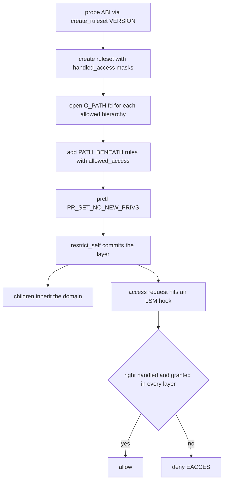

# Landlock Internals: Unprivileged Filesystem Sandboxing

## Overview

Landlock is a Linux Security Module, merged in Linux 5.13 (2021), that lets any unprivileged
process restrict its own filesystem (and, since later ABIs, network and socket) access — and its
children's — without root, policy files, or administrator involvement. The application builds a
ruleset, commits it as a new "domain" layer in its credentials, and from that point every access
decision runs through LSM hooks that can only ever get stricter. This page covers the internal
machinery: the three-syscall API, the dentry-based path-beneath model, layer intersection
semantics, the `no_new_privs` interplay, and thread-propagation rules including the recent
`TSYNC` flag. The tour-level treatment lives in
[../../linux/security/landlock.md](../../linux/security/landlock.md); the syscall-number
counterpart is [./seccomp.md](./seccomp.md).

> **Interview one-liner:** "seccomp decides on syscall numbers and integer arguments; Landlock decides on resolved file objects — that is why Landlock can say 'no writes under /etc' and seccomp fundamentally cannot."

## The Three-Syscall API

Landlock's entire user surface is three syscalls plus capability-detection flags:

| Step | Syscall | Key argument | Notes |
|---|---|---|---|
| 1 | `landlock_create_ruleset(2)` | `landlock_ruleset_attr` | declares *handled* rights: bits that become denied-by-default |
| 2 | `landlock_add_rule(2)` | `landlock_path_beneath_attr` or `landlock_net_port_attr` | grants rights per hierarchy (O_PATH fd) or per port |
| 3 | `landlock_restrict_self(2)` | ruleset fd, flags | commits the ruleset as a new layer on the calling thread |

`handled_access_fs` is the security-critical choice: every bit set there means "within this
domain, this access right is denied unless a rule grants it" — unset bits remain governed by
ordinary DAC. The ruleset fd is then populated with rules and committed with `restrict_self`,
which requires either `PR_SET_NO_NEW_PRIVS` or `CAP_SYS_ADMIN` in the initial namespace.
Availability probing is first-class: `landlock_create_ruleset(NULL, 0,
LANDLOCK_CREATE_RULESET_VERSION)` returns the highest supported ABI version (or fails with
`ENOSYS` if the syscall does not exist, `EOPNOTSUPP` if disabled), and the kernel documentation
explicitly recommends a best-effort pattern — handle what the ABI supports, quietly skip what it
does not.

The ABI is versioned because rights shipped incrementally:

| Right (group) | Introduced | Meaning |
|---|---|---|
| 13 base `LANDLOCK_ACCESS_FS_*` bits (execute, read/write file, read dir, remove, make char/dir/reg/sock/fifo/block/sym) | ABI 1 (5.13) | the original filesystem rights |
| `LANDLOCK_ACCESS_FS_REFER` | ABI 2 (5.19) | cross-directory link/rename control |
| `LANDLOCK_ACCESS_FS_TRUNCATE` | ABI 3 (6.2) | `truncate`/`ftruncate`/`O_TRUNC` |
| `LANDLOCK_ACCESS_NET_BIND_TCP`, `..._CONNECT_TCP` | ABI 4 (6.7) | restrict TCP bind/connect to allowed ports |
| `LANDLOCK_ACCESS_FS_IOCTL_DEV` | ABI 5 | restrict `ioctl(2)` on char/block devices |
| `LANDLOCK_SCOPE_ABSTRACT_UNIX_SOCKET`, `LANDLOCK_SCOPE_SIGNAL` | ABI 6 | restrict abstract-socket connections and signal sending (scoped model) |
| `LANDLOCK_RESTRICT_SELF_LOG_*` flags | ABI 7 | audit-logging control per layer |
| `LANDLOCK_RESTRICT_SELF_TSYNC` | ABI 8 | propagate the ruleset to all threads (below) |
| `LANDLOCK_ACCESS_FS_RESOLVE_UNIX` | ABI 9 | restrict lookups of pathname Unix sockets |
| UDP bind/connect rights | ABI 10 | extends the net-port model to UDP |

Rights 5 and beyond landed across recent 6.x releases; the runtime probe, not a kernel-version
string, is the supported way to detect them. The task-facing consequence: a sandbox written for
ABI 1 degrades safely on old kernels (the handled-but-unknown bits are simply not enforced) and
hardens automatically on new ones.



## Path-Beneath Semantics and the Dentry Model

A `LANDLOCK_RULE_PATH_BENEATH` rule binds an access mask to a *hierarchy identified by an O_PATH
file descriptor*, not by a path string. This is the core internal design decision: the rule
tracks a dentry/inode ancestry, so renaming the directory, mounting something else on top, or
reopening it from a different path does not confuse the rule — the restriction follows the
object, not the name. Enforcement at `security_file_open` and the path hooks walks the accessed
file's dentry chain upward looking for an ancestor covered by a rule; there is no pathname
parsing and no string comparison, and cost scales with ancestry depth rather than policy size.

Two behavioral quirks follow from the model. First, `REFER` (ABI 2) exists because moving or
linking a file between hierarchies could otherwise smuggle an object out from under a
restrictive layer; on ABI-1 kernels cross-directory link/rename is conservatively denied
whenever any FS right is handled, and only ABI 2+ lets a domain grant it explicitly with
destination-side `MAKE_*`/`REMOVE_*` rights also accounted. Second, OverlayFS interacts the way
object-identity rules predict: a rule on the lower-layer directory does not automatically cover
the merged view, so sandboxes on container overlay filesystems must handle the merged hierarchy
explicitly (the kernel documentation dedicates a section to exactly this).

## Layered Restrictions: Intersection, Never Union

Each successful `landlock_restrict_self` pushes a new domain layer onto the calling thread's
credentials; there is no way to pop one. Access is granted only if, for every right *handled* by
*any* layer, that layer grants it — the effective policy is the intersection of all layers. A
worked example makes the semantics concrete:

| Access | Layer 1 (app) | Layer 2 (library, loaded later) | Effective |
|---|---|---|---|
| read `/data/input` | granted | granted | allowed |
| write `/data/tmp` | granted | handled, not granted | **denied** |
| read `/home/user` | handled, not granted | granted | **denied** |
| execute `/usr/bin` | unhandled | granted | allowed (DAC governs layer 1's view) |

The table shows the two directions of the "only shrink" invariant: a later layer can take rights
away that an earlier layer granted, and it can also *handle* a right an earlier layer left
unhandled — but nothing can grant back what any layer denied. This composability is what makes
Landlock usable by library authors: a component can harden itself (`restrict_self` on its own
ruleset) without knowing what the embedding application already did, because the combination is
well-defined regardless of order. It also means defensive stacking is cheap — wrapping an
untrusted helper in one more layer never loosens anything.

## no-new-privileges Interplay

`landlock_restrict_self` requires the calling thread to have `PR_SET_NO_NEW_PRIVS` set (or hold
`CAP_SYS_ADMIN`), and the pairing is deliberate. `no_new_privs` makes every subsequent `execve`
inert with respect to privilege gain: setuid bits and file capabilities stop working, so the
sandbox cannot be escaped by exec-ing a privileged helper. Meanwhile the Landlock domain itself
lives in the credentials, crosses `fork` and `execve`, and cannot be shed — so a restricted
process that execs an unrelated binary (a shell, a build tool) hands the restriction down
intact. The kernel documentation's threat model treats this as the unprivileged guarantee: no
root, no daemon, and no policy store is involved, so the only thing being trusted is the kernel.

The remaining escape class is pre-existing privilege: a setuid binary execed *before* the
restriction runs unconstrained, and a process that already holds `CAP_SYS_ADMIN` can opt out of
the NNP requirement. Recent kernels (ABI 11 era) add `LANDLOCK_RESTRICT_SELF_NO_NEW_PRIVS`,
which sets `no_new_privs` atomically on a successful `restrict_self` — closing the small window
where NNP is set but enforcement failed. For placement-level purposes, remember the pair as "NNP
stops privilege gain at exec; Landlock stops object access everywhere else."

## Thread Propagation, libpsx, and TSYNC

Landlock's domain is stored in the task's credentials, and Linux credentials are copy-on-write
per task: `landlock_restrict_self` affects the calling thread and every task created *after* it,
but existing sibling threads keep their old domain. A multithreaded process can therefore run
different layers on different threads — powerful for compartmentalization, but a correctness
trap if the intent was process-wide sandboxing. Historically there was no synchronization
primitive, and the sanctioned workaround was libpsx (shipped with recent glibc): it intercepts
security-relevant syscalls and replicates them across all threads by stopping each one, so every
thread commits the new credentials together. The kernel documentation even discusses a Landlock
erratum (signal scoping vs libpsx) in exactly those terms — threads are not security boundaries,
so same-process signaling must keep working across domains.

The modern answer is `LANDLOCK_RESTRICT_SELF_TSYNC` (ABI 8): one flag makes `restrict_self`
propagate the new domain to all threads of the calling process, mirroring seccomp's
`SECCOMP_FILTER_FLAG_TSYNC` — which is why the two designs now rhyme, a decade apart, on the
same problem. With TSYNC, a process can apply a Landlock layer after threads exist; without it,
the options are apply-before-first-thread or libpsx-style synchronous propagation.
Interview-relevant contrast: seccomp needed TSYNC from the early days because filters are
per-thread by construction, while Landlock's late TSYNC reflects its credentials-based storage —
same symptom, different mechanism.

## C Walkthrough

Condensed from the kernel's own sample
([samples/landlock/sandboxer.c](https://github.com/torvalds/linux/blob/master/samples/landlock/sandboxer.c)):

```c
#define _GNU_SOURCE
#include <linux/landlock.h>
#include <sys/syscall.h>
#include <fcntl.h>        /* O_PATH */
#include <sys/prctl.h>

static int lockdown_fs(void)
{
    /* 1. Declare handled rights: everything below is denied unless granted. */
    struct landlock_ruleset_attr attr = {
        .handled_access_fs = LANDLOCK_ACCESS_FS_EXECUTE  |
                             LANDLOCK_ACCESS_FS_READ_FILE |
                             LANDLOCK_ACCESS_FS_WRITE_FILE |
                             LANDLOCK_ACCESS_FS_READ_DIR,
    };
    int ruleset_fd = syscall(SYS_landlock_create_ruleset,
                             &attr, sizeof(attr), 0);
    if (ruleset_fd < 0)
        return -1;                       /* ENOSYS: kernel lacks Landlock */

    /* 2. Grant read-only access beneath /usr via an O_PATH fd. */
    struct landlock_path_beneath_attr usr = {
        .allowed_access = LANDLOCK_ACCESS_FS_READ_FILE |
                          LANDLOCK_ACCESS_FS_READ_DIR,
    };
    int usr_fd = open("/usr", O_PATH | O_CLOEXEC);
    usr.parent_fd = usr_fd;
    syscall(SYS_landlock_add_rule, ruleset_fd,
            LANDLOCK_RULE_PATH_BENEATH, &usr, 0);
    close(usr_fd);

    /* 3. NNP requirement, then commit: deny-by-default from here on. */
    prctl(PR_SET_NO_NEW_PRIVS, 1, 0, 0, 0);
    if (syscall(SYS_landlock_restrict_self, ruleset_fd, 0) < 0) {
        close(ruleset_fd);
        return -1;                       /* e.g. E2BIG: rule count exceeded */
    }
    close(ruleset_fd);
    return 0;   /* fork/exec from here inherits the domain */
}
```

Six points worth being able to make about this code. The handled mask in step 1 *is* the policy
posture — any right not listed stays DAC-governed, so a missing bit is a hole, not a crash.
Rules are additive grants against a deny-by-default background, which is why step 2 must
enumerate every hierarchy the program still needs. The O_PATH fd (no open permission required)
is what makes unprivileged sandboxing possible: you can restrict to a directory you could not
read. Errors matter asymmetrically: failing to create the ruleset on an old kernel should
degrade gracefully, but failing to *restrict* must abort — running unrestricted after intending
to restrict is the vulnerability. `restrict_self` is thread-scoped, so libraries calling this
must think about TSYNC or thread creation order. And the entire sequence is idempotent-safe to
repeat: a second call adds a layer and can only shrink access.

## What Landlock Does Not Cover

Scope discipline matters as much as scope. Landlock has no syscall-number policy — cutting the
ABI (blocking `ptrace`, `mount`, exotic syscalls) remains seccomp's job. Its network rights (ABI
4+) govern TCP/UDP bind and connect *ports*, not payload, protocol semantics, or other address
families. It is not an isolation primitive: it does not create namespaces, chroots, or user
boundaries, and composes with those mechanisms rather than replacing them. Same-process
signaling is deliberately always allowed (threads are not security boundaries), and only from
ABI 6 can a domain scope *cross-process* abstract-socket connections and signals.

Restrictions are also one-way at the process level: there is no "unrestrict" call, and recovery
means exiting the restricted thread or process. Finally, the ABI-gap risk cuts the other way too
— on an old kernel, handled-but-unknown rights silently reduce enforcement, so the best-effort
pattern (probe the ABI, enforce the subset) must be paired with an unconditional privilege drop
or equivalent hardening so a partial sandbox is still a sandbox. The composite rule for
interviews: Landlock narrows *object* access, seccomp narrows the *ABI*, namespaces narrow
*visibility* — each is necessary, none is sufficient.

Error codes are part of the design contract, and each tells a different operational story:

| errno | Raised by | Operational meaning |
|---|---|---|
| `ENOSYS` | `create_ruleset` | kernel predates Landlock — degrade deliberately, keep privilege drop |
| `EOPNOTSUPP` | `create_ruleset` | Landlock built but disabled (LSM list/order) — fix boot config |
| `EINVAL` | all three | malformed attr size, unknown rule type, flag misuse — code bug |
| `E2BIG` | `add_rule` / `restrict_self` | too many rules / domain too large — restructure the policy |
| `EBADF` | `restrict_self` | fd is not a Landlock ruleset — lifecycle bug |
| `EPERM` | `restrict_self` | `no_new_privs` unset and no `CAP_SYS_ADMIN` — setup-order bug |

The cardinal rule: `ENOSYS`/`EOPNOTSUPP` are *environment* failures where a
restricted-but-smaller sandbox is still correct, while `E2BIG`/`EINVAL`/`EPERM` are
*policy-path* failures where proceeding unrestricted means running exactly the code you intended
to confine — abort instead. Treat this distinction as a code-review gate for any self-sandboxing
library.

## Landlock vs seccomp vs AppArmor/SELinux vs BPF LSM

| Property | seccomp-BPF | Landlock | AppArmor | SELinux | BPF LSM |
|---|---|---|---|---|---|
| Decision point | syscall entry | LSM hooks (objects) | LSM hooks | LSM hooks | LSM hooks |
| Sees | nr, args, arch, PC | resolved dentries, ports | pathnames, labels | labels, classes | anything BPF computes |
| Policy author | the process itself | the process itself | admin (profiles) | admin (TE policy) | developer/ops (code) |
| Load privilege | none (needs NNP) | none (needs NNP) | root + policy | root + policy | root + CAP_MAC_ADMIN |
| Revocable/tightenable | tighten only | tighten only (layers) | yes, admin | yes, admin | yes, replaceable |
| Scope | whole syscall ABI | FS + net + scoped IPC | paths + caps | all object classes | per-hook, custom |

The crisp division of labor: seccomp reduces the *syscall surface*; Landlock and the LSM family
decide access to *objects*. Production sandboxes stack them — a container runtime applies
namespaces + capabilities + seccomp + (optionally) an LSM, and an application hardens itself
further with Landlock without coordinating with any of that stack. What Landlock uniquely buys
is the unprivileged, self-imposed, composable corner: an admin cannot express it for you
(AppArmor/SELinux need root), and seccomp cannot express it at all (no path knowledge).

## Interview Questions

1. **Why does Landlock identify rule targets with O_PATH file descriptors instead of path
   strings?** The rule binds to the dentry/inode ancestry, so the restriction follows the
   object through renames and mount changes instead of a text prefix that can be gamed with
   symlinks or bind mounts. Enforcement walks the accessed file's ancestry at the LSM hook,
   which also makes decisions O(depth) with no string parsing. The fd itself needs no read
   permission (O_PATH), which is what allows unprivileged self-sandboxing. The trade-off is
   overlayfs subtleties: a rule on a lower layer does not automatically cover the merged
   view.
2. **What happens when two Landlock layers disagree — say layer 1 grants write to /data and
   layer 2 handles but does not grant it?** The effective right is the intersection: because
   layer 2 *handles* `WRITE_FILE` and grants nothing, writes under /data are denied even
   though layer 1 granted them. Layers stack monotonically and cannot be popped, so
   composition always shrinks. This is what lets a library harden itself independently of its
   host application. Note the subtle case in the other direction: a later layer can handle a
   right the earlier one left unhandled, tightening the domain beyond the author's original
   mask.
3. **How does Landlock propagate to threads, and what changed with TSYNC?** The domain lives
   in per-task credentials, so `restrict_self` affects the calling thread and all tasks
   created afterward — existing threads keep their old domain. Before ABI 8 there was no
   synchronization; multithreaded programs used libpsx, which stops all threads and
   replicates the credential commit. `LANDLOCK_RESTRICT_SELF_TSYNC` (ABI 8) now propagates
   the domain to all threads in one call, mirroring seccomp's `SECCOMP_FILTER_FLAG_TSYNC`.
   Same problem, different storage model: seccomp filters are per-thread by construction,
   Landlock domains are credentials.
4. **How would you decide between Landlock and seccomp for hardening a parser that handles
   untrusted input?** Use both, for different questions. seccomp answers "which syscalls can
   this code even issue?" — cut the ABI to what the parser needs (open/read/write/exit-class
   calls only). Landlock answers "which objects may it touch?" — grant read-only to the input
   directory and nothing else, so even an allowed `openat` fails on the wrong path. The
   stacking is safe because both mechanisms only tighten, and each covers the other's blind
   spot: seccomp cannot see paths, Landlock cannot restrict syscall classes it has no hooks
   for.
5. **How do you write Landlock code for kernels spanning 5.13 to current?** Probe with
   `landlock_create_ruleset(NULL, 0, LANDLOCK_CREATE_RULESET_VERSION)` and treat the ABI as a
   feature mask: handle only rights at or below the reported version, using the best-effort
   pattern the kernel documentation prescribes. A right handled by an older kernel degrades
   to not-enforced, which fails safe only if the app also drops privileges or constrains
   itself another way. Never gate the sandbox on the newest ABI — the intersection semantics
   mean partial enforcement is still strictly better than none. This runtime-probe discipline
   is exactly how the kernel sample and libpsx-era userspace cope with the 5.13-to-6.x
   rollout.
6. **What does no_new_privs contribute to the Landlock guarantee, and why is it required?**
   `restrict_self` requires NNP (or CAP_SYS_ADMIN) because the whole model is "unprivileged
   code restricts itself": without NNP, a restricted process could exec a setuid binary and
   gain privileges that predate the sandbox — the restriction would still apply, but the
   newly privileged code is exactly what you do not trust. NNP makes privilege gain
   impossible via setuid bits and file capabilities for every future exec in this domain.
   Combined with the fact that the Landlock domain survives exec and cannot be removed, the
   pair closes the exec-based escape. Newer ABIs fold this into `restrict_self` itself with
   `LANDLOCK_RESTRICT_SELF_NO_NEW_PRIVS`.

## Key Takeaways

- Landlock (5.13+) is the only mainstream LSM that unprivileged code can apply to itself — no root, no policy store, no daemon.
- The model is deny-by-default over a *handled* mask, with O_PATH-fd-bound `PATH_BENEATH` grants; unhandled rights stay DAC-governed.
- Rules track objects, not names: enforcement walks dentry ancestry at LSM hooks, so renames/mounts do not defeat it — but overlayfs merged views need explicit handling.
- Layers intersect and cannot be popped: any layer's handled-but-ungranted right denies the access everywhere.
- `no_new_privs` is the exec-side half of the guarantee; the domain is thread-scoped in credentials, inherited by children, and `LANDLOCK_RESTRICT_SELF_TSYNC` (ABI 8) finally gives seccomp-style all-thread application.
- The ABI is the compatibility contract — probe `LANDLOCK_CREATE_RULESET_VERSION` and enforce a best-effort subset (FS 1 → REFER 2 → TRUNCATE 3 → TCP-net 4 → ioctl-dev 5 → scoped 6 → TSYNC 8 → UDP 10).
- seccomp vs Landlock is number-vs-object: production sandboxes stack both because neither can answer the other's question.

## References

- Kernel documentation, Landlock user-space API (ABI table, best-effort pattern): <https://docs.kernel.org/userspace-api/landlock.html>
- landlock_create_ruleset(2): <https://man7.org/linux/man-pages/man2/landlock_create_ruleset.2.html>
- landlock_add_rule(2): <https://man7.org/linux/man-pages/man2/landlock_add_rule.2.html>
- landlock_restrict_self(2): <https://man7.org/linux/man-pages/man2/landlock_restrict_self.2.html>
- no_new_privs kernel documentation: <https://docs.kernel.org/userspace-api/no_new_privs.html>
- LSM admin guide (module list and `lsm=` boot parameter): <https://docs.kernel.org/admin-guide/LSM/index.html>
- Kernel sample sandboxer: <https://github.com/torvalds/linux/blob/master/samples/landlock/sandboxer.c>
- Project site (status, kernel support matrix): <https://landlock.io/>
- LWN (Landlock design and merge coverage): <https://lwn.net/>

## Cross-References

- [seccomp Internals](./seccomp.md) — the syscall-number sandbox; TSYNC and notify internals
- [BPF LSM Internals](./bpf-lsm.md) — programmable LSM policies as the third point in the triangle
- [SELinux](../security/selinux.md) — the admin-managed label-based MAC Landlock contrasts with
- [Access Control](../security/access-control.md) — DAC/MAC models that Landlock sits on top of
- [Landlock: Unprivileged Sandboxing](../../linux/security/landlock.md) — tour-level page in the Linux tree
- [Namespaces](../containers/namespaces.md) — the isolation context where Landlock and mount namespaces interact
- [BPF LSM](../../linux/security/bpf-lsm.md) — LSM-family comparison page
- [MAC](../../linux/security/mac.md) — mandatory access control fundamentals
