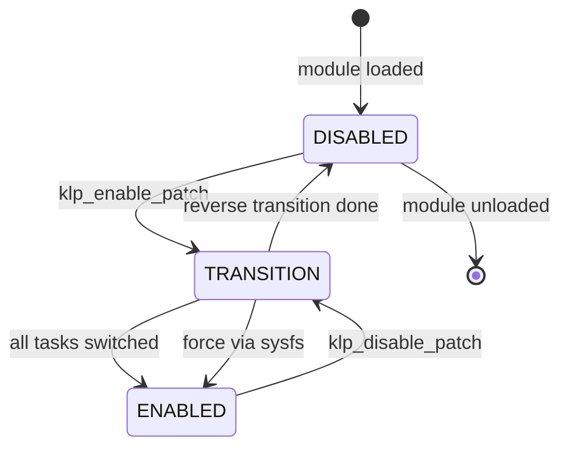
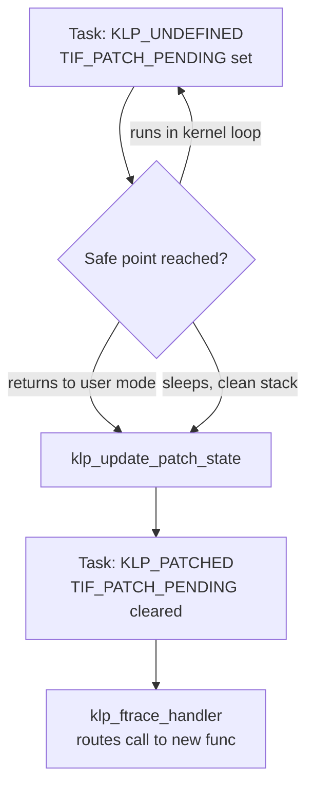

# Kernel Live Patching Internals

## Overview

Kernel live patching replaces compiled functions in a running kernel with corrected versions — no reboot, no workload drain, no connection loss. The [Kernel Live Patching](../../linux/kernel/live-patching.md) page covers the toolchain landscape (kpatch, kGraft, Canonical Livepatch) and the mechanics of ftrace-based function replacement; this page goes one level deeper into what makes live patching *hard*: the per-task consistency model (`TIF_PATCH_PENDING`, `klp_complete_task`), the limits of patch stacking, the SUSE-style cumulative patch model, and an honest risk model of what a live patch can and cannot safely change. Expect this material in senior kernel, SRE, and systems-performance interviews at companies that run fleets where reboots cost money.

## The ftrace Contract

Every upstream live patch is a kernel module that registers `struct klp_patch` descriptions and lets the livepatch subsystem install an **ftrace ops** on each patched function's entry. The details that matter beyond the basic nop-to-call rewrite:

- Each `klp_func` gets its own `ftrace_ops` with `FTRACE_OPS_FL_SAVE_REGS | FTRACE_OPS_FL_IPMODIFY`. Saving registers is non-negotiable: the handler must be able to overwrite the saved `pt_regs->ip` so the caller's return path continues into the new function.
- The handler (`klp_ftrace_handler()`) looks up the function in the per-object list and **consults the current task's patch state** to decide which version's address to place in the saved IP. During a transition, a task whose `patch_state` still says "unpatched" must keep executing the old body even though the ftrace hook is already installed; getting this wrong is a use-after-free of semantics, so the handler validates the function's state and falls back to the stack top.
- Livepatch functions must not recurse into ftrace itself: the patching code runs with `preempt` disabled where required and relies on ftrace's recursion protection so a patched `printk` inside a patch handler does not re-enter.
- Instruction-level atomicity is inherited from ftrace's `text_poke` machinery (INT3-broadcast-and-replace on x86), so a concurrently executing CPU never observes a torn instruction. This solves the *installation* race; the *semantic* race between old and new callers is what the consistency model below solves.

The number of simultaneously patched functions is bounded only by memory, but each patched function pays a ftrace-hop at every call — roughly 2–5 extra nanoseconds on modern x86 — which is why hot-path functions (`memcpy`, scheduler internals) are avoided and why vendors ship cumulative patches with dozens to hundreds of functions rather than one patch per bug.

### The handler in code

The dispatch decision that makes the consistency model work is small enough to read:

```c
/* kernel/livepatch/patch.c — heavily simplified */
static void klp_ftrace_handler(unsigned long ip, unsigned long parent_ip,
                               struct ftrace_ops *ops, struct ftrace_regs *fregs)
{
    struct klp_func *func = ops->private;

    func = list_entry(func->stack_node.next, struct klp_func, stack_node)
           ?: func;                       /* walk the per-function stack */

    if (func->transition) {
        /* mid-transition: which generation does THIS task run? */
        if (current->patch_state == KLP_UNDEFINED &&
            func->patch_state == KLP_PATCHED)
            func = klp_prev_func(func);  /* stay on the old body */
        else if (current->patch_state == KLP_PATCHED &&
                 func->patch_state == KLP_UNDEFINED)
            goto unlock;                 /* not ours to reroute yet */
    }

    ftrace_instruction_pointer_set(fregs,
        (unsigned long)func->new_func);  /* the whole trick */
unlock:
    /* do nothing: old code runs by falling through */
}
```

Three properties of this snippet carry the interview weight. First, the *fall-through* default means an old-generation task executes the old body even though the ftrace hook is live — installation and adoption are deliberately decoupled. Second, the per-task decision is made at call time, not patch time, which is what allows two tasks to run different generations of the same function concurrently and safely. Third, any error path leaves the original instruction pointer untouched, so a bug in the handler degrades to "unpatched behavior" rather than a jump to garbage — a deliberate fail-safe choice.

## The klp Object Model

The description hierarchy is `klp_patch → klp_object → klp_func`, one per module load:

| Object | Identifies | Contains |
|---|---|---|
| `klp_patch` | the `.ko` module (`MODULE_INFO(livepatch, "Y")`) | list of objects, `.replace` flag, optional states |
| `klp_object` | patch target: `vmlinux` (`name == NULL`) or a module by name | function list, callbacks, states |
| `klp_func` | one replacement: `old_name` + `new_func` pointer | resolved `old_addr`, `nop` flag, `patch_state`, transition bookkeeping |

Three internals are interview-grade:

1. **Symbol resolution** happens at enable time via kallsyms (`CONFIG_KALLSYMS_ALL` is required so static functions resolve). Duplicate symbols (static `cleanup` in fifty files) are disambiguated with `sympos` — the caller supplies the 1-based occurrence index, and getting it wrong fails the load rather than patching the wrong function.
2. **Module patching is dynamic**: if the patch targets a loadable module that is not loaded, `klp_module_coming()` hooks the module loader so the object is patched at module-load time, and removed from consideration at unload.
3. **Relocations travel with the patch**: references from new functions to kernel symbols are encoded as `.klp.rela.` sections; the subsystem applies them against the resolved addresses (optionally validating symbol CRCs), which is how a patch module compiled against one tree binds safely to a running kernel.

## The Consistency Model

### Why two competing designs converged

Upstream livepatching is literally the merger of the two competing patch systems of 2013–2014, and the split is a perfect interview story. **kpatch** (Red Hat) performed a *bulk* switch: at enable time it used `stop_machine()` to pause every CPU and flip every call site at once, giving a crude but atomic transition whose cost was a brief system-wide stall. **kGraft** (SUSE) switched *per task*, using a binary patched/unpatched state per thread with NMI-safe checks, so no global stall ever happened — but proving a task would never again observe old code required the safe-point discipline described below. Upstream took kGraft's per-task model (no stop_machine on 512-CPU monsters) and added kpatch's insistence on a well-defined completion barrier, producing the hybrid: per-task adoption, global completion semantics, and a forced-transition escape hatch. When you hear "the consistency model", this history is why the phrase is singular: there is exactly one barrier in the kernel, and both vendors' product lines converged on it.

| Design | Switch granularity | Global stall | Completion guarantee | Fate |
|---|---|---|---|---|
| kpatch (2014) | whole system via `stop_machine` | yes, milliseconds | atomic by construction | merged as the toolchain, not the model |
| kGraft (2014) | per task at safe points | none | barrier completion needed | became the upstream model |
| Upstream livepatch (4.0+) | per task + global barrier | no | `klp_complete_transition()` | the one everyone ships |
| Ksplice (2008) | instruction-level with "quiet zones" | brief | text-verified | commercialized at Oracle; not merged |

The ftrace-based entry rewrite also settled an argument Ksplice had dodged: Ksplice patched call sites *individually* and needed proof no thread was mid-instruction in a patched region (its "quiet zone" analysis), which is a compiler-coupled research problem. Routing one entry instruction through ftrace reduces the safety problem to the task barrier, at the cost of the small per-call hop quantified earlier — a trade upstream considered obviously worth it.

The central problem: you cannot atomically re-point every call site of a function across all CPUs while arbitrary tasks are executing inside the old body. A task that is asleep *inside* the old version of a patched function must finish with the old code before the patch can be declared fully enabled — otherwise the kernel runs a mix of versions with no defined boundary. Upstream (inheriting kGraft's model, merged in Linux 4.0) solves this with a **per-task transition kernel barrier**:

- Each task gets a `TIF_PATCH_PENDING` thread flag and a `task_struct.patch_state` value (`KLP_UNDEFINED` = run old, `KLP_PATCHED` = run new).
- When a patch is enabled, `klp_init_transition()` marks every task pending, then `klp_start_transition()` arms the flags. The patch enters its **transition** state, visible as `transition=1` in `/sys/kernel/livepatch/<patch>/transition`.
- A task switches itself at a **safe point** via `klp_update_patch_state()`, which clears `TIF_PATCH_PENDING` and sets `patch_state` to the target. For a user task the safe point is the exit-to-user-mode path of a syscall/interrupt return — the natural "quiescent boundary" where no kernel function is on its stack. Sleeping tasks are switched directly by `klp_try_switch_task()`, but only after `klp_check_stack()` walks the task's stack with the **reliable stacktrace** infrastructure (`stack_trace_save_tsk_reliable`) to confirm no patched function frame is present.
- The **idle task** switches in its loop, so a quiet CPU does not block a transition forever.
- The transition is driven by a dedicated kernel thread that repeatedly retries stragglers and sleeps between passes. When `klp_complete_transition()` observes zero pending tasks it flips the global target state and the patch becomes fully enabled. If something is truly stuck (a kernel thread spinning in a patched function without returning to user mode), the administrator can write to `/sys/kernel/livepatch/<patch>/force`, which completes the transition regardless — with an explicit warning that tasks may execute mixed old/new code.



Per-task, the same window is a two-state machine hung off `TIF_PATCH_PENDING`:



### Safe points and their mechanisms

| Safe point | Mechanism | Notes |
|---|---|---|
| Return to user mode | `_TIF_PATCH_PENDING` in exit-to-user work flags | the common case; user tasks convert within one syscall of becoming eligible |
| Sleeping task | `klp_try_switch_task()` + `klp_check_stack()` | requires a **reliable** backtrace; frame-pointer-only builds can block patching |
| Idle task | checked in the idle loop | prevents idle CPUs from stalling transitions |
| Blocked on futex/poll with patched frame | not switched until frame returns | the long tail that transitions wait for |
| Forced (sysfs) | `klp_complete_task()` bypass | last resort; admits mixed-version execution |

The design consequence worth stating in interviews: a live patch is only *architecturally* guaranteed once every task has crossed the barrier, and the barrier's cost is dominated by the worst task — a long-running kernel thread inside patched code can stretch a transition from milliseconds to indefinitely, which is the operational reason `force` exists and why patch authors minimize the set of functions that kernel threads call.

### A transition, step by step

The enable path ties the pieces together in a fixed order, and knowing the order is what makes stuck-transition debugging tractable:

1. `klp_enable_patch()` validates the module (livepatch annotation, symbol resolution, relocation fixups) under the global mutex — a second transition cannot start here.
2. `klp_init_transition(patch, KLP_PATCHED)` arms every task: `TIF_PATCH_PENDING` set, `patch_state` left at `KLP_UNDEFINED`, and the patch marked `transition=1` in sysfs.
3. `klp_start_transition()` registers the ftrace ops for every function in the patch — from this instant, dispatch depends on each task's state, and *no* global switch ever flips.
4. The transition kthread and each task's own exit-to-user path call `klp_try_switch_task()` / `klp_update_patch_state()`; `klp_complete_task()` clears the flag and records the new generation for that task.
5. When `klp_try_complete_transition()` finds zero pending tasks it runs post-patch callbacks, flips the patch to `enabled=1`, and ends the transition. Disable runs the same machinery mirrored, including the stack check, because tasks must also stop *running* the old body before it can be considered retired.

```bash
# Watching a transition on a live system
ls /sys/kernel/livepatch/livepatch_9/          # enabled  transition  force  <object> dirs
cat /sys/kernel/livepatch/livepatch_9/transition   # 1 = tasks still converting
# per-task adoption is visible in the per-object function dirs:
ls /sys/kernel/livepatch/livepatch_9/vmlinux/
# after it settles (transition back to 0) the patch is fully in force
echo 1 > /sys/kernel/livepatch/livepatch_9/force   # ONLY after root-causing the straggler
```

Two failure signatures cover most production incidents. A transition that never completes with some tasks at `patch_state=unpatched` almost always means a kernel thread is parked inside a patched function — the fix is to quiesce that workload, not to force immediately. A transition that completes but misbehaves is a *semantic* problem (missed inline site, bad state migration) and no amount of sysfs inspection will reveal it; that is what canary fleets and the kselftests livepatch suite are for.

## Stacking and Its Limits

Multiple patches may be loaded, and the subsystem maintains a **per-function stack** of replacements: for a function patched by patches P1 then P2, the stack is `[P2.func, P1.func]`, and the ftrace handler dispatches according to each task's transition state across the stack, not just the top entry. Limits that shape real deployments:

- **One transition at a time.** The whole subsystem serializes on a mutex and a single global transition target; enabling P3 while P2 is mid-transition is rejected, and disabling follows the same rule. On a 10,000-host fleet this turns patch rollout into an ordered, observable event.
- **Source-level coupling.** If P2 patches the same function as P1, P2's new body must be written *against P1's source*, not the pristine kernel — the toolchain must compile P2 on top of P1's binary/source inputs. Losing track of this layering produces patches that compile but silently revert P1's fix.
- **Feature negotiation via `klp_state`.** `struct klp_state` entries let patch N record versioned per-patch key/value state so a successor patch can detect "the previous patch already migrated this data structure to v2" and either adopt or fail the load. This is the supported mechanism for data-layout evolution across stacked patches, alongside `klp_shadow` variables keyed by `(object, id)` for attaching new per-object data at runtime.
- **Callback symmetry.** `pre_patch/post_patch/pre_unpatch/post_unpatch` callbacks let a patch allocate and free state; unpatching a patch whose callbacks freed resources another patch depends on is a class of bug the states mechanism exists to prevent.

### Data changes in practice: shadow variables and states

Because a live patch cannot change `struct` layouts, the two supported mechanisms for evolving data deserve a concrete look. Shadow variables attach *sidecar* storage to existing objects, keyed by `(object pointer, id)`, with lifetime helpers so the data dies with the object:

```c
/* patch adds a "generation" field to struct netdevice without touching it */
int *gen = klp_shadow_get(dev, SHADOW_ID);
if (!gen) {
    gen = klp_shadow_alloc(dev, SHADOW_ID, sizeof(int), GFP_KERNEL,
                           shadow_ctor, NULL);   /* ctor copies old fields */
}
*gen += 1;
```

Versioned `klp_state` entries then solve the *cross-patch* problem: a cumulative successor patch declares the state by id and version, and the subsystem refuses to enable it if the previous generation's patch declared a different version — turning "did the previous patch migrate this structure?" from tribal knowledge into a load-time check. In fleet practice the combination shows up whenever a CVE fix needs to track a per-object flag (shadow variable) *and* the next cumulative patch needs to know the flag exists (state versioning). The [system state documentation](https://docs.kernel.org/livepatch/system-state.html) formalizes exactly this handshake, and vendors treat a missing state declaration as a build failure rather than a runtime surprise.

## Cumulative Patches — the SUSE Model

Stacking N single-fix patches leaves the consistency problem compounding: each new patch must transition all tasks again, each unload order matters, and the semantic layering is fragile. SUSE's production model (documented in the kernel's `cumulative-patches` guide) collapses this: each release patch is marked `.replace = true` and **contains every function from all previous patches**, rebased onto the current base.

- Enabling the new cumulative patch performs one transition to the union of all fixes; on completion, the older patches are disabled automatically and their modules can be unloaded and deleted. The function stacks collapse from depth N to depth 1.
- The transition semantics stay simple because at any moment there is exactly one "current" generation. Fleet tooling (SLE Live Patching, KernelCare, Amazon Linux livepatching) is built around this: ship `livepatch-N`, never ask about intermediate states.
- The cost is build-time: every cumulative patch is rebuilt and revalidated as a whole, and a patch that misses one function of a previous generation silently regresses that fix — which is why the tooling diffs the symbol sets of consecutive generations in CI.

```bash
# Inspecting patch state on a live system
ls /sys/kernel/livepatch/
cat /sys/kernel/livepatch/livepatch_9/transition      # 0 = settled
cat /sys/kernel/livepatch/livepatch_9/enabled
# Per-task view while a transition runs:
# /proc/<pid>/status -> patch_state: patched | unpatched (kernel >= 5.x exposes it)
```

## Risk Model: What a Live Patch Can Change

The consistency model guarantees *when* it is safe to swap, not *whether* the swap is correct. The hard constraints, in decreasing order of severity:

1. **Inlined call sites.** If a security fix changes logic that is inlined into callers, every caller is a changed function and must be patched. `kpatch-build` discovers this by compiling both kernels and diffing function *objects* (`--debug` output lists "functions changed by association"). Missing one caller ships a half-fix — the classic live patch failure mode.
2. **Semantic change without function boundary.** Changes to global data layouts, `struct` sizes, `static inline` data, or initialization code (`__init` functions are freed after boot) are unpatchable. The workarounds are wrappers plus shadow variables, and they accrue complexity per fix.
3. **Sleeping-in-old-code.** Handled by the barrier, but only as well as reliable stacktrace works. Kernel builds without reliable stacktrace support (some arch configs) restrict or forbid livepatching entirely.
4. **Execution-time races inside the patch itself.** Patch authors can introduce the very races the CVE fix closes, e.g. by allocating in `post_patch` what `pre_patch` assumed exists. The subsystem validates ordering but cannot review semantics.
5. **Version skew at the boundary.** The running kernel's exported symbols may drift from the patch's expectations; symbol CRC checks catch layout drift only where CRCs are generated, so vendor patch pipelines pin to exact `uname -r` builds.

The residual operational truth: live patching changes *patch deployment time*, not *test coverage requirements*. Fleets still canary, still reboot on schedule (typically monthly), and use live patches to shrink the window between "CVE public" and "fleet protected" from weeks to hours.

### A worked failure: the missed inline site

It is worth internalizing one concrete failure end to end. A CVE fix changes a bounds check in `foo()`; the fix's logic was also inlined into `bar()` at `-O2`, so `bar()`'s machine code contains the vulnerable pattern even though its *source* never changed. `kpatch-build` diffs compiled objects, not source files, so it lists both `foo` and `bar` as changed and the patch module includes replacements for both — the tool catches the case that human review misses. The failure mode arrives through the paths the differ cannot see: assembly code calling `foo` directly, generated code, or a fix expressed as a `#define` change whose users span dozens of functions. This is why vendor pipelines run the *fixed source's* test suite against the patched kernel (behavioral verification, not just symbol coverage), and why a live patch that "compiles and loads" is considered unverified until the CVE's reproducer fails against it.

### Validation gates before a patch ships

The pipeline around the patch module is where the reliability reputation is earned, and its gates are consistent across kpatch, SUSE, and Canonical tooling:

1. **Build reproducibility** — the patch must be built against the exact `uname -r` source and config of the fleet image; symbol addresses and CRCs differ otherwise, and the load fails (correctly) with unresolved symbols.
2. **Symbol coverage diff** — the set of functions in generation N+1 must be a superset of generation N's fixes; a missing function is a silent regression and fails the pipeline.
3. **kselftests livepatch suite** — the kernel's own tests (`tools/testing/selftests/livepatch/`) exercise enable/disable, transitions under load, shadow variables, and module-coming races on every proposed kernel.
4. **Behavioral verification** — the CVE reproducer is run against the patched kernel and must fail (i.e., the bug no longer triggers), plus the fixed code's own test suite.
5. **Fleet canary** — rollout to a percentage of hosts with transition-time and post-patch error monitoring before fleet-wide enablement.

### Failure containment: when the patch itself is bad

A live patch module is ordinary kernel code once loaded — it can deadlock, oops, or corrupt memory exactly like any other kernel module, and livepatching provides no sandbox around it. The containment story is therefore operational: disabling a patch runs the reverse transition, restoring the original functions deterministically, which is why patches are kept small and reversible rather than monolithic; a patch that BUGs before its transition completes may leave the system unrecoverable except by reboot, and this is the accepted residual risk. Vendors mitigate by reviewing patches like kernel commits (the same maintainer standards apply), running the transition under load in CI, and shipping cumulative generations so a bad module is disabled *and replaced* in one operation rather than wound back incrementally. The honest framing for an interview: livepatching moves the risk from "reboot window" to "patch review quality", and the industry decided that trade is worth it for CVE response time.

## Alternatives: Reboot, kexec, Ksplice, Livepatch

| Approach | Downtime | Consistency guarantee | Operational cost | Notes |
|---|---|---|---|---|
| Full reboot | seconds–minutes (plus boot orchestration) | trivially correct | scheduling, connection churn, cold caches | the baseline everything is measured against |
| `kexec` fast reboot | ~1–2 s kernel swap | full (new kernel) | device re-init, no BIOS re-POST | fixes everything a new kernel fixes; see [kexec](../../linux/embedded/kexec.md) |
| Ksplice (Oracle) | zero | function-level with its own runtime checks | commercial; pre-dates upstream model | the 2008–2009 original; per-function rewrites with no shared upstream core |
| Upstream livepatch (kpatch/kGraft lineage) | zero | per-task barrier, cumulative model | patch pipeline + CI per kernel version | what SUSE/Red Hat/Canonical ship |
| Do nothing / VM replacement | workload-level | full (new VM) | orchestrator load | cloud reality: "pets get patches, cattle get replaced" |

The comparison that interviewers like: live patching is the only option with zero downtime **and** zero connection loss, bought at the price of a restricted fix surface and a per-kernel-version build pipeline. kexec trades a 1–2 second blip for the full fix surface. See [kernel architectures](../advanced/kernel-architectures.md) for how module-loading and address-space layout constrain both.

One cloud-native footnote rounds out the comparison: orchestrator-level *replacement* (drain the pod, boot a fresh VM with the patched kernel, reschedule) is the de-facto patching mechanism for stateless cattle, and it composes with live patching rather than competing with it — live patches cover the long-tail stateful hosts (databases, message buses, legacy monoliths) whose drain time exceeds any maintenance window. The fleet-level pattern is thus: live patch immediately on CVE disclosure, reboot at leisure on the monthly schedule, and the two mechanisms together shrink both the exposure window and the scheduling burden.

## Interview Questions

1. **"Why can't livepatch just swap function pointers atomically?"** Because the problem is not the pointer — it is tasks already executing inside the old body. The ftrace rewrite is atomic at the instruction level, but a task that called the function before the rewrite is executing old code right now and will interleave with new-code tasks. The upstream model therefore makes every task pass through a barrier (`TIF_PATCH_PENDING` cleared at exit-to-user, idle, or a clean-sleep stack check) before the patch is declared complete, so at any instant each task executes one consistent generation.
2. **"What is `TIF_PATCH_PENDING` and where is it checked?"** It is a per-thread flag set when a transition begins and cleared when the task adopts the target patch state (`patch_state` = `KLP_PATCHED`/`KLP_UNDEFINED`). It is checked in the exit-to-user-mode work flags — so a user task converts on its next syscall or interrupt return — in the idle loop, and sleeping tasks are converted directly after a reliable stack walk proves they are not inside a patched function. The transition kthread retries stragglers until none are left, then completes.
3. **"What happens if a task never reaches a safe point?"** The transition waits indefinitely and reports `transition=1`. The escape hatch is the sysfs `force` file on the patch, which completes the transition ignoring stragglers — safe only if the stuck tasks are known not to depend on the changed semantics, and accompanied by a kernel warning. Operationally you first look for kernel threads spinning in patched code and try to quiesce them.
4. **"Why do SUSE and others use cumulative patches instead of stacking?"** Stacking requires each patch to be written against the previous patch's source, preserves an N-deep function stack with per-task dispatch across the stack, and forces a fresh full transition per patch. A cumulative `.replace` patch carries all previous fixes in one module, collapses the stack to depth one, needs exactly one transition per release, and lets all older modules unload — one generation, one transition, simpler fleet bookkeeping, at the cost of rebuilding and revalidating the whole set each time.
5. **"What can't you fix with a live patch?"** Data structure layout changes, `__init` code, static inline logic in unlisted callers (each inlined site is a changed function and must be enumerated), anything requiring atomic re-initialization of live objects, and changes to entry/assembly paths that ftrace cannot hook. The supported pressure valves are wrappers, `klp_shadow` variables, and `klp_state` versioned migration — which is why vendors treat live patches as bridge fixes until the next scheduled reboot.
6. **"How does livepatching interact with ftrace and with kprobes on the same function?"** Both use the same ftrace ops machinery, so a function can host a kprobe and a livepatch simultaneously, but only one registration may use `IPMODIFY` — you cannot have a kretprobe-style IP rewriter and a livepatch fighting over the return address. Livepatch handlers additionally consult task patch state, so tracing that runs *inside* the patched window must tolerate seeing either version's frames depending on the task.

## Key Takeaways

- Live patching = ftrace entry redirect (`SAVE_REGS|IPMODIFY` ops) + a per-task consistency barrier; the barrier is the hard part.
- `TIF_PATCH_PENDING`/`patch_state` per task; safe points are exit-to-user, idle, and clean-sleep tasks verified by reliable stacktrace (`klp_check_stack`).
- A patch is complete only when every task has transitioned; `klp_complete_transition()` flips the global state, and sysfs `force` is the documented last resort.
- Stacking is per-function and source-coupled; only one global transition may run at a time.
- Cumulative `.replace` patches (SUSE model) collapse stacks to one generation and one transition — the fleet-scale pattern.
- Unpatchable classes: data layout, init code, missed inline sites; shadow variables and states are the escape valves.
- Every patched function pays a small ftrace hop; hot-path and high-frequency functions are deliberately avoided.
- Live patching compresses CVE-to-protection time; it does not replace scheduled reboots or reduce testing obligations.

## References

- [Livepatching — kernel documentation](https://docs.kernel.org/livepatch/livepatch.html) — the authoritative description of the consistency model, safe points, and `TIF_PATCH_PENDING`.
- [Cumulative livepatches](https://docs.kernel.org/livepatch/cumulative-patches.html) — the SUSE-style atomic-replace model and its rationale.
- [Reliable stacktrace](https://docs.kernel.org/livepatch/reliable-stacktrace.html) — why `klp_check_stack` needs reliable backtraces and which arch configs provide them.
- [System state tracking](https://docs.kernel.org/livepatch/system-state.html) — `klp_state` version negotiation across patch generations.
- [Ftrace documentation](https://docs.kernel.org/trace/ftrace.html) — ops, filters, and the `IPMODIFY` contract livepatch builds on.
- [kpatch project](https://github.com/dynup/kpatch) — `kpatch-build` ELF differ that enumerates changed and inline-affected functions.
- Arnold, J. & Kaashoek, M. F. — *Ksplice: Automatic kernel patches without really trying* (MIT CSAIL TR-2009-014 / USENIX ;login: 2009) — the original per-function rewrite design; cite by title.

## Cross-References

- [Kernel Live Patching](../../linux/kernel/live-patching.md) — toolchain overview (kpatch/kGraft/Canonical), ftrace mechanics, and build workflow this page assumes.
- [ftrace and Probes](../kernel-advanced/tracing-probes.md) — the tracing infrastructure that provides the function-replacement primitive.
- [Kernel Modules](../kernel/modules.md) — module loading, symbol resolution, and the `.klp.rela` relocation path.
- [kexec](../../linux/embedded/kexec.md) — the reboot-in-seconds alternative compared in this page.
- [Kernel Architectures](../advanced/kernel-architectures.md) — how text patching and module layout constrain what can be redirected.
