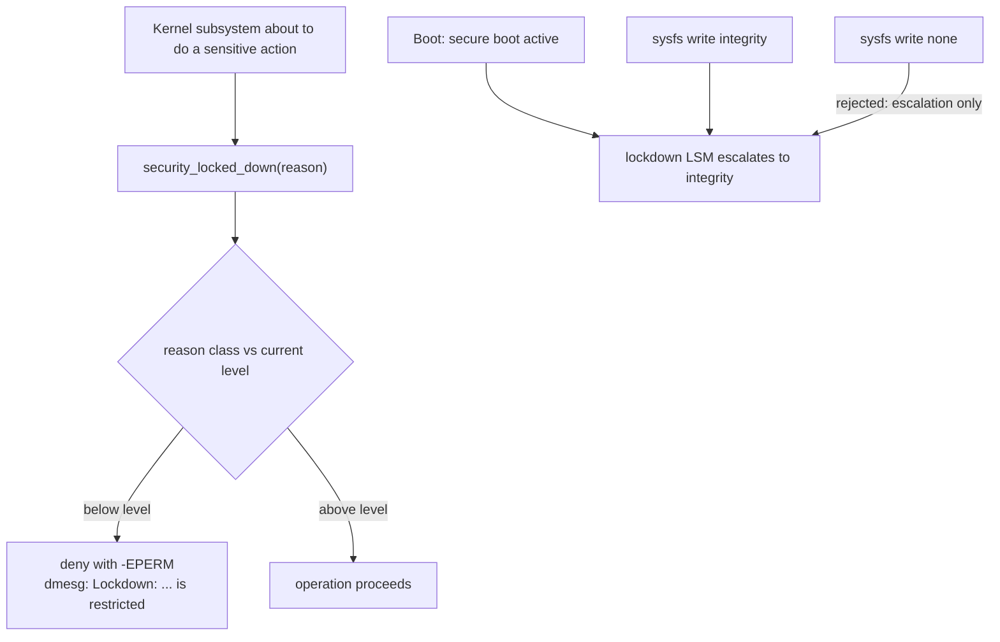
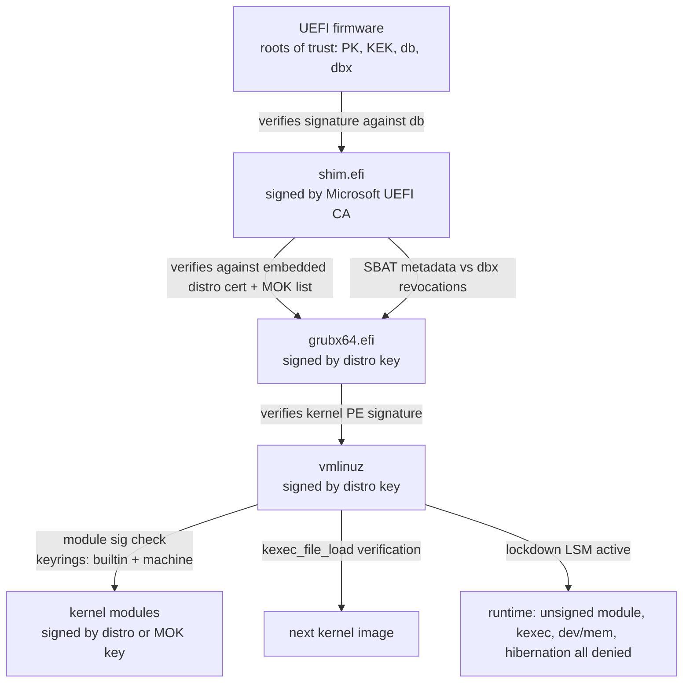

# Kernel Lockdown: The Secure Boot Chain's Runtime Enforcer

## Overview

Kernel lockdown is the point where the UEFI Secure Boot chain of trust stops being a boot-time check and becomes a **runtime** guarantee. The admin-facing view — modes, sysfs, what stops working — is covered in [Kernel Lockdown Mode](../../linux/security/lockdown.md), and the UEFI plumbing (PK/KEK/db/dbx, shim, MOK) in [UEFI Secure Boot](../../linux/security/secure-boot.md). This page covers the mechanics those pages treat as black boxes: how the lockdown LSM hook actually rejects operations, the ordered reason list that splits integrity from confidentiality, where each key in the chain lives and what it can sign, why hibernation is a special threat, and the criticisms and bypass history that shaped the feature. Interviewers at security-conscious shops use this material to test whether you understand privilege boundaries, not just flag names.

## Lockdown as an LSM

Lockdown is implemented as a small Linux Security Module (`security/lockdown/lockdown.c`) that participates in the **LSM stacking** list — it coexists with SELinux/AppArmor rather than competing with them, and can be ordered via `lsm=` on the command line. Its entire enforcement surface is one hook:

```c
/* the whole enforcement model, simplified */
static int lockdown_is_locked_down(enum lockdown_reason reason)
{
    if (reason >= LOCKDOWN_INTEGRITY_MAX && lockdown_level < LOCKDOWN_INTEGRITY_MAX)
        return 0;                       /* integrity class, not yet enabled */
    if (reason >= LOCKDOWN_CONFIDENTIALITY_MAX)
        return 0;                       /* confidentiality class, not yet enabled */
    return -EPERM;                      /* deny */
}
```

The design hinges on the **ordered `enum lockdown_reason`** list (full enumeration in the [kernel lockdown page](../../linux/security/lockdown.md)): reasons are numbered so that all integrity-class reasons sit *below* the `LOCKDOWN_INTEGRITY_MAX` sentinel, confidentiality-class reasons sit between that and `LOCKDOWN_CONFIDENTIALITY_MAX`. A global level (`none` < `integrity` < `confidentiality`) is compared against the per-reason threshold, so "what does mode X block" is literally "which reasons have a threshold ≤ X". Call sites are scattered through the kernel — `kexec`, `/dev/mem`, `kcore`, module loading, MSR access, `perf_event_open`, tracefs, BPF helpers — each invoking `security_locked_down(LOCKDOWN_...)` before the sensitive action. A denial is loud and greppable:

```text
dmesg: Lockdown: insmod: unsigned module loading is restricted
       Lockdown: perf: perf_event_open is restricted  (confidentiality)
       Lockdown: kexec: kexec of unsigned images is restricted
```

Mode selection and one-way escalation:

- `lockdown=integrity|confidentiality` on the kernel command line; `CONFIG_LOCK_DOWN_KERNEL_FORCE_*` bakes it in at build time for appliance-style deployments.
- With UEFI Secure Boot detected at boot, the kernel automatically escalates to **integrity** — this is the distro default path (Fedora/RHEL, Ubuntu, Debian since 11).
- From sysfs (`/sys/kernel/security/lockdown`) the level can only be **raised** at runtime, never lowered — otherwise root, having obtained a foothold, would simply write `none`. De-escalation requires a reboot with changed parameters.



The threat model deserves one precise sentence: lockdown assumes **root is adversarial** — a boundary traditional Unix never had ("root is god" was a design axiom) — while explicitly not defending against physical access, DMA-capable hardware, or kernel memory-corruption exploits, which is the crux of the criticisms section below.

## What Each Mode Blocks, Mechanically

| Reason class | Blocked operation | Integrity | Confidentiality | Why it threatens the chain |
|---|---|---|---|---|
| Unsigned module load (`init_module`/`finit_module`) | yes | yes | arbitrary kernel code = end of all guarantees |
| `kexec_load` (legacy interface) | yes | yes | boots a different kernel with zero verification |
| `kexec_file_load` unsigned image | yes | yes | the verified variant of kexec survives lockdown |
| `/dev/mem`, `/dev/kmem` write | yes | yes | direct kernel text/data patching |
| `/dev/mem`, `/proc/kcore` read | no | yes | kernel memory disclosure (tokens, keys) |
| EFI variable writes via efivarfs | yes | yes | firmware persistence below the OS |
| MSR writes (`/dev/cpu/*/msr`) | yes | yes | MSRs can disable SMAP/SMEP, reprogram TSC |
| raw I/O ports, PCI config space writes | yes | yes | legacy paths into device DMA engines |
| hibernation (`/sys/power/disk`, swsusp) | yes | yes | unsigned resume image = arbitrary kernel code (below) |
| ACPI custom methods, mmio-trace, debugfs write nodes | yes | yes | each is a kernel-memory write primitive |
| BPF: writing kernel memory / loading programs that do | yes | yes | BPF is a kernel code loader in this context |
| BPF: reading kernel memory (`bpf_probe_read_kernel`) | no | yes | disclosure channel |
| `perf_event_open` with kernel sampling | no | yes | kernel pointers/symbols leak; "perfmon" lockdown reason |
| kprobes, tracefs/kprobe events | no (read) | yes | probes read kernel memory and can alter flow |
| `/proc/kallsyms` symbol addresses | kptr_restrict interplay | yes | leak defeats KASLR — see [KASLR/ASLR](../../linux/kernel/memory/aslr.md) |

Two mechanical nuances are worth stating precisely. First, lockdown **refines** rather than replaces existing protections: module signature enforcement (`CONFIG_MODULE_SIG_FORCE` or `module.sig_enforce=1`) already blocks unsigned modules; lockdown additionally blocks *tainted* paths like loading modules built without signatures when enforcement is permissive, and blocks the legacy `kexec_load` even when `kexec_file_load` exists. Second, the confidentiality tier exists for a specific deployment (protected reading of kernel memory) and is rarely enabled by distros — enabling it breaks `perf top`, `bcc`/`bpftrace`, `crash`, and most kernel debugging workflows, which is why the common complaint is "lockdown broke perf/BPF" while the common reality is integrity-only.

### kexec: two interfaces, two verdicts

The kexec treatment shows lockdown's design precision better than any other example, because the kernel has two distinct load interfaces with different security properties:

| Interface | Introduced | Verification | Under lockdown integrity |
|---|---|---|---|
| `kexec_load()` | 2.6.13 | none — user space hands over segments | **denied outright** (`LOCKDOWN_KEXEC`) |
| `kexec_file_load()` | 3.17 | kernel-side PE signature check against kernel keyrings | allowed only if the image verifies |

The legacy interface is a DMA-anywhere primitive: user space supplies raw memory segments that the boot trampoline copies into place, so "kexec into a attacker-built kernel" is just `kexec_load` with hostile segment contents — functionally identical to loading a kernel module, which is why it gets no grace period. `kexec_file_load`, by contrast, performs the same class of verification module loading does (signature against the builtin and machine keyrings), so it slots into the chain of trust instead of bypassing it. The related sysctl `kexec_load_disabled` (see the [sysctl docs](https://docs.kernel.org/admin-guide/sysctl/kernel.html)) offers a weaker, one-way version of the same idea for kernels without lockdown: once set, the legacy interface dies permanently for the boot. Interview shorthand worth using: "lockdown didn't block kexec — it blocked *unverified* kexec and forced the verified interface."

### Module signing: what the check actually does

Since lockdown's module story leans on signature enforcement, the mechanism deserves its own paragraph. A signed module carries a PKCS#7 detached signature appended to the ELF image plus a `~Module signature appended~` marker; at load time the kernel extracts it, verifies the chain to a key in the builtin/machine/secondary keyrings, and only then runs init. Failure behavior depends on policy: `CONFIG_MODULE_SIG_FORCE` (or `module.sig_enforce=1`) rejects unsigned modules outright, permissive mode taints the kernel (`TAINT_UNSIGNED_MODULE`) and loads anyway — and lockdown integrity mode closes exactly that gap by making permissive mode behave like force. Where the verification keys come from is the chain-of-trust section below; the runtime consequence is that a distro kernel under Secure Boot accepts distro-signed and MOK-signed modules and nothing else, and `dmesg` names the reason on every rejection.

### Where IMA and EVM fit

Lockdown is often conflated with the integrity subsystem it coexists with, so the boundary is worth drawing. IMA (Integrity Measurement Architecture) *measures and appraises* files at open/execute time — hash them into a TPM PCR and/or verify signatures against an IMA policy — protecting user-space executables and, with `appraise_type=imasig`, kernel modules, against on-disk tampering. EVM protects the *metadata* (xattrs like labels and hashes) with an HMAC or signature. Lockdown does none of that: it constrains *runtime operations of the kernel itself*, regardless of file provenance. The three compose in a defense-in-depth stack — Secure Boot verifies the kernel that loads, IMA verifies the executables it later runs, lockdown prevents root from hot-patching the running kernel in between — and a deployment that enables only one has a differently-shaped hole, not a smaller threat model.

## The Chain of Trust, End to End

Secure boot verifies firmware → bootloader → kernel. Lockdown is the kernel's promise that the verified state survives contact with root. The full chain, with the keyring each link checks:



Where each key actually lives:

- **UEFI databases** (`PK`, `KEK`, `db`, `dbx`) live in firmware NVRAM. `db` holds allowed signing CAs (Microsoft's UEFI CA signs shim; distro CAs sign grub/kernel); `dbx` holds revocations. Update mechanisms: fwupd capsules and `SBAT` generation bumps (the fine-grained revocation scheme introduced after the 2020 BootHole GRUB vulnerabilities — see the [secure boot page](../../linux/security/secure-boot.md) for the SBAT workflow).
- **shim** carries the distro's signing cert *inside its binary* (itself signed by Microsoft so stock firmware trusts it) and consults **MokList** — the machine-owner key database stored in EFI variables — as an additional trust source.
- **The kernel's keyrings** complete the chain: `.builtin_trusted_keys` (compiled-in distro keys), `.machine` keyring (populated at boot from MokList, on distro kernels that support it), and the secondary trusted keyring. Module signature checks and `kexec_file_load` verification search these keyrings; that is the precise sense in which "your MOK" becomes a runtime kernel trust anchor.

### MOK enrollment: how a user key enters the chain

```bash
# 1. Generate a key pair and enroll the cert (pending state in EFI vars)
openssl req -new -x509 -newkey rsa:2048 -nodes -keyout MOK.priv \
        -outform DER -out MOK.der -days 3650 -subj "/CN=local dev key/"
sudo mokutil --import MOK.der          # sets MokNew + one-time password

# 2. Reboot: shim launches MokManager (blue UI) and, after the password,
#    merges MOK.der into the MokList EFI variable.

# 3. Next boot: kernel imports MokList into the .machine keyring.

# 4. Sign modules against it:
sudo /usr/src/linux-headers-$(uname -r)/scripts/sign-file sha256 \
        MOK.priv MOK.der mydriver.ko
sudo modprobe mydriver                 # passes module sig verification
```

The security-relevant subtlety: MOK enrollment requires **physical presence** (the MokManager prompt happens in firmware context, before the OS runs) and a one-time password set while the OS was still trusted. That bootstraps a boot-time-only trust decision — the mechanism by which DKMS modules, custom kernels, and NVIDIA drivers coexist with Secure Boot without weakening the chain for everyone (it weakens it for that machine, deliberately, by its owner).

### The reason list as a bypass changelog

Read historically, the `lockdown_reason` enum is a curated list of every privilege-escalation primitive the kernel exposed to root, each added after someone demonstrated it or made the argument uncomfortably well:

| Reason | The bypass it closed | Era |
|---|---|---|
| `LOCKDOWN_MODULE_SIGNATURE` | `finit_module` of attacker-built .ko | the original motivation |
| `LOCKDOWN_KEXEC` | `kexec_load` as "module load without a module" | 2014-era proposals |
| `LOCKDOWN_MSR` | `/dev/cpu/*/msr` writes disabling SMAP/SMEP or reprogramming TSC | post-Black Hat 2017 MSR talks |
| `LOCKDOWN_PCI_ACCESS`, `LOCKDOWN_IOPORT` | config-space/PIO writes steering device DMA at kernel memory | classic DMA-attack literature |
| `LOCKDOWN_ACPI_CUSTOM_METHOD` | arbitrary write via ACPI `custom_method` debugfs node | long-standing known hole |
| `LOCKDOWN_BPF_WRITE`/`LOCKDOWN_BPF_READ` | BPF as kernel-memory read/write channel | the 2019 controversy (below) |
| `LOCKDOWN_PERF` | perf kernel sampling as a KASLR-defeating oracle | confidentiality only |

This reading explains both the feature's growth pattern (each new hardware interface that can write kernel memory eventually acquires a reason) and the pushback: several of these paths — MSR, BPF, perf — have *legitimate* non-adversarial users, and every new reason re-litigates the same boundary question. The durable compromise in mainline: integrity mode blocks write-primitives, confidentiality mode blocks read-primitives, and distros ship integrity.

## Hibernation: The Special Case

Hibernation writes a full kernel+memory image to swap (or a dedicated file) and, on resume, the *next* kernel boot restores that image and jumps into it. Under Secure Boot this is a chain-of-trust hole shaped exactly like kexec: nothing at boot time verifies the hiberfile's contents, and the image contains a complete kernel — so an attacker with disk access (evil maid) replaces the image's kernel text with their own, and the firmware's verified bootloader happily restores the attacker's code with all the legitimacy of a verified boot. The image is, functionally, an unsigned kernel module that survived a reboot.

Lockdown integrity mode therefore blocks hibernation outright (`LOCKDOWN_HIBERNATION`), including the userspace `uswsusp` path, because both reduce to "restore and jump". Suspend-to-RAM is unaffected — DRAM contents are not part of the offline-attacker threat model in the same way, though ACPI S3 has its own attack literature. The accepted mitigations if hibernation is required: encrypt the swap/hiberfile (protects confidentiality, not integrity of the restored kernel — the restored kernel itself is still unverifiable), or use measured-boot TPM policies that seal hibernation to PCR state. This is a genuine functional regression that enterprises feel, and the honest answer in an interview is that no widely deployed integrity-preserving hibernation exists in mainline today.

## Deployment Reality and Criticisms

### Who runs what, in practice

Mainstream deployments converge on the same posture, worth knowing before arguing about it: Fedora/RHEL and Ubuntu enable **integrity** automatically under Secure Boot and nothing else; Debian ships the same default since 11; appliances (network gear, kiosks, compliance-scoped fleets) sometimes force integrity or confidentiality at build time via `CONFIG_LOCK_DOWN_KERNEL_FORCE_*`; and confidentiality mode in the wild is nearly nonexistent because it disables the observability tooling those same environments run. The admin-affecting symptoms are therefore narrow and known: DKMS/NVIDIA modules need MOK enrollment, `kexec -l` of an unsigned image needs `kexec_file_load` or a lockdown-free boot, custom ACPI/debugging workflows need a signed debug kernel. Everything else on a stock distro is unchanged, which is precisely why the feature survived its rocky merge.

### The arguments that shaped it

Lockdown was the most argued-about merged feature of 2019, and the objections matter because they define what the feature is *not*:

- **"Root is already game over."** The Unix axiom says uid 0 owning the kernel is not a boundary worth enforcing (the Linus position during the multi-year debate). The counter: modern fleets run untrusted-in-effect root (CI runners, container hosts, tenant admins), where "root" is an escalation away from anyone — lockdown converts "root = arbitrary kernel code" into "root = filesystem and process control", a real demotion.
- **Collateral breakage of observability.** Confidentiality mode's BPF-read and perf restrictions broke `bcc`/`bpftrace`/`perf` workflows on distro kernels, producing years of "why does my tool fail with Lockdown" tickets. BPF maintainers formally objected to reading restrictions; the compromise is that integrity mode (the default) keeps read-path tools working.
- **The physical-access argument.** With hardware access, you reflash firmware, enroll your own PK, or DMA — lockdown defends none of these. Proponents answer that lockdown targets the *remote* attacker who reaches root, for whom "just flash the SPI chip" is not available.

### Bypass history

| Attack class | Does lockdown stop it? | Actual mitigation |
|---|---|---|
| Root loads unsigned module | yes (integrity) | module sig force + lockdown |
| Root reads kernel memory via BPF/perf | confidentiality only | rarely enabled; kptr_restrict, dmesg_restrict |
| Kernel memory-corruption exploit | no | KASLR, KPTI, hardening — see [KPTI](../advanced/kpti.md) |
| Evil-maid hiberfile tamper | yes (by blocking hibernation) | encryption/measured boot alternatives |
| Firmware/GRUB exploit (BootHole class) | no — upstream of lockdown | SBAT/dbx revocations, firmware updates |
| DMA from untrusted devices | no | IOMMU, Thunderbolt security levels |
| Owner who controls the machine | by definition no | MOK enrollment is the sanctioned path |

## Interview Questions

1. **"How does the lockdown LSM decide to deny an operation?"** Every sensitive path calls `security_locked_down(reason)` with a value from the ordered `lockdown_reason` enum; integrity-class reasons sit below the `LOCKDOWN_INTEGRITY_MAX` sentinel and confidentiality-class reasons below `LOCKDOWN_CONFIDENTIALITY_MAX`. The hook compares the reason's class against the global level (none/integrity/confidentiality) and returns `EPERM` if the class is active, logging "Lockdown: `<comm>`: `<operation>` is restricted". It is a stacked LSM, so it composes with SELinux/AppArmor rather than replacing them, and the level is one-way at runtime.
2. **"Why does enabling Secure Boot turn on lockdown, and what does that actually guarantee?"** Secure boot verifies the boot chain up to the kernel image, after which the traditional kernel would let root load code and erase the guarantee. Lockdown extends the verified state through runtime by denying root the classic kernel-code paths: unsigned modules, legacy kexec, `/dev/mem` writes, MSR games, hibernation. The guarantee is "the kernel running is the one that booted" — not "the kernel is bug-free", which is the distinction people miss.
3. **"How does a self-signed module get to run on a Secure Boot system?"** Through MOK: generate a key pair, `mokutil --import` the certificate (pending state in EFI variables), reboot into shim's MokManager and confirm with the one-time password — a physical-presence, boot-time-only decision — after which the kernel imports the key into the `.machine` keyring and modules signed with the private key pass verification. This is the sanctioned per-machine weakening of the chain: the owner, not the distro, vouches for the module.
4. **"Why is hibernation blocked under lockdown when suspend-to-RAM isn't?"** A hibernation image contains an entire kernel that the next boot restores and jumps into, and nothing in the verified boot chain signs or measures it — so it is functionally an unsigned kernel payload that disk-level attackers can tamper with (swap the image's kernel text, get arbitrary code with a legitimate boot). Suspend-to-RAM keeps state in DRAM within the running machine and never re-enters the boot chain. Lockdown chooses "no hibernation" over "unverifiable resume", which is why encrypted swap is a partial (confidentiality-only) workaround.
5. **"Secure Boot, shim, MOK, SBAT — how do they fit together, and what did BootHole change?"** Firmware verifies shim against `db`; shim verifies grub/kernel against its embedded distro cert plus MokList; `dbx` revokes signatures and hashes. BootHole (2020) showed the verified chain itself was exploitable via a GRUB parsing bug, and wholesale certificate revocation would have bricked fleets, so SBAT was introduced: components carry generation metadata and `dbx`/shim policy rejects below-threshold generations — fine-grained revocation of bootloader software rather than of keys.
6. **"What are lockdown's honest limits?"** It does not defend against kernel memory-corruption exploits, physical access, DMA-capable devices without an IOMMU, firmware or bootloader exploits upstream of the kernel, or the machine's owner (who can enroll a MOK or disable Secure Boot in firmware setup). It also taxes observability: confidentiality mode breaks perf kernel sampling and kernel-memory-reading BPF, which is why distros ship integrity-only. Its value is demoting root from "arbitrary kernel code" to "process and filesystem control" on machines whose users are effectively remote attackers.

## Key Takeaways

- Lockdown is a one-hook LSM: `security_locked_down(reason)` against an ordered reason enum whose `INTEGRITY_MAX`/`CONFIDENTIALITY_MAX` sentinels define the two mode classes.
- The level is set at boot (`lockdown=`, auto-integrity under Secure Boot, `CONFIG_LOCK_DOWN_KERNEL_FORCE_*`) and is **escalation-only** at runtime — de-escalation requires reboot by design.
- Integrity blocks kernel-code paths (unsigned modules, legacy `kexec_load`, `/dev/mem` writes, MSRs, EFI var writes, hibernation); confidentiality additionally blocks kernel-memory reads (kcore, BPF read helpers, perf kernel sampling, kprobes).
- The chain of trust: firmware db/dbx → shim (Microsoft-signed, carries distro cert) → grub → kernel → module keyrings (`builtin` + `machine`); lockdown is the runtime continuation of that chain.
- MOK enrollment is a physical-presence, boot-time trust decision that lands in the kernel's `.machine` keyring — the sanctioned path for custom modules under Secure Boot.
- Hibernation is blocked because an unverified resume image is functionally unsigned kernel code; suspend-to-RAM stays legal.
- BootHole (2020) forced SBAT generation-based revocation of boot components — signature checks alone were insufficient for the chain's own software.
- Honest threat model: root-demotion against remote attackers; no defense against kernel bugs, DMA, firmware exploits, or the physical owner.

## References

- [Kernel parameters documentation](https://docs.kernel.org/admin-guide/kernel-parameters.html) — the `lockdown=`, `module.sig_enforce`, and related boot parameters.
- [Module signing — kernel documentation](https://docs.kernel.org/admin-guide/module-signing.html) — keyrings, `sign-file`, and verification semantics that lockdown strengthens.
- [EFI stub — kernel documentation](https://docs.kernel.org/admin-guide/efi-stub.html) — the firmware-to-kernel handoff under which secure boot state is detected.
- [Kernel sysctl documentation](https://docs.kernel.org/admin-guide/sysctl/kernel.html) — `kexec_load_disabled` and related restrictions that interact with lockdown.
- [shim bootloader source](https://github.com/rhboot/shim) — MokList/MokManager implementation and SBAT metadata in the boot chain.
- Garrett, M. — *Kernel lockdown mode* patch series and design discussion (2018–2019, LWN-covered) — cite by title; the design-debate record for the "root is god" objections.
- Eclypsium Research — *There's a Hole in the Boot* (BootHole, CVE-2020-10713, 2020) — cite by title; the GRUB vulnerability behind SBAT adoption.

## Cross-References

- [Kernel Lockdown Mode](../../linux/security/lockdown.md) — the administrator view: modes, sysfs, affected interfaces, and config checklists.
- [UEFI Secure Boot](../../linux/security/secure-boot.md) — PK/KEK/db/dbx mechanics, shim and MOK workflows, SBAT and measured boot.
- [BIOS and UEFI](../boot/bios-uefi.md) — where the firmware roots of trust physically live.
- [Bootloader](../boot/bootloader.md) — the boot stages lockdown sits downstream of.
- [Kernel Modules](../kernel/modules.md) — module loading and the signature verification lockdown enforces.
- [kexec](../../linux/embedded/kexec.md) — the reboot mechanism split into locked-down `kexec_load` vs verified `kexec_file_load`.
