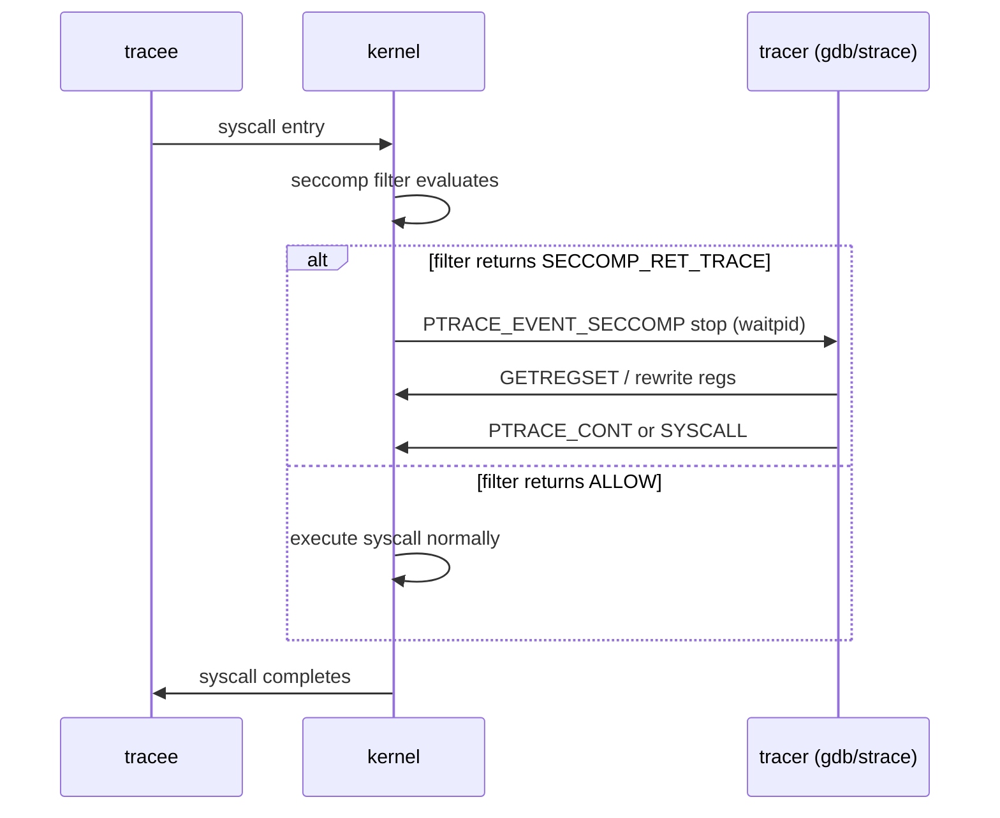

# ptrace Internals

## Overview

`ptrace(2)` is the mechanism behind `gdb`, `strace`, `ltrace`, CRIU, and a decade of anti-debug tricks — one syscall that lets one process observe and control another's execution, registers, memory, and signals. This page covers how ptrace actually works inside the kernel: the stop states the tracee passes through, the `PTRACE_SYSCALL`/`PTRACE_GETREGSET` loops that real debuggers run, how seccomp's `SECCOMP_RET_TRACE` changes the economics of syscall tracing, what happens when a tracer dies, and why Yama exists. For the user-facing tooling, see [strace and ltrace](../../linux/debugging/strace-ltrace.md); for the security policy that gates attachment, see [Yama](../../linux/security/yama.md).

## The Tracer/Tracee Model

A traced process becomes a **tracee** of its **tracer**, and the relationship rewires process semantics: the tracer becomes the tracee's real parent for signal-reporting purposes, `wait()` on the tracee returns stop and signal events instead of the tracee handling them itself, and every continuation is an explicit ptrace request. Entry paths:

- `PTRACE_TRACEME` — the classic: the *child* requests tracing by its (already-awaited) parent; used by `strace cmd`, where strace forks, the child calls `TRACEME` + `execve`, and the exec delivers an `exec` stop to the tracer.
- `PTRACE_ATTACH` / `PTRACE_SEIZE` — attach to a running process by PID. `ATTACH` sends the tracee a `SIGSTOP` and is the legacy interface; `SEIZE` (Linux 3.4+) attaches *without* stopping the tracee, supports `PTRACE_INTERRUPT` for clean stop-on-demand, and `PTRACE_LISTEN` for a tracee that sits in group-stop without being resumed — the modern, race-free pair that `gdb` and CRIU use.
- Permission check at attach: same-UID or `CAP_SYS_PTRACE`, a non-setuid dumpable target (`dumpable` is cleared on credential change, so ptrace of a suid child fails), and the Yama policy (`ptrace_scope`) on top; a failing check returns `EPERM`.

```c
/* attach by seize and interrupt cleanly */
long rc = ptrace(PTRACE_SEIZE, pid, 0,
                 PTRACE_O_TRACESYSGOOD | PTRACE_O_TRACEFORK |
                 PTRACE_O_TRACEEXEC | PTRACE_O_TRACECLONE);
if (rc == 0)
    ptrace(PTRACE_INTERRUPT, pid, 0, 0);
```

The "tracer is the wait-looper" point is the one interviewers probe: ptrace is not push-based. The tracer sits in `waitpid(pid, &status, __WALL)`, the kernel reports events as wait statuses (stops carry `SIGTRAP`-family codes and ptrace-event bits in the high byte), and until the tracer issues a resume request the tracee stays stopped. A debugger's event loop is exactly this: `waitpid` → decode status → `PTRACE_GETREGS`/`PEEK`/breakpoint edits → `PTRACE_CONT`/`SYSCALL`/`SINGLESTEP`.

### The request taxonomy

The ptrace request space is bigger than the five requests people remember, and knowing the shape of it signals depth:

| Request group | Members | Purpose |
|---|---|---|
| Attach/detach | `TRACEME`, `ATTACH`, `SEIZE`, `DETACH`, `INTERRUPT` | establish and tear down the relationship cleanly |
| Continue/step | `CONT`, `SYSCALL`, `SINGLESTEP`, `SYSEMU`, `LISTEN` | resume with optional tracing mode (SYSEMU emulates syscalls without executing them — UML's trick) |
| Registers | `GETREGS`/`SETREGS` (legacy), `GETREGSET`/`SETREGSET` (portable, via `NT_*` regsets) | read/rewrite the syscall number, arguments, return value, IP |
| Memory | `PEEKTEXT`/`PEEKDATA`/`POKEDATA` (word-at-a-time, legacy) | breakpoints, code patches; superseded by `process_vm_readv` for bulk |
| Options/events | `SETOPTIONS`, `GETEVENTMSG`, `GETSIGINFO` | enable `PTRACE_O_*` event reporting and fetch payloads |
| Misc | `PEEKUSER`/`POKEUSER` (offsets into `user` struct incl. debug regs), `KILL` (deprecated) | hardware watchpoints (`DR0–DR7` on x86) |

One cross-cutting subtlety: every request targets a **thread** (TID), not a process — a multi-threaded tracee is a set of independently attachable tracees, and `PTRACE_O_TRACECLONE` exists so a debugger auto-attaches newborn threads before they run. Tooling that attaches to the group leader and forgets the rest produces exactly the "it works single-threaded" bug reports that fill debugger issue trackers.

## Stop States

Tracees can be in several distinct stop kinds, and confusing them is the source of most ptrace bugs:

| Stop kind | Entered by | Reported as | Resumed by |
|---|---|---|---|
| Signal-delivery-stop | tracee receives a signal while traced | `W.STOPSIG = sig` | `PTRACE_CONT`/`SYSCALL` with or without injecting the signal |
| Group-stop | `SIGSTOP`/`SIGTSTP`/job-control stops | `W.STOPSIG = SIGSTOP` (plus group-stop bit) | `PTRACE_LISTEN` (stay stopped, re-attachable) or resume request |
| Syscall-stop | `PTRACE_SYSCALL`/`PTRACE_SYSEMU` boundary | `SIGTRAP | 0x80` with `TRACESYSGOOD` | next `PTRACE_SYSCALL` |
| `PTRACE_EVENT_*` stop | option-gated events: `FORK`, `VFORK`, `EXEC`, `CLONE`, `EXIT`, `SECCOMP`, `EXIT_SIGNAL`... | `SIGTRAP` with event code in `status>>8` | resume request; `PTRACE_GETEVENTMSG` fetches the payload (new child pid, seccomp data) |

The subtle pieces worth knowing:

- **Group-stop vs signal-delivery-stop ordering**: a `SIGSTOP` arriving at a traced process is reported twice conceptually — first as group-stop, then as signal-delivery-stop for the same signal on resume. Old code that treats any stop as "SIGSTOP happened" corrupts job control; this is the bug class `PTRACE_SEIZE`+`LISTEN` was designed to end.
- **Syscall restart transparency**: if a tracer interrupts a syscall (`EINTR`-style) and re-injects the signal, the kernel may restart the syscall; the tracee's `orig_rax`/restart-block handling is invisible to a naive tracer, which is why correct tracers distinguish syscall-entry from syscall-exit stops and avoid injecting signals at entry.
- **`PTRACE_EVENT_EXIT`** gives a debugger a last look before death; **`PTRACE_O_EXITKILL`** (below) covers the inverse problem — what happens to the tracee when the *tracer* dies.

### Event stops in practice: following children

The `PTRACE_EVENT_*` machinery is how one tracer multiplexes a process tree, and the idiom is worth memorizing because every tracer (strace `-f`, gdb `set follow-fork-mode`, CRIU) is built on it:

```c
ptrace(PTRACE_SETOPTIONS, pid, 0,
       PTRACE_O_TRACEFORK | PTRACE_O_TRACEVFORK | PTRACE_O_TRACECLONE |
       PTRACE_O_TRACEEXEC | PTRACE_O_TRACEEXIT);

/* on each stop, check the event code: */
if (status >> 8 == (SIGTRAP | PTRACE_EVENT_FORK << 8)) {
    unsigned long newpid;
    ptrace(PTRACE_GETEVENTMSG, pid, 0, &newpid);
    /* the child is stopped before returning from fork():
       attach it (auto-done by the option) and trace both. */
}
```

The kernel guarantees the newborn is stopped at its very first instruction (before `fork()` even returns), which closes the classic race where a traced child executes unobserved. `TRACEEXEC` similarly stops the tracee after the new image is loaded but before it runs — the point where `gdb` reloads symbols and re-applies breakpoints. Without these options, tracers must poll `/proc` and chase new PIDs, losing every instruction in between; the options exist precisely because ptrace's value is *total* observability.

### Signal injection semantics

Resuming a tracee from signal-delivery-stop passes a signal number as the resume request's data argument: `PTRACE_CONT(pid, 0, sig)` delivers `sig` to the tracee after resuming, while `sig = 0` swallows it. That single parameter is the entire signal-debugging interface — gdb's `handle SIGPIPE nostop noprint pass` translates into whether the tracer resumes with or without the signal. The same channel delivers *injected* signals the tracee never received, which is how debuggers synthesize `SIGSTOP`-like breaks, and the order of operations (stop first, then choose) is what prevents the tracee from racing the tracer's decision. Syscall-stops take no signal argument; passing one is an error, another detail that separates correct tracers from demo code.

## The Syscall-Tracing Loop

`strace`'s core loop is two stops per syscall, with register reads through `PTRACE_GETREGSET` (the modern, arch-portable interface over `NT_PRSTATUS`; `PTRACE_GETREGS` is the legacy per-arch form):

```c
/* minimal strace: entry and exit stops per syscall */
ptrace(PTRACE_SETOPTIONS, pid, 0, PTRACE_O_TRACESYSGOOD);
for (;;) {
    int status;
    waitpid(pid, &status, __WALL);
    if (WIFEXITED(status)) break;
    if (WIFSTOPPED(status) && (WSTOPSIG(status) == (SIGTRAP | 0x80))) {
        struct user_regs_struct r;
        struct iovec iov = { &r, sizeof(r) };
        ptrace(PTRACE_GETREGSET, pid, NT_PRSTATUS, &iov);
        /* x86-64: rax = syscall nr on entry, rax = return on exit;
           orig_rax distinguishes entry from exit */
        fprintf(stderr, "syscall %lld (args %llx %llx %llx)\n",
                r.orig_rax, r.rdi, r.rsi, r.rdx);
    }
    ptrace(PTRACE_SYSCALL, pid, 0, 0);   /* run to next syscall boundary */
}
```

Every `PTRACE_SYSCALL` continuation runs the tracee until the next syscall entry or exit, where it stops again. On x86-64 the syscall number lives in `orig_rax` at entry, arguments in `rdi/rsi/rdx/r10/r8/r9`, and a tracer may **rewrite** the number, arguments, or — at exit — the return value via `PTRACE_SETREGSET`, which is how syscall interposition tools (and sandboxes) implement policy. The cost structure: each stop is a wakeup, a context switch into the tracer, its `waitpid` return, register reads, and a resume — roughly 5–20 µs per stop pair in practice, which is why a syscall-dense loop (e.g. `read`/`write` at 100k+/s) slows by 10–100x under `strace`.

### seccomp + ptrace: SECCOMP_RET_TRACE

The economics improve when a seccomp filter does the syscall filtering *inside* the kernel and only the interesting calls reach the tracer. A filter returning `SECCOMP_RET_TRACE` (with a tracer attached and `PTRACE_O_TRACESECCOMP` set) stops the tracee at syscall entry with a `PTRACE_EVENT_SECCOMP` stop; the filter's returned data arrives via `PTRACE_GETEVENTMSG`, and the tracer may rewrite registers as above or let the syscall proceed. `strace --seccomp-bpf` (4.15+) installs exactly this: a BPF program that returns `TRACE` for syscalls in the `-e trace=` set and `ALLOW` for the rest, eliminating 90%+ of stop pairs in syscall-heavy workloads. The sibling mechanism without any tracer — `SECCOMP_RET_USER_NOTIF`, where a supervisor process reads a notification fd — is the modern container case; see [seccomp internals](../advanced/seccomp-bpf.md) and [seccomp-notify](../../linux/containers/seccomp-notify.md).



## Debugger Architecture: How gdb and strace Really Work

- **gdb** = ptrace event loop + ELF/DWARF knowledge + a remote-serial-protocol layer. Breakpoints are kernel-mediated: gdb saves the byte at the target address and writes `0xCC` (`int3`); on execution the CPU faults, the kernel delivers a `SIGTRAP` stop, gdb restores the byte, rewinds RIP by one, and reports. Single-stepping is `PTRACE_SINGLESTEP` (per-instruction trap flag), watchpoints use the debug registers `DR0–DR3`/`DR7` via `PTRACE_POKEUSER`, and following children uses the `TRACEFORK`/`TRACECLONE`/`TRACEEXEC` events so the debugger auto-attaches descendants. Reading large memory regions goes through `/proc/pid/mem` or `process_vm_readv` — not the byte-at-a-time `PTRACE_PEEKDATA`.
- **strace** = the `PTRACE_SYSCALL` loop above, plus decode tables per arch/ABI, plus the seccomp-bpf accelerator. `-f` multiplexes the loop over the whole process tree using the fork/clone events.
- **ltrace** = breakpoint-on-PLT: ptrace writes `int3` at PLT/library call sites, so it traces library-level calls; same primitive, different target.
- **CRIU** uses ptrace to freeze the process tree into a quiescent state before dumping — the checkpoint side is a generalized "stop everything, harvest state" application of the same stop machinery; see [CRIU](../advanced/criu-checkpoint-restore.md).
- **The zero-stop alternative**: uprobes/kprobes and eBPF observe execution *without* stops (int3 + in-kernel handler, or perf events), which is why production tracing has largely moved to [tracing infrastructure](../kernel-advanced/tracing-probes.md) and ptrace remains the tool for *control* (modify registers, single-step, inject signals), not bulk observation.

## Tracer Death, Detach, and PTRACE_O_EXITKILL

When the tracer exits, every tracee is automatically detached: pending stops are resolved, the kernel reverts the parentage bookkeeping, and tracees resume in `SIGSTOP`-ed state (a group-stop) so that a debugger crash does not leave children running wild — the classic behavior `gdb` relies on. Two option-level refinements matter:

- `PTRACE_O_EXITKILL` (Linux 3.8): when the tracer dies, **SIGKILL** the tracees instead of stopping them. Built for sandboxes and job runners ("if my supervisor dies, kill my workload"), and the reason a `strace -f` process tree can be guaranteed to die with it.
- Explicit `PTRACE_DETACH` resumes the tracee normally; `PTRACE_KILL` is a deprecated half-broken relic that modern code ignores.

Orphaned-tracer semantics also define the classic anti-debug pattern: a process `TRACEME`s itself (so no other debugger can attach), then its parent exits — the self-traced process dies or misbehaves. Legitimate uses of the same semantics: single-shot self-checks in license/anti-tamper code, and test harnesses that must never be debugged.

## Yama, ptrace_scope, and the Security Cost

Classic ptrace lets any same-UID process attach to any other — which turns every compromised process into a credential harvester (`/proc/*/mem` via ptrace, SSH-agent key extraction, browser session theft). Yama's `kernel.yama.ptrace_scope` (see [Yama](../../linux/security/yama.md)) layers a relationship requirement on top:

| ptrace_scope | Rule |
|---|---|
| 0 | classic: any same-UID attach |
| 1 (distro default) | only an *ancestor* may attach (`PR_SET_PTRACER` can grant exceptions) |
| 2 | `CAP_SYS_PTRACE` required |
| 3 | no attach at all, system-wide |

Under ptrace_scope=1, debuggers work because the shell (ancestor) is the tracer's parent — `gdb ./prog` works, `gdb -p <unrelated>` needs `PR_SET_PTRACER` or capabilities. Container platforms lean on scope 1 + dropped `CAP_SYS_PTRACE` so one pod cannot debug another; `kubectl debug` and similar tools explicitly re-grant what they need. The remaining superpower worth naming: `CAP_SYS_PTRACE` plus `/proc/pid/mem` bypasses most of this — which is why the capability is treated as near-root in hardening guides (see [capabilities](../security/capabilities.md)).

## Performance Cost and Modern Alternatives

### Common failure modes worth knowing

Production ptrace code trips over a small, well-known set of errors, and naming them reads as experience in interviews:

- **`ESRCH` on attach/continue** — the tracee died or was never stopped; the tracer must treat `waitpid` results as the only truth about liveness, not the return codes of stale requests.
- **Attach races with `execve`** — `PTRACE_ATTACH` on a running process can lose the race against an exec that changes credentials (the attach legitimately fails for suid targets); `SEIZE` plus `PTRACE_O_TRACEEXEC` from a known-stopped state avoids the window.
- **Thread leaks** — attaching to the group leader without `TRACECLONE` leaves threads untraced; conversely, forgetting to detach every TID leaves zombie-stopped threads after "detach" appears to succeed.
- **Restart blocks** — tracers that rewrite registers after a `EINTR`-interrupted syscall can break restart semantics (`ERESTARTSYS`-class returns); correct tracers either let the kernel restart or replicate the restart logic exactly.

### ptrace, pidfd, and containers

Modern process-management primitives interlock with ptrace in ways worth a sentence each. `pidfd_open` (see [pidfd_open(2)](https://man7.org/linux/man-pages/man2/pidfd_open.2.html)) gives tracers a race-free handle so a PID reuse cannot redirect a `PTRACE_DETACH` or `kill` at an innocent process — supervisor code that used `pid + SIGKILL` for cleanup now holds a pidfd. `pidfd_getfd` lets a supervisor steal file descriptors from a tracee without `/proc` games. In containers, the default hardening (Yama scope 1, dropped `CAP_SYS_PTRACE`) is precisely what makes cross-pod debugging impossible, and tooling like `kubectl debug` works by *joining* the target's namespaces in a new privileged container rather than by ptrace from outside — an architectural acknowledgment that relationship-based ptrace policy is working as intended. The remaining frontier is `SECCOMP_RET_USER_NOTIF` supervisors, which handle syscall mediation without stops entirely; ptrace keeps the cases where state must be frozen — checkpoints, core-dump generators, single-steppers.

| Mechanism | Cost profile | Stops tracee? | Can modify execution? | Typical use |
|---|---|---|---|---|
| `PTRACE_PEEKDATA`/`POKEDATA` | one syscall per word | no (but slow) | yes (memory) | legacy; avoid |
| `PTRACE_GETREGSET`/`SETREGSET` | syscall + iovec copy | needs stop | yes (registers) | debuggers |
| `process_vm_readv`/`writev` | iovec-batched, no stops | no | no | bulk memory inspection (gdb, cheats, introspection) |
| `/proc/pid/mem` seek+read | fd-based bulk, no stops | no | write path (with ptrace-style perms) | fast dumps |
| uprobes/eBPF, perf | near-zero overhead, in-kernel | no | no | production observability |
| seccomp `USER_NOTIF` | fd round-trip per intercepted call | no stop of peers | decide-and-inject (bounded) | containers, sandboxes |

Numbers to carry: a ptrace stop pair costs a context switch each way — single-digit to low-tens of microseconds including tracer wakeup; `strace` on a syscall-dense loop is 10–100x slower than the untraced run; `process_vm_readv` reads megabytes without any of it (one syscall per iovec batch) and is why modern debuggers fetch memory that way, keeping ptrace stops for breakpoints and stepping only. For pure observation at scale, [eBPF](../kernel-advanced/ebpf-deep.md) has replaced ptrace in production tracing; ptrace retains the capabilities the others cannot do: change registers, single-step, hijack syscalls, and inject signals — the definition of *control* versus *observation*.

## Interview Questions

1. **"Walk me through what happens when strace attaches to a running process."** With `PTRACE_SEIZE` (or legacy `ATTACH`+`SIGSTOP`), the kernel marks the target a tracee after permission checks (same-UID, dumpable, Yama scope). The tracer then loops on `waitpid`; each `PTRACE_SYSCALL` continuation runs the tracee to the next syscall entry or exit, reported as `SIGTRAP|0x80`. At each stop the tracer reads registers via `PTRACE_GETREGSET`, prints the decoded call, and resumes. That is two context-switch stops per syscall — the reason strace slows syscall-dense workloads 10–100x — and `--seccomp-bpf` removes most stops by letting a BPF filter decide which syscalls are worth stopping for.
2. **"What is the difference between group-stop, signal-delivery-stop, and a syscall-stop?"** A group-stop is a job-control stop (`SIGSTOP`/`SIGTSTP`) where the whole thread group halts — resume with `PTRACE_LISTEN` keeps it stopped but responsive. A signal-delivery-stop is the tracer being offered an ordinary signal for disposition/injection. A syscall-stop is the synthetic `SIGTRAP|0x80` at a `PTRACE_SYSCALL` boundary. Confusing the first two corrupts job control in traced children — the historical bug class that motivated `PTRACE_SEIZE`.
3. **"How does seccomp interact with ptrace?"** A filter action of `SECCOMP_RET_TRACE` stops the tracee at syscall entry and reports a `PTRACE_EVENT_SECCOMP` stop to a tracer with `PTRACE_O_TRACESECCOMP`; `PTRACE_GETEVENTMSG` returns the filter-supplied data, and the tracer can rewrite the syscall number or arguments before resuming, or skip the call by rewriting the return. This makes selective tracing cheap: the kernel filters at entry, only interesting calls pay the stop cost. `SECCOMP_RET_USER_NOTIF` is the tracer-less sibling for sandbox supervisors.
4. **"What happens when a debugger dies — and what does PTRACE_O_EXITKILL change?"** The kernel auto-detaches all tracees of a dead tracer: stops are resolved and tracees resume in a stopped state so nothing runs unsupervised. With `PTRACE_O_EXITKILL`, tracees are SIGKILLed instead — the supervisor semantics sandboxes want ("if the watchdog dies, the workload dies with it"). Explicit `PTRACE_DETACH` is the clean manual path.
5. **"Why is Yama's ptrace_scope=1 the distro default, and what still works?"** Because classic ptrace lets any same-UID process become a debugger of any other — a compromised process can harvest credentials from every agent and browser it can attach to. Scope 1 restricts attach to ancestors (with `PR_SET_PTRACER` opt-ins), so `gdb ./a.out` and `strace cmd` still work — the tracer is a process ancestor — while `gdb -p` on unrelated processes needs capabilities. Scope 2 requires `CAP_SYS_PTRACE`, scope 3 disables attach entirely; hardening guides treat `CAP_SYS_PTRACE` as near-root because `/proc/pid/mem` under it bypasses the relationship requirement.
6. **"When would you still use ptrace instead of eBPF or process_vm_readv?"** Whenever you need control, not observation: setting breakpoints and single-stepping (register writes, `int3` injection), rewriting syscalls (sandboxing, fault injection), injecting signals, or freezing a process tree exactly (CRIU). `process_vm_readv` reads memory faster and without stops but cannot change execution; eBPF observes with near-zero overhead but cannot stop, step, or modify the target. gdb itself mixes all three: ptrace for stops/registers, `process_vm_readv` for memory,uprobes-style thinking for scale.

## Key Takeaways

- ptrace is a wait-driven protocol: the tracer loops on `waitpid`, every event is a stop, every resume is an explicit request — there is no push channel.
- Tracee states: signal-delivery-stop, group-stop, syscall-stop (`SIGTRAP|0x80`), and `PTRACE_EVENT_*` stops (`FORK`/`EXEC`/`EXIT`/`SECCOMP`); `PTRACE_SEIZE`+`LISTEN` fixed the legacy job-control races.
- One syscall trace = two stops (entry+exit) ≈ 5–20 µs; syscall-dense loops slow 10–100x under strace; `--seccomp-bpf` and `SECCOMP_RET_TRACE` push filtering into the kernel.
- `PTRACE_GETREGSET` over `NT_PRSTATUS` is the portable register interface; `orig_rax` vs `rax` distinguishes entry from exit on x86-64; tracers may rewrite numbers, args, and returns.
- Tracer death auto-detaches; `PTRACE_O_EXITKILL` converts that into SIGKILL for supervisor semantics.
- Yama `ptrace_scope` 0–3 turns "any same-UID attach" into ancestor-only/capability/no-attach; `CAP_SYS_PTRACE` remains the near-root escape hatch.
- Modern stack: `process_vm_readv`/`/proc/pid/mem` for bulk memory, eBPF/uprobes for observation, ptrace only where control is required.

## References

- [ptrace(2) — Linux manual page](https://man7.org/linux/man-pages/man2/ptrace.2.html) — the definitive request list, stop-state taxonomy, and the "tracer must wait" contract.
- [seccomp filter documentation](https://docs.kernel.org/userspace-api/seccomp_filter.html) — `SECCOMP_RET_TRACE` semantics and the ptrace option interaction.
- [Yama — kernel documentation](https://docs.kernel.org/admin-guide/LSM/Yama.html) — `ptrace_scope` rationale and `PR_SET_PTRACER` exception protocol.
- [process_vm_readv(2)](https://man7.org/linux/man-pages/man2/process_vm_readv.2.html) — the no-stop, iovec-batched memory access alternative.
- [pidfd_open(2)](https://man7.org/linux/man-pages/man2/pidfd_open.2.html) — pidfd handles for race-free process management alongside ptrace-based tooling.

## Cross-References

- [strace and ltrace](../../linux/debugging/strace-ltrace.md) — the user-facing tools built on the loops explained here.
- [Yama LSM](../../linux/security/yama.md) — the attachment policy layer (`ptrace_scope`, `PR_SET_PTRACER`) in depth.
- [Seccomp BPF](../advanced/seccomp-bpf.md) — filter actions and the `SECCOMP_RET_TRACE`/`USER_NOTIF` interplay.
- [Seccomp Notify](../../linux/containers/seccomp-notify.md) — the fd-based supervisor pattern replacing tracer-based interposition.
- [Process States](../processes/states.md) — where tracee stops fit in the process state machine.
- [CRIU Checkpoint/Restore](../advanced/criu-checkpoint-restore.md) — ptrace used to freeze and dump whole process trees.
