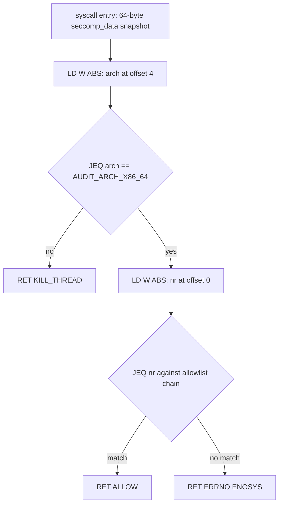
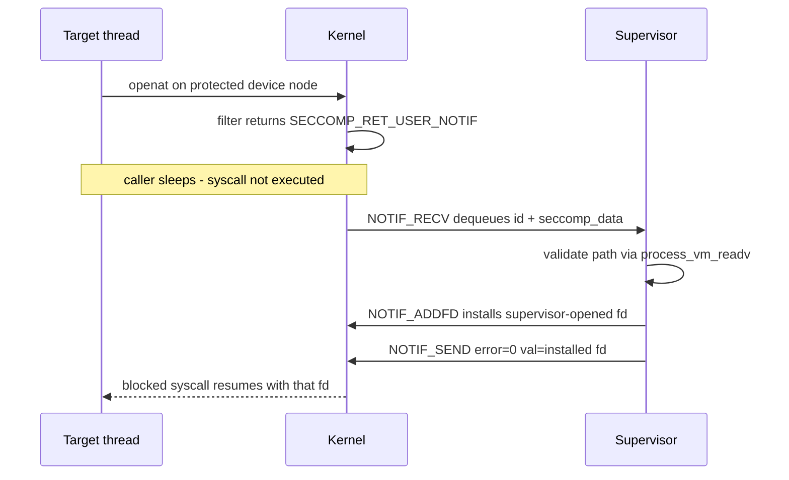

# seccomp Internals: Filter Anatomy, Action Semantics, and the User-Notify Supervisor

## Overview

seccomp-BPF is the kernel's per-thread syscall firewall: a classic-BPF program, validated once
at load, executes on every syscall entry and returns a verdict — allow, deny with an errno,
trap, kill, or hand the decision to a user-space supervisor. This page covers the machinery
underneath the concept: the `sock_filter` instruction format and its jump-target arithmetic,
what each `SECCOMP_RET_*` action actually does to the caller, the TSYNC/thread model, and the
`SECCOMP_USER_NOTIF` supervisor protocol with `ADDFD`. It is the internals companion to the
overview in [../advanced/seccomp-bpf.md](../advanced/seccomp-bpf.md), which covers
strict-vs-filter mode, `seccomp_data`, and a worked cBPF mini-VM.

> **Interview one-liner:** "A seccomp filter is a loop-free cBPF program whose jump targets are unsigned 8-bit forward offsets — cycles are unrepresentable, so load-time validation is cheap and per-syscall cost is a handful of instructions."

## Filter Program Anatomy: sock_filter, Opcodes, and JTAs

A seccomp filter is an array of `struct sock_filter { __u16 code; __u8 jt; __u8 jf; __u32 k; }`
— 8 bytes per instruction, the classic BPF (cBPF) format, not eBPF. `BPF_LD | BPF_W | BPF_ABS`
(opcode `0x20`) loads the 32-bit word at offset `k` of the 64-byte `seccomp_data` snapshot into
the accumulator; `BPF_JMP | BPF_JEQ | BPF_K` (`0x15`) compares the accumulator to `k` and sets
`pc += 1 + jt` on equality, `pc += 1 + jf` otherwise; `BPF_RET | BPF_K` (`0x06`) terminates with
a `SECCOMP_RET_*` value. The "JTA" (jump-target address) is that `jt`/`jf` pair: a **relative
forward skip**, not an absolute label. Because `jt`/`jf` are unsigned 8-bit fields, backward
jumps cannot be encoded at all, so a filter is structurally loop-free — the only way to
terminate is a `RET`.

Load-time validation happens once in `seccomp_check_filter()`: it whitelists the opcodes, checks
that every `ABS` load stays inside the 64-byte `seccomp_data`, checks every jump target stays
inside the program, and requires the last instruction to be a `RET`. After validation the kernel
converts the cBPF program to internal eBPF form and hands it to the same JIT used for eBPF, so
per-syscall execution is native code, not an interpreted walk. Each filter is capped at
`BPF_MAXINSNS` = 4096 instructions, and a thread's whole filter tree is capped at a much larger
cumulative step count, so stacked filters cannot exhaust the kernel by construction. The `arch`
guard is mandatory discipline: syscall numbers are unique only per calling convention, so a real
policy loads `arch` first and kills anything but its expected `AUDIT_ARCH_*` value — skipping
that check lets an `nr` from a foreign ABI be misread.

```c
#include <linux/filter.h>
#include <linux/seccomp.h>
#include <linux/audit.h>
#include <sys/syscall.h>

static struct sock_filter allowlist[] = {
    /* [0] A <- u32 at offset 4 = arch */
    BPF_STMT(BPF_LD | BPF_W | BPF_ABS, offsetof(struct seccomp_data, arch)),
    /* [1] arch == AUDIT_ARCH_X86_64 ? fall through : JTA skip 3 -> [5] */
    BPF_JUMP(BPF_JMP | BPF_JEQ | BPF_K, AUDIT_ARCH_X86_64, 0, 3),
    /* [2] A <- nr (offset 0) */
    BPF_STMT(BPF_LD | BPF_W | BPF_ABS, offsetof(struct seccomp_data, nr)),
    /* [3] nr == __NR_read ? fall through to allow : JTA skip 1 -> [5] */
    BPF_JUMP(BPF_JMP | BPF_JEQ | BPF_K, __NR_read, 0, 1),
    /* [4] verdict: allow */
    BPF_STMT(BPF_RET | BPF_K, SECCOMP_RET_ALLOW),
    /* [5] verdict: fail the syscall with ENOSYS */
    BPF_STMT(BPF_RET | BPF_K, SECCOMP_RET_ERRNO | ENOSYS),
};
static struct sock_fprog prog = { .len = 6, .filter = allowlist };
/* seccomp(SECCOMP_SET_MODE_FILTER, 0, &prog); requires PR_SET_NO_NEW_PRIVS */
```

`BPF_STMT`/`BPF_JUMP` are macros over `(code, jt, jf, k)`; `BPF_JUMP` takes `(code, k, jt, jf)`.
Policies written with libseccomp generate exactly this shape, but generate it per architecture
and per library version — hand-written filters drift out of date the first time a glibc update
swaps a syscall. That is why profile tooling (below) generates filters from runtime traces
rather than from documentation.



## Action Semantics: Who Sees What

A filter's `RET` carries the action in the high 16 bits and errno data in the low 16. The
actions and their observability:

| Action | Caller-visible effect | Catchable? | Typical use |
|---|---|---|---|
| `SECCOMP_RET_KILL_PROCESS` (4.14+) | whole process dies, no signal delivery window | no | maximum-containment deny |
| `SECCOMP_RET_KILL_THREAD` | calling thread dies (SIGKILL semantics) | no | foreign-arch guard, `ptrace` deny |
| `SECCOMP_RET_TRAP` | synchronous `SIGSYS`, `si_code = SYS_SECCOMP` | yes, but not resumable | crash reporting, jail-break canaries |
| `SECCOMP_RET_ERRNO` | syscall returns `-errno` (low 16 bits) | as a normal errno | the standard deny: cheap, silent |
| `SECCOMP_RET_USER_NOTIF` (5.0) | caller sleeps; supervisor fd gets the request | resumed by supervisor | emulation, device/file proxies |
| `SECCOMP_RET_TRACE` | hands syscall to a `ptrace()` tracer | by tracer | debuggers, legacy interposition |
| `SECCOMP_RET_LOG` (4.14) | allow + one audit record | — | profile dry-running |
| `SECCOMP_RET_ALLOW` | proceed normally | — | the common case |

`TRAP` delivers a `siginfo_t` with `si_syscall`, `si_arch`, and `si_call_addr`, so a handler can
log exactly which call site fired — useful for shipping code with a canary policy. `ERRNO`
choice matters more than it looks: returning `ENOSYS` makes modern libc fall back to older
syscall variants (e.g. glibc retrying `getrandom` paths), while `EPERM` surfaces as a hard,
mysterious failure deep in a library. Stacked filters (each `seccomp(SECCOMP_SET_MODE_FILTER)`
call adds one) combine by precedence — the strongest action seen across all filters wins — so a
second filter can only tighten, never widen, the sandbox. The sysctls
`kernel.seccomp.actions_avail` and `kernel.seccomp.actions_logged` (both 4.14) show which
actions the running kernel supports and which get audit records; `SECCOMP_FILTER_FLAG_LOG` marks
a specific filter's non-allow actions for logging regardless of the sysctl.

## TSYNC and the Per-Thread Model

Filters attach per thread, not per process. A filter loaded in the main thread is inherited by
every `fork()`/`clone()` child and survives `execve()`, but an already-running sibling thread —
or a `pthread_create()` racing the load — starts unsandboxed. `SECCOMP_FILTER_FLAG_TSYNC` exists
to close that hole: it attempts to bring every thread in the process onto the same filter tree
and fails atomically if any thread cannot adopt it (a thread with its own stricter filters
refuses). `SECCOMP_FILTER_FLAG_TSYNC_ESRCH` (5.7) changes the failure mode from killing the
process to returning `-ESRCH`, which is the semantics garbage-collected runtimes like Go's M:N
scheduler need, because they cannot guarantee what every M is doing at load time.

There is no uninstall: seccomp state is monotonic and the only exit is thread death. That
invariant is what makes the sandbox survive credential changes — dropping privileges later
cannot remove the filter — and it is why runtimes load the filter *before* `execve()` of the
container entrypoint, so the workload is born inside the ABI restriction. The practical failure
mode in code review: a library calls `seccomp()` without `TSYNC` inside a server that already
spawned worker threads, and half the process keeps full syscall access. Audit for "filter
loaded, then threads created" versus "threads created, then `TSYNC` load" — only the second
order is safe.

## User Notify: the Supervisor Protocol and ADDFD

`SECCOMP_FILTER_FLAG_NEW_LISTENER` (5.0) turns `SECCOMP_RET_USER_NOTIF` into an RPC: the loader
receives a listener fd (transferable over Unix-domain fd passing), and every filtered syscall
that returns `USER_NOTIF` blocks the caller while the kernel queues a notification. The
supervisor drives the fd with three ioctls:

| ioctl | Direction | Purpose |
|---|---|---|
| `SECCOMP_IOCTL_NOTIF_RECV` | supervisor <- kernel | dequeue `seccomp_notif`: id, pid, full `seccomp_data` |
| `SECCOMP_IOCTL_NOTIF_SEND` | supervisor -> kernel | reply `seccomp_notif_resp`: success value, `-errno`, or `CONTINUE` |
| `SECCOMP_IOCTL_NOTIF_ADDFD` (5.14) | supervisor -> kernel | install one of the supervisor's own fds into the target |

The dangerous knob is `SECCOMP_USER_NOTIF_FLAG_CONTINUE` (5.5): it resumes the *original*
syscall in the target after the supervisor already inspected it. Between the inspection and the
resume, another thread of the same task can rewrite the memory behind any pointer argument, so
the bytes the supervisor validated are not the bytes the kernel will use — the uapi headers say
outright that this inherent TOCTOU means the notifier cannot implement a security policy by
itself. Safe supervisors therefore *emulate* instead of continuing: they read the target's
memory with `process_vm_readv`, inspect its fds with `pidfd_getfd()` (5.6) or `/proc/<pid>/fd`,
and respond with their own result. `SECCOMP_IOCTL_NOTIF_ID_VALID` guards against replying to an
already-dead syscall, and `SECCOMP_FILTER_FLAG_WAIT_KILLABLE_RECV` (5.19) fixes the inverse case
where a supervisor stuck in `RECV` could not be interrupted when the target died.

`ADDFD` is the piece that makes real proxies work. The supervisor opens the resource itself (a
`/dev/fuse` node, a file behind a mount namespace the target cannot see), then
`SECCOMP_IOCTL_NOTIF_ADDFD` installs that fd into the target's fd table;
`SECCOMP_ADDFD_FLAG_SETFD` picks the target fd number and `SECCOMP_ADDFD_FLAG_SEND` atomically
combines the install with the `NOTIF_SEND` reply, so the target's blocked `openat` completes
with the supervisor-provided fd and no SCM_RIGHTS round trip. The classic construction: the
target calls `openat("/dev/fuse")`, the filter returns `USER_NOTIF`, the supervisor validates
the path, opens the real node, `ADDFD`s it back as the return value — the target never held the
privilege to open the node itself.



## Docker, Kubernetes, and Profile Operations

Docker's default profile is data, not code: it lives in the
[moby/profiles](https://github.com/moby/profiles) repository as `seccomp/default.json`, an
allowlist of roughly 360 syscall names with `defaultAction: SCMP_ACT_ERRNO` and
`defaultErrnoRet: 1` (deny-with-`EPERM` everything else). `archMap` entries map
`SCMP_ARCH_X86_64`, `SCMP_ARCH_AARCH64`, and friends onto `AUDIT_ARCH_*` constants so runc emits
one arch-guarded chain per calling convention. Syscalls already gated by dropped capabilities
still get explicit entries (e.g. `kexec_load`, `keyctl`), so the profile holds even if the
capability drop is misconfigured — defense in depth across the two layers. Kubernetes exposes
the same machinery as `securityContext.seccompProfile` with `RuntimeDefault`, `Localhost`, and
`Unconfined` values; the [Kubernetes seccomp
tutorial](https://kubernetes.io/docs/tutorials/security/seccomp/) walks the tuning loop: run
under `SCMP_ACT_LOG`, harvest observed syscalls from audit logs, extend the allowlist, re-ship.

Systemd integrates the same kernel facility at the unit level with `SystemCallFilter=`,
`SystemCallArchitectures=native`, and `SystemCallLog=`, which is how a hardened host sandboxes
daemons without touching container runtimes. One operational subtlety: because filters stack by
tightening, a runtime profile plus a library's profile compose safely, but two `USER_NOTIF`
consumers do not — the second listener can interpose on syscalls the first supervisor believed
it owned. Profile review should therefore ask "who else installs filters in this process tree?"
and not only "what does this profile allow?"

## Overhead: Realistic Numbers

Filter evaluation is linear in instructions executed before the terminating `RET`, and after JIT
it is a handful of compares. A stated-assumption envelope: a JITed compare-and-branch step costs
on the order of 1-2 ns, so a typical 20-step allow path adds roughly 20-60 ns per syscall.
Against a bare `getpid` at 50-100 ns that is noticeable (tens of percent), against a real
`openat` at 1-3 µs of VFS work it is single-digit percent, and against macro benchmarks doing
real I/O it disappears into noise — which matches the widely reported result that seccomp costs
are visible only in syscall-dense microbenchmarks. `SCMP_ACT_LOG` is the expensive mode: one
audit record per syscall, order-of-magnitude microseconds plus `auditd` load, hence its role as
a temporary profiling state rather than a steady-state policy.

`SECCOMP_RET_USER_NOTIF` changes the cost class entirely: each notified syscall pays two context
switches plus supervisor processing, so single-digit microseconds per event, three orders of
magnitude above an `ERRNO` deny. A hot path that trips `USER_NOTIF` thousands of times per
second is a design bug; the pattern exists for cold, privileged operations (mount helpers,
device proxying, `/proc` emulation). For contrast, `ptrace`-based syscall interposition pays a
stop-notify-continue round trip on *every* syscall — 10-100x the notify cost — which is exactly
why seccomp ships in every container runtime while ptrace sandboxing is a debugging tool.

## Profile Toolchain

| Tool | What it does |
|---|---|
| [seccomp-tools](https://github.com/david942j/seccomp-tools) | dumps the cBPF a process actually installed, disassembles it, traces syscalls per binary |
| [libseccomp](https://github.com/seccomp/libseccomp) | canonical C API (`seccomp_init`, `seccomp_rule_add`, `seccomp_load`), exports generated BPF |
| [libseccomp-golang](https://github.com/seccomp/libseccomp-golang) | Go bindings used by runc/Docker toolchains |
| [oci-seccomp-bpf-hook](https://github.com/containers/oci-seccomp-bpf-hook) | traces a container's syscalls via eBPF and emits an OCI seccomp profile |
| `strace -f -c` | syscall census per workload — the input to any allowlist |
| `bpftrace tracepoint:syscalls:sys_enter_*` | fleet-wide syscall histograms without ptrace cost |
| Docker `archMap`/`moby/profiles` | the maintained default allowlist runc compiles at container start |
| Chromium `bpf_dsl` | C++ DSL that compiles policy objects to cBPF inside the process |

The repeatable workflow is: census with `strace`/bpftrace, generate the profile with libseccomp
or the OCI hook, dry-run under `SCMP_ACT_LOG` or `SECCOMP_RET_TRAP` in staging, ship as
`SCMP_ACT_ERRNO | ENOSYS`, and keep `seccomp-tools dump` in the debugging runbook so the filter
actually installed is never assumed. The kernel's own conformance suite
([selftests/seccomp/seccomp_bpf.c](https://github.com/torvalds/linux/blob/master/tools/testing/selftests/seccomp/seccomp_bpf.c))
is the reference for edge semantics like TSYNC and notify behavior across releases.

## Interview Questions

1. **Why must a seccomp filter check `arch` before comparing syscall numbers, and what breaks
   if it does not?** Syscall numbers are unique only per calling convention, and
   `seccomp_data.arch` records which ABI made the call. Without the `AUDIT_ARCH_*` guard, a
   32-bit caller's `nr` can be matched against your 64-bit allowlist and misinterpreted,
   silently permitting a different operation. Docker's profile handles this with `archMap`
   entries so runc emits one guarded chain per ABI. A filter can also use
   `instruction_pointer` to distinguish JIT-generated calls from known text regions — the
   only provenance signal available.
2. **What is the difference between `SECCOMP_RET_KILL_THREAD` and `SECCOMP_RET_KILL_PROCESS`,
   and why does it matter for containers?** `KILL_THREAD` (the original behavior) kills only
   the calling thread; in a multithreaded process the remaining threads keep running,
   possibly re-executing the denied syscall. `KILL_PROCESS` (4.14) tears down the whole
   process so a container's PID 1 death cascades through the runtime's restart policy. For
   containment you generally want `KILL_PROCESS`, because a surviving thread is an attacker
   with one less constraint.
3. **Why can `SECCOMP_USER_NOTIF` + `CONTINUE` not implement a security policy, and what is
   the safe pattern instead?** `CONTINUE` resumes the original syscall after the supervisor
   inspected it, but another thread of the same task can rewrite the memory behind pointer
   arguments in between — a TOCTOU the uapi headers explicitly warn about. The bytes
   validated are not the bytes the kernel consumes. Safe supervisors emulate: read target
   memory with `process_vm_readv`, open the resource themselves, and deliver it with
   `SECCOMP_IOCTL_NOTIF_ADDFD` so the target's blocked syscall completes with a
   supervisor-controlled fd. The notify mechanism sits behind some other enforcement layer,
   never instead of one.
4. **How do you sandbox a multithreaded program safely, and what does TSYNC change?** Filters
   are per-thread, so loading one in the main thread leaves existing threads unsandboxed and
   races `pthread_create`. `SECCOMP_FILTER_FLAG_TSYNC` synchronizes all threads onto one
   filter tree atomically; `TSYNC_ESRCH` (5.7) turns the failure from process death into
   `-ESRCH`, which garbage-collected runtimes like Go need because they cannot control what
   every thread is doing. Order in code review: threads created first, then `TSYNC` load —
   never the reverse. Landlock added the analogous `LANDLOCK_RESTRICT_SELF_TSYNC` much later,
   for the same reason.
5. **Where does seccomp overhead actually show up, and when is it negligible?** A JITed allow
   path of ~20 instructions adds tens of nanoseconds per syscall — visible (tens of percent)
   against a 50-100 ns `getpid` microbenchmark, single-digit percent against real VFS work,
   noise in macro benchmarks. The expensive modes are `SCMP_ACT_LOG` (audit record per
   syscall) and `USER_NOTIF` (two context switches plus supervisor work, microseconds per
   event). That cost asymmetry drives policy design: `ERRNO` for hot denies, notify only for
   cold privileged operations, and never ptrace-based interposition on hot paths.
6. **What does the default Docker profile actually deny, and how does it interact with
   dropped capabilities?** It is an allowlist (~360 syscalls) with `defaultAction:
   SCMP_ACT_ERRNO`, so anything not listed fails with `EPERM`; significant denials include
   `kexec_load`, `keyctl`, `ptrace`, and `mount`. Syscalls already blocked by the dropped
   capability set are still listed explicitly, so the profile remains correct even if
   capability dropping is misconfigured. The layers compose: namespaces change what objects
   exist, capabilities gate privileged operations, seccomp cuts the syscall ABI, and an LSM
   judges objects — each fails independently.

## Key Takeaways

- A seccomp filter is 8-byte cBPF instructions with unsigned 8-bit **forward-only** jump targets — loop-free by construction, validated once, JITed to native code.
- `arch` (`AUDIT_ARCH_*`) guards are mandatory: syscall numbers mean nothing without their calling convention.
- Actions form a precedence ladder — `KILL_PROCESS` > `KILL_THREAD` > `TRAP` > `USER_NOTIF`/`TRACE` > `ERRNO` > `LOG` > `ALLOW` — and stacked filters only tighten.
- Prefer `ENOSYS` over `EPERM` for denies so libc falls back gracefully; develop under `TRAP`/`LOG`, ship `ERRNO`.
- Filters are per-thread and uninstallable: use `TSYNC`/`TSYNC_ESRCH` for thread pools, and load before `execve()`.
- `USER_NOTIF` is a µs-class supervisor RPC (RECV/SEND/ADDFD), not a policy engine — `CONTINUE` is TOCTOU-unsafe; emulate and `ADDFD` instead.
- The Docker/Kubernetes default is a ~360-syscall allowlist compiled from `moby/profiles`; treat `LOG`-mode harvesting as the profile maintenance loop.
- Latency model: tens of ns for filter evaluation, µs-class for notify, 10-100x that for ptrace — design hot paths accordingly.

## References

- seccomp(2) man page (flag and action versions): <https://man7.org/linux/man-pages/man2/seccomp.2.html>
- Kernel docs, seccomp filter (ADDFD, notify ioctls): <https://docs.kernel.org/userspace-api/seccomp_filter.html>
- Docker Engine seccomp documentation: <https://docs.docker.com/engine/security/seccomp/>
- Docker default profile source: <https://github.com/moby/profiles>
- Kubernetes seccomp tutorial: <https://kubernetes.io/docs/tutorials/security/seccomp/>
- seccomp-tools (cBPF dump/disasm/trace): <https://github.com/david942j/seccomp-tools>
- libseccomp: <https://github.com/seccomp/libseccomp> — Go bindings: <https://github.com/seccomp/libseccomp-golang>
- oci-seccomp-bpf-hook (profile generation from eBPF traces): <https://github.com/containers/oci-seccomp-bpf-hook>
- Kernel selftest for edge semantics: <https://github.com/torvalds/linux/blob/master/tools/testing/selftests/seccomp/seccomp_bpf.c>
- LWN (kernel development coverage of seccomp notify and filters): <https://lwn.net/>

## Cross-References

- [Seccomp Deep Dive](../advanced/seccomp-bpf.md) — overview page: strict vs filter mode, `seccomp_data`, action table, cBPF mini-VM demo
- [Landlock Internals](./landlock.md) — the path-based counterpart: seccomp judges numbers, Landlock judges objects
- [BPF LSM Internals](./bpf-lsm.md) — programmable LSM policies that can see what seccomp cannot
- [IMA, EVM, and Code Signing](./ima-signing.md) — integrity enforcement below the syscall layer
- [Seccomp Notify](../../linux/containers/seccomp-notify.md) — dedicated supervisor-protocol walkthrough in the Linux tree
- [Docker](../containers/docker.md) — where the default profile attaches in the runtime stack
- [Kubernetes](../containers/kubernetes.md) — `seccompProfile` in pod security contexts
- [Capabilities](../security/capabilities.md) — the capability layer the seccomp profile is designed to overlap
- [Namespaces](../containers/namespaces.md) — the isolation layer that makes `USER_NOTIF` fd proxying meaningful
