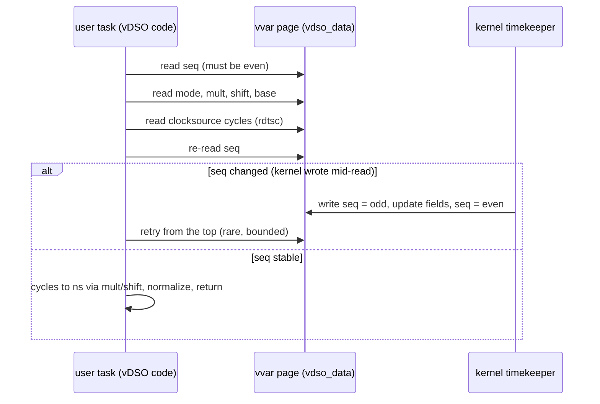

# vDSO and vvar Internals

## Overview

The vDSO ("virtual dynamic shared object") is an ELF shared object the kernel maps into every process so that hot system calls — `clock_gettime`, `gettimeofday`, `getcpu`, and since Linux 6.11 `getrandom` — run as plain function calls with no mode switch. The [vDSO and vsyscall](../../linux/kernel/core/vdso-vsyscall.md) page covers the fast-path idea, the vsyscall legacy page, and a worked cost model; this page covers the internals that page gestures at: how the loader discovers the vDSO via `AT_SYSINFO_EHDR`, the layout of the `vvar` data pages and the seqcount protocol the timekeeper uses to update them safely from user space, how clocksource drivers decide whether the fast path exists at all, and the shared-mutable-state engineering behind `vgetrandom`. This is core material for low-latency and performance-interview loops.

## Mapping and Discovery

At boot the kernel builds an ELF image from source such as `arch/x86/entry/vdso/`, and on every `execve`/clone-with-mm it maps two (recently three) memory regions into the new address space, visible in `/proc/self/maps` as `[vdso]` and `[vvar]` — with recent kernels adding a separate `[vvar_vclock]` mapping after the timekeeping-page rework. Nothing here is on disk; the loader's job is only to *find* it, and the discovery channel is the auxiliary vector:

- The kernel places `AT_SYSINFO_EHDR` in the auxv, pointing at the vDSO's ELF header at its randomized base. ASLR randomizes the address per process; the pointer keeps C libraries portable.
- glibc's early startup (`_dl_sysdep_start` path) stores the value, and its `clock_gettime`/`gettimeofday`/`getcpu` shims call into the vDSO through `__vdso_clock_gettime@LINUX_2.6`-style versioned symbols. Symbol versioning matters: the kernel can add `__vdso_*` entry points in newer versions and old binaries keep binding to what they know.
- The vDSO is a genuine ELF: it has program headers, a hash table, and function code. You can inspect it: `getauxval(AT_SYSINFO_EHDR)` in a running process, or dump the mapping with `gdb`/`objdump` via `/proc/<pid>/mem`. musl and other libc's follow the same auxv contract, which is what makes `clock_gettime` non-syscall on every mainstream C library.
- `AT_SYSINFO` (the older 32-bit entry-point slot) is the historical variant; on modern 64-bit systems `AT_SYSINFO_EHDR` is the one that matters.

```c
/* Finding and calling the vDSO directly (portable glibc idiom) */
#include <sys/auxv.h>
#include <dlfcn.h>

void *vdso = (void *)getauxval(AT_SYSINFO_EHDR);
int (*clock_gettime_vdso)(clockid_t, struct timespec *) = NULL;
if (vdso) {
    /* dlopen on a raw mapping requires dlmopen tricks; the common
       shortcut binds the private symbol: */
    clock_gettime_vdso = dlsym(RTLD_DEFAULT, "__vdso_clock_gettime");
}
```

Two discovery-adjacent facts are useful operationally: a process can run with the vDSO disabled (`vdso=0` boot parameter or seccomp/LD setups that break it), in which case glibc falls back to real syscalls transparently; and containers inherit the host's vDSO mapping (it is per-mm, not per-filesystem), so path-based analysis of the mapping is a legitimate way to detect vDSO-related regressions.

## A Tour of the vvar Data

Because user space is reproducing kernel arithmetic, the exported fields are the kernel's own, not an abstraction of them. The x86-64-generic sketch (from `include/vdso/datapage.h`, trimmed):

```c
struct vdso_data {
    u32 seq;                    /* seqcount: odd = kernel updating */
    s32 clock_mode;             /* which vclock: TSC / PVCLOCK / NONE */
    u64 mask;                   /* cycles mask for the clocksource */
    u32 mult;                   /* cycles to ns multiplier, NTP-corrected */
    u32 shift;                  /* cycles to ns shift */
    struct vdso_timestamp basetime[VDSO_BASES];  /* coarse/RAW caches */
    /* ... offsets per clock, tz_minwest, timens offset, ... */
};
```

Field by field, the arithmetic a reader performs is: `cycles = read_clocksource() & mask`, then `ns = (cycles - cycle_last) * mult >> shift`, then add the clock's base offset and normalize into seconds/nanoseconds. The `mult` value is *already NTP-corrected* by the kernel — the vDSO applies slewing without a division (shift and multiply only), which is part of why the whole read stays in the tens of cycles. The `basetime` caches are why coarse clocks cost almost nothing: no clocksource read at all, just a seq-guarded copy of values the kernel refreshed at the last tick.

One more piece hides in plain sight: `getcpu` needs no vvar read on x86-64 because the kernel exports CPU and node numbers through the GDT (retrieved with a single `lsl` instruction), while 32-bit and compat ABIs use a per-CPU vvar page instead. That asymmetry — global seqcount-protected time data versus per-CPU identity data — is a neat illustration of how each vDSO function picks the cheapest sound protocol for its inputs.

## The vvar Pages and the Seqcount Protocol

The vDSO code is stateless; all the state lives in the **vvar** mapping — a read-only-for-user page set the kernel writes and user space reads. On x86-64 the layout centers on `struct vdso_data` (see `kernel/time/vsyscall.c` and `include/vdso/datapage.h`):

- A **seqcount** (`seq`) at the front: odd = writer active, even = stable. This is the only synchronization user space gets.
- Per-clock `vdso_timestamp` records: base seconds/nanoseconds, plus the monotonic-raw and boottime variants.
- The clocksource conversion parameters exported per update: `mask`, `mult`, `shift`, `cycle_last` — the exact multiplier the kernel itself uses, so user space reproduces the kernel's arithmetic bit-for-bit.
- Cached coarse values (`CLOCK_REALTIME_COARSE`, `CLOCK_MONOTONIC_COARSE`), timezone/minwest for `gettimeofday`-era callers, and a clocksource id so the reader can detect which vclock mode is live.
- On 32-bit/compat ABIs there is a per-CPU vvar component for `getcpu` (cpu/node numbers); on x86-64 `getcpu` can also be served by the `lsl` instruction from per-CPU GDT storage — which is why `getcpu` costs single-digit nanoseconds.

The kernel-side writer is the timekeeper core. On every tick or `clocksource` read that advances the timekeeping seqcount (`tk_core.seq`), `update_vsyscall()` re-derives the conversion parameters and publishes them into `vdso_data` under the same write-side seqcount discipline: increment seq to odd, write all fields in dependency order, increment back to even. Because the writer only ever runs in kernel context (tick, `do_settimeofday64`, NTP adjustments, clocksource switches), the lock is uncontended from the user side — readers never spin in the classic sense, they **retry**:



The retry loop is why the vDSO is correct without taking locks: the math is deterministic from the snapshot fields, and any interleaved kernel update invalidates the snapshot rather than corrupting it. Time namespaces (containers with shifted clocks) get their own vvar page contents swapped per-namespace, and the `[vvar_vclock]` split in recent kernels isolates the "vclock mode" word so the hottest read path touches fewer cache lines. The authoritative kernel-side reference is the timekeeping documentation ([timers/timekeeping](https://docs.kernel.org/timers/timekeeping.html)).

### The timekeeper update path

On the writer side, the update is wired into the tick: timer interrupt → `update_wall_time()` → the timekeeping core advances under `tk_core.seq` → `update_vsyscall()` re-derives the exported parameters and publishes them to `vdso_data`. Architecture hooks matter here — x86 implements `arch_update_vsyscall()` to fold in TSC-derived values, while architectures with different clocksource arithmetic (powerpc, s390) do the equivalent in their own units, which is why the *user-side* vDSO code is per-architecture too. Deep idle interacts in a way worth knowing: on `nohz_full` cores the timekeeper may not run for seconds, so exported bases go stale until the CPU crosses the kernel boundary — the design accepts bounded staleness on isolated cores, and workloads needing fresh bases force periodic kernel crossings. `do_settimeofday64`, NTP slewing, and clocksource switches all funnel through the same write side, which is why a `settimeofday` from one container becomes visible to every reader on the host within one seqcount cycle.

## Clocksources and the TSC Stability Question

The vDSO fast path exists only for clocksources that can be read **from user space**. On x86 that is effectively the TSC; paravirt clocksources (kvmclock's pvclock page, Hyper-V reference TSC) are engineered specifically to be user-readable, which is why enlightened guests keep the fast path where unenlightened ones lose it.

| Clocksource | Read cost profile | vDSO-capable | Notes |
|---|---|---|---|
| TSC (invariant) | 20–30 cycles, ordered via `rdtsc`/`rdtscp` | yes | rating ~300; the only common MMIO-free source |
| kvmclock / pvclock | shared-page read + seq check | yes | paravirt; designed for guests |
| Hyper-V reference TSC | shared-page read | yes | `hv_ref_tsc` enlightenment |
| HPET | MMIO read, hundreds of cycles | no | forces syscall fallback |
| ACPI PM timer | IPort/MMIO read | no | the usual watchdog fallback |
| jiffies | memory read, low resolution | coarse only | last-resort rating 1 |

Selection and validation machinery that shows up in interviews:

1. **Invariant TSC detection.** CPUID leaf `0x80000007` bit 8 ("Invariant TSC") — the TSC ticks at a constant rate across P-states and deep C-states. Without it, TSC rate changes make it unusable as a wall-clock backing, and the kernel drops to HPET/PM timer.
2. **Boot-time qualification.** The TSC clocksource is registered only after checks for known-broken CPUs (early Geode/VIA/AMD quirks), multi-socket sync (`tsc` synchronization test at boot), and the `tsc=` parameters (`tsc=reliable`, `tsc=nowatchdog`, `tsc=unstable`) that override heuristics.
3. **Runtime watchdog.** A watchdog clocksource (typically the ACPI PM timer or HPET) is periodically read against the TSC; a skew beyond the threshold marks the TSC `unstable` (`clocksource_mark_unstable()`), switches `current_clocksource`, and — critically for this page — flips the vDSO clock mode to `VDSO_CLOCKMODE_NONE` on x86, so every subsequent `clock_gettime` becomes a real syscall. Systems show this after BIOS updates, NUMA sync faults, or hypervisor migrations; the symptom is a 5–10x latency regression in polling loops with no error anywhere.
4. **Observability.** `cat /sys/devices/system/clocksource/clocksource0/current_clocksource` and `available_clocksource`, plus `dmesg | grep -i tsc` for the watchdog verdicts. `clocksource=tsc tsc=reliable` forces trust where you know better than the heuristics (a common HPC tuning step, and a common root-caused fix for "our latency jumped after firmware update").

### Reading the mapping: a worked example

The internals are directly observable on any running system, and doing it once teaches more than a diagram:

```bash
# 1. Find the mappings for a live process
pgrep -f mydaemon | head -1
grep -E 'vdso|vvar' /proc/<pid>/maps
# 7ffd...000-7ffd...000 r--p ... [vvar]
# 7ffd...000-7ffd...000 --xp ... [vdso]

# 2. Confirm what the loader sees (matches the [vdso] base)
getauxval(AT_SYSINFO_EHDR)   # from a small C probe

# 3. Dump the image from /proc/<pid>/mem and inspect its symbols
objdump -T vdso.dump | grep __vdso
# __vdso_clock_gettime  ... LINUX_2.6
# __vdso_getcpu         ... LINUX_2.6
# __vdso_getrandom      ... (kernels >= 6.11)
```

Note the permissions: `[vdso]` is execute-only (`--xp`) on hardened kernels and `[vvar]` is read-only — the kernel forbids writing its exported state, and an execute-only vDSO defeats the gadget-scanning attacks that the old fixed vsyscall page made trivial (see the [sibling page](../../linux/kernel/core/vdso-vsyscall.md) for that history). The vDSO image is also position-independent and versioned the same way any userspace shared object would be, which is why a plain `objdump` works on it — there is no special tooling involved.

## Performance Math

Order-of-magnitude numbers to anchor answers (x86-64, modern cores; mitigations change syscall cost, not vDSO cost):

| Path | Typical cost | Why |
|---|---|---|
| `clock_gettime(CLOCK_MONOTONIC)` via vDSO, TSC | ~15–40 ns | rdtsc + seqcount check + mult/shift math, no mode switch |
| coarse clocks via vDSO | ~5–15 ns | skip the TSC read; return cached base values |
| `clock_gettime` syscall, unmitigated entry | ~80–150 ns | `syscall`/`sysret` + timekeeping under seqlock |
| same with KPTI/retpoline-era mitigations | ~250–700 ns | entry/exit dominates; mitigation tax is 2–5x |
| vDSO after TSC→HPET fallback | syscall cost + ~100–300 ns | MMIO read happens in kernel now |
| `getrandom()` syscall | ~1–3 µs class | RNG lock/reseed logic, cache effects |
| `vgetrandom()` | ~50–150 ns for a 16-byte draw | ChaCha block generation in user space |

The ratio worth memorizing: **vDSO is 5–10x cheaper than a mitigated syscall** for timestamps, and the gap widens as mitigation tax grows. A poller reading `CLOCK_MONOTONIC` at 1 MHz spends ~1.5–4% of one core on vDSO reads versus ~25–70% on syscall paths — this is the single biggest reason latency-sensitive stacks (trading systems, DPDK control planes, database internal timers) obsess over clocksource state. Benchmark hygiene matters: anything that times syscalls must first assert which path `clock_gettime` takes (vDSO vs syscall), or the measurement floor swamps the signal; see [benchmarking discipline](../../arch/performance/benchmarking.md).

### Environment variations

| Environment | Fast path? | Mechanism |
|---|---|---|
| Bare metal, invariant TSC | yes | rdtsc direct |
| VM, enlightened (kvmclock/Hyper-V ref TSC) | yes | shared pvclock page instead of TSC |
| VM without enlightenment, non-invariant TSC | degraded | TSC traps or unstable → syscall fallback |
| Nested VM (L2 guest) | usually degraded | TSC virtualization cost, pvclock scaling off; invtsc passthrough (`vmx-tsc-scaling`/`invtsc` CPU flags) restores it |
| TSC watchdog trip | no | `VDSO_CLOCKMODE_NONE` → every read is a syscall |

### vDSO across architectures

The contract is uniform, the implementation is not — a table worth having when someone asks "is this x86-only?":

| Arch | User-space clock read | getcpu path | Notes |
|---|---|---|---|
| x86-64 | `rdtsc`/`rdtscp` (TSC) | `lsl` from GDT | the reference implementation |
| arm64 | `cntvct_el0` (generic timer) | per-CPU vvar page | virtual counter is architectural and monotonic |
| powerpc | timebase register (`mfspr TB`) | per-CPU vvar page | partition-scoped on LPARs |
| s390 | STCKF store-clock-fast | per-CPU vvar page | firmware-guaranteed stepping |
| riscv | `rdtime` CSR | per-CPU vvar page | mirrors the arm64 philosophy |

arm64 is the instructive contrast to x86: the generic timer's virtual counter was *designed* to be user-readable and monotonic across power states, so arm64 has no equivalent of the TSC watchdog drama — the "TSC went unstable" incident class is essentially x86-specific. In interviews, the portable framing is `CPUID 0x80000007` bit 8 (x86 invariant TSC) versus "always architectural" (arm64): it signals you know exactly where the portability boundary sits and why firmware fallbacks differ per platform.

Nested virtualization deserves the callout it usually gets: an L2 guest inherits a virtualized TSC whose offset/multiplier the L0 hypervisor controls; with TSC scaling (VMX TSC scaling on Intel, TSC ratio on AMD) the L2 `rdtsc` is hardware-adjusted and the vDSO stays usable; without it, exits per read destroy the fast path. This is the concrete case where "vDSO performance" becomes a hypervisor configuration conversation, not a kernel one — see [virtualization internals](../advanced/virtualization.md).

## glibc vs Direct vDSO Calls

glibc's `clock_gettime` adds a small dispatch layer (vDSO-available check, then the call). Consequences:

- **Overhead:** glibc's wrapper costs a few extra nanoseconds versus calling `__vdso_clock_gettime` directly — measurable at 100M+ calls, invisible otherwise. Code that *does* bypass it (traders' libraries, some profilers) uses the `dlsym(RTLD_DEFAULT, "__vdso_clock_gettime")` idiom shown above or resolves via `AT_SYSINFO_EHDR` + its own symbol table walk.
- **Fallback transparency:** glibc silently falls back to the syscall when the vDSO symbol is missing or the clock has no vDSO implementation (`CLOCK_PROCESS_CPUTIME_ID` is served by per-process counters, not the vDSO; `CLOCK_TAI` gained vDSO support only in later kernels). Programs cannot distinguish the paths — which is exactly why `strace` shows no `clock_gettime` on healthy systems and why its absence confuses people debugging.
- **musl and runtimes:** musl binds the vDSO similarly; language runtimes (Go's `time.Now`, Rust's `Instant`) call libc or the vDSO conventions directly — Go notably implements its own vDSO parsing for `nanotime`, which is why a broken vDSO shows up as a Go runtime latency cliff.
- **The coarse-clock trick:** where nanosecond precision is unnecessary, `CLOCK_MONOTONIC_COARSE` returns jiffies-granularity values with no TSC read at all — the cheapest legal timestamp, used by stats and timeout sweeps.

### A minimal honest benchmark

The right benchmark structure is a tight loop plus an outer coarse-clock fence, so the timing method itself never syscalls:

```c
#include <time.h>
#include <stdio.h>

#define N 10000000L
static double now_s(void) {          /* fence: coarse clock, no TSC read */
    struct timespec ts; clock_gettime(CLOCK_MONOTONIC_COARSE, &ts);
    return ts.tv_sec + ts.tv_nsec / 1e9;
}

int main(void) {
    struct timespec ts;
    double t0 = now_s();
    for (long i = 0; i < N; i++) clock_gettime(CLOCK_MONOTONIC, &ts);
    double t1 = now_s();
    printf("clock_gettime: %.1f ns/call\n", (t1 - t0) * 1e9 / N);
    return 0;
}
```

Reading the output requires the discipline from the clocksource checklist: ~15–40 ns per call means the vDSO TSC path is live; ~250 ns on a mitigated kernel means every iteration is a real syscall and `current_clocksource` has left the TSC; a bimodal distribution means the watchdog flipped mid-run and you should rerun with the clocksource pinned. The coarse-clock fence costs a few nanoseconds per N iterations, so its contribution is noise — the failure mode to avoid is timing the loop *with* `CLOCK_MONOTONIC` itself, which benchmarks the timer against itself and hides the very path you are measuring.

## vgetrandom (Linux 6.11)

`vgetrandom()` extends the vDSO beyond clocks, and its design is the reference example of exporting *mutable* state safely:

- **Per-task state in vvar-adjacent memory.** `mmap`-allocated (via a `getrandom`-family vDSO call) per-thread generator states hold ChaCha-based block generators seeded from the kernel CRNG. The draw path generates bytes entirely in user space; no mode switch.
- **Reseeding by generation counter.** The kernel publishes a generation number in shared memory; when the CRNG reseeds (the kernel reseeds on schedule and on entropy events), the generation bumps and the next vDSO call detects the change and rekeys the per-task state. Staleness is bounded by the kernel's reseed policy, not by user discipline.
- **fork/exec invalidation.** Generator state is per-mm; `fork()` must not clone a secret stream, so the machinery tracks mm generation and forces reinit after fork. `madvise(MADV_DROPPABLE)`-style handling (the new `MAP_DROPPABLE` mapping type arrived with this work) lets the kernel drop the pages under memory pressure without corrupting the protocol.
- **Adoption path:** glibc wires `getrandom()` to the vDSO when present; the syscall remains the portable baseline. The LWN coverage in the references walks the design debates (per-vCPU vs per-task states, madvise interactions).

The transferable lesson: a vDSO function is a user-space routine over kernel-maintained inputs. Clocks need only a seqcount; randomness needs generation counters, fork semantics, and droppable memory — each new vDSO call inherits the *hardest* part of its kernel-side state machine.

## Interview Questions

1. **"How does user space find the vDSO?"** The kernel publishes `AT_SYSINFO_EHDR` in the auxiliary vector at process startup, pointing at the vDSO's ELF header; the C library reads it via `getauxval`/startup glue and binds versioned symbols like `__vdso_clock_gettime@LINUX_2.6`. No filesystem is involved — the image is built into the kernel and mapped per-mm, visible as `[vdso]`/`[vvar]` in `/proc/self/maps`.
2. **"How can the vDSO read timekeeping data without a lock, while the kernel updates it?"** Through the same seqcount the kernel timekeeper uses: the writer (tick, `settimeofday`, NTP) publishes conversion parameters — mult/shift/mask, cycle_last, base seconds/nanoseconds — into the vvar page with the seqcount going odd→even, and the vDSO reader takes a snapshot: read seq, read fields, read TSC, re-read seq. If the seq changed, retry. Readers never block; the kernel-side writer is the only writer, so retries are rare.
3. **"Your service's latency jumped 8x after a firmware update and the only change visible is clock_gettime cost. What happened?"** The TSC failed the clocksource watchdog (skew against HPET/ACPI PM timer, or a firmware change broke invariant TSC sync across sockets), so the kernel switched `current_clocksource` off TSC; the vDSO then reports `VDSO_CLOCKMODE_NONE` and every timestamp becomes a real syscall with MMIO clock reads — 5–10x per-call cost. Check `/sys/devices/system/clocksource/clocksource0/current_clocksource`, `dmesg | grep -i tsc`, and either fix the root cause or set `clocksource=tsc tsc=reliable` deliberately.
4. **"Why is clock_gettime slower inside some VMs?"** The fast path needs a user-readable clock. Without invariant TSC (or with TSC traps under nested virtualization), the vDSO falls back to paravirt clock pages (kvmclock, Hyper-V reference TSC) — still fast — or to plain syscalls. With TSC scaling enabled on the hypervisor (`invtsc`, VMX TSC scaling), an L2 guest keeps hardware-adjusted rdtsc and near-bare-metal vDSO costs; without it, each read traps to the L0 hypervisor.
5. **"What does it take to add a new function to the vDSO — say getrandom?"** You need: an arch-specific vDSO implementation, kernel-side state exported into vvar memory, and a user-safe protocol for that state. Clocks only needed a seqcount because inputs are read-mostly; `vgetrandom` needed per-task generator states, a generation counter for reseeding, fork invalidation, and droppable mappings — because its state is mutable and secret. That asymmetry is the design lesson: vDSO functions are user-space routines over kernel-maintained inputs, and the cost scales with state mutability.
6. **"How would you benchmark vDSO vs syscall clock_gettime correctly?"** Pin the clocksource first (`current_clocksource` = tsc), warm caches, and time many iterations with `rdtsc` or a coarse-clock outer loop so the timing method itself doesn't syscall. Compare glibc `clock_gettime` (which uses the vDSO) against a direct syscall wrapper, and report distributions, not means — the vDSO path is ~15–40 ns vs ~250–700 ns mitigated syscall on x86-64, and any `strace` in the loop multiplies the syscall side by orders of magnitude.

## Key Takeaways

- The vDSO is a kernel-built ELF mapped per process, discovered via `AT_SYSINFO_EHDR` in the auxv; `clock_gettime`, `gettimeofday`, `getcpu` (and 6.11+ `vgetrandom`) resolve without a mode switch.
- All vDSO state lives in the read-only-to-user `vvar` pages; a seqcount (odd = kernel writing) is the entire synchronization protocol, with bounded reader retries.
- The fast path exists only while a user-readable clocksource is active: invariant TSC on bare metal, pvclock-style shared pages in enlightened guests; HPET/ACPI PM timer fallback forces syscalls and is a classic silent 5–10x regression.
- TSC qualification = CPUID invariant-TSC bit + boot checks + a runtime watchdog; `tsc=reliable`/`clocksource=` override heuristics at your own risk.
- vDSO timestamp reads cost ~15–40 ns versus ~250–700 ns for mitigated syscalls on x86-64 — the 5–10x ratio that motivates coarse clocks and clocksource hygiene.
- glibc/musl bind the vDSO transparently; direct `__vdso_*` calls shave a few ns and are the standard trick in ultra-low-latency code.
- `vgetrandom` shows the pattern's limits: mutable, secret state requires generation counters, fork invalidation, and droppable memory — not just a seqcount.
- Benchmark anything timestamp-heavy only after asserting which path `clock_gettime` actually takes.

## References

- [vdso(7) — Linux manual page](https://man7.org/linux/man-pages/man7/vdso.7.html) — the user-facing contract: `AT_SYSINFO_EHDR`, versioned symbols, per-arch notes.
- [Timekeeping — kernel documentation](https://docs.kernel.org/timers/timekeeping.html) — the kernel-side timekeeper structures whose snapshots populate vvar.
- [clock_getres(2) / clock_gettime(2)](https://man7.org/linux/man-pages/man2/clock_getres.2.html) — clock IDs and which ones have vDSO paths.
- [getcpu(2)](https://man7.org/linux/man-pages/man2/getcpu.2.html) — documents the vDSO `getcpu` variant and its per-CPU state.
- [getrandom(2)](https://man7.org/linux/man-pages/man2/getrandom.2.html) — the syscall `vgetrandom` shadows, with the CRNG semantics that define reseed behavior.
- Corbet, L. — [On vsyscalls and the vDSO](https://lwn.net/Articles/446528/) — the vsyscall hardening saga and vDSO design context.
- Corbet, L. — [Implementing virtual system calls](https://lwn.net/Articles/615809/) — vDSO construction and mapping mechanics.
- Corbet, L. — [getrandom() in the vDSO](https://lwn.net/Articles/978601/) and [the follow-up](https://lwn.net/Articles/983186/) — vgetrandom design and its shared-state debates.

## Cross-References

- [vDSO and vsyscall](../../linux/kernel/core/vdso-vsyscall.md) — the fast-path overview, vsyscall hardening modes, and cost-model companion page.
- [Fast I/O](../advanced/fast-io.md) — the broader syscall-bypass landscape (io_uring, batching) around the vDSO.
- [Virtualization](../advanced/virtualization.md) — VM exits, TSC virtualization, and why guests lose or keep the fast path.
- [Benchmarking](../../arch/performance/benchmarking.md) — measurement discipline for the ns-scale differences this page quantifies.
- [KPTI](../advanced/kpti.md) — the mitigation that widened the syscall-vs-vDSO gap.
