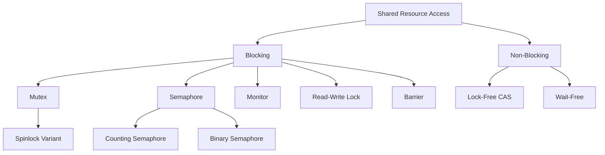

# Synchronization

When multiple threads or processes access shared resources concurrently, **synchronization** mechanisms ensure correct behavior. Without synchronization, race conditions lead to corrupted data, lost updates, and unpredictable behavior.

## Why Synchronization Matters

```c
// Classic race condition
int counter = 0;

// Thread 1              // Thread 2
counter++;                counter++;
// Could be: load, load, inc, store, inc, store → counter = 1 (not 2!)
```

The `counter++` operation is **not atomic**. It involves:
1. Read counter from memory
2. Increment in register
3. Write back to memory

If two threads interleave these steps, the result is wrong.

## The Critical Section Problem

A **critical section** is code that accesses shared resources and must not be executed by more than one thread at a time. The solution must satisfy:

1. **Mutual Exclusion**: At most one thread in the critical section
2. **Progress**: If no thread is in CS, a waiting thread must be allowed to enter
3. **Bounded Waiting**: A thread must not wait forever (no starvation)

## Chapter Contents

- [Critical Section Problem](critical-section.md) — the fundamental problem
- [Peterson's Algorithm](petersons.md) — software-only solution for 2 threads
- [Mutexes](mutex.md) — the simplest locking primitive
- [Semaphores](semaphores.md) — counting synchronization
- [Spinlocks](spinlocks.md) — busy-wait locks for short critical sections
- [Monitors](monitors.md) — high-level synchronization construct
- [Readers-Writers Problem](readers-writers.md) — concurrent read access
- [Dining Philosophers Problem](dining-philosophers.md) — resource allocation
- [Sleeping Barber Problem](sleeping-barber.md) — signaling and counting
- [Lock-Free Data Structures](lock-free.md) — synchronization without locks
- [Compare-and-Swap (CAS)](cas.md) — atomic primitive
- [Memory Barriers](memory-barriers.md) — ordering memory operations
- [Deadlocks](deadlocks/README.md) — when threads wait forever

## Synchronization Mechanism Comparison

| Mechanism | Type | Use Case | Complexity |
|-----------|------|----------|------------|
| Mutex | Binary lock | Protect critical section | Low |
| Semaphore | Counting | Resource pool, signaling | Medium |
| Spinlock | Busy-wait lock | Short CS, no context switch | Low |
| Monitor | High-level | Object-oriented sync | Medium |
| Condition Variable | Signaling | Wait for condition | Medium |
| Read-Write Lock | Multiple readers | Read-heavy workloads | Medium |
| Barrier | Synchronization | Wait for all threads | Medium |
| Lock-free (CAS) | Non-blocking | High-performance | High |

## Interview Quick Facts

1. **Mutex vs Semaphore**: Mutex = mutual exclusion (binary, owner-based). Semaphore = signaling/counting (no owner concept).
2. **Spinlock vs Mutex**: Spinlock busy-waits (no context switch, good for short CS). Mutex sleeps (context switch, good for long CS).
3. **Monitor** = mutex + condition variables + encapsulated data
4. **Deadlock** requires all 4 conditions: mutual exclusion, hold-and-wait, no preemption, circular wait

## Diagram: Synchronization Hierarchy



## Cross-References

- [Deadlocks](deadlocks/README.md) — what happens when synchronization goes wrong
- [I/O](../io/README.md) — device synchronization
- [Filesystems](../filesystems/README.md) — concurrent file access
- [Containers](../containers/README.md) — namespace isolation


## Cross References

- [Mutex](../os/synchronization/mutex.md)
- [Semaphores](../os/synchronization/semaphores.md)
- [Deadlocks](../os/synchronization/deadlocks/README.md)
- [Concurrency Overview](../concurrency/overview.md)
- [Lock-Based Concurrency](../dbms/transactions/lock-based.md)
