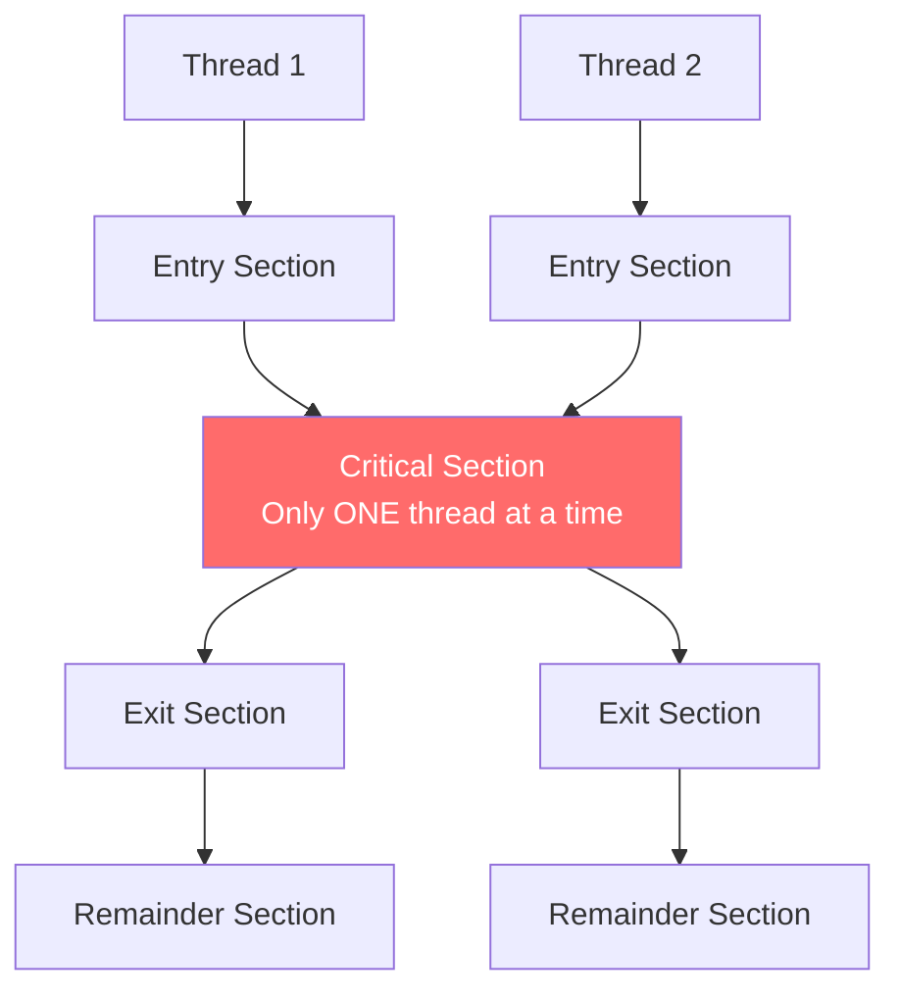
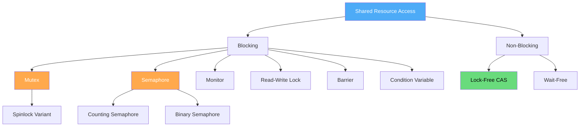

# Synchronization

When multiple threads or processes access shared resources concurrently, **synchronization** mechanisms ensure correct behavior. Without synchronization, race conditions lead to corrupted data, lost updates, and unpredictable behavior.

## Why Synchronization Matters

```c
// Classic race condition
int counter = 0;

// Thread 1              // Thread 2
counter++;                counter++;
// Could be: load, load, inc, store, inc, store → counter = 1 (not 2!)
```

The `counter++` operation is **not atomic**. It involves:
1. Read counter from memory
2. Increment in register
3. Write back to memory

If two threads interleave these steps, the result is wrong.

## Race Conditions

A **race condition** occurs when the behavior of a program depends on the relative timing of threads/processes. The outcome changes based on scheduling order, making bugs non-deterministic and hard to reproduce.

### Race Condition Example

```c
// Shared bank account
int balance = 1000;

// Thread A: withdraw $800
// Thread B: withdraw $500

// Expected: one succeeds, one fails (insufficient funds)
// Actual (with race): BOTH may succeed!
```

```
Timeline (race condition):
Thread A: read balance (1000)     ←──── Both read same value
Thread B: read balance (1000)     ←──── before either writes
Thread A: balance = 1000 - 800 = 200
Thread A: write balance (200)
Thread B: balance = 1000 - 500 = 500  ←── Uses stale read!
Thread B: write balance (500)         ←── Overwrites A's update!
Final balance: 500 (should be -300 or fail)
```

### Fix: Mutual Exclusion

```c
pthread_mutex_t lock = PTHREAD_MUTEX_INITIALIZER;
int balance = 1000;

void withdraw(int amount) {
    pthread_mutex_lock(&lock);
    if (balance >= amount) {
        // Simulate some processing
        usleep(1000);
        balance -= amount;
        printf("Withdrew %d, balance: %d\n", amount, balance);
    } else {
        printf("Insufficient funds\n");
    }
    pthread_mutex_unlock(&lock);
}
```

### Types of Race Conditions

| Type | Description | Example |
|------|-------------|---------|
| **Data race** | Unsynchronized read/write to same variable | `counter++` from two threads |
| **Check-then-act (TOCTOU)** | Check condition, then act (condition may change) | `if (file exists) open()` — file deleted between check and open |
| **Read-modify-write** | Non-atomic read-modify-write sequence | `balance -= amount` |
| **Ordering race** | Operations happen in unexpected order | Producer writes before consumer reads |

### TOCTOU Example

```c
// VULNERABLE: Time-of-Check-Time-of-Use
if (access("/tmp/myfile", W_OK) == 0) {  // Check
    // Attacker could create symlink here!
    FILE *f = fopen("/tmp/myfile", "w");  // Use
}

// SAFE: Use atomic operations
int fd = open("/tmp/myfile", O_WRONLY | O_CREAT | O_EXCL, 0600);
// O_EXCL atomically fails if file exists
```

## The Critical Section Problem

A **critical section** is code that accesses shared resources and must not be executed by more than one thread at a time.



The solution must satisfy three requirements:

| Requirement | Description | Why It Matters |
|-------------|-------------|----------------|
| **Mutual Exclusion** | At most one thread in the critical section | Prevents data corruption |
| **Progress** | If no thread is in CS, a waiting thread must be allowed to enter | Prevents deadlock |
| **Bounded Waiting** | A thread must not wait forever | Prevents starvation |

## Synchronization Primitives Overview

### Comparison Table

| Mechanism | Type | Use Case | Blocking? | Complexity |
|-----------|------|----------|-----------|------------|
| **Mutex** | Binary lock | Protect critical section | Yes (sleep) | Low |
| **Semaphore** | Counting | Resource pool, signaling | Yes (sleep) | Medium |
| **Spinlock** | Busy-wait lock | Short CS, no context switch | No (busy-wait) | Low |
| **Monitor** | High-level | Object-oriented sync | Yes | Medium |
| **Condition Variable** | Signaling | Wait for condition | Yes | Medium |
| **Read-Write Lock** | Multiple readers | Read-heavy workloads | Yes | Medium |
| **Barrier** | Synchronization | Wait for all threads | Yes | Medium |
| **Lock-free (CAS)** | Non-blocking | High-performance | No | High |

### Mechanism Hierarchy



### Mutex (Mutual Exclusion Lock)

The simplest synchronization primitive. Only one thread can hold it at a time.

```c
pthread_mutex_t mutex = PTHREAD_MUTEX_INITIALIZER;

// Thread-safe increment
void *increment(void *arg) {
    for (int i = 0; i < 1000000; i++) {
        pthread_mutex_lock(&mutex);    // Acquire
        shared_counter++;
        pthread_mutex_unlock(&mutex);  // Release
    }
    return NULL;
}
```

**Properties:**
- Binary: locked or unlocked
- Ownership: only the thread that locked it can unlock it
- Blocking: `lock()` blocks if already locked (thread sleeps)
- Priority inversion: low-priority holder can block high-priority waiter

### Semaphore

A counting semaphore allows up to N threads to access a resource simultaneously.

```c
#include <semaphore.h>

sem_t sem;

// Initialize with count 3 (3 resources available)
sem_init(&sem, 0, 3);

void *worker(void *arg) {
    sem_wait(&sem);      // Decrement (blocks if 0)
    // Access shared resource (at most 3 threads)
    use_resource();
    sem_post(&sem);      // Increment (wake waiting thread)
    return NULL;
}
```

**Mutex vs Semaphore:**
| Aspect | Mutex | Semaphore |
|--------|-------|-----------|
| Ownership | Yes (owner must unlock) | No (any thread can signal) |
| Value | Binary (0 or 1) | Counting (0 to N) |
| Purpose | Mutual exclusion | Signaling / resource counting |
| Use case | Protect critical section | Limit concurrent access |

### Spinlock

A spinlock busy-waits instead of sleeping. Best for very short critical sections where context switch overhead exceeds wait time.

```c
#include <pthread.h>

pthread_spinlock_t spinlock;
pthread_spin_init(&spinlock, PTHREAD_PROCESS_PRIVATE);

void *worker(void *arg) {
    pthread_spin_lock(&spinlock);    // Busy-wait
    // Very short critical section
    shared_counter++;
    pthread_spin_unlock(&spinlock);  // Release
    return NULL;
}
```

**Spinlock vs Mutex:**
| Aspect | Spinlock | Mutex |
|--------|----------|-------|
| Waiting | Busy-wait (burns CPU) | Sleep (yields CPU) |
| Context switch | None | Yes |
| Best for | Short CS (< 1μs) | Long CS (> 1μs) |
| SMP benefit | Yes (another CPU can release) | N/A |
| Uniprocessor | Useless (holder can't run to release) | Preferred |

### Condition Variables

Used to wait for a specific condition to become true. Always used with a mutex.

```c
pthread_mutex_t mutex = PTHREAD_MUTEX_INITIALIZER;
pthread_cond_t cond = PTHREAD_COND_INITIALIZER;
int data_ready = 0;

// Consumer (waits for data)
void *consumer(void *arg) {
    pthread_mutex_lock(&mutex);
    while (!data_ready) {                    // ALWAYS use while, not if
        pthread_cond_wait(&cond, &mutex);    // Atomically: unlock + sleep
    }                                        // Re-locked on wakeup
    // Process data
    data_ready = 0;
    pthread_mutex_unlock(&mutex);
    return NULL;
}

// Producer (signals when data is ready)
void *producer(void *arg) {
    pthread_mutex_lock(&mutex);
    // Prepare data...
    data_ready = 1;
    pthread_cond_signal(&cond);     // Wake one waiting thread
    // or pthread_cond_broadcast(&cond) to wake all
    pthread_mutex_unlock(&mutex);
    return NULL;
}
```

**Key rule:** Always check the condition in a `while` loop, not an `if`, to handle **spurious wakeups**.

### Read-Write Locks

Allows multiple concurrent readers OR one exclusive writer.

```c
pthread_rwlock_t rwlock = PTHREAD_RWLOCK_INITIALIZER;

void *reader(void *arg) {
    pthread_rwlock_rdlock(&rwlock);    // Shared read lock
    // Multiple readers can enter here
    read_data();
    pthread_rwlock_unlock(&rwlock);
    return NULL;
}

void *writer(void *arg) {
    pthread_rwlock_wrlock(&rwlock);    // Exclusive write lock
    // Only one writer, no readers
    modify_data();
    pthread_rwlock_unlock(&rwlock);
    return NULL;
}
```

**Use case:** Read-heavy workloads (config files, caches, lookup tables).

### Barriers

Synchronize multiple threads at a specific point — all must arrive before any can proceed.

```c
pthread_barrier_t barrier;
pthread_barrier_init(&barrier, NULL, 4);  // 4 threads

void *worker(void *arg) {
    // Phase 1: independent work
    do_phase1();
    
    pthread_barrier_wait(&barrier);  // Wait for all 4 threads
    
    // Phase 2: all threads start together
    do_phase2();
    return NULL;
}
```

### Compare-and-Swap (CAS)

The fundamental atomic operation for lock-free programming.

```c
#include <stdatomic.h>

atomic_int counter = 0;

// Atomic increment using CAS (lock-free)
void atomic_increment(atomic_int *val) {
    int old_val, new_val;
    do {
        old_val = atomic_load(val);
        new_val = old_val + 1;
    } while (!atomic_compare_exchange_weak(val, &old_val, new_val));
    // Retry if another thread modified val between load and CAS
}
```

**CAS properties:**
- Atomic hardware instruction (`cmpxchg` on x86)
- No locks needed (non-blocking)
- Suffers from ABA problem (mitigate with version counters)
- Can have high contention cost under heavy load

## Peterson's Algorithm (Software Solution)

A classic software-only solution for mutual exclusion between 2 threads (no hardware support needed):

```c
int flag[2] = {0, 0};
int turn = 0;

void lock(int id) {
    int other = 1 - id;
    flag[id] = 1;           // I want to enter
    turn = other;           // But I give priority to other
    while (flag[other] && turn == other)
        ;                   // Busy wait
}

void unlock(int id) {
    flag[id] = 0;           // I'm done
}
```

**Limitations:**
- Only works for 2 threads
- Requires sequential memory consistency (need memory barriers on modern CPUs)
- Not used in practice (hardware solutions are better)

## Memory Barriers / Fences

Modern CPUs reorder instructions for performance. Memory barriers enforce ordering:

```c
// Without barrier: CPU may reorder these
data = 42;
ready = 1;  // Consumer might see ready=1 before data=42!

// With barrier: data is visible before ready
data = 42;
__sync_synchronize();  // Full memory barrier
ready = 1;

// C11 atomic with ordering
atomic_store_explicit(&ready, 1, memory_order_release);
// Paired with:
int d = atomic_load_explicit(&data, memory_order_acquire);
```

## Interview Quick Facts

1. **Mutex vs Semaphore**: Mutex = mutual exclusion (binary, owner-based). Semaphore = signaling/counting (no owner concept).
2. **Spinlock vs Mutex**: Spinlock busy-waits (no context switch, good for short CS). Mutex sleeps (context switch, good for long CS).
3. **Monitor** = mutex + condition variables + encapsulated data (Java `synchronized`, Python `threading.Lock`)
4. **Deadlock** requires all 4 conditions: mutual exclusion, hold-and-wait, no preemption, circular wait
5. **Spurious wakeup**: Always use `while` loop with condition variables, never `if`
6. **ABA problem**: CAS can succeed even if value changed and changed back — use versioned pointers

## Interview Questions

### Beginner

**Q1: What is a race condition?**  
A: A race condition occurs when multiple threads access shared data concurrently, and the result depends on the timing of their execution. For example, two threads incrementing a counter simultaneously may produce an incorrect result because the read-modify-write sequence isn't atomic.

**Q2: What is mutual exclusion?**  
A: Mutual exclusion ensures that only one thread can access a critical section (shared resource) at a time. It's implemented using synchronization primitives like mutexes, semaphores, or spinlocks.

**Q3: What is the difference between a mutex and a semaphore?**  
A: A mutex has ownership — only the thread that locked it can unlock it. It's binary (locked/unlocked) and used for mutual exclusion. A semaphore has no ownership — any thread can signal it. It's counting (0 to N) and used for signaling or limiting concurrent access.

### Intermediate

**Q4: Why use `while` instead of `if` with condition variables?**  
A: Because of **spurious wakeups** — the OS may wake a thread even without a signal (for performance or implementation reasons). Also, another thread may have acted on the condition between the signal and this thread's execution. Using `while` rechecks the condition after each wakeup.

**Q5: When should you use a spinlock vs a mutex?**  
A: Use spinlock when: critical section is very short (< 1μs), running on multi-core, and you can't afford context switch overhead (e.g., kernel interrupt handler). Use mutex when: critical section is longer, running on single-core, or you want to yield CPU while waiting.

**Q6: Explain the readers-writers problem and its variants.**  
A: Multiple readers can access data simultaneously, but writers need exclusive access. **Variants:** Reader-priority (readers may starve writers), Writer-priority (writers may starve readers), Fair (FIFO ordering). Solution: read-write lock with appropriate fairness policy.

### FAANG-Level

**Q7: How would you implement a lock-free queue?**  
A: Use CAS (Compare-and-Swap) on head/tail pointers. Michael-Scott queue: each node has `next` pointer. Enqueue: CAS on tail to append node. Dequeue: CAS on head to advance to next node. Handle ABA problem with tagged pointers (combine pointer + version counter). Need memory barriers for ordering. Libraries: `boost::lockfree::queue`, Java `ConcurrentLinkedQueue`.

**Q8: Design a readers-writers lock that prevents writer starvation.**  
A: Use: 1) Mutex for state protection, 2) Condition variable for readers and writers, 3) `active_readers` count, `active_writer` flag, `waiting_writers` count. Rule: new readers block if there are waiting writers. This gives writers priority. Alternative: ticket-based FIFO lock — both readers and writers get tickets and are served in order.

## Common Mistakes

1. **Not joining or detaching threads:** Creates resource leaks (thread zombies).
2. **Accessing shared data without synchronization:** Data races lead to undefined behavior.
3. **Deadlock with multiple locks:** Always acquire locks in the same order.
4. **Using `if` instead of `while` with condvar:** Spurious wakeups cause bugs.
5. **Holding lock for too long:** Reduces parallelism, causes contention.
6. **Forgetting to unlock on error paths:** Use `pthread_cleanup_push` or RAII (C++).
7. **Using spinlock on single-core:** Holder and waiter can't run simultaneously.

## Summary

| Concept | Key Point |
|---------|-----------|
| Race condition | Unsynchronized concurrent access to shared data |
| Critical section | Code that must execute atomically |
| Mutual exclusion | Only one thread in critical section at a time |
| Mutex | Binary lock with ownership |
| Semaphore | Counting lock without ownership |
| Spinlock | Busy-wait lock for short CS |
| Condition variable | Wait for a condition (with mutex) |
| CAS | Atomic primitive for lock-free code |

## Cross-References

- [Critical Section Problem](critical-section.md) — the fundamental problem
- [Peterson's Algorithm](petersons.md) — software-only solution for 2 threads
- [Mutexes](mutex.md) — the simplest locking primitive
- [Semaphores](semaphores.md) — counting synchronization
- [Spinlocks](spinlocks.md) — busy-wait locks for short critical sections
- [Monitors](monitors.md) — high-level synchronization construct
- [Readers-Writers Problem](readers-writers.md) — concurrent read access
- [Dining Philosophers Problem](dining-philosophers.md) — resource allocation
- [Lock-Free Data Structures](lock-free.md) — synchronization without locks
- [Compare-and-Swap (CAS)](cas.md) — atomic primitive
- [Memory Barriers](memory-barriers.md) — ordering memory operations
- [Deadlocks](deadlocks/README.md) — when threads wait forever

## References

- Silberschatz, A., Galvin, P.B., Gagne, G. *Operating System Concepts*, 10th Edition. Wiley, 2018. (Chapter 5: Process Synchronization)
- Butenhof, D.R. *Programming with POSIX Threads*. Addison-Wesley, 1997.
- Herlihy, M., Shavit, N. *The Art of Multiprocessor Programming*. Morgan Kaufmann, 2008.
- McKenney, P.E. "Memory Barriers: A Hardware View for Software Hackers." 2010.
- `man 3 pthread_mutex`, `man 3 pthread_cond`, `man 3 sem_wait` — POSIX manual pages
- Linux kernel source: `kernel/locking/` — mutex, spinlock, rwsem implementations
