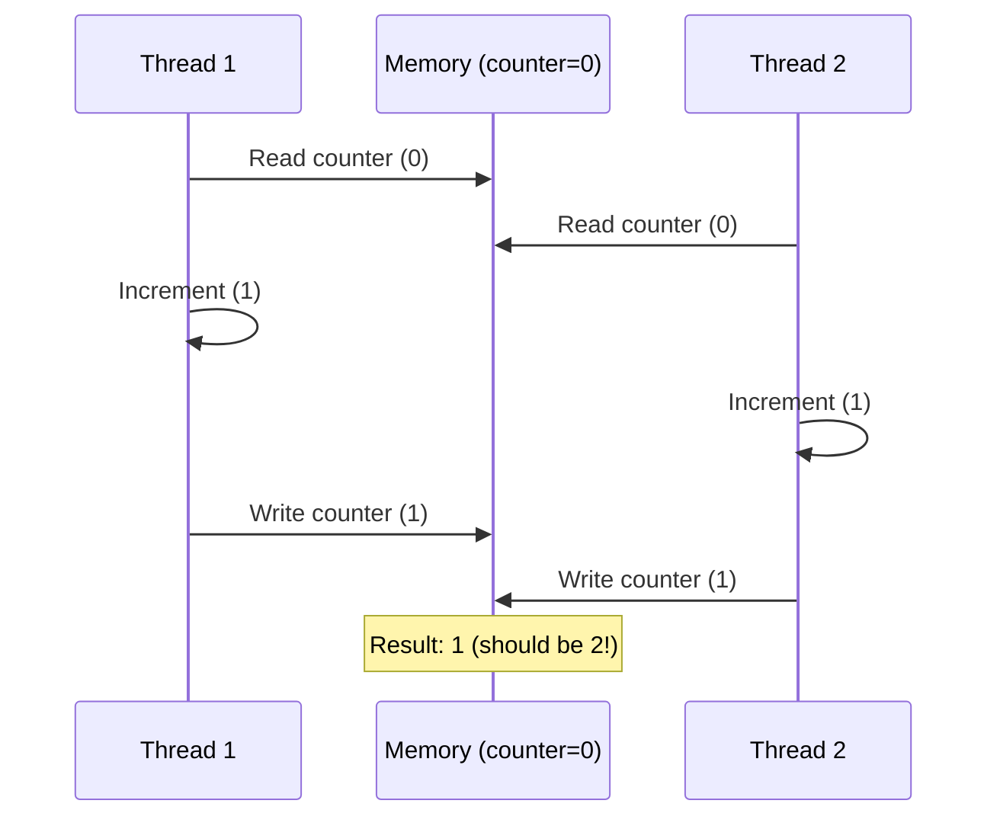
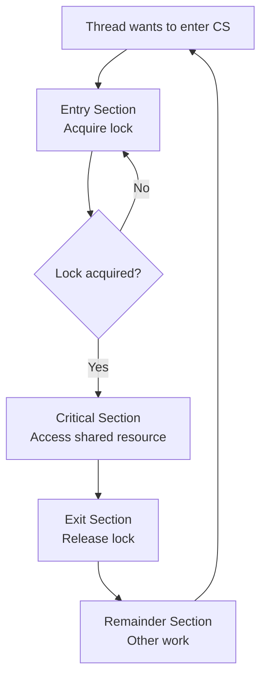

# The Critical Section Problem

## Overview

The **critical section problem** is the fundamental challenge in concurrent programming: how to allow multiple processes/threads to share data without causing race conditions. A critical section is a code segment that accesses shared resources and must execute atomically with respect to other critical sections.

## The Problem

```c
// Shared variable
int balance = 1000;

// Thread A: Withdraw $800        // Thread B: Withdraw $500
if (balance >= 800) {              if (balance >= 500) {
    balance -= 800;                    balance -= 500;
}                                  }
// balance = 200                  // balance = 500
// Which is correct? Neither! Both checks passed simultaneously.
```

## Structure of a Process

```c
do {
    // Entry Section
    //   Acquire permission to enter critical section
    
    // Critical Section
    //   Access shared resources
    
    // Exit Section
    //   Release permission
    
    // Remainder Section
    //   Non-critical code
} while (true);
```

## Requirements for a Solution

### 1. Mutual Exclusion
At most one process may be executing in its critical section at any time.

### 2. Progress
If no process is in its critical section and some processes wish to enter, only those processes not in their remainder section can participate in the decision, and the decision cannot be postponed indefinitely.

### 3. Bounded Waiting
There exists a bound on the number of times other processes can enter their critical section after a process has made a request to enter and before that request is granted.

## Failed Attempt 1: Turn-Based (Strict Alternation)

```c
// Process 0                  // Process 1
while (turn != 0);            while (turn != 1);
// critical section           // critical section
turn = 1;                     turn = 0;
```

**Problem**: Enforces strict alternation. If Process 0 doesn't want to enter, Process 1 still can't enter. **Violates progress**.

## Failed Attempt 2: Flag-Based

```c
// Process 0                  // Process 1
flag[0] = true;               flag[1] = true;
while (flag[1]);              while (flag[0]);
// critical section           // critical section
flag[0] = false;              flag[1] = false;
```

**Problem**: Both processes set flags, then both wait for the other. **Deadlock**.

## Failed Attempt 3: Combined (Flag + Turn)

```c
// Process i
flag[i] = true;
turn = j;                     // Give priority to the other
while (flag[j] && turn == j); // Wait if other wants in AND it's their turn
// critical section
flag[i] = false;
```

This is **Peterson's Algorithm** — it works! (See next page.)

## Hardware Solutions

### Disabling Interrupts

```c
// Only works in kernel mode
disable_interrupts();
// critical section
enable_interrupts();
```

**Problems:**
- Only works on single-processor systems
- Dangerous — a bug can hang the system
- Doesn't work in multiprocessor (disabling on one CPU doesn't affect others)

### Atomic Instructions

Modern CPUs provide atomic instructions:

| Instruction | Description | Architecture |
|-------------|-------------|-------------|
| `test_and_set` | Atomically set a variable to true and return old value | x86: `XCHG` |
| `compare_and_swap` | Atomically compare and conditionally update | x86: `CMPXCHG` |
| `fetch_and_add` | Atomically add to a variable and return old value | x86: `XADD` |

### test_and_set Lock

```c
bool test_and_set(bool *target) {
    bool old = *target;
    *target = true;
    return old;
}

// Usage
bool lock = false;

while (test_and_set(&lock));  // Spin until we get the lock
// critical section
lock = false;
```

**Problems:**
- **Busy waiting** — wastes CPU
- No guarantee of bounded waiting (starvation possible)

### compare_and_swap (CAS)

```c
int compare_and_swap(int *value, int expected, int new_value) {
    int temp = *value;
    if (*value == expected)
        *value = new_value;
    return temp;
}

// Usage
while (compare_and_swap(&lock, 0, 1) != 0);
// critical section
lock = 0;
```

## Bounded Waiting with test_and_set

```c
bool waiting[N] = {false};
bool lock = false;

void enter_critical(int i) {
    waiting[i] = true;
    bool key = true;
    while (waiting[i] && key)
        key = test_and_set(&lock);
    waiting[i] = false;
}

void exit_critical(int i, int n) {
    int j = (i + 1) % n;
    while ((j != i) && !waiting[j])
        j = (j + 1) % n;
    if (j == i)
        lock = false;        // No one waiting
    else
        waiting[j] = false;  // Hand off to next waiter
}
```

## Memory Barriers

Even with atomic instructions, CPU memory reordering can cause issues:

```c
// Thread 1              // Thread 2
flag1 = true;            flag2 = true;
while (!flag2);          while (!flag1);
// Both could see flag as false due to memory reordering!
```

**Solution**: Use memory barriers (fences) to enforce ordering.

## Diagram: Race Condition



## Diagram: Critical Section Solution



## Interview Questions

**Q1: What are the three requirements for the critical section problem?**

1. **Mutual exclusion**: At most one process in the critical section at a time
2. **Progress**: If no process is in CS and some want to enter, one must be allowed (no deadlock)
3. **Bounded waiting**: A process waiting to enter will eventually get in (no starvation)

**Q2: Why can't we just disable interrupts to solve the critical section problem?**

Disabling interrupts only works in kernel mode and only on uniprocessor systems. On multiprocessor systems, disabling interrupts on one CPU doesn't prevent other CPUs from accessing shared data. It's also dangerous — a bug could prevent interrupts from being re-enabled, hanging the system.

**Q3: What is the difference between `test_and_set` and `compare_and_swap`?**

`test_and_set` atomically sets a variable to true and returns the old value. `compare_and_swap` atomically compares a variable to an expected value and, if equal, updates it. CAS is more powerful — it can implement `test_and_set` but also more complex lock-free data structures. CAS is the foundation of most modern lock-free algorithms.

**Q4: What is busy waiting and when is it acceptable?**

Busy waiting (spinning) means repeatedly checking a condition in a loop without yielding the CPU. It wastes CPU cycles but avoids context switch overhead. It's acceptable when: (1) the wait is expected to be very short (microseconds), (2) on multiprocessor systems where the other CPU will release the lock quickly, (3) in kernel code where context switches are expensive.

**Q5: Explain the strict alternation solution and why it fails.**

The turn-based solution forces processes to alternate entry. If turn=0, only process 0 can enter. If process 0 doesn't want to enter (in remainder section), process 1 is blocked even though no one is in the critical section. This violates the **progress** requirement.

## Common Mistakes

- Assuming atomicity of compound statements (`counter++` is NOT atomic)
- Disabling interrupts on multiprocessor systems
- Using busy waiting when the wait time is long (wastes CPU)
- Not considering memory reordering by modern CPUs
- Forgetting that bounded waiting must be guaranteed (starvation is a real bug)

## Summary

- The critical section problem: ensure mutual exclusion, progress, and bounded waiting
- Software solutions (Peterson's) work for 2 processes but don't scale
- Hardware atomic instructions (`test_and_set`, `CAS`) provide the building blocks
- Busy waiting is acceptable for short waits; sleeping (mutexes) is better for long waits
- Memory barriers are needed to prevent CPU reordering
- Modern solutions use atomic instructions + memory barriers

## Cross-References

- [Peterson's Algorithm](petersons.md) — complete software solution for 2 threads
- [Mutexes](mutex.md) — sleeping locks
- [Spinlocks](spinlocks.md) — busy-wait locks
- [CAS](cas.md) — compare-and-swap in depth
- [Memory Barriers](memory-barriers.md) — preventing reordering
