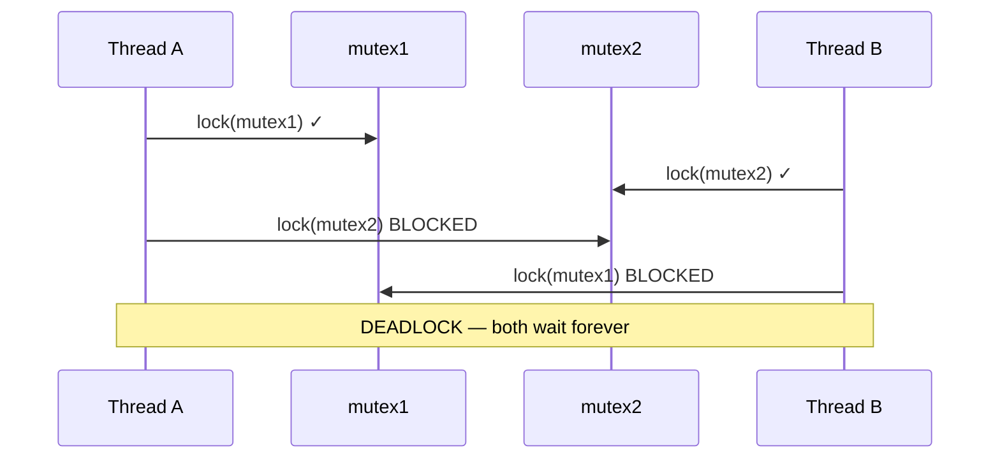
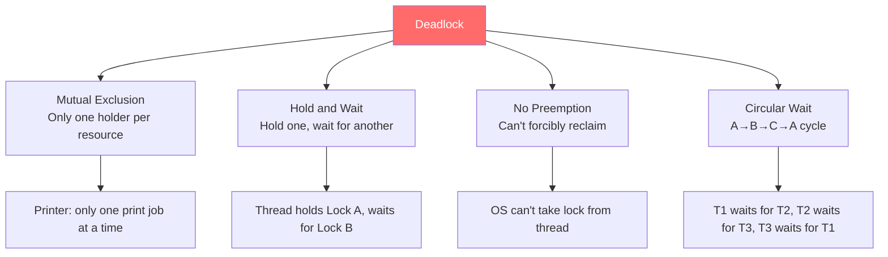
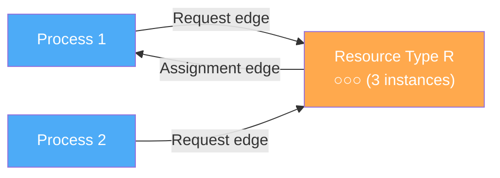
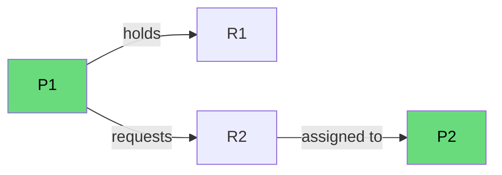
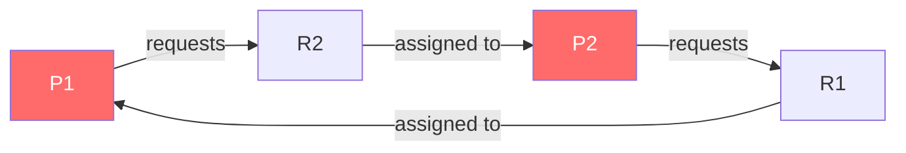
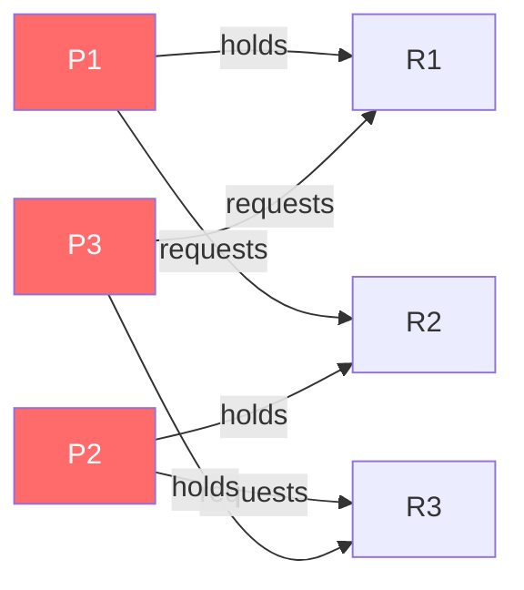
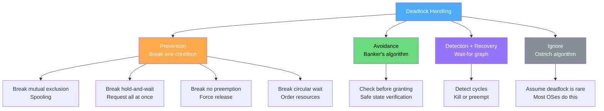

# Deadlocks

## Overview

A **deadlock** is a situation where two or more processes are permanently blocked, each waiting for a resource held by another. None can proceed, and none will ever release their resources. Deadlocks are one of the most serious concurrency bugs.

## The Deadlock Example

```c
// Thread A                      // Thread B
pthread_mutex_lock(&mutex1);     pthread_mutex_lock(&mutex2);
// ... work ...
pthread_mutex_lock(&mutex2);     pthread_mutex_lock(&mutex1);
// DEADLOCK: A holds mutex1,     // DEADLOCK: B holds mutex2,
// waits for mutex2              // waits for mutex1
```



## Four Necessary Conditions (Coffman Conditions)

All four must hold **simultaneously** for deadlock to occur. If any one is broken, deadlock cannot happen.

| # | Condition | Description | Example |
|---|-----------|-------------|---------|
| 1 | **Mutual Exclusion** | Only one process can use a resource at a time | Mutex, printer, tape drive |
| 2 | **Hold and Wait** | Process holds resource while waiting for another | Holding mutex1, waiting for mutex2 |
| 3 | **No Preemption** | Resources cannot be forcibly taken away | Can't force a thread to release mutex |
| 4 | **Circular Wait** | Circular chain of processes waiting for each other | A→B→C→A (cycle in wait graph) |

### Visual: All Four Conditions



### Real-World Deadlock Examples

**Example 1: Database Transactions**
```
Transaction A:                    Transaction B:
BEGIN;                            BEGIN;
UPDATE accounts SET balance=100   UPDATE orders SET status='shipped'
  WHERE id=1; (locks row 1)         WHERE id=5; (locks row 5)
UPDATE orders SET status='shipped' UPDATE accounts SET balance=100
  WHERE id=5; (waits for row 5)     WHERE id=1; (waits for row 1)
-- DEADLOCK --
```

**Example 2: File Operations**
```
Process A:                        Process B:
lock(file1.txt)                   lock(file2.txt)
lock(file2.txt) ← blocks         lock(file1.txt) ← blocks
-- DEADLOCK --
```

**Example 3: Device Access**
```
Process A: holds scanner, requests printer
Process B: holds printer, requests scanner
-- DEADLOCK --
```

**Example 4: Thread Join**
```
Thread A: pthread_join(B, NULL)  // Wait for B to finish
Thread B: pthread_join(A, NULL)  // Wait for A to finish
-- DEADLOCK: neither can finish --
```

## Resource Allocation Graph (RAG)

A **Resource Allocation Graph** visually represents the state of resource allocation and requests.

### Graph Elements



- **Process node** (rectangle): represents a process/thread
- **Resource node** (circle): represents a resource type (with dots for instances)
- **Request edge** (P→R): process requests a resource
- **Assignment edge** (R→P): resource is assigned to a process

### RAG Analysis Rules

| Graph State | Single Instance | Multiple Instance |
|-------------|----------------|-------------------|
| No cycle | **No deadlock** | **No deadlock** |
| Cycle exists | **Deadlock guaranteed** | **Possible deadlock** (need Banker's to confirm) |

### RAG Examples

**No deadlock (no cycle):**


**Deadlock (cycle exists):**


**Complex example (deadlock):**


### Building an RAG Step by Step

Given this state:
- P1 holds R1, requests R2
- P2 holds R2, requests R1

```
Step 1: Draw process and resource nodes
Step 2: Draw assignment edges (R→P) for held resources
Step 3: Draw request edges (P→R) for requested resources
Step 4: Check for cycles

P1 →(requests)→ R2 →(assigned to)→ P2 →(requests)→ R1 →(assigned to)→ P1
     ↑_____________________________ CYCLE _____________________________↓
     
Result: DEADLOCK (cycle with single-instance resources)
```

## Strategies for Handling Deadlocks



### Strategy Comparison

| Strategy | Description | Overhead | Used In |
|----------|-------------|----------|---------|
| **Prevention** | Eliminate one of the four conditions | Restrictive programming | Real-time systems |
| **Avoidance** | Dynamically check before granting | Runtime overhead (Banker's) | Theoretical, rarely practical |
| **Detection + Recovery** | Let deadlocks happen, detect and fix | Recovery cost | Databases |
| **Ignore (Ostrich)** | Pretend deadlocks don't happen | None (risk accepted) | Most general-purpose OSes |

### 1. Deadlock Prevention

Break one of the four conditions:

| Condition | How to Break | Trade-off |
|-----------|-------------|-----------|
| **Mutual Exclusion** | Use sharable resources (spooling for printers) | Not always possible |
| **Hold and Wait** | Request all resources at once before starting | Low resource utilization, starvation |
| **No Preemption** | Allow OS to forcibly take resources | Complex, may lose work |
| **Circular Wait** | Impose total ordering on resources | Must know all resources in advance |

**Resource ordering example:**
```c
// Define order: mutex1 < mutex2 < mutex3
// ALWAYS acquire in this order
pthread_mutex_lock(&mutex1);   // Lower number first
pthread_mutex_lock(&mutex2);
pthread_mutex_lock(&mutex3);
// ... work ...
pthread_mutex_unlock(&mutex3);
pthread_mutex_unlock(&mutex2);
pthread_mutex_unlock(&mutex1);
```

### 2. Deadlock Avoidance (Banker's Algorithm)

The Banker's Algorithm checks if granting a resource request leads to a **safe state** (where all processes can complete) or **unsafe state** (deadlock possible).

**Algorithm:**
1. On resource request, simulate granting it
2. Run safety algorithm: find an order where all processes can complete
3. If safe → grant; if unsafe → deny (block the process)

**Example:**

```
Processes: P0, P1, P2
Resources: A(10), B(5), C(7)

Current allocation:     Max need:        Available:
    A  B  C              A  B  C          A  B  C
P0: 0  1  0              7  5  3          3  3  2
P1: 2  0  0              3  2  2
P2: 3  0  2              9  0  2

Safety check: Can all processes finish?
Need = Max - Allocation:
P0: 7,4,3  P1: 1,2,2  P2: 6,0,0

1. P1 can run (need 1,2,2 ≤ available 3,3,2)
   After P1 finishes: available = 3,3,2 + 2,0,0 = 5,3,2
2. P0 can run (need 7,4,3 > available 5,3,2) → skip
   P2 can run (need 6,0,0 > available 5,3,2) → skip
   Stuck! → UNSAFE if we grant any more to P0/P2
```

### 3. Deadlock Detection

Use a **wait-for graph** and detect cycles:

```python
# Deadlock detection algorithm
def detect_deadlock(wait_graph):
    visited = set()
    rec_stack = set()
    
    def has_cycle(node):
        visited.add(node)
        rec_stack.add(node)
        for neighbor in wait_graph[node]:
            if neighbor not in visited:
                if has_cycle(neighbor):
                    return True
            elif neighbor in rec_stack:
                return True  # Cycle found!
        rec_stack.remove(node)
        return False
    
    for node in wait_graph:
        if node not in visited:
            if has_cycle(node):
                return True
    return False
```

### 4. Deadlock Recovery

When deadlock is detected, recover by:

| Method | Description | Cost |
|--------|-------------|------|
| **Kill one process** | Break the cycle by terminating a victim | Lost work |
| **Kill all deadlocked** | Brute force | Major lost work |
| **Preempt resources** | Take resource from one process, give to another | Complex rollback |
| **Rollback** | Roll back one or more processes to checkpoint | Checkpoint overhead |

**Victim selection criteria:**
- Process priority (kill lowest)
- How long it's been running (kill shortest)
- How many resources it holds (kill least)
- How many more resources it needs (kill most remaining)
- Whether it's interactive or batch

## Deadlock in Practice

### Linux Kernel

Linux uses the **Ostrich algorithm** — it doesn't prevent deadlocks. Instead:
- Kernel developers follow lock ordering conventions
- `lockdep` (lock dependency validator) detects potential deadlocks during development
- Runtime warnings for lock ordering violations

```bash
# Enable lockdep in kernel config
CONFIG_PROVE_LOCKING=y
CONFIG_DEBUG_LOCK_ALLOC=y

# Check for lockdep warnings
dmesg | grep -i deadlock
```

### Databases

Databases use **detection + recovery**:
```sql
-- MySQL: view InnoDB deadlock info
SHOW ENGINE INNODB STATUS;

-- PostgreSQL: log deadlocks
SET log_lock_waits = on;
SET deadlock_timeout = '1s';

-- Oracle: automatically detects and rolls back one transaction
```

### Java

Java provides `tryLock` with timeout to avoid indefinite blocking:
```java
Lock lock1 = new ReentrantLock();
Lock lock2 = new ReentrantLock();

public void safeTransfer() {
    while (true) {
        boolean got1 = lock1.tryLock(100, TimeUnit.MILLISECONDS);
        if (!got1) continue;
        
        try {
            boolean got2 = lock2.tryLock(100, TimeUnit.MILLISECONDS);
            if (!got2) continue;
            
            try {
                // Both locks acquired — do work
                break;
            } finally {
                lock2.unlock();
            }
        } finally {
            lock1.unlock();
        }
    }
}
```

## Livelock

A **livelock** is similar to deadlock, but processes are not blocked — they keep changing state in response to each other without making progress.

```c
// Two people in a hallway trying to pass each other
void person_a() {
    while (1) {
        if (i_am_blocking()) {
            step_aside();       // Try to be polite
            if (other_stepped_aside()) continue;  // Both stepped same way!
            // Loop forever: both keep stepping aside in sync
        }
    }
}
```

**Difference from deadlock:**
| Aspect | Deadlock | Livelock |
|--------|----------|----------|
| Process state | Blocked (sleeping) | Active (running) |
| CPU usage | None (waiting) | 100% (busy doing nothing) |
| Detection | Cycle in wait graph | Harder to detect |

**Solution:** Introduce randomness (backoff), detect and change strategy.

## Interview Questions

### Beginner

**Q1: What is a deadlock?**  
A: A deadlock is a situation where two or more processes are permanently blocked, each waiting for a resource held by another. None can proceed because each is waiting for the other to release its resource.

**Q2: What are the four conditions for deadlock?**  
A: 1) Mutual Exclusion — only one process can use a resource at a time, 2) Hold and Wait — process holds one resource while waiting for another, 3) No Preemption — resources can't be forcibly taken, 4) Circular Wait — circular chain of waiting processes. All four must hold simultaneously.

**Q3: What is the difference between deadlock and starvation?**  
A: Deadlock: processes are permanently blocked waiting for each other — no progress possible. Starvation: a process waits indefinitely because other processes are always preferred — the system makes progress, just not for that process. Deadlock is a system-wide problem; starvation affects individual processes.

### Intermediate

**Q4: How does the Banker's Algorithm work?**  
A: Before granting a resource request, the algorithm simulates the grant and checks if the resulting state is "safe" — meaning there exists some order in which all processes can complete. If safe, grant; if unsafe, deny and block the requesting process. It requires knowing maximum resource needs in advance.

**Q5: How do databases handle deadlocks?**  
A: Databases use detection + recovery: 1) Maintain a wait-for graph, 2) Periodically check for cycles, 3) When deadlock found, choose a victim (usually the transaction with least work done), 4) Roll back the victim transaction, 5) The victim gets an error and can retry. MySQL InnoDB and PostgreSQL both implement this.

**Q6: How would you prevent deadlock with multiple mutexes?**  
A: Impose a total ordering on all mutexes and always acquire them in that order. For example, assign each mutex a number and always lock lower-numbered mutexes first. This prevents circular wait. Alternative: use `trylock()` with timeout and backoff — if can't acquire all, release and retry.

### FAANG-Level

**Q7: Design a deadlock-free resource manager for a distributed system.**  
A: 1) **Global ordering:** Assign each resource a globally unique timestamp/ID. All processes acquire resources in ID order. 2) **Timeout + retry:** Use `tryLock` with randomized exponential backoff. If timeout, release all held resources and retry. 3) **Central coordinator:** Single service tracks all resource allocations (single point of failure — use replication). 4) **Lease-based:** Resources granted with time-limited leases; expired leases are automatically reclaimed. 5) **Detection:** Periodic cycle detection in wait-for graph (can be distributed using Chandy-Misra-Haas algorithm). 6) **Recovery:** Kill the youngest transaction or the one holding the fewest resources.

**Q8: Explain the difference between deadlock, livelock, and starvation with real examples.**  
A: **Deadlock:** Two threads each hold one lock and wait for the other — both blocked forever. **Livelock:** Two people meeting in a hallway both step left, then both step right, repeating forever — actively running but no progress. **Starvation:** Low-priority thread never runs because high-priority threads keep preempting it — system progresses but this thread doesn't. **Solutions:** Deadlock → lock ordering or detection. Livelock → randomized backoff. Starvation → aging (gradually increase priority of waiting processes).

## Chapter Contents

- [Prevention](prevention.md) — breaking the four conditions
- [Avoidance](avoidance.md) — Banker's algorithm
- [Detection](detection.md) — cycle detection in wait-for graph
- [Recovery](recovery.md) — what to do after deadlock
- [Banker's Algorithm](bankers.md) — safe state verification

## Cross-References

- [Mutexes](../mutex.md) — common source of deadlocks
- [Semaphores](../semaphores.md) — another source
- [Banker's Algorithm](bankers.md) — avoidance strategy
- [Synchronization](../README.md) — the broader context
- [Dining Philosophers](../dining-philosophers.md) — classic deadlock problem

## References

- Coffman, E.G., Elphick, M., Shoshani, A. "System Deadlocks." *ACM Computing Surveys*, 3(2), 1971. (Original four conditions)
- Silberschatz, A., Galvin, P.B., Gagne, G. *Operating System Concepts*, 10th Edition. Wiley, 2018. (Chapter 7: Deadlocks)
- Holt, R.C. "Some Deadlock Properties of Computer Systems." *ACM Computing Surveys*, 4(3), 1972. (RAG theory)
- `man 3 pthread_mutex_timedlock` — POSIX timed lock (deadlock avoidance)
- Linux kernel: `Documentation/locking/lockdep-design.rst` — lockdep deadlock detector
