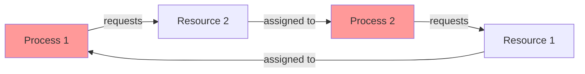
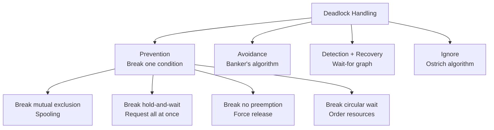

# Deadlocks

## Overview

A **deadlock** is a situation where two or more processes are permanently blocked, each waiting for a resource held by another. None can proceed, and none will ever release their resources. Deadlocks are one of the most serious concurrency bugs.

## The Deadlock Example

```
Thread A:                      Thread B:
lock(mutex1)  ✓                lock(mutex2)  ✓
lock(mutex2)  BLOCKED ←→      lock(mutex1)  BLOCKED
```

Both threads wait forever.

## Four Necessary Conditions (Coffman Conditions)

All four must hold simultaneously for deadlock:

| Condition | Description | Example |
|-----------|-------------|---------|
| **Mutual Exclusion** | Only one process can use a resource at a time | Mutex, printer |
| **Hold and Wait** | Process holds resource while waiting for another | Holding mutex1, waiting for mutex2 |
| **No Preemption** | Resources cannot be forcibly taken away | Can't force a thread to release mutex |
| **Circular Wait** | Circular chain of processes waiting for each other | A waits for B, B waits for A |

## Resource Allocation Graph



**Cycle in graph = potential deadlock** (with single-instance resources, cycle = deadlock).

## Strategies for Handling Deadlocks

| Strategy | Description | Cost |
|----------|-------------|------|
| **Prevention** | Eliminate one of the four conditions | Restrict programming |
| **Avoidance** | Dynamically check before granting (Banker's) | Runtime overhead |
| **Detection + Recovery** | Let deadlocks happen, detect and fix | Recovery cost |
| **Ignore (Ostrich)** | Pretend deadlocks don't happen | Risk of deadlock |

## Chapter Contents

- [Prevention](prevention.md) — breaking the four conditions
- [Avoidance](avoidance.md) — Banker's algorithm
- [Detection](detection.md) — cycle detection in wait-for graph
- [Recovery](recovery.md) — what to do after deadlock
- [Banker's Algorithm](bankers.md) — safe state verification

## Interview Quick Facts

1. **Deadlock requires ALL four conditions**: mutual exclusion, hold-and-wait, no preemption, circular wait
2. **Prevention**: break any one condition
3. **Avoidance**: Banker's algorithm checks if granting a request leads to unsafe state
4. **Detection**: find cycles in wait-for graph
5. **Recovery**: kill processes or preempt resources

## Diagram: Deadlock Strategies



## Cross-References

- [Mutexes](../mutex.md) — common source of deadlocks
- [Semaphores](../semaphores.md) — another source
- [Banker's Algorithm](bankers.md) — avoidance strategy
- [Synchronization](../README.md) — the broader context
