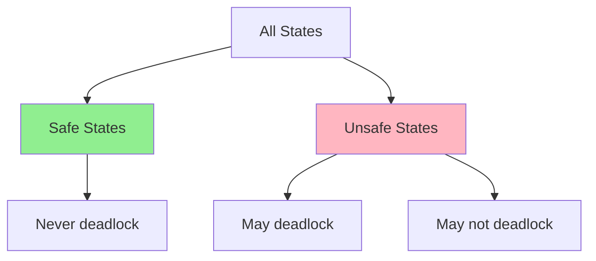

# Deadlock Avoidance

## Overview

**Deadlock avoidance** dynamically examines resource allocation state before granting requests. If granting a request would lead to an **unsafe state** (potential deadlock), the request is denied. The most famous avoidance algorithm is **Banker's Algorithm** by Dijkstra.

## Safe vs Unsafe States

### Safe State
A state is **safe** if the system can find a sequence of processes such that each process can complete with the currently available resources plus resources held by processes earlier in the sequence.

### Unsafe State
Not all unsafe states are deadlocks, but all deadlocks occur in unsafe states.



## Banker's Algorithm

### Setup

- **n** processes, **m** resource types
- **Available[m]**: vector of available resources
- **Max[n][m]**: maximum need of each process
- **Allocation[n][m]**: currently allocated resources
- **Need[n][m]**: remaining need = Max - Allocation

### Example

```
3 resource types: A=10, B=5, C=7

Process  Max    Allocation  Need
         A B C  A B C       A B C
P0       7 5 3  0 1 0       7 4 3
P1       3 2 2  2 0 0       1 2 2
P2       9 0 2  3 0 2       6 0 0
P3       2 2 2  2 1 1       0 1 1
P4       4 3 3  0 0 2       4 3 1

Available: A=3, B=3, C=2
```

### Safety Algorithm

```
1. Work = Available, Finish[i] = false for all i
2. Find i such that:
   - Finish[i] == false
   - Need[i] <= Work
3. If found:
   - Work = Work + Allocation[i]  (process finishes, releases resources)
   - Finish[i] = true
   - Go to step 2
4. If all Finish[i] == true → SAFE STATE
   Otherwise → UNSAFE STATE
```

### Trace

```
Available: (3, 3, 2)

Step 1: Find P1: Need(1,2,2) <= (3,3,2) ✓
  Work = (3,3,2) + (2,0,0) = (5,3,2)
  Finish: [F, T, F, F, F]

Step 2: Find P3: Need(0,1,1) <= (5,3,2) ✓
  Work = (5,3,2) + (2,1,1) = (7,4,3)
  Finish: [F, T, F, T, F]

Step 3: Find P4: Need(4,3,1) <= (7,4,3) ✓
  Work = (7,4,3) + (0,0,2) = (7,4,5)
  Finish: [F, T, F, T, T]

Step 4: Find P2: Need(6,0,0) <= (7,4,5) ✓
  Work = (7,4,5) + (3,0,2) = (10,4,7)
  Finish: [F, T, T, T, T]

Step 5: Find P0: Need(7,4,3) <= (10,4,7) ✓
  Work = (10,4,7) + (0,1,0) = (10,5,7)
  Finish: [T, T, T, T, T]

Safe sequence: P1 → P3 → P4 → P2 → P0 ✅ SAFE
```

### Resource-Request Algorithm

When process P_i requests resources Request[i]:

```
1. If Request[i] <= Need[i], go to step 2
   Otherwise: error (exceeded maximum claim)

2. If Request[i] <= Available, go to step 3
   Otherwise: wait (resources not available)

3. Pretend to allocate:
   Available = Available - Request[i]
   Allocation[i] = Allocation[i] + Request[i]
   Need[i] = Need[i] - Request[i]

4. Run safety algorithm:
   If safe → grant request
   If unsafe → undo changes and wait
```

### Example Request

P1 requests (1, 0, 2):

```
1. (1,0,2) <= Need[1]=(1,2,2) ✓
2. (1,0,2) <= Available=(3,3,2) ✓
3. Pretend:
   Available = (3,3,2) - (1,0,2) = (2,3,0)
   Allocation[1] = (2,0,0) + (1,0,2) = (3,0,2)
   Need[1] = (1,2,2) - (1,0,2) = (0,2,0)

4. Safety check with new state:
   Available = (2,3,0)
   
   P3: Need(0,1,1) <= (2,3,0)? No (C: 1 > 0)
   P1: Need(0,2,0) <= (2,3,0)? Yes
     Work = (2,3,0) + (3,0,2) = (5,3,2)
   
   P3: Need(0,1,1) <= (5,3,2)? Yes
     Work = (5,3,2) + (2,1,1) = (7,4,3)
   
   Continue... all finish → SAFE → GRANT REQUEST
```

## Limitations of Banker's Algorithm

| Limitation | Description |
|-----------|-------------|
| Requires advance knowledge | Must know Max resources per process |
| Static process count | Doesn't handle new processes well |
| Computational overhead | O(m × n²) per request |
| Conservative | May deny requests that wouldn't actually cause deadlock |

## Interview Questions

**Q1: What is the difference between safe and unsafe states?**

A safe state guarantees that all processes can complete in some order. An unsafe state doesn't guarantee this — deadlock might occur. All deadlocks happen in unsafe states, but not all unsafe states lead to deadlock. Avoidance algorithms keep the system in safe states.

**Q2: Explain Banker's algorithm step by step.**

1. Maintain Available, Max, Allocation, Need matrices
2. On request: check if Request ≤ Need and Request ≤ Available
3. Pretend to allocate: update Available, Allocation, Need
4. Run safety check: find a sequence where each process can finish
5. If safe: grant. If unsafe: undo pretend and wait.

**Q3: What are the limitations of Banker's algorithm?**

Must know maximum resource needs in advance. O(m×n²) overhead per request. Doesn't handle dynamic process creation/removal well. Conservative — may deny safe requests. Not used in practice for general-purpose OS — resource ordering is preferred.

**Q4: How does avoidance differ from prevention?**

Prevention makes deadlock impossible by design (e.g., resource ordering). Avoidance checks at runtime whether a request is safe before granting. Prevention is more restrictive; avoidance is more flexible but has computational overhead.

**Q5: Why isn't Banker's algorithm used in real operating systems?**

The overhead of running the safety check on every resource request is too high. Additionally, processes rarely declare their maximum resource needs accurately. Real systems use deadlock prevention (resource ordering) or detection + recovery instead.

## Common Mistakes

- Confusing safe state with deadlock-free state (unsafe ≠ deadlock)
- Forgetting to undo the "pretend" allocation when a request is denied
- Not updating Need when Allocation changes
- Applying Banker's to single-instance resources (simpler graph-based approach suffices)

## Summary

- Avoidance checks state before granting requests
- Safe state: all processes can complete in some sequence
- Banker's algorithm: O(m×n²) safety check per request
- Must know Max resources in advance
- Not used in practice due to overhead and assumptions
- Resource ordering (prevention) is preferred

## Cross-References

- [Banker's Algorithm](bankers.md) — detailed implementation
- [Deadlock Prevention](prevention.md) — design-time alternative
- [Deadlock Detection](detection.md) — runtime detection
- [Deadlock Recovery](recovery.md) — fixing deadlocks
