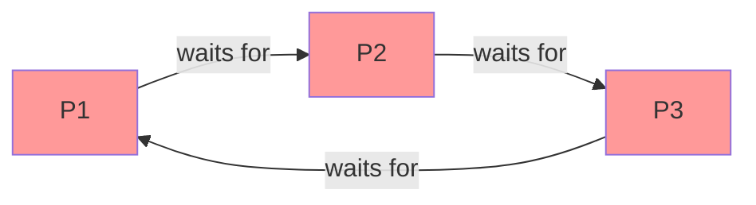
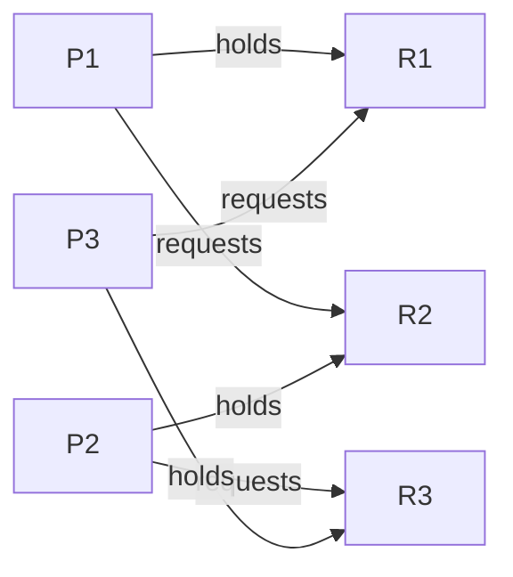

# Deadlock Detection

## Overview

**Deadlock detection** allows deadlocks to occur but detects them after the fact. The system periodically checks for deadlocks and, if found, initiates recovery. This approach has less overhead than avoidance but requires a recovery mechanism.

## Single Instance Resources: Wait-For Graph

For resources with a single instance, use a **Wait-For Graph** (WFG):

- **Nodes**: Processes
- **Edge**: P_i → P_j means P_i is waiting for a resource held by P_j

**Deadlock = cycle in the wait-for graph.**



### Example

```
P1 holds R1, waits for R2
P2 holds R2, waits for R3
P3 holds R3, waits for R1

Wait-for graph: P1→P2→P3→P1 (cycle) → DEADLOCK
```

### Cycle Detection Algorithm

Use DFS to find cycles:

```c
bool has_cycle(int n, bool adj[n][n]) {
    enum { WHITE, GRAY, BLACK };
    int color[n];
    memset(color, WHITE, sizeof(color));
    
    for (int i = 0; i < n; i++) {
        if (color[i] == WHITE && dfs(i, adj, color, n))
            return true;
    }
    return false;
}

bool dfs(int u, bool adj[][n], int color[], int n) {
    color[u] = GRAY;
    for (int v = 0; v < n; v++) {
        if (adj[u][v]) {
            if (color[v] == GRAY) return true;  // Cycle!
            if (color[v] == WHITE && dfs(v, adj, color, n))
                return true;
        }
    }
    color[u] = BLACK;
    return false;
}
```

**Time complexity**: O(V²) where V is the number of processes.

## Multiple Instance Resources: Detection Algorithm

For resources with multiple instances, use a Banker's-like algorithm:

### Setup

- **Available[m]**: available resources per type
- **Allocation[n][m]**: resources allocated to each process
- **Request[n][m]**: current request of each process

### Algorithm

```
1. Work = Available, Finish[i] = false for all i
   (Finish[i] = true if Allocation[i] == 0, meaning no resources)

2. Find i such that:
   - Finish[i] == false
   - Request[i] <= Work

3. If found:
   - Work = Work + Allocation[i]
   - Finish[i] = true
   - Go to step 2

4. If any Finish[i] == false → those processes are DEADLOCKED
```

### Example

```
Processes: P0, P1, P2, P3, P4
Resource types: A, B, C

         Allocation  Request   Available
         A  B  C     A  B  C   A  B  C
P0       0  1  0     0  0  0   0  0  0
P1       2  0  0     2  0  2
P2       3  0  3     0  0  0
P3       2  1  1     1  0  0
P4       0  0  2     0  0  2

Step 1: Work = (0,0,0)
  P0: Request(0,0,0) <= (0,0,0) ✓
    Work = (0,0,0) + (0,1,0) = (0,1,0), Finish[0]=T

Step 2: Work = (0,1,0)
  P2: Request(0,0,0) <= (0,1,0) ✓
    Work = (0,1,0) + (3,0,3) = (3,1,3), Finish[2]=T

Step 3: Work = (3,1,3)
  P1: Request(2,0,2) <= (3,1,3) ✓
    Work = (3,1,3) + (2,0,0) = (5,1,3), Finish[1]=T

Step 4: Work = (5,1,3)
  P3: Request(1,0,0) <= (5,1,3) ✓
    Work = (5,1,3) + (2,1,1) = (7,2,4), Finish[3]=T

Step 5: Work = (7,2,4)
  P4: Request(0,0,2) <= (7,2,4) ✓
    Work = (7,2,4) + (0,0,2) = (7,2,6), Finish[4]=T

All Finish = true → NO DEADLOCK
```

## When to Run Detection

| Strategy | Description | Overhead |
|----------|-------------|----------|
| Every request | Check after each allocation | High overhead, immediate detection |
| Periodically | Run every T seconds | Medium overhead, delayed detection |
| When utilization drops | Run when CPU is idle | Low overhead, delayed detection |

## Resource Allocation Graph with Requests



With single instances: cycle = deadlock.
With multiple instances: cycle is necessary but not sufficient.

## Interview Questions

**Q1: How does deadlock detection work?**

The system maintains a wait-for graph (for single-instance resources) or a detection matrix (for multiple-instance resources). For single-instance: find cycles in the graph using DFS. For multiple-instance: run a Banker's-like algorithm to find processes that can't complete. Deadlocked processes have `Finish[i] == false`.

**Q2: What is the difference between detection for single-instance and multi-instance resources?**

Single-instance: wait-for graph with cycle detection (O(V²)). Multi-instance: Banker's-like algorithm checking if each process can complete (O(m×n²)). Cycles in multi-instance graphs are necessary but not sufficient for deadlock.

**Q3: When should deadlock detection be run?**

Options: (1) after every allocation — immediate but expensive, (2) periodically — balanced, (3) when CPU utilization drops — cheap but delayed. Most systems use periodic detection or run it when performance degrades (which may indicate deadlock).

**Q4: What is the relationship between detection and avoidance?**

Avoidance checks before granting (prevents unsafe states). Detection checks after allocation (finds actual deadlocks). Avoidance is proactive; detection is reactive. Detection has less overhead per operation but requires recovery.

**Q5: How do you represent multiple-instance resources in a detection algorithm?**

Use matrices: Allocation[n][m] (current allocation), Request[n][m] (current requests), Available[m] (free resources). Run a completion check: if a process's request ≤ available, it can finish and release its resources. Repeat until all finish (no deadlock) or no more can finish (deadlocked processes identified).

## Common Mistakes

- Assuming a cycle in a multi-instance resource graph means deadlock (it doesn't)
- Not updating the detection data structures after each allocation/deallocation
- Running detection too frequently (overhead) or too rarely (delayed detection)
- Forgetting to handle processes with zero allocation (they're always "finished")
- Not considering that detection itself must be deadlock-free

## Summary

- Detection allows deadlocks to occur, then finds and recovers from them
- Single-instance: wait-for graph, cycle detection via DFS
- Multi-instance: Banker's-like completion check
- Run periodically or when performance degrades
- Less overhead than avoidance but requires recovery mechanism
- Deadlock = cycle (single-instance) or stuck processes (multi-instance)

## Cross-References

- [Deadlock Recovery](recovery.md) — what to do after detection
- [Deadlock Prevention](prevention.md) — preventing deadlocks by design
- [Deadlock Avoidance](avoidance.md) — Banker's algorithm
- [Banker's Algorithm](bankers.md) — similar to detection algorithm


## Cross References

- [Deadlock Avoidance](avoidance.md)
- [Deadlock Recovery](recovery.md)
- [Deadlock Prevention](prevention.md)
