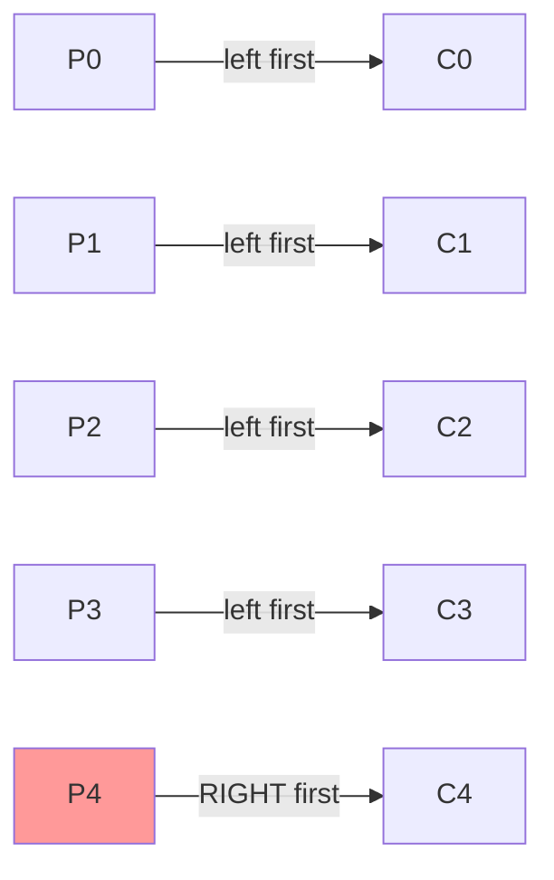

# Dining Philosophers Problem

## Overview

The **Dining Philosophers Problem** was formulated by Edsger Dijkstra in 1965. Five philosophers sit around a table, alternating between thinking and eating. Between each pair of philosophers is one chopstick (5 chopsticks total). A philosopher needs both adjacent chopsticks to eat. The challenge is to design a protocol that avoids deadlock and starvation.

## Problem Setup

```
            P0
           /  \
         C4    C0
        /        \
      P4          P1
       \          /
        C3      C1
          \    /
           P3-C2-P2

Pentagon layout: philosophers P0..P4 at the 5 vertices,
chopstick C_i is on the edge between P_i and P_{(i+1)%5}.

P_i needs C_i and C_{(i+1)%5}:
  P0 needs C0, C4
  P1 needs C1, C0
  P2 needs C2, C1
  P3 needs C3, C2
  P4 needs C4, C3
```

## Why It Matters

This problem models resource allocation where:
- Multiple resources are needed simultaneously
- Resources are shared between processes
- Deadlock and starvation are possible

## Solution 1: Naive (Deadlock-Prone)

```c
sem_t chopstick[5];

void philosopher(int i) {
    while (1) {
        think();
        wait(&chopstick[i]);           // Pick up left
        wait(&chopstick[(i+1) % 5]);   // Pick up right
        eat();
        signal(&chopstick[(i+1) % 5]); // Put down right
        signal(&chopstick[i]);          // Put down left
    }
}
```

**Problem**: Deadlock! All philosophers pick up left chopstick simultaneously → all wait for right → deadlock.

## Solution 2: Resource Ordering (Asymmetric)

```c
void philosopher(int i) {
    while (1) {
        think();
        if (i == 4) {
            // Philosopher 4 picks up RIGHT first
            wait(&chopstick[(i+1) % 5]);
            wait(&chopstick[i]);
        } else {
            // Others pick up LEFT first
            wait(&chopstick[i]);
            wait(&chopstick[(i+1) % 5]);
        }
        eat();
        signal(&chopstick[i]);
        signal(&chopstick[(i+1) % 5]);
    }
}
```

**Why it works**: Breaks the circular wait condition. At least one philosopher picks up in reverse order, preventing the cycle.



## Solution 3: Limit Concurrent Diners

```c
sem_t room;  // init = 4 (one less than philosophers)

void philosopher(int i) {
    while (1) {
        think();
        wait(&room);                    // At most 4 can try
        wait(&chopstick[i]);
        wait(&chopstick[(i+1) % 5]);
        eat();
        signal(&chopstick[(i+1) % 5]);
        signal(&chopstick[i]);
        signal(&room);
    }
}
```

**Why it works**: With only 4 philosophers trying to eat, at least one will get both chopsticks.

## Solution 4: Monitor (Java)

```java
public class DiningTable {
    enum State { THINKING, HUNGRY, EATING }
    private State[] state = new State[5];
    private Condition[] self = new Condition[5];
    private Lock lock = new ReentrantLock();
    
    public DiningTable() {
        for (int i = 0; i < 5; i++) {
            state[i] = State.THINKING;
            self[i] = lock.newCondition();
        }
    }
    
    public void pickup(int i) throws InterruptedException {
        lock.lock();
        state[i] = State.HUNGRY;
        test(i);
        while (state[i] != State.EATING)
            self[i].await();
        lock.unlock();
    }
    
    public void putdown(int i) {
        lock.lock();
        state[i] = State.THINKING;
        test((i + 4) % 5);  // Check left neighbor
        test((i + 1) % 5);  // Check right neighbor
        lock.unlock();
    }
    
    private void test(int i) {
        if (state[(i + 4) % 5] != State.EATING &&
            state[i] == State.HUNGRY &&
            state[(i + 1) % 5] != State.EATING) {
            state[i] = State.EATING;
            self[i].signal();
        }
    }
}
```

**Properties**: No deadlock, no starvation (condition variables guarantee bounded waiting).

## Solution 5: Chandy/Misra Solution

A fully distributed solution where philosophers communicate with neighbors:

1. When hungry, request both chopsticks
2. If you have a chopstick and your neighbor requests it, give it up (unless you're eating)
3. Clean chopsticks go to the philosopher with the lower ID

**Properties**: No centralized control, no deadlock, no starvation, fully distributed.

## Comparison of Solutions

| Solution | Deadlock-Free | Starvation-Free | Distributed | Complexity |
|----------|--------------|-----------------|-------------|------------|
| Resource ordering | Yes | No | Yes | Low |
| Limit diners | Yes | No | No | Low |
| Monitor | Yes | Yes | No | Medium |
| Chandy/Misra | Yes | Yes | Yes | High |

## Interview Questions

**Q1: What is the dining philosophers problem and how do you solve it?**

Five philosophers alternate between thinking and eating, needing two adjacent chopsticks to eat. Naive solution: all pick up left → deadlock. Solutions: (1) resource ordering (one philosopher picks up in reverse), (2) limit to N-1 concurrent diners, (3) monitor with condition variables, (4) Chandy/Misra distributed algorithm.

**Q2: How does resource ordering prevent deadlock?**

Deadlock requires circular wait. If all philosophers pick up left then right, there's a cycle: P0 waits for C1 held by P1, P1 waits for C2 held by P2, etc. Making one philosopher pick up right first (asymmetric) breaks the cycle. The philosopher who reverses order can't be part of the circular dependency.

**Q3: How does the monitor-based solution prevent starvation?**

When a philosopher puts down chopsticks, it checks if both neighbors can eat (they're hungry and neither adjacent philosopher is eating). If so, it signals them. Condition variables ensure that signaled philosophers eventually run. Since each philosopher only waits when a neighbor is eating, and eating takes finite time, waiting is bounded.

**Q4: What is the Chandy/Misra solution?**

A fully distributed algorithm: philosophers send request messages for chopsticks. If a philosopher has a clean chopstick and receives a request, it passes it. Chopsticks are marked clean/dirty — dirty ones must be cleaned before being passed. A philosopher who just ate has dirty chopsticks and must give them up if requested. This ensures fairness without centralized control.

**Q5: Why is limiting concurrent diners to N-1 a valid solution?**

With 5 philosophers and 4 allowed to try, at least one will find both chopsticks available (pigeonhole principle). If 4 philosophers each hold one chopstick, they're using 4 chopsticks out of 5, so one chopstick is free. The philosopher adjacent to the free chopstick already has one, so they can pick up the other and eat.

## Common Mistakes

- Not handling the case where a philosopher is interrupted while holding one chopstick
- Using binary semaphores for chopsticks without considering deadlock
- Not considering starvation — deadlock-free doesn't mean starvation-free
- Overcomplicating the solution when resource ordering is sufficient
- Forgetting that real implementations need timeout handling

## Summary

- Classic resource allocation problem: avoid deadlock and starvation
- Resource ordering (asymmetric solution) is simplest and most practical
- Monitor-based solution prevents both deadlock and starvation
- Chandy/Misra provides a fully distributed solution
- Models real-world scenarios: database locks, network resources, device access

## Cross-References

- [Semaphores](semaphores.md) — used in most solutions
- [Monitors](monitors.md) — monitor-based solution
- [Deadlocks](deadlocks/README.md) — the problem to avoid
- [Critical Section](critical-section.md) — the fundamental problem
- [Readers-Writers](readers-writers.md) — another classic synchronization problem
