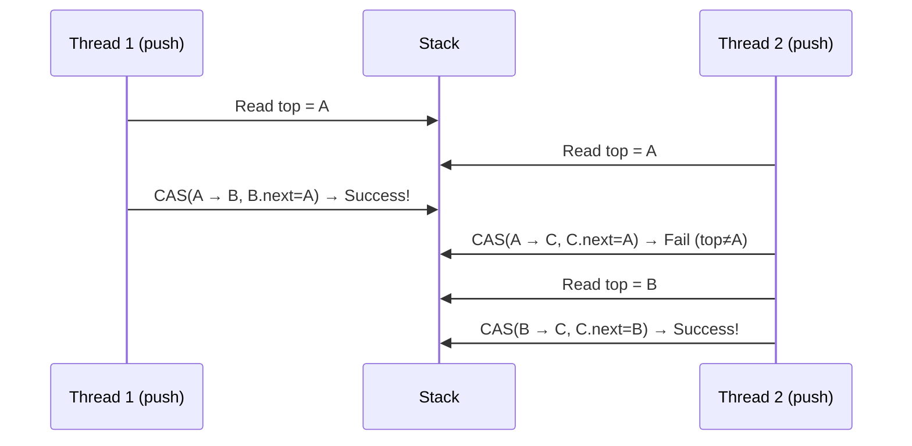

# Lock-Free Data Structures

## Overview

**Lock-free** (non-blocking) data structures provide thread-safe access without using locks (mutexes, spinlocks). They use atomic hardware instructions (CAS, FAA) to ensure progress. The key advantage: at least one thread always makes progress, even if other threads are suspended.

## Blocking vs Non-Blocking

| Property | Blocking (Locks) | Lock-Free | Wait-Free |
|----------|------------------|-----------|-----------|
| Progress | All threads may block | At least 1 makes progress | Every thread makes progress |
| Deadlock | Possible | Impossible | Impossible |
| Starvation | Possible | Possible | Impossible |
| Complexity | Low | High | Very high |
| Performance | Good (short CS) | Excellent (contention) | Variable |

## Lock-Free Stack (Treiber Stack)

```c
#include <stdatomic.h>

typedef struct Node {
    int data;
    struct Node *next;
} Node;

typedef struct {
    _Atomic(Node *) top;
} LockFreeStack;

void push(LockFreeStack *stack, int value) {
    Node *new_node = malloc(sizeof(Node));
    new_node->data = value;
    
    Node *old_top;
    do {
        old_top = atomic_load(&stack->top);
        new_node->next = old_top;
    } while (!atomic_compare_exchange_weak(&stack->top, &old_top, new_node));
}

int pop(LockFreeStack *stack, int *result) {
    Node *old_top;
    Node *new_top;
    do {
        old_top = atomic_load(&stack->top);
        if (old_top == NULL) return 0;  // Empty
        new_top = old_top->next;
    } while (!atomic_compare_exchange_weak(&stack->top, &old_top, new_top));
    
    *result = old_top->data;
    // free(old_top) — ABA problem! (see below)
    return 1;
}
```



## Lock-Free Queue (Michael-Scott Queue)

```c
typedef struct Node {
    int data;
    _Atomic(Node *) next;
} Node;

typedef struct {
    _Atomic(Node *) head;
    _Atomic(Node *) tail;
} LockFreeQueue;

void enqueue(LockFreeQueue *q, int value) {
    Node *new_node = malloc(sizeof(Node));
    new_node->data = value;
    atomic_store(&new_node->next, NULL);
    
    Node *old_tail;
    while (1) {
        old_tail = atomic_load(&q->tail);
        Node *next = atomic_load(&old_tail->next);
        if (next == NULL) {
            if (atomic_compare_exchange_weak(&old_tail->next, &next, new_node))
                break;
        } else {
            // Tail is lagging, help advance it
            atomic_compare_exchange_weak(&q->tail, &old_tail, next);
        }
    }
    atomic_compare_exchange_weak(&q->tail, &old_tail, new_node);
}
```

**Key insight**: Threads help each other advance pointers, preventing a slow thread from blocking others.

## ABA Problem

The **ABA problem** occurs when a value changes from A to B and back to A between a read and a CAS. The CAS succeeds but the state has changed.

```
Thread 1: reads top = A
Thread 1: preempts
Thread 2: pop A, pop B, push A (A is back on top but with different next)
Thread 1: resumes, CAS(A → new) succeeds!
But A.next has changed → corrupt data structure
```

### Solutions

| Solution | Description |
|----------|-------------|
| **Hazard pointers** | Threads announce which pointers they're accessing |
| **Epoch-based reclamation** | Defer freeing until all threads pass an epoch |
| **Tagged pointers** | Use extra bits to count modifications (32-bit tag + 32-bit pointer) |
| **RCU** | Read-Copy-Update — wait for grace period before freeing |

### Hazard Pointers

```c
// Each thread has a hazard pointer slot
_Atomic(Node *) hazard[NUM_THREADS];

void *safe_read(_Atomic(Node *) *ptr, int tid) {
    Node *p;
    do {
        p = atomic_load(ptr);
        atomic_store(&hazard[tid], p);      // Announce
    } while (p != atomic_load(ptr));         // Verify not changed
    return p;
}

// Free only if no hazard pointer points to it
void safe_free(Node *p) {
    for (int i = 0; i < NUM_THREADS; i++) {
        if (atomic_load(&hazard[i]) == p) {
            defer_free(p);  // Retry later
            return;
        }
    }
    free(p);
}
```

## Lock-Free Linked List (Harris's Algorithm)

```c
// Mark pointer with LSB to indicate "logically deleted"
#define MARKED(p)   ((Node *)((uintptr_t)(p) | 1))
#define UNMARKED(p) ((Node *)((uintptr_t)(p) & ~1))
#define IS_MARKED(p) ((uintptr_t)(p) & 1)

typedef struct Node {
    int key;
    _Atomic(Node *) next;
} Node;

// Physically remove marked nodes during traversal
Node *get_next(Node *node) {
    Node *next = atomic_load(&node->next);
    while (IS_MARKED(next)) {
        node = UNMARKED(next);
        next = atomic_load(&node->next);
    }
    return next;
}
```

## Lock-Free in the Linux Kernel

Linux provides atomic operations:

```c
#include <linux/atomic.h>

atomic_t counter = ATOMIC_INIT(0);

atomic_inc(&counter);           // atomic increment
atomic_dec(&counter);           // atomic decrement
atomic_add(5, &counter);        // atomic add
atomic_cmpxchg(&counter, 0, 1); // CAS
atomic_xchg(&counter, 10);      // atomic exchange

// For pointers
void *old = cmpxchg(&ptr, expected, new_val);
```

## Performance Considerations

### When Lock-Free Wins

- **High contention**: Threads don't block each other
- **Unequal thread speeds**: Slow threads don't hold up fast ones
- **Preemption-prone**: No priority inversion

### When Locks Win

- **Low contention**: Lock overhead is minimal
- **Short critical sections**: Spinlock acquire/release is fast
- **Complex operations**: Hard to make lock-free

## Interview Questions

**Q1: What is the difference between lock-free and wait-free?**

Lock-free guarantees that **at least one** thread makes progress in a finite number of steps. Wait-free guarantees that **every** thread makes progress. Wait-free is stronger but much harder to implement. Lock-free prevents deadlock and system-wide starvation but individual threads can still starve.

**Q2: What is the ABA problem and how do you solve it?**

The ABA problem: a value changes A→B→A between a read and CAS. The CAS succeeds but the underlying state has changed. Solutions: (1) hazard pointers — announce which pointers you're reading, (2) tagged pointers — increment a counter on each modification, (3) RCU — defer reclamation until all readers finish.

**Q3: How does a lock-free stack work?**

Push: create new node, set its `next` to current `top`, CAS `top` from old to new. Pop: read `top`, read `top.next`, CAS `top` from old to `next`. If CAS fails (another thread modified top), retry. At least one thread's CAS succeeds per retry round, guaranteeing progress.

**Q4: Why might a lock-free data structure perform worse than a locked one?**

Under low contention, CAS retry loops have overhead (memory barriers, cache-line bouncing). A simple spinlock with a single atomic operation (test_and_set) can be faster. Lock-free shines under high contention where locks cause threads to block and context-switch.

**Q5: What is "helping" in lock-free algorithms?**

When a thread notices another thread is slow (e.g., tail pointer in a queue is lagging), it helps the slow thread complete its operation before doing its own. This ensures system-wide progress — no single thread can block the entire algorithm. Used in Michael-Scott queue and other lock-free structures.

## Common Mistakes

- Forgetting about the ABA problem in CAS-based structures
- Not using proper memory ordering (memory_order_relaxed vs acquire/release)
- Assuming lock-free always means faster — it depends on contention
- Memory leaks — can't free nodes that other threads might be reading
- Not handling the empty/full cases in lock-free containers

## Summary

- Lock-free structures use CAS/FAA instead of locks for thread safety
- At least one thread always makes progress (no deadlock)
- ABA problem is the main challenge — solved by hazard pointers, tagged pointers, or RCU
- Treiber stack and Michael-Scott queue are classic lock-free structures
- Performance depends on contention level — not always faster than locks

## Cross-References

- [CAS](cas.md) — the atomic primitive used
- [Memory Barriers](memory-barriers.md) — ordering requirements
- [Spinlocks](spinlocks.md) — alternative for short critical sections
- [Mutexes](mutex.md) — blocking alternative
- [Deadlocks](deadlocks/README.md) — lock-free prevents deadlock


## Cross References

- [CAS](cas.md)
- [Memory Barriers](memory-barriers.md)
- [Lock-Free (Concurrency)](../../concurrency/lock-free.md)
- [Optimistic Concurrency](../../dbms/transactions/optimistic.md)
