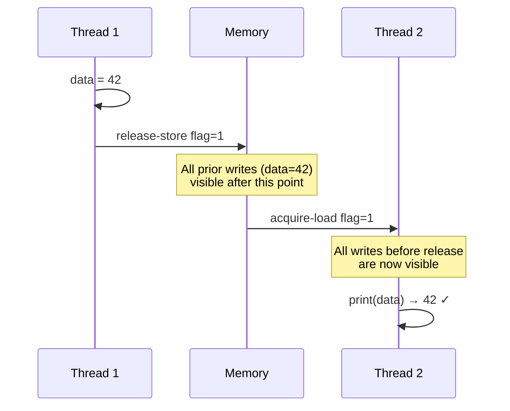
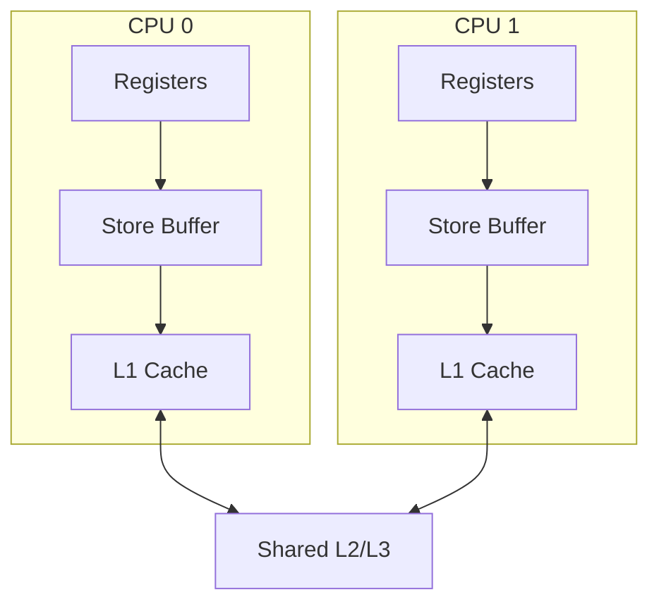

# Memory Barriers (Fences)

## Overview

Modern CPUs execute instructions **out of order** and use **store buffers** and **caches** for performance. This means memory operations may not be visible to other CPUs in the order you wrote them. **Memory barriers** (fences) enforce ordering, ensuring that operations before the barrier are visible before operations after it.

## The Problem

```c
// Thread 1              // Thread 2
x = 1;                   while (y == 0) {}
y = 1;                   print(x);  // Might print 0!
```

Even though Thread 1 writes `x` before `y`, Thread 2 might see `y=1` but `x=0` because:
1. **Store buffer**: `x=1` is in Thread 1's store buffer, not yet in cache/memory
2. **Out-of-order execution**: CPU reordered the stores
3. **Cache coherence delay**: Invalidation messages haven't propagated

## Memory Ordering Models

### Sequential Consistency (SC)

All operations appear in some total order consistent with program order. The strongest model — all CPUs see the same order.

### Total Store Order (TSO) — x86

- Stores can be reordered after loads (store buffer)
- Loads are not reordered with loads
- Stores are not reordered with stores
- **Most common**: x86 is TSO

### Weak Ordering — ARM, RISC-V

- Almost anything can be reordered
- Explicit barriers needed everywhere
- Better performance, more programming burden

## Types of Barriers

### Full Memory Barrier

```c
// All operations before this are visible before any operation after
atomic_thread_fence(memory_order_seq_cst);
__sync_synchronize();          // GCC legacy
asm volatile("mfence" ::: "memory");  // x86
```

### Store Barrier (Write Barrier)

```c
// All stores before this are visible before any store after
atomic_thread_fence(memory_order_release);
asm volatile("sfence" ::: "memory");  // x86
```

### Load Barrier (Read Barrier)

```c
// All loads before this complete before any load after
atomic_thread_fence(memory_order_acquire);
asm volatile("lfence" ::: "memory");  // x86
```

## C11 Memory Model

### Memory Orderings

```c
#include <stdatomic.h>

atomic_int x, y;

// Relaxed — no ordering
atomic_store_explicit(&x, 1, memory_order_relaxed);
int val = atomic_load_explicit(&x, memory_order_relaxed);

// Release — all prior operations visible after acquire of same variable
atomic_store_explicit(&x, 1, memory_order_release);
int val = atomic_load_explicit(&x, memory_order_acquire);

// Acquire — sees all operations before the matching release
int val = atomic_load_explicit(&x, memory_order_acquire);

// Acq_rel — both acquire and release (for read-modify-write)
atomic_fetch_add_explicit(&x, 1, memory_order_acq_rel);

// Seq_cst — sequential consistency (strongest, default)
atomic_store_explicit(&x, 1, memory_order_seq_cst);
```

### When to Use Each

| Ordering | Use Case | Example |
|----------|----------|---------|
| `relaxed` | Counters, statistics | `atomic_fetch_add(&counter, 1, relaxed)` |
| `release` | Publishing data | Store data, then release-store flag |
| `acquire` | Reading published data | Acquire-load flag, then read data |
| `acq_rel` | Read-modify-write on shared state | `fetch_add` on lock |
| `seq_cst` | When in doubt, use this | Default, strongest |

## Release-Acquire Pattern

The most important pattern in lock-free programming:

```c
// Thread 1 — Producer
data = 42;                                          // Regular store
atomic_store_explicit(&flag, 1, memory_order_release); // Release store

// Thread 2 — Consumer
while (atomic_load_explicit(&flag, memory_order_acquire) == 0) // Acquire load
    ;
print(data);  // Guaranteed to see 42
```



**Guarantee**: If Thread 2 sees `flag=1`, it also sees `data=42`.

## Store Buffer and Barrier



A store goes: Register → Store Buffer → L1 Cache → L2/3 → Memory

The store buffer is **private** to each CPU. Other CPUs can't see stores in the buffer.

**Memory barrier**: Flushes the store buffer, making stores visible to other CPUs.

## Dekker's Algorithm with Barriers

```c
// Thread 0                    // Thread 1
flag0 = 1;                     flag1 = 1;
memory_barrier();              memory_barrier();
if (flag1 == 0) {              if (flag0 == 0) {
    // Enter CS                   // Enter CS
}                              }
flag0 = 0;                     flag1 = 0;
```

Without barriers, both threads might see the other's flag as 0 (stores in store buffers).

## Linux Kernel Barriers

```c
#include <linux/barrier.h>

// Full barrier
mb();      // All memory operations
rmb();     // Reads (loads)
wmb();     // Writes (stores)

// Compiler barriers (prevent compiler reordering only)
barrier();

// SMP barriers (no-op on UP systems)
smp_mb();
smp_rmb();
smp_wmb();

// Atomic operations with barriers
smp_mb__before_atomic();
smp_mb__after_atomic();
```

## Compiler vs CPU Reordering

Two sources of reordering:

1. **Compiler reordering**: The compiler may reorder instructions for optimization
2. **CPU reordering**: The CPU executes instructions out of order

```c
// Compiler barrier prevents compiler reordering
asm volatile("" ::: "memory");

// Memory barrier prevents BOTH compiler and CPU reordering
asm volatile("mfence" ::: "memory");  // x86
```

## Acquire-Release vs Seq_cst

```c
// Acquire-release: only guarantees ordering between paired operations
// Thread 1                    // Thread 2
store_release(&flag, 1);       while (!load_acquire(&flag)) {}
// No guarantee about other variables' ordering with other threads

// Seq_cst: total order across ALL seq_cst operations
store_seq_cst(&flag, 1);       while (!load_seq_cst(&flag)) {}
// All seq_cst operations across all threads appear in one total order
```

## Interview Questions

**Q1: Why are memory barriers necessary?**

Modern CPUs use store buffers and execute instructions out of order. Without barriers, a store might not be visible to other CPUs when expected. Barriers flush store buffers and prevent reordering, ensuring that memory operations are visible in the intended order.

**Q2: What is the difference between a compiler barrier and a memory barrier?**

A compiler barrier (`asm volatile("" ::: "memory")`) prevents the compiler from reordering instructions but does nothing about CPU reordering. A memory barrier (e.g., `mfence`) prevents both. In practice, you usually need memory barriers for multi-threaded code.

**Q3: Explain the release-acquire pattern.**

A release store ensures all prior writes are visible when the store is observed. An acquire load ensures all subsequent reads see writes that happened before the matching release. Together, they create a "happens-before" relationship: if Thread 2 sees the release-store, it also sees everything that happened before it.

**Q4: What is a store buffer and how does it affect visibility?**

A store buffer is a per-CPU queue that holds stores before they reach the cache. It allows the CPU to continue executing without waiting for cache coherence. Problem: other CPUs can't see stores in the buffer. A memory barrier flushes the store buffer, making stores globally visible.

**Q5: Why is x86's memory model (TSO) simpler than ARM's?**

x86 Total Store Order guarantees: loads aren't reordered with loads, stores aren't reordered with stores. Only store→load reordering is allowed (through the store buffer). ARM allows almost any reordering, requiring explicit barriers everywhere. This makes x86 programming easier but ARM more power-efficient.

## Common Mistakes

- Using `relaxed` ordering when `release/acquire` is needed — data races
- Forgetting compiler barriers — the compiler can reorder too
- Using `seq_cst` everywhere — correct but slower than necessary
- Not pairing release and acquire on the same variable
- Assuming x86's strong ordering works on ARM — it doesn't

## Summary

- Memory barriers enforce ordering of memory operations across CPUs
- Two types of reordering: compiler and CPU
- Release-acquire: the most common pattern for publishing data
- x86 is TSO (strong); ARM/RISC-V are weak (need explicit barriers)
- Store buffers cause visibility delays; barriers flush them
- Use `relaxed` for counters, `release/acquire` for data publishing, `seq_cst` when unsure

## Cross-References

- [CAS](cas.md) — atomic operations with ordering
- [Lock-Free](lock-free.md) — algorithms that need barriers
- [Spinlocks](spinlocks.md) — implicit barriers in lock/unlock
- [Peterson's Algorithm](petersons.md) — needs barriers on modern CPUs
