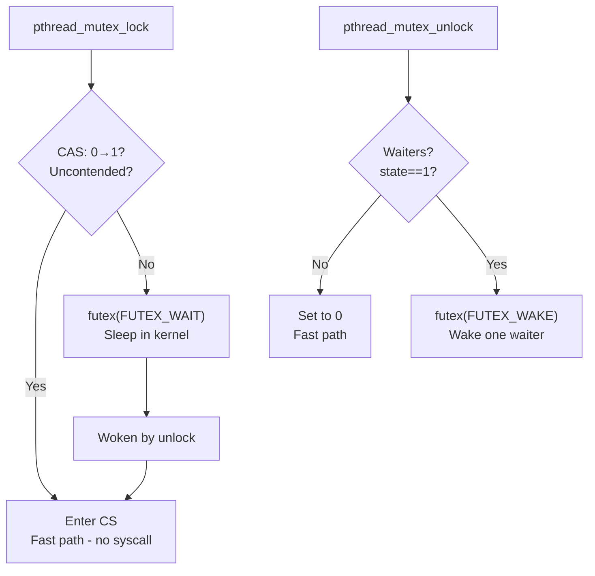

# Mutexes (Mutual Exclusion Locks)

## Overview

A **mutex** (mutual exclusion) is the simplest synchronization primitive. It ensures that only one thread can hold the lock at a time. Other threads that try to acquire the lock **block** (sleep) until it's released. Unlike spinlocks, mutexes don't waste CPU while waiting.

## Basic Operations

```c
pthread_mutex_t mutex = PTHREAD_MUTEX_INITIALIZER;

pthread_mutex_lock(&mutex);    // Acquire (block if held)
// Critical section
pthread_mutex_unlock(&mutex);  // Release

// Non-blocking acquire
if (pthread_mutex_trylock(&mutex) == 0) {
    // Got the lock
    pthread_mutex_unlock(&mutex);
} else {
    // Lock is held by someone else
}
```

## Implementation

### User-Space (Futex-based on Linux)

Linux mutexes use **futexes** (Fast Userspace muTEXes):



**Key insight**: Uncontended mutex lock/unlock is just a single CAS — no syscall!

### Kernel-Space (Semaphore-based)

In the kernel, mutexes are often built on semaphores:

```c
// Linux kernel mutex (simplified)
struct mutex {
    atomic_long_t owner;       // Thread that holds the lock
    spinlock_t wait_lock;      // Protects wait list
    struct list_head wait_list; // Sleeping threads
};
```

## Mutex Types (POSIX)

```c
pthread_mutex_t mutex;
pthread_mutexattr_t attr;

pthread_mutexattr_init(&attr);

// Default (normal) - no error checking
pthread_mutexattr_settype(&attr, PTHREAD_MUTEX_NORMAL);

// Error checking - double lock returns EDEADLK
pthread_mutexattr_settype(&attr, PTHREAD_MUTEX_ERRORCHECK);

// Recursive - same thread can lock multiple times
pthread_mutexattr_settype(&attr, PTHREAD_MUTEX_RECURSIVE);

pthread_mutex_init(&mutex, &attr);
```

### Recursive Mutex

```c
pthread_mutex_t mutex = PTHREAD_MUTEX_RECURSIVE_INITIALIZER;

void recursive_function(int n) {
    pthread_mutex_lock(&mutex);  // Lock
    if (n > 0) recursive_function(n - 1);  // Lock again (OK with recursive)
    pthread_mutex_unlock(&mutex);
}
```

**Warning**: Recursive mutexes can hide design problems. Prefer restructuring code.

## Mutex vs Spinlock vs Semaphore

| Feature | Mutex | Spinlock | Semaphore |
|---------|-------|----------|-----------|
| Blocking | Sleep | Busy-wait | Sleep |
| CPU usage while waiting | None | 100% | None |
| Context switch | Yes | No | Yes |
| Owner tracking | Yes | Yes (usually) | No |
| Best for | Long critical sections | Short CS (kernel, ISR) | Resource counting, signaling |
| Can be used in ISR | No | Yes | No |
| Reentrant | Recursive variant | No | Counting variant |

## Linux Kernel Mutex

```c
#include <linux/mutex.h>

DEFINE_MUTEX(my_mutex);

void my_function(void) {
    mutex_lock(&my_mutex);          // Sleep if contended
    // Critical section
    mutex_unlock(&my_mutex);
    
    if (mutex_trylock(&my_mutex)) { // Non-blocking
        // Got it
        mutex_unlock(&my_mutex);
    }
    
    mutex_lock_interruptible(&my_mutex); // Can be interrupted by signals
}
```

**Kernel mutex rules:**
- Cannot be used in interrupt context (may sleep)
- Only the owner can unlock
- Cannot be locked recursively (use `struct rt_mutex` for that)

## Deadlock with Mutexes

```c
// DEADLOCK!
// Thread A                    // Thread B
pthread_mutex_lock(&mutex1);  pthread_mutex_lock(&mutex2);
pthread_mutex_lock(&mutex2);  pthread_mutex_lock(&mutex1);
// Both wait forever
```

**Solution**: Always acquire locks in the same order.

## Lock Hierarchy

```c
// Define ordering: mutex1 < mutex2 < mutex3
// ALWAYS acquire in this order
pthread_mutex_lock(&mutex1);
pthread_mutex_lock(&mutex2);
pthread_mutex_lock(&mutex3);
// Critical section
pthread_mutex_unlock(&mutex3);
pthread_mutex_unlock(&mutex2);
pthread_mutex_unlock(&mutex1);
```

## Timed Lock

```c
struct timespec ts;
clock_gettime(CLOCK_REALTIME, &ts);
ts.tv_sec += 5;  // 5 second timeout

int result = pthread_mutex_timedlock(&mutex, &ts);
if (result == ETIMEDOUT) {
    // Couldn't get lock in 5 seconds
}
```

## Condition Variables (with Mutexes)

Mutexes alone can only protect critical sections. **Condition variables** add the ability to wait for a condition:

```c
pthread_mutex_t mutex = PTHREAD_MUTEX_INITIALIZER;
pthread_cond_t cond = PTHREAD_COND_INITIALIZER;
bool data_ready = false;

// Producer                          // Consumer
pthread_mutex_lock(&mutex);         pthread_mutex_lock(&mutex);
data_ready = true;                  while (!data_ready)
pthread_cond_signal(&cond);             pthread_cond_wait(&cond, &mutex);
pthread_mutex_unlock(&mutex);       // Use data...
                                    pthread_mutex_unlock(&mutex);
```

**Critical**: Always use `while`, not `if`, for condition checks (spurious wakeups).

### Why `while` not `if`?

```c
// WRONG - may use data when it's not ready
if (!data_ready)
    pthread_cond_wait(&cond, &mutex);

// CORRECT - re-check after wakeup
while (!data_ready)
    pthread_cond_wait(&cond, &mutex);
```

Spurious wakeups can occur — the thread wakes up even though the condition isn't true.

## Interview Questions

**Q1: What is a mutex and how does it differ from a semaphore?**

A mutex provides mutual exclusion — only one thread can hold it at a time. It has an **owner** concept: only the thread that locked it can unlock it. A semaphore is a signaling/counting mechanism with no owner — any thread can signal it. Use mutex for protecting critical sections, semaphore for signaling between threads or limiting concurrent access to a resource pool.

**Q2: How does a futex-based mutex work on Linux?**

A futex (Fast Userspace muTEX) is a 32-bit integer in shared memory. Uncontended lock: CAS the integer from 0 to 1 (no syscall). Contended lock: CAS fails → call `futex(FUTEX_WAIT)` to sleep in kernel. Unlock: CAS to 0. If there are waiters, call `futex(FUTEX_WAKE)` to wake one. The fast path (uncontended) requires no system calls.

**Q3: What is a spurious wakeup and how do you handle it?**

A spurious wakeup occurs when a thread blocked on `pthread_cond_wait` wakes up without the condition being signaled. This can happen due to signal delivery or internal kernel behavior. Always check the condition in a `while` loop, not an `if`, so the thread goes back to sleep if the condition isn't met.

**Q4: Why would you use a recursive mutex?**

A recursive mutex allows the same thread to lock it multiple times without deadlocking. Each lock must be matched by an unlock. Use case: recursive functions that need to hold a lock across recursive calls, or when a function calls another function that also needs the same lock. However, recursive mutexes can hide design issues.

**Q5: What is the lock hierarchy pattern and why is it important?**

Lock hierarchy defines a strict ordering for acquiring multiple locks (e.g., always lock A before B). If all threads follow the same ordering, deadlock is impossible. Tools like lockdep (Linux kernel) can verify that lock ordering is maintained at runtime.

## Common Mistakes

- Forgetting to unlock (especially on error paths) — use `pthread_cleanup_push` or RAII in C++
- Double-locking a non-recursive mutex — undefined behavior on POSIX, deadlock on some implementations
- Using `if` instead of `while` with condition variables — spurious wakeups
- Holding a mutex for too long — reduces concurrency
- Locking order violations — leads to deadlock

## Summary

- A mutex ensures only one thread accesses a critical section at a time
- Linux futexes make uncontended lock/unlock fast (no syscall)
- Types: normal, error-checking, recursive
- Always unlock on all paths (including error paths)
- Use condition variables with mutexes for waiting on conditions
- Lock hierarchy prevents deadlock when multiple locks are needed

## Cross-References

- [Critical Section](critical-section.md) — the problem mutexes solve
- [Spinlocks](spinlocks.md) — busy-wait alternative
- [Semaphores](semaphores.md) — counting synchronization
- [Monitors](monitors.md) — high-level sync with condition variables
- [Deadlocks](deadlocks/README.md) — what happens with incorrect locking


## Cross References

- [Semaphores](semaphores.md)
- [Spinlocks](spinlocks.md)
- [Monitors](monitors.md)
- [Deadlocks](deadlocks/README.md)
- [Lock-Based Concurrency](../../dbms/transactions/lock-based.md)
