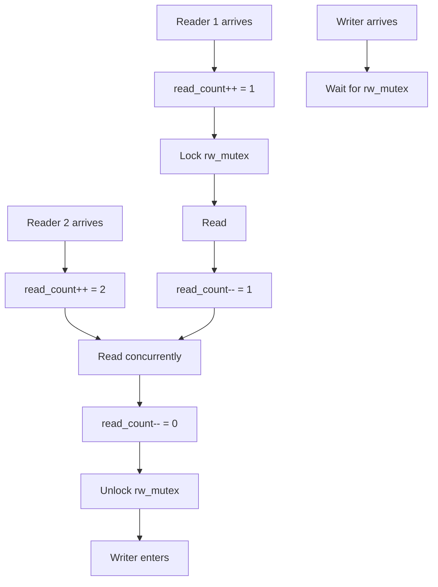
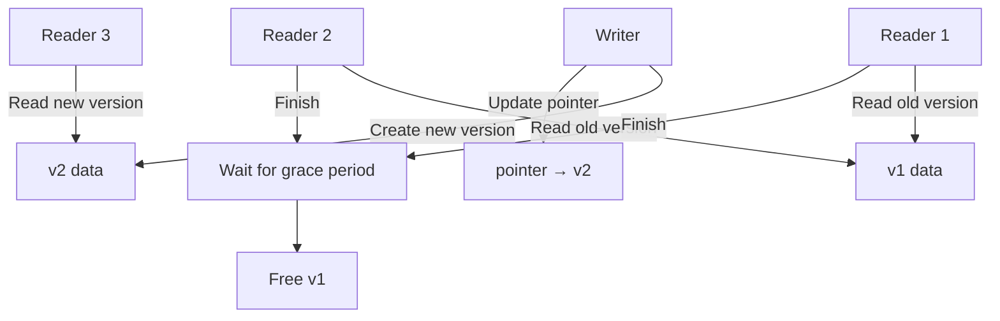

# Readers-Writers Problem

## Overview

The **Readers-Writers Problem** is a classic synchronization problem: multiple threads access a shared resource (e.g., database), where readers only read and writers read and write. The goal is to allow concurrent readers but exclusive access for writers.

## Problem Statement

- Multiple readers can access the resource simultaneously
- Only one writer can access at a time
- No reader and writer can access simultaneously

## Variations

| Variant | Priority | Description |
|---------|----------|-------------|
| **First Readers-Writers** | Readers | No reader waits because of a writer |
| **Second Readers-Writers** | Writers | Once a writer is ready, no new readers start |
| **Third** | Neither | Bounded waiting for both |

## Solution 1: Readers Priority (First Readers-Writers)

```c
sem_t rw_mutex;    // Binary, init=1 — protects read/write
sem_t mutex;       // Binary, init=1 — protects read_count
int read_count = 0;

// Reader
void reader() {
    wait(&mutex);
    read_count++;
    if (read_count == 1)   // First reader locks out writers
        wait(&rw_mutex);
    signal(&mutex);
    
    // Read data
    
    wait(&mutex);
    read_count--;
    if (read_count == 0)   // Last reader allows writers
        signal(&rw_mutex);
    signal(&mutex);
}

// Writer
void writer() {
    wait(&rw_mutex);
    
    // Write data
    
    signal(&rw_mutex);
}
```



**Problem**: Writers can starve if readers keep arriving.

## Solution 2: Writers Priority

```c
sem_t rw_mutex;    // init=1 — protects resource
sem_t read_mutex;  // init=1 — protects read_count
sem_t write_mutex; // init=1 — protects write_count
sem_t read_try;    // init=1 — writers block new readers
int read_count = 0;
int write_count = 0;

// Reader
void reader() {
    wait(&read_try);        // Wait if writer is ready
    wait(&read_mutex);
    read_count++;
    if (read_count == 1)
        wait(&rw_mutex);
    signal(&read_mutex);
    signal(&read_try);
    
    // Read data
    
    wait(&read_mutex);
    read_count--;
    if (read_count == 0)
        signal(&rw_mutex);
    signal(&read_mutex);
}

// Writer
void writer() {
    wait(&write_mutex);
    write_count++;
    if (write_count == 1)
        wait(&read_try);    // Block new readers
    signal(&write_mutex);
    
    wait(&rw_mutex);
    
    // Write data
    
    signal(&rw_mutex);
    
    wait(&write_mutex);
    write_count--;
    if (write_count == 0)
        signal(&read_try);  // Allow readers
    signal(&write_mutex);
}
```

**Advantage**: Writers get priority — once a writer is ready, new readers wait.

## Solution 3: Using Monitors (Java)

```java
public class ReadersWriters {
    private int readers = 0;
    private boolean writing = false;
    private final Lock lock = new ReentrantLock();
    private final Condition canRead = lock.newCondition();
    private final Condition canWrite = lock.newCondition();
    
    public void startRead() throws InterruptedException {
        lock.lock();
        while (writing)
            canRead.await();
        readers++;
        lock.unlock();
    }
    
    public void endRead() {
        lock.lock();
        readers--;
        if (readers == 0)
            canWrite.signal();
        lock.unlock();
    }
    
    public void startWrite() throws InterruptedException {
        lock.lock();
        while (writing || readers > 0)
            canWrite.await();
        writing = true;
        lock.unlock();
    }
    
    public void endWrite() {
        lock.lock();
        writing = false;
        canRead.signalAll();  // Wake all waiting readers
        canWrite.signal();    // Or wake a writer
        lock.unlock();
    }
}
```

## Solution 4: Read-Write Locks (POSIX)

```c
#include <pthread.h>

pthread_rwlock_t rwlock = PTHREAD_RWLOCK_INITIALIZER;

// Reader
pthread_rwlock_rdlock(&rwlock);
// Read data
pthread_rwlock_unlock(&rwlock);

// Writer
pthread_rwlock_wrlock(&rwlock);
// Write data
pthread_rwlock_unlock(&rwlock);

// Try-lock (non-blocking)
if (pthread_rwlock_tryrdlock(&rwlock) == 0) {
    // Got read lock
    pthread_rwlock_unlock(&rwlock);
}
```

## Solution 5: Linux Kernel Read-Write Lock

```c
#include <linux/spinlock.h>

rwlock_t my_rwlock = RW_LOCK_UNLOCKED;

// Reader
read_lock(&my_rwlock);
// Read
read_unlock(&my_rwlock);

// Writer
write_lock(&my_rwlock);
// Write
write_unlock(&my_rwlock);

// With interrupt safety
read_lock_irqsave(&my_rwlock, flags);
// Read
read_unlock_irqrestore(&my_rwlock, flags);
```

## Read-Copy-Update (RCU)

Linux kernel's advanced readers-writers solution:



**Key properties:**
- Readers: **zero overhead** — no locks, no atomics
- Writers: create new version, update pointer, wait for readers to finish, free old version
- **Grace period**: wait until all pre-existing readers complete

```c
#include <linux/rcupdate.h>

// Reader (lock-free!)
rcu_read_lock();
data = rcu_dereference(global_ptr);
// Use data (must not block)
rcu_read_unlock();

// Writer
new_data = kmalloc(...);
*new_data = *old_data;  // Copy
new_data->field = new_value;  // Modify
rcu_assign_pointer(global_ptr, new_data);  // Publish
synchronize_rcu();  // Wait for grace period
kfree(old_data);  // Safe to free
```

## Comparison

| Method | Readers | Writers | Starvation | Complexity |
|--------|---------|---------|------------|-----------|
| Solution 1 (readers priority) | Concurrent | Exclusive | Writers may starve | Low |
| Solution 2 (writers priority) | Concurrent | Exclusive | Readers may starve | Medium |
| POSIX rwlock | Concurrent | Exclusive | Implementation-dependent | Low |
| Monitor-based | Concurrent | Exclusive | Configurable | Medium |
| RCU | Lock-free | Copy + update | No starvation | High |

## Interview Questions

**Q1: What is the readers-writers problem and how do you solve it?**

Multiple readers can access a shared resource concurrently, but writers need exclusive access. Solution: use a semaphore/mutex for the resource and a counter for active readers. The first reader acquires the resource lock; the last reader releases it. Writers acquire the resource lock directly. This allows concurrent reading while ensuring exclusive writing.

**Q2: What is the starvation problem in the readers-writers problem?**

In the readers-priority solution, if readers keep arriving, writers never get access (starvation). In the writers-priority solution, readers may starve if writers keep arriving. Solutions: use fairness mechanisms like FIFO queuing, or time-bounded waiting.

**Q3: How does RCU (Read-Copy-Update) work and when is it used?**

RCU allows readers to access data with zero synchronization overhead. Writers create a new copy, modify it, atomically update the pointer, then wait for a "grace period" (all existing readers finish) before freeing the old data. RCU is used extensively in the Linux kernel for read-heavy data structures (routing tables, module lists).

**Q4: What is the difference between a read-write lock and a mutex?**

A mutex allows only one thread at a time. A read-write lock allows multiple concurrent readers OR one exclusive writer. Read-write locks improve performance for read-heavy workloads because readers don't block each other. However, they have more overhead than mutexes (tracking reader count), so for write-heavy workloads, a mutex may be better.

**Q5: How would you implement a fair readers-writers solution?**

Use a FIFO queue or ticket system. When a writer arrives, it takes a ticket. New readers must wait if a writer's ticket is before theirs. This ensures writers are served in order and readers don't continuously push writers back. Alternatively, use a monitor with separate conditions for readers and writers, giving priority to whichever has been waiting longer.

## Common Mistakes

- Forgetting to release the read lock on error paths
- Using read-write locks when writes are frequent (overhead > benefit)
- Not considering that `read_count` access itself needs protection (use a separate mutex)
- Starving writers in readers-priority solution
- Using RCU for write-heavy workloads (copy overhead)

## Summary

- Readers-writers: concurrent reads, exclusive writes
- Readers-priority: simple but can starve writers
- Writers-priority: prevents writer starvation but can starve readers
- POSIX `pthread_rwlock` provides a standard implementation
- RCU: zero-overhead readers, used in Linux kernel for read-heavy structures
- Fairness requires explicit mechanisms (FIFO, tickets)

## Cross-References

- [Semaphores](semaphores.md) — used in the solution
- [Monitors](monitors.md) — higher-level solution
- [Mutexes](mutex.md) — alternative for write-heavy workloads
- [Lock-Free](lock-free.md) — RCU is a lock-free approach
- [Critical Section](critical-section.md) — the fundamental problem
