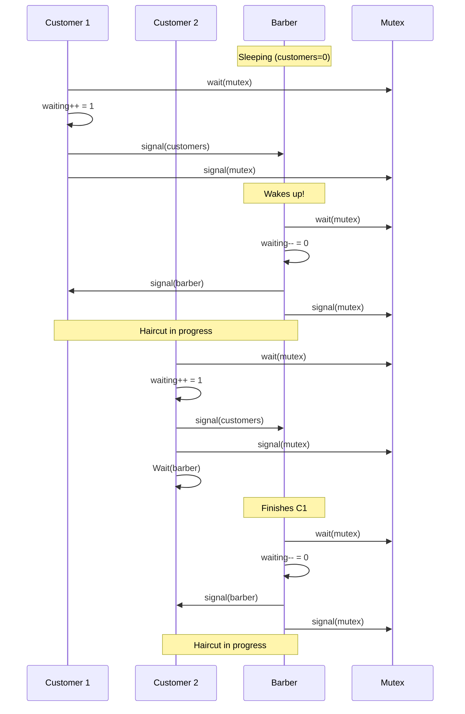

# Sleeping Barber Problem

## Overview

The **Sleeping Barber Problem** was proposed by Dijkstra in 1965. A barber shop has one barber, one barber chair, and N waiting chairs. If no customers, the barber sleeps. If a customer arrives and the barber is sleeping, wake the barber. If all chairs are full, the customer leaves. The challenge is coordinating the barber and customers without race conditions.

## Problem Setup

```
┌─────────────────────────────────────────────┐
│  Barber Shop                                 │
│                                              │
│  [Barber Chair]  ← Barber sleeps if empty    │
│                                              │
│  [Wait1] [Wait2] [Wait3] [Wait4] [Wait5]    │
│           Waiting chairs (N=5)               │
│                                              │
│  Customers arrive randomly                   │
└─────────────────────────────────────────────┘
```

## Solution Using Semaphores

```c
sem_t customers;    // init = 0 — count of waiting customers
sem_t barber;       // init = 0 — barber ready signal
sem_t mutex;        // init = 1 — protects waiting_count
int waiting = 0;    // Number of waiting customers
int CHAIRS = 5;     // Number of waiting chairs

// Customer
void customer() {
    wait(&mutex);
    if (waiting < CHAIRS) {
        waiting++;
        signal(&customers);   // Signal barber: customer waiting
        signal(&mutex);       // Release lock
        wait(&barber);        // Wait for barber to be ready
        // Get haircut
    } else {
        signal(&mutex);       // Release lock, leave
        // Shop full, leave
    }
}

// Barber
void barber() {
    while (1) {
        wait(&customers);     // Sleep if no customers
        wait(&mutex);
        waiting--;
        signal(&barber);      // Signal customer: barber ready
        signal(&mutex);
        // Cut hair
    }
}
```



## Variations

### Multiple Barbers

```c
sem_t customers;    // init = 0
sem_t barbers;      // init = num_barbers
sem_t mutex;        // init = 1
int waiting = 0;

// Customer
void customer() {
    wait(&mutex);
    if (waiting < CHAIRS) {
        waiting++;
        signal(&customers);
        signal(&mutex);
        wait(&barbers);       // Wait for any barber
        // Get haircut
    } else {
        signal(&mutex);
    }
}

// Barber
void barber() {
    while (1) {
        wait(&customers);
        wait(&mutex);
        waiting--;
        signal(&barbers);
        signal(&mutex);
        // Cut hair
    }
}
```

### With Timeout (Impatient Customers)

```c
struct timespec ts;
clock_gettime(CLOCK_REALTIME, &ts);
ts.tv_sec += 5;  // 5 second timeout

if (sem_timedwait(&mutex, &ts) == ETIMEDOUT) {
    // Customer leaves (impatient)
}
```

## Analysis

### Race Condition Prevention

The mutex protects `waiting` count from concurrent modification:
- Customer increments `waiting` atomically
- Barber decrements `waiting` atomically
- No lost signals or double-counts

### Deadlock Prevention

- Customers signal `customers` before releasing mutex
- Barber waits on `customers` outside mutex (avoids holding mutex while sleeping)
- Signal-before-release ensures the barber is woken

### Starvation Prevention

- Semaphore queue provides FIFO ordering (typically)
- Each customer gets served in order of arrival

## Comparison with Other Problems

| Problem | Resources | Challenge |
|---------|-----------|-----------|
| Sleeping Barber | 1 barber, N chairs | Coordination + counting |
| Producer-Consumer | N buffer slots | Buffer management |
| Readers-Writers | Shared data | Concurrent reads, exclusive writes |
| Dining Philosophers | 5 chopsticks | Deadlock avoidance |

## Interview Questions

**Q1: What is the sleeping barber problem and how do you solve it?**

A barber sleeps when no customers are present. Customers wake the barber or wait in chairs (leave if full). Solution: use semaphores — `customers` (count of waiting customers, barber waits on this), `barber` (customer waits for barber to be ready), `mutex` (protects waiting count). The barber sleeps on `customers`; when a customer arrives, they signal it.

**Q2: What race conditions could occur without the mutex?**

Without mutex: (1) Two customers check `waiting < CHAIRS` simultaneously, both increment → one gets a nonexistent chair. (2) Barber reads stale `waiting` count. (3) Customer signals `customers` while barber is between `wait(customers)` and `waiting--` → count mismatch.

**Q3: How would you extend the sleeping barber to multiple barbers?**

Add a `barbers` semaphore initialized to the number of barbers. Customers signal `customers` and wait on `barbers` (instead of `barber`). Any available barber can wake up. The `waiting` count still tracks customers in waiting chairs.

**Q4: What happens if the barber checks `waiting` before sleeping?**

This creates a race condition: barber checks `waiting == 0`, then a customer arrives and signals `customers` before the barber sleeps. The barber then sleeps, missing the signal. Solution: the barber must wait on `customers` without checking `waiting` first — the semaphore handles the count.

**Q5: How does this relate to producer-consumer?**

The sleeping barber is a variant of producer-consumer where: customers are producers (add to queue), barber is consumer (process queue), waiting chairs are the bounded buffer. The key difference is the barber sleeping when empty and the customer leaving when full.

## Common Mistakes

- Checking `waiting` before sleeping (TOCTOU race condition)
- Holding mutex while waiting on semaphore (deadlock)
- Not signaling before releasing mutex (lost wakeup)
- Using `if` instead of `while` for condition checks
- Forgetting that semaphore operations must be atomic

## Summary

- Sleeping barber: 1 barber, N chairs, random customer arrivals
- Semaphores coordinate sleeping/waking and count waiting customers
- Mutex protects the shared `waiting` count
- Signal before release prevents lost wakeups
- Variants: multiple barbers, impatient customers, priority scheduling

## Cross-References

- [Semaphores](semaphores.md) — the synchronization primitive used
- [Monitors](monitors.md) — alternative implementation approach
- [Critical Section](critical-section.md) — the fundamental problem
- [Deadlocks](deadlocks/README.md) — what to avoid


## Cross References

- [Semaphores](../os/synchronization/semaphores.md)
- [Dining Philosophers](../os/synchronization/dining-philosophers.md)
- [Producer-Consumer](../concurrency/producer-consumer.md)
