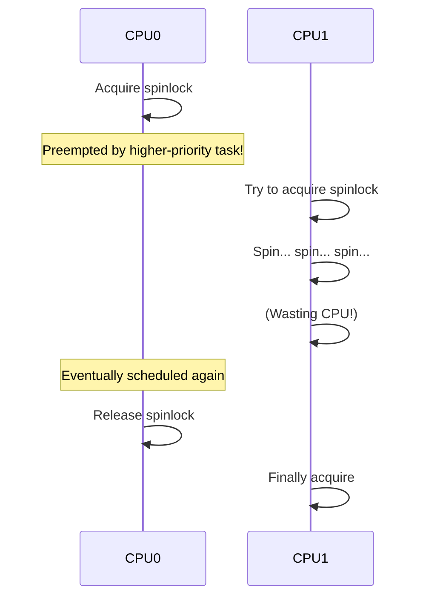
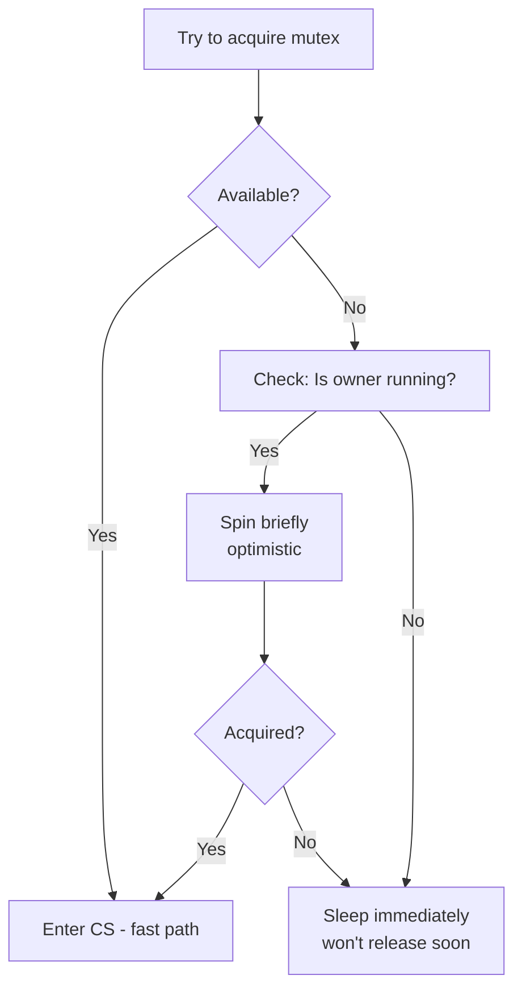

# Spinlocks

## Overview

A **spinlock** is a synchronization primitive where a thread **busy-waits** (spins) in a loop until the lock becomes available. Unlike mutexes, spinlocks don't yield the CPU or perform context switches. They're ideal for very short critical sections where the lock hold time is less than the context switch overhead.

## When to Use Spinlocks

| Scenario | Use Spinlock? | Use Mutex? |
|----------|--------------|------------|
| Hold time < context switch time | ✅ Yes | ❌ No |
| Hold time > context switch time | ❌ No | ✅ Yes |
| Interrupt context (ISR) | ✅ Yes | ❌ Cannot sleep |
| Single CPU | ❌ No (will deadlock) | ✅ Yes |
| Multiprocessor, short CS | ✅ Yes | Acceptable |

## Basic Implementation

### Naive Spinlock

```c
typedef struct {
    volatile int locked;  // 0 = unlocked, 1 = locked
} spinlock_t;

void lock(spinlock_t *lock) {
    while (test_and_set(&lock->locked) == 1)
        ;  // Spin
}

void unlock(spinlock_t *lock) {
    lock->locked = 0;
}
```

**Problem**: No fairness — a thread can spin forever (starvation).

### Ticket Spinlock (Fair)

```c
typedef struct {
    volatile unsigned int next_ticket;
    volatile unsigned int now_serving;
} ticketlock_t;

void lock(ticketlock_t *lock) {
    unsigned int my_ticket = fetch_and_add(&lock->next_ticket, 1);
    while (lock->now_serving != my_ticket)
        ;  // Spin on my ticket number
}

void unlock(ticketlock_t *lock) {
    lock->now_serving++;
}
```

**Advantage**: FIFO ordering — bounded waiting guaranteed.

## Linux Kernel Spinlocks

```c
#include <linux/spinlock.h>

spinlock_t my_lock;
spin_lock_init(&my_lock);

// Basic lock
spin_lock(&my_lock);
// Critical section
spin_unlock(&my_lock);

// Save and disable interrupts
spin_lock_irqsave(&my_lock, flags);
// Critical section (safe from ISR)
spin_unlock_irqrestore(&my_lock, flags);

// Disable bottom halves
spin_lock_bh(&my_lock);
// Critical section
spin_unlock_bh(&my_lock);
```

### When to Use Which Variant

| Variant | Disables | Use Case |
|---------|----------|----------|
| `spin_lock` | Nothing | Process context, no ISR sharing |
| `spin_lock_irq` | Interrupts | Shared with ISR (known IRQ state) |
| `spin_lock_irqsave` | Interrupts + save state | Shared with ISR (unknown IRQ state) |
| `spin_lock_bh` | Soft IRQs | Shared with bottom halves |

## Spinlock + Preemption Issues

On preemptive kernels, a thread holding a spinlock can be preempted, causing other CPUs to spin uselessly.



**Solution**: Disable preemption while holding a spinlock (Linux does this automatically).

```c
// Linux spin_lock internally does:
preempt_disable();
raw_spin_lock(lock);
// Critical section
raw_spin_unlock(lock);
preempt_enable();
```

## Spinlock vs Mutex

| Aspect | Spinlock | Mutex |
|--------|----------|-------|
| Waiting | Busy-wait (CPU consumed) | Sleep (CPU freed) |
| Context switch | No | Yes |
| Interrupt context | Yes | No |
| Hold time | Very short | Any |
| Multiprocessor | Required | Not required |
| Preemption | Disabled while held | Allowed |
| Implementation | Atomic instructions | Futex / semaphore |

## Adaptive Spinning

Modern mutex implementations (like Linux's) use **adaptive spinning**:



**Insight**: If the lock holder is currently running on another CPU, it will likely release soon → spin. If the holder is sleeping, it won't release soon → sleep.

## Read-Write Spinlocks

```c
#include <linux/spinlock.h>

rwlock_t my_rwlock;
rwlock_init(&my_rwlock);

// Readers (can be concurrent)
read_lock(&my_rwlock);
// Read data
read_unlock(&my_rwlock);

// Writer (exclusive)
write_lock(&my_rwlock);
// Write data
write_unlock(&my_rwlock);
```

## Performance Considerations

### Cache Line Bouncing

```
CPU0: acquire lock → cache line in CPU0's cache (Exclusive)
CPU1: acquire lock → cache line invalidated on CPU0, transferred to CPU1
CPU0: release lock → cache line invalidated on CPU1, transferred to CPU0
```

Each transfer takes ~100 cycles on modern CPUs (NUMA: even more).

### MCS Lock (Cache-Friendly)

```c
typedef struct mcs_node {
    struct mcs_node *next;
    volatile int locked;
} mcs_node_t;

typedef struct {
    mcs_node_t *tail;
} mcs_lock_t;

void lock(mcs_lock_t *lock, mcs_node_t *my_node) {
    my_node->next = NULL;
    my_node->locked = 1;
    mcs_node_t *prev = fetch_and_store(&lock->tail, my_node);
    if (prev != NULL) {
        prev->next = my_node;
        while (my_node->locked)  // Spin on LOCAL variable
            ;
    }
}

void unlock(mcs_lock_t *lock, mcs_node_t *my_node) {
    if (my_node->next == NULL) {
        if (compare_and_swap(&lock->tail, my_node, NULL))
            return;  // No waiters
        while (my_node->next == NULL)  // Wait for next to link
            ;
    }
    my_node->next->locked = 0;  // Hand off to next
}
```

**Key**: Each thread spins on its **own** cache line → no cache bouncing.

## Interview Questions

**Q1: When should you use a spinlock instead of a mutex?**

Use a spinlock when: (1) the critical section is very short (few instructions), (2) you're in interrupt context where sleeping is forbidden, (3) on multiprocessor systems where spinning on another CPU is cheaper than context switching. Use a mutex when the critical section might sleep or the hold time is unpredictable.

**Q2: Why must preemption be disabled when holding a spinlock?**

If a thread holding a spinlock is preempted, other CPUs trying to acquire the lock will spin uselessly until the preempted thread is rescheduled. Disabling preemption ensures the lock holder runs to completion without being interrupted by higher-priority tasks on the same CPU.

**Q3: What is the ticket spinlock and why is it better than a naive spinlock?**

A ticket spinlock uses two counters: `next_ticket` (issued to arriving threads) and `now_serving` (currently executing thread). Each thread spins until its ticket number matches `now_serving`. This guarantees FIFO ordering and bounded waiting, preventing starvation that can occur with naive spinlocks.

**Q4: What is cache line bouncing and how does MCS lock solve it?**

Cache line bouncing occurs when multiple CPUs repeatedly invalidate and transfer the same cache line (the lock variable). Each transfer costs ~100 cycles. MCS lock uses a queue of per-thread nodes — each thread spins on its own node (in its own cache line), and the lock is passed directly from one thread to the next without shared-variable bouncing.

**Q5: Explain adaptive spinning in Linux mutexes.**

When a mutex is contended, Linux checks if the lock holder is currently running on another CPU. If yes, it spins briefly (optimistic — holder will release soon). If no (holder is sleeping/preempted), it sleeps immediately (no point spinning). This hybrid approach gets the benefits of spinning for short waits while avoiding wasted CPU for long waits.

## Common Mistakes

- Using spinlocks when the critical section might sleep (deadlock on same CPU)
- Holding spinlocks for too long (wastes CPU on other spinning cores)
- Not disabling preemption (preempted holder → spinning CPUs waste cycles)
- Using spinlocks on uniprocessor systems (no benefit, just wastes CPU)
- Forgetting to disable interrupts when lock is shared with ISR

## Summary

- Spinlocks busy-wait: no context switch, but CPU is consumed
- Ideal for very short critical sections on multiprocessor systems
- Must disable preemption while held (Linux does this automatically)
- Ticket spinlocks provide FIFO fairness
- MCS locks avoid cache line bouncing by per-thread spinning
- Adaptive spinning in mutexes combines benefits of both approaches

## Cross-References

- [Mutexes](mutex.md) — sleeping locks
- [CAS](cas.md) — atomic primitive used by spinlocks
- [Memory Barriers](memory-barriers.md) — ordering in spinlock implementation
- [Critical Section](critical-section.md) — the problem being solved
- [Deadlocks](deadlocks/README.md) — risks with spinlocks


## Cross References

- [Mutex](../os/synchronization/mutex.md)
- [CAS](../os/synchronization/cas.md)
- [Lock-Free](../os/synchronization/lock-free.md)
- [Cache Coherence](../arch/memory-hierarchy/coherence.md)
