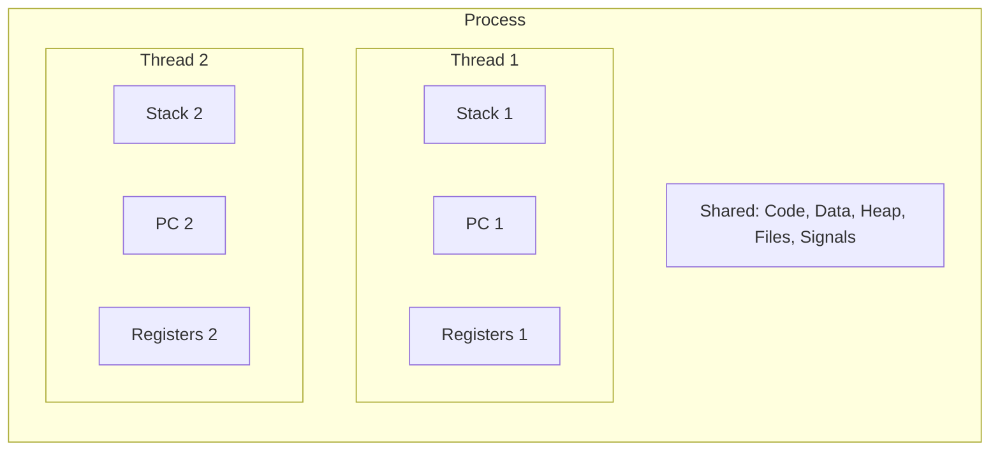
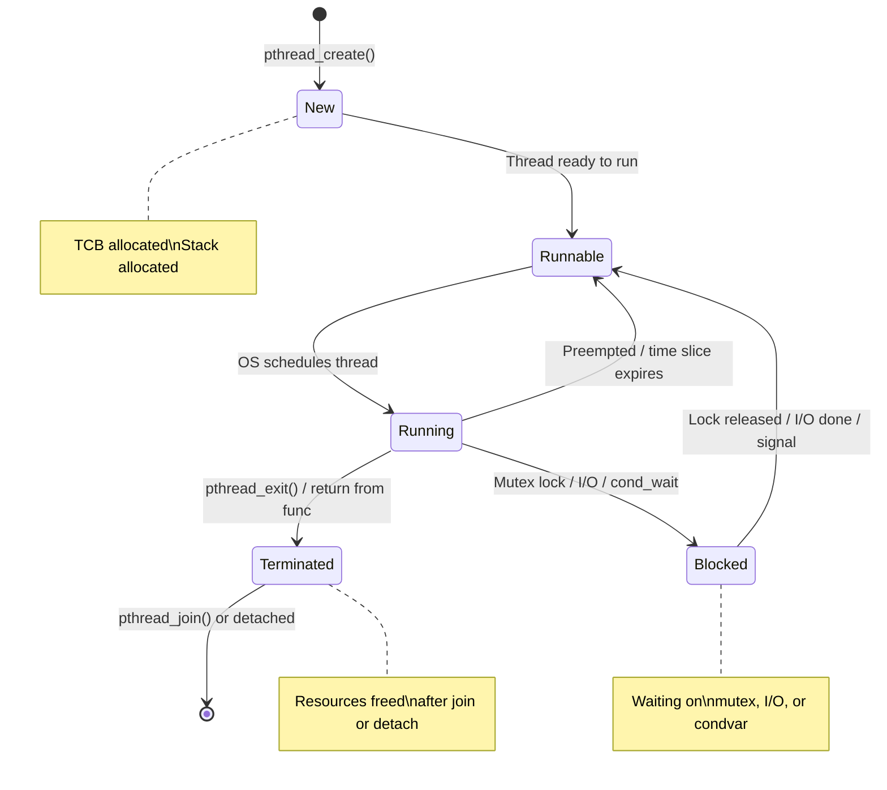
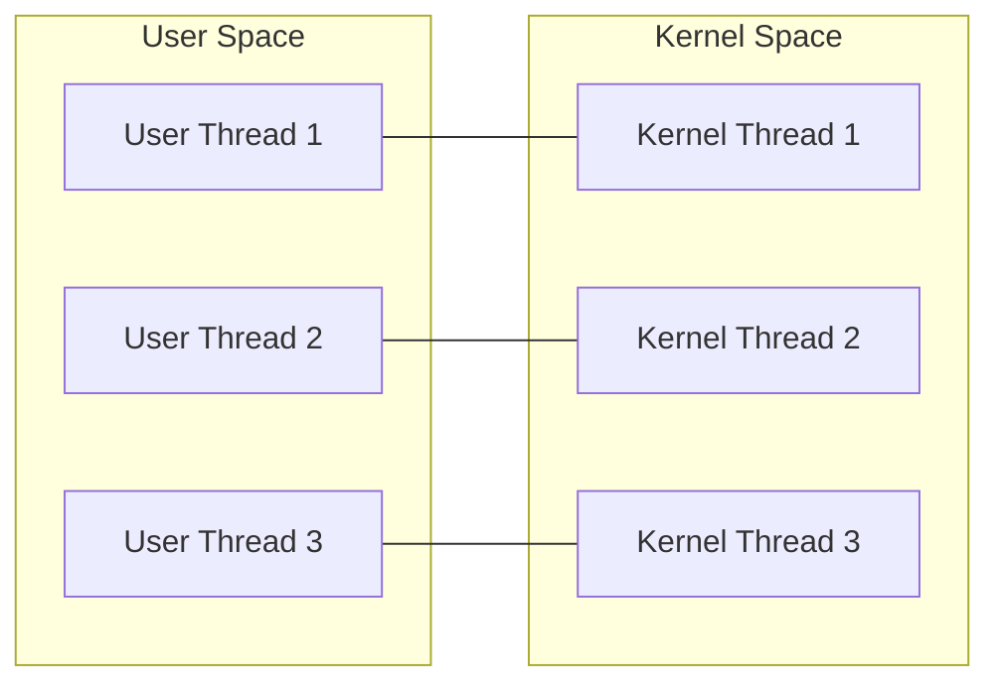
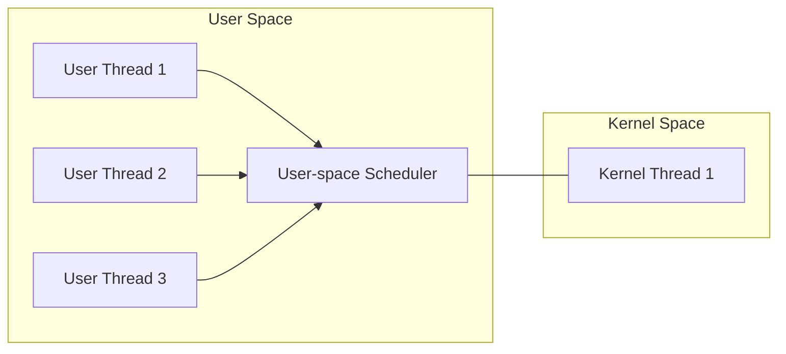
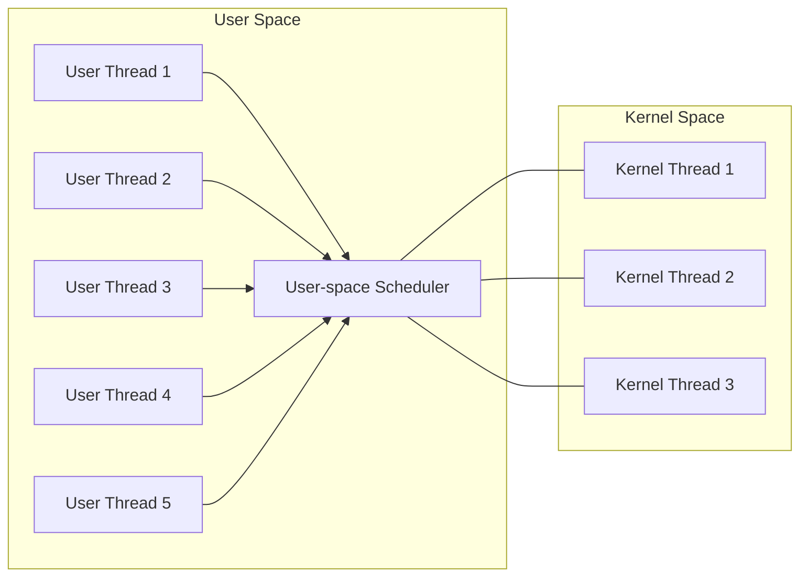

# Threads

## What is a Thread?

A **thread** is the smallest unit of execution within a process. A process can have multiple threads, all sharing the same address space, code, data, and resources — but each thread has its own **stack**, **program counter**, and **register set**.

> **Interview one-liner:** "A thread is a lightweight execution unit within a process — threads share code, data, and heap but have their own stack and registers."

## Process vs Thread



| Resource | Process | Thread |
|----------|---------|--------|
| Code segment | Own copy | **Shared** |
| Data segment | Own copy | **Shared** |
| Heap | Own copy | **Shared** |
| Stack | Own (one) | **Own per thread** |
| Registers | Own | **Own per thread** |
| Program counter | Own | **Own per thread** |
| File descriptors | Own | **Shared** |
| Signal handlers | Own | **Shared** |
| PID | Unique | Shared (TID differs) |
| Address space | Isolated | Shared |
| Creation cost | ~1-10 ms | ~10-100 μs |
| Context switch cost | ~2-100 μs (TLB flush) | ~1-10 μs (no TLB flush) |

## Why Use Threads?

### 1. Responsiveness
```
Single-threaded:  [===Request 1===][===Request 2===]
Multi-threaded:   [===Request 1===]
                  [===Request 2===]
                  (concurrent)
```

### 2. Resource Sharing
Threads share memory naturally — no IPC needed for data sharing.

### 3. Economy
| Operation | Process | Thread |
|-----------|---------|--------|
| Creation | ~1-10 ms | ~10-100 μs |
| Context switch | ~2-100 μs | ~1-10 μs |
| Memory overhead | Full address space | Stack only (~1-8 MB) |

### 4. Scalability
Multi-threaded programs can run on multiple CPU cores in parallel.

## Thread Lifecycle



### Thread Creation and Joining

```c
#include <pthread.h>
#include <stdio.h>
#include <stdlib.h>

void *worker(void *arg) {
    int id = *(int *)arg;
    printf("Thread %d: running (TID=%lu)\n", id, (unsigned long)pthread_self());
    
    // Do work...
    for (volatile int i = 0; i < 1000000; i++);
    
    return (void *)(long)(id * 10);  // Return value
}

int main() {
    pthread_t threads[4];
    int ids[4];
    
    for (int i = 0; i < 4; i++) {
        ids[i] = i;
        int ret = pthread_create(&threads[i], NULL, worker, &ids[i]);
        if (ret != 0) {
            perror("pthread_create");
            return 1;
        }
    }
    
    for (int i = 0; i < 4; i++) {
        void *retval;
        pthread_join(threads[i], &retval);
        printf("Thread %d returned: %ld\n", i, (long)retval);
    }
    
    return 0;
}
```

## Thread Implementation Models

The mapping between user-level threads and kernel-level threads determines the threading model. There are three primary models:

### 1:1 Model (Kernel-Level Threading)



**How it works:** Each user thread maps 1:1 to a kernel thread. The OS scheduler manages all threads directly.

| Pros | Cons |
|------|------|
| True parallelism on multi-core | Thread creation involves syscalls (slower) |
| OS manages scheduling (fair, preemptive) | Kernel overhead per thread |
| One thread blocks without affecting others | Limited by kernel thread limits (~thousands) |
| Can use multiple CPU cores | Context switch requires kernel mode transition |

**Used by:** Linux (pthreads), Windows, macOS

### N:1 Model (User-Level Threading)



**How it works:** Many user threads multiplexed onto a single kernel thread. All scheduling happens in user space.

| Pros | Cons |
|------|------|
| Very fast thread creation/switching (no syscall) | **No true parallelism** (one kernel thread) |
| Can have thousands of threads easily | If one thread blocks (I/O), **all** threads block |
| Portable (user-space library) | Cannot use multiple CPU cores |
| No kernel overhead | Kernel is unaware of user threads |

**Used by:** Early green threads (Java), GNU Portable Threads

### M:N Model (Hybrid Threading)



**How it works:** M user threads multiplexed onto N kernel threads. Combines benefits of both models.

| Pros | Cons |
|------|------|
| Best of both worlds | Complex to implement |
| True parallelism (multiple kernel threads) | Scheduler coordination between user and kernel |
| Fast user-space switching when possible | Difficult to get right (debugging, signal handling) |
| Scalable (many user threads) | |

**Used by:** Go (goroutines), Erlang (processes), Solaris (historically), Haskell (GHC runtime)

### Model Comparison Table

| Feature | 1:1 | N:1 | M:N |
|---------|-----|-----|-----|
| True parallelism | ✅ Yes | ❌ No | ✅ Yes |
| Thread creation speed | Medium (syscall) | Fast (user space) | Fast (user space) |
| Blocking behavior | Only blocks one thread | Blocks all threads | Blocks only mapped threads |
| Multi-core utilization | ✅ Yes | ❌ No | ✅ Yes |
| Implementation complexity | Simple | Simple | Complex |
| Thread scalability | Limited (~10k) | High (~100k+) | High (~100k+) |
| Example | Linux pthreads | Green threads | Go goroutines |

### Linux-Specific: clone() and Threading

Linux implements 1:1 threading via `clone()`. Each pthread is a separate task sharing resources via clone flags:

```bash
# View threads of a process
ps -T -p <PID>
# or
ls /proc/<PID>/task/

# Each thread has its own TID
cat /proc/<PID>/task/<TID>/status
```

## POSIX Threads (pthreads) API

### Key pthread Functions

| Function | Purpose |
|----------|---------|
| `pthread_create()` | Create a new thread |
| `pthread_exit()` | Terminate calling thread |
| `pthread_join()` | Wait for thread to finish |
| `pthread_detach()` | Mark thread as detached (auto-cleanup) |
| `pthread_self()` | Get calling thread's ID |
| `pthread_cancel()` | Request thread cancellation |
| `pthread_setname_np()` | Set thread name (debugging) |
| `pthread_setaffinity_np()` | Pin thread to CPU core |

### Detached vs Joinable Threads

```c
// Joinable (default) — must be joined
pthread_t t1;
pthread_create(&t1, NULL, worker, NULL);
pthread_join(t1, NULL);  // Wait for t1 — resources freed after this

// Detached — auto-cleanup on exit
pthread_t t2;
pthread_attr_t attr;
pthread_attr_init(&attr);
pthread_attr_setdetachstate(&attr, PTHREAD_CREATE_DETACHED);
pthread_create(&t2, &attr, worker, NULL);
// No join needed — resources freed when thread exits
```

**When to use each:**
- **Joinable:** When you need the thread's return value or need to know when it's done
- **Detached:** Fire-and-forget threads where you don't need to synchronize on completion

## Thread Synchronization

Since threads share memory, synchronization is critical:

### Mutex

```c
pthread_mutex_t mutex = PTHREAD_MUTEX_INITIALIZER;
int shared_counter = 0;

void *increment(void *arg) {
    for (int i = 0; i < 100000; i++) {
        pthread_mutex_lock(&mutex);
        shared_counter++;
        pthread_mutex_unlock(&mutex);
    }
    return NULL;
}
```

### Condition Variables

```c
pthread_mutex_t mutex = PTHREAD_MUTEX_INITIALIZER;
pthread_cond_t cond = PTHREAD_COND_INITIALIZER;
int ready = 0;

// Producer
void *producer(void *arg) {
    pthread_mutex_lock(&mutex);
    ready = 1;
    pthread_cond_signal(&cond);  // Wake consumer
    pthread_mutex_unlock(&mutex);
    return NULL;
}

// Consumer
void *consumer(void *arg) {
    pthread_mutex_lock(&mutex);
    while (!ready) {
        pthread_cond_wait(&cond, &mutex);  // Sleep until signaled
    }
    printf("Data ready!\n");
    pthread_mutex_unlock(&mutex);
    return NULL;
}
```

### Read-Write Locks

```c
pthread_rwlock_t rwlock = PTHREAD_RWLOCK_INITIALIZER;

// Multiple readers can hold the lock simultaneously
void *reader(void *arg) {
    pthread_rwlock_rdlock(&rwlock);
    // Read shared data...
    pthread_rwlock_unlock(&rwlock);
    return NULL;
}

// Only one writer, exclusive access
void *writer(void *arg) {
    pthread_rwlock_wrlock(&rwlock);
    // Modify shared data...
    pthread_rwlock_unlock(&rwlock);
    return NULL;
}
```

### Barriers

```c
pthread_barrier_t barrier;
pthread_barrier_init(&barrier, NULL, 4);  // Wait for 4 threads

void *worker(void *arg) {
    // Phase 1: independent work
    do_phase1();
    
    // Wait for all threads to finish phase 1
    pthread_barrier_wait(&barrier);
    
    // Phase 2: all threads start together
    do_phase2();
    return NULL;
}
```

## Thread-Specific Data (TSD)

```c
#include <pthread.h>

pthread_key_t tls_key;

void cleanup(void *data) {
    free(data);  // Called when thread exits
}

void *worker(void *arg) {
    // Each thread has its own copy
    pthread_setspecific(tls_key, malloc(1024));
    
    void *my_data = pthread_getspecific(tls_key);
    // my_data is unique to this thread
    
    return NULL;
}

int main() {
    pthread_key_create(&tls_key, cleanup);
    // Create threads...
}
```

**Modern alternative (C11/GCC):**
```c
__thread int thread_local_var = 0;       // GCC extension
_Thread_local int tls_var = 0;           // C11
thread_local int tls_var_cpp = 0;        // C++11
```

## C11 Threads (Modern Alternative)

```c
#include <threads.h>
#include <stdio.h>

int worker(void *arg) {
    printf("Thread: %s\n", (char *)arg);
    return 42;
}

int main() {
    thrd_t thread;
    thrd_create(&thread, worker, "Hello");
    
    int result;
    thrd_join(&thread, &result);
    printf("Result: %d\n", result);
    
    return 0;
}
```

## Thread Safety

A function is **thread-safe** if it can be called concurrently by multiple threads without data races.

| Function | Thread-Safe? | Issue |
|----------|-------------|-------|
| `printf()` | Yes | Uses internal mutex |
| `malloc()` | Yes | Uses internal locks |
| `strtok()` | No | Uses static buffer |
| `strtok_r()` | Yes | Caller provides buffer |
| `rand()` | No | Uses static state |
| `rand_r()` | Yes | Caller provides state |
| `localtime()` | No | Returns static pointer |
| `localtime_r()` | Yes | Caller provides buffer |
| `gethostbyname()` | No | Returns static struct |
| `getaddrinfo()` | Yes | Returns new struct |

### Making Functions Thread-Safe

Three strategies:
1. **Mutex protection** — lock shared data access
2. **Reentrant versions** — use `_r` suffix functions
3. **Thread-local storage** — per-thread copies of state

## Performance Considerations

### Thread Pool
Creating threads per-request is expensive. Use a thread pool:

```c
// Instead of:
for (int i = 0; i < 10000; i++) {
    pthread_create(&t, NULL, handle_request, &req[i]);  // 10000 threads!
}

// Use a pool: Create N worker threads once, submit tasks to a shared queue
```

### False Sharing
```c
// BAD: Both variables on same cache line
struct {
    int thread1_counter;  // Modified by thread 1
    int thread2_counter;  // Modified by thread 2
} shared;  // Cache line ping-pong!

// GOOD: Pad to separate cache lines
struct {
    int thread1_counter;
    char padding1[60];  // Fill cache line (64 bytes)
    int thread2_counter;
    char padding2[60];
} shared;

// BEST: Use compiler alignment
struct __attribute__((aligned(64))) {
    int thread1_counter;
} counter1;
struct __attribute__((aligned(64))) {
    int thread2_counter;
} counter2;
```

### Thread Stack Size

```c
pthread_attr_t attr;
pthread_attr_init(&attr);
pthread_attr_setstacksize(&attr, 2 * 1024 * 1024);  // 2 MB stack

// Default is typically 1-8 MB (check with ulimit -s)
// Reduce for many threads to save memory
// Increase for deep recursion
```

## Real-World Threading Examples

### Producer-Consumer with Bounded Buffer

```c
#include <pthread.h>
#include <stdio.h>
#include <stdlib.h>

#define BUFFER_SIZE 10

int buffer[BUFFER_SIZE];
int count = 0, in = 0, out = 0;

pthread_mutex_t mutex = PTHREAD_MUTEX_INITIALIZER;
pthread_cond_t not_full = PTHREAD_COND_INITIALIZER;
pthread_cond_t not_empty = PTHREAD_COND_INITIALIZER;

void *producer(void *arg) {
    for (int i = 0; i < 100; i++) {
        pthread_mutex_lock(&mutex);
        while (count == BUFFER_SIZE)
            pthread_cond_wait(&not_full, &mutex);
        
        buffer[in] = i;
        in = (in + 1) % BUFFER_SIZE;
        count++;
        
        pthread_cond_signal(&not_empty);
        pthread_mutex_unlock(&mutex);
    }
    return NULL;
}

void *consumer(void *arg) {
    for (int i = 0; i < 100; i++) {
        pthread_mutex_lock(&mutex);
        while (count == 0)
            pthread_cond_wait(&not_empty, &mutex);
        
        int item = buffer[out];
        out = (out + 1) % BUFFER_SIZE;
        count--;
        
        pthread_cond_signal(&not_full);
        pthread_mutex_unlock(&mutex);
        printf("Consumed: %d\n", item);
    }
    return NULL;
}
```

### Parallel Sum with Barriers

```c
#define NUM_THREADS 4
#define ARRAY_SIZE 1000000

int array[ARRAY_SIZE];
long partial_sums[NUM_THREADS];

void *sum_worker(void *arg) {
    int id = *(int *)arg;
    int chunk = ARRAY_SIZE / NUM_THREADS;
    int start = id * chunk;
    int end = start + chunk;
    
    long sum = 0;
    for (int i = start; i < end; i++)
        sum += array[i];
    partial_sums[id] = sum;
    
    return NULL;
}
// Final sum: sum all partial_sums
```

## Interview Questions

### Beginner

**Q1: What is the difference between a process and a thread?**  
A: A process is an independent program with its own memory space. A thread is a lightweight execution unit within a process. Threads share code, data, and heap but have their own stack and registers. Threads are cheaper to create and switch between.

**Q2: Why use threads instead of processes?**  
A: Threads are faster to create (~10-100μs vs ~1-10ms), use less memory (shared address space), have cheaper context switches (no TLB flush), and communicate easily (shared memory). Use processes for isolation (one crash doesn't affect others) and threads for performance.

**Q3: What is `pthread_join()`?**  
A: `pthread_join()` blocks the calling thread until the specified thread terminates. It's the thread equivalent of `wait()` for processes. It also retrieves the thread's return value. Every joinable thread must be joined to avoid resource leaks.

### Intermediate

**Q4: What happens if you don't `pthread_join()` a thread?**  
A: If the thread is joinable (default), its resources (stack, TID) are not freed — similar to a zombie process. This is a resource leak. Use `pthread_detach()` for threads you don't need to wait for, or join them explicitly.

**Q5: What is thread safety? How do you make a function thread-safe?**  
A: A function is thread-safe if it can be called concurrently without data races. Make it thread-safe by: 1) Using mutexes to protect shared data, 2) Using reentrant versions of functions (`strtok_r` instead of `strtok`), 3) Using thread-local storage instead of static variables, 4) Using atomic operations for simple counters.

**Q6: Explain the three thread implementation models (1:1, N:1, M:N).**  
A: **1:1**: Each user thread maps to a kernel thread. True parallelism, but limited scalability. Used by Linux pthreads. **N:1**: Many user threads on one kernel thread. Fast switching, but no parallelism and one blocked thread blocks all. Used by green threads. **M:N**: M user threads on N kernel threads. Best of both worlds but complex. Used by Go goroutines.

### FAANG-Level

**Q7: How would you implement a work-stealing thread pool?**  
A: Each worker thread has its own deque (double-ended queue). Tasks are pushed to the local end. When a thread's deque is empty, it "steals" from the tail of another thread's deque. Benefits: minimal contention (each thread works on its own deque), good cache locality, dynamic load balancing. Implementation: use lock-free Chase-Lev deque, or per-thread mutex-protected deques with random victim selection for stealing.

**Q8: A multi-threaded program has a race condition that only appears under load. How would you debug it?**  
A: 1) **Static analysis:** ThreadSanitizer (TSan) compile with `-fsanitize=thread`, 2) **Dynamic analysis:** Valgrind's Helgrind or DRD, 3) **Code review:** Look for unprotected shared data, check lock ordering, 4) **Stress testing:** Run with many threads, add `usleep()` random delays to increase race window, 5) **Logging:** Add timestamps and thread IDs to every shared data access, 6) **Formal:** Use model checkers like SPIN for critical sections.

**Q9: Compare POSIX threads, green threads, and fibers. When would you use each?**  
A: **POSIX threads** (1:1): kernel-managed, true parallelism, OS-visible, ~1-10μs context switch. Best for CPU-bound parallel work. **Green threads** (M:1 or M:N): user-space managed, cooperative scheduling, faster switching (~100ns), but M:1 can't use multiple cores. Best for I/O-bound work with massive concurrency. **Fibers** (cooperative): user-space coroutines, manual yield points, minimal overhead (~50ns). Best for event-driven architectures. Go uses M:N (goroutines). Java virtual threads (Project Loom) are M:N. Rust has async/await (cooperative, single-threaded by default).

## Common Mistakes

1. **Not joining or detaching threads:** Creates resource leaks (thread zombies).
2. **Accessing shared data without synchronization:** Data races lead to undefined behavior.
3. **Deadlock with multiple locks:** Always acquire locks in the same order.
4. **Using `pthread_cancel()` carelessly:** Can leave resources in inconsistent state. Use cleanup handlers.
5. **Stack overflow:** Default thread stack is 1-8MB. Deep recursion or large local variables can overflow it.
6. **False sharing:** Unrelated variables on the same cache line cause performance degradation.
7. **Using `if` instead of `while` for condition variables:** Spurious wakeups mean you must recheck the condition.

## Summary

| Aspect | Key Point |
|--------|-----------|
| Definition | Lightweight execution unit within a process |
| Shared | Code, data, heap, file descriptors |
| Private | Stack, registers, program counter |
| API | pthreads (POSIX), C11 threads, C++ std::thread |
| Synchronization | Mutex, condition variable, semaphore, rwlock |
| Creation cost | ~10-100 μs |
| Context switch | ~1-10 μs |
| Models | 1:1 (Linux), N:1 (green threads), M:N (Go) |

## Cross-References

- [User vs Kernel Threads](./user-vs-kernel.md) - Thread implementation models
- [Thread Models](./models.md) - 1:1, M:1, M:N
- [Thread Pools](./pools.md) - Efficient thread reuse
- [Thread Safety](./safety.md) - Writing correct concurrent code
- [Green Threads](./green-threads.md) - User-space threads
- [Synchronization](../synchronization/README.md) - Mutex, semaphore, etc.
- [Processes](../processes/README.md) - Heavyweight alternative

## References

- Butenhof, D.R. *Programming with POSIX Threads*. Addison-Wesley, 1997.
- Love, R. *Linux Kernel Development*, 3rd Edition. Addison-Wesley, 2010. (Chapter 3: Process Management)
- Silberschatz, A., Galvin, P.B., Gagne, G. *Operating System Concepts*, 10th Edition. Wiley, 2018. (Chapter 4: Threads & Concurrency)
- Kerrisk, M. *The Linux Programming Interface*. No Starch Press, 2010. (Chapters 29-32: POSIX Threads)
- Go documentation: `go` keyword and goroutine scheduler — M:N threading model
- `man 3 pthread_create`, `man 3 pthread_join` — POSIX threads manual pages
