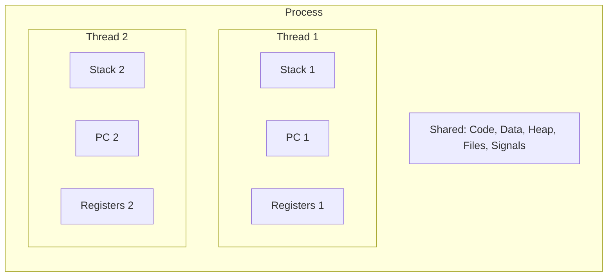
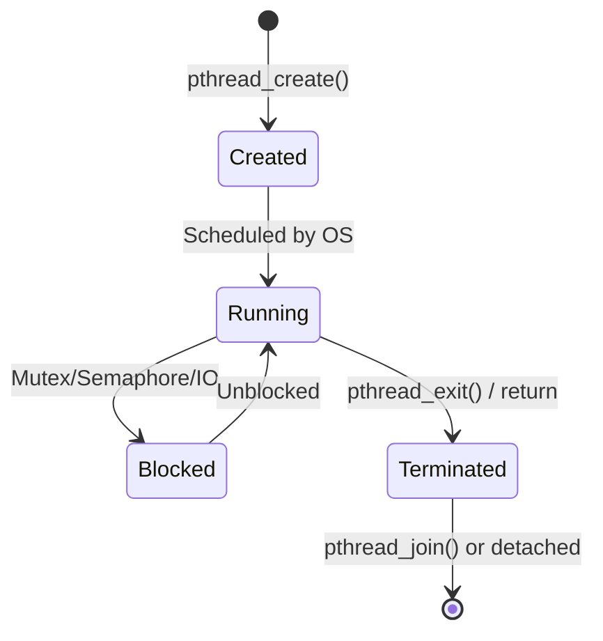

# Threads

## What is a Thread?

A **thread** is the smallest unit of execution within a process. A process can have multiple threads, all sharing the same address space, code, data, and resources — but each thread has its own **stack**, **program counter**, and **register set**.

> **Interview one-liner:** "A thread is a lightweight execution unit within a process — threads share code, data, and heap but have their own stack and registers."

## Process vs Thread



| Resource | Process | Thread |
|----------|---------|--------|
| Code segment | Own copy | **Shared** |
| Data segment | Own copy | **Shared** |
| Heap | Own copy | **Shared** |
| Stack | Own (one) | **Own per thread** |
| Registers | Own | **Own per thread** |
| Program counter | Own | **Own per thread** |
| File descriptors | Own | **Shared** |
| Signal handlers | Own | **Shared** |
| PID | Unique | Shared (TID differs) |
| Address space | Isolated | Shared |

## Why Use Threads?

### 1. Responsiveness
```
Single-threaded:  [===Request 1===][===Request 2===]
Multi-threaded:   [===Request 1===]
                  [===Request 2===]
                  (concurrent)
```

### 2. Resource Sharing
Threads share memory naturally — no IPC needed for data sharing.

### 3. Economy
| Operation | Process | Thread |
|-----------|---------|--------|
| Creation | ~1-10 ms | ~10-100 μs |
| Context switch | ~2-100 μs | ~1-10 μs |
| Memory overhead | Full address space | Stack only (~1-8 MB) |

### 4. Scalability
Multi-threaded programs can run on multiple CPU cores in parallel.

## POSIX Threads (pthreads) API

### Creating Threads

```c
#include <pthread.h>
#include <stdio.h>
#include <stdlib.h>

void *worker(void *arg) {
    int id = *(int *)arg;
    printf("Thread %d: running\n", id);
    return (void *)(long)(id * 10);  // Return value
}

int main() {
    pthread_t threads[4];
    int ids[4];
    
    for (int i = 0; i < 4; i++) {
        ids[i] = i;
        pthread_create(&threads[i], NULL, worker, &ids[i]);
    }
    
    for (int i = 0; i < 4; i++) {
        void *retval;
        pthread_join(threads[i], &retval);
        printf("Thread %d returned: %ld\n", i, (long)retval);
    }
    
    return 0;
}
```

### Thread Lifecycle



### Key pthread Functions

| Function | Purpose |
|----------|---------|
| `pthread_create()` | Create a new thread |
| `pthread_exit()` | Terminate calling thread |
| `pthread_join()` | Wait for thread to finish |
| `pthread_detach()` | Mark thread as detached (auto-cleanup) |
| `pthread_self()` | Get calling thread's ID |
| `pthread_cancel()` | Request thread cancellation |
| `pthread_setname_np()` | Set thread name (debugging) |
| `pthread_setaffinity_np()` | Pin thread to CPU core |

### Detached vs Joinable Threads

```c
// Joinable (default) — must be joined
pthread_t t1;
pthread_create(&t1, NULL, worker, NULL);
pthread_join(t1, NULL);  // Wait for t1

// Detached — auto-cleanup on exit
pthread_t t2;
pthread_attr_t attr;
pthread_attr_init(&attr);
pthread_attr_setdetachstate(&attr, PTHREAD_CREATE_DETACHED);
pthread_create(&t2, &attr, worker, NULL);
// No join needed
```

## Thread Synchronization

Since threads share memory, synchronization is critical:

### Mutex

```c
pthread_mutex_t mutex = PTHREAD_MUTEX_INITIALIZER;
int shared_counter = 0;

void *increment(void *arg) {
    for (int i = 0; i < 100000; i++) {
        pthread_mutex_lock(&mutex);
        shared_counter++;
        pthread_mutex_unlock(&mutex);
    }
    return NULL;
}
```

### Condition Variables

```c
pthread_mutex_t mutex = PTHREAD_MUTEX_INITIALIZER;
pthread_cond_t cond = PTHREAD_COND_INITIALIZER;
int ready = 0;

// Producer
void *producer(void *arg) {
    pthread_mutex_lock(&mutex);
    ready = 1;
    pthread_cond_signal(&cond);  // Wake consumer
    pthread_mutex_unlock(&mutex);
    return NULL;
}

// Consumer
void *consumer(void *arg) {
    pthread_mutex_lock(&mutex);
    while (!ready) {
        pthread_cond_wait(&cond, &mutex);  // Sleep until signaled
    }
    printf("Data ready!\n");
    pthread_mutex_unlock(&mutex);
    return NULL;
}
```

## Thread-Specific Data (TSD)

```c
#include <pthread.h>

pthread_key_t tls_key;

void *worker(void *arg) {
    // Each thread has its own copy
    pthread_setspecific(tls_key, malloc(1024));
    
    void *my_data = pthread_getspecific(tls_key);
    // my_data is unique to this thread
    
    return NULL;
}

int main() {
    pthread_key_create(&tls_key, free);  // Destructor called on thread exit
    // Create threads...
}
```

## C11 Threads (Modern Alternative)

```c
#include <threads.h>
#include <stdio.h>

int worker(void *arg) {
    printf("Thread: %s\n", (char *)arg);
    return 42;
}

int main() {
    thrd_t thread;
    thrd_create(&thread, worker, "Hello");
    
    int result;
    thrd_join(&thread, &result);
    printf("Result: %d\n", result);
    
    return 0;
}
```

## Thread Safety

A function is **thread-safe** if it can be called concurrently by multiple threads without data races.

| Function | Thread-Safe? | Issue |
|----------|-------------|-------|
| `printf()` | Yes | Uses internal mutex |
| `malloc()` | Yes | Uses internal locks |
| `strtok()` | No | Uses static buffer |
| `strtok_r()` | Yes | Caller provides buffer |
| `rand()` | No | Uses static state |
| `rand_r()` | Yes | Caller provides state |
| `localtime()` | No | Returns static pointer |
| `localtime_r()` | Yes | Caller provides buffer |

## Performance Considerations

### Thread Pool
Creating threads per-request is expensive. Use a thread pool:

```c
// Instead of:
for (int i = 0; i < 10000; i++) {
    pthread_create(&t, NULL, handle_request, &req[i]);  // 10000 threads!
}

// Use a pool:
// Create N worker threads once
// Submit tasks to a shared queue
```

### False Sharing
```c
// BAD: Both variables on same cache line
struct {
    int thread1_counter;  // Modified by thread 1
    int thread2_counter;  // Modified by thread 2
} shared;  // Cache line ping-pong!

// GOOD: Pad to separate cache lines
struct {
    int thread1_counter;
    char padding1[60];  // Fill cache line
    int thread2_counter;
    char padding2[60];
} shared;
```

## Interview Questions

### Beginner

**Q1: What is the difference between a process and a thread?**  
A: A process is an independent program with its own memory space. A thread is a lightweight execution unit within a process. Threads share code, data, and heap but have their own stack and registers. Threads are cheaper to create and switch between.

**Q2: Why use threads instead of processes?**  
A: Threads are faster to create (~10-100μs vs ~1-10ms), use less memory (shared address space), have cheaper context switches (no TLB flush), and communicate easily (shared memory). Use processes for isolation (one crash doesn't affect others) and threads for performance.

**Q3: What is `pthread_join()`?**  
A: `pthread_join()` blocks the calling thread until the specified thread terminates. It's the thread equivalent of `wait()` for processes. It also retrieves the thread's return value. Every joinable thread must be joined to avoid resource leaks.

### Intermediate

**Q4: What happens if you don't `pthread_join()` a thread?**  
A: If the thread is joinable (default), its resources (stack, TID) are not freed — similar to a zombie process. This is a resource leak. Use `pthread_detach()` for threads you don't need to wait for, or join them explicitly.

**Q5: What is thread safety? How do you make a function thread-safe?**  
A: A function is thread-safe if it can be called concurrently without data races. Make it thread-safe by: 1) Using mutexes to protect shared data, 2) Using reentrant versions of functions (`strtok_r` instead of `strtok`), 3) Using thread-local storage instead of static variables, 4) Using atomic operations for simple counters.

**Q6: Explain the producer-consumer problem with threads.**  
A: Producer threads add items to a shared buffer; consumer threads remove items. Synchronization: mutex for buffer access, condition variable to signal when buffer has items (wake consumer) or space (wake producer). Key: always check condition in a `while` loop (not `if`) to handle spurious wakeups.

### FAANG-Level

**Q7: How would you implement a work-stealing thread pool?**  
A: Each worker thread has its own deque (double-ended queue). Tasks are pushed to the local end. When a thread's deque is empty, it "steals" from the tail of another thread's deque. Benefits: minimal contention (each thread works on its own deque), good cache locality, dynamic load balancing. Implementation: use lock-free Chase-Lev deque, or per-thread mutex-protected deques with random victim selection for stealing.

**Q8: A multi-threaded program has a race condition that only appears under load. How would you debug it?**  
A: 1) **Static analysis:** ThreadSanitizer (TSan) compile with `-fsanitize=thread`, 2) **Dynamic analysis:** Valgrind's Helgrind or DRD, 3) **Code review:** Look for unprotected shared data, check lock ordering, 4) **Stress testing:** Run with many threads, add `usleep()` random delays to increase race window, 5) **Logging:** Add timestamps and thread IDs to every shared data access, 6) **Formal:** Use model checkers like SPIN for critical sections.

**Q9: Compare POSIX threads, green threads, and fibers.**  
A: **POSIX threads** (1:1): kernel-managed, true parallelism, OS-visible, ~1-10μs context switch. **Green threads** (M:1 or M:N): user-space managed, cooperative scheduling, faster switching (~100ns), but can't use multiple cores (M:1). **Fibers** (cooperative): user-space coroutines, manual yield points, minimal overhead (~50ns). Use pthreads for CPU-bound parallel work. Use green threads/fibers for I/O-bound work with massive concurrency (100k+ tasks). Go uses M:N (goroutines). Java virtual threads are M:N.

## Common Mistakes

1. **Not joining or detaching threads:** Creates resource leaks (thread zombies).
2. **Accessing shared data without synchronization:** Data races lead to undefined behavior.
3. **Deadlock with multiple locks:** Always acquire locks in the same order.
4. **Using `pthread_cancel()` carelessly:** Can leave resources in inconsistent state. Use cleanup handlers.
5. **Stack overflow:** Default thread stack is 1-8MB. Deep recursion or large local variables can overflow it.

## Summary

| Aspect | Key Point |
|--------|-----------|
| Definition | Lightweight execution unit within a process |
| Shared | Code, data, heap, file descriptors |
| Private | Stack, registers, program counter |
| API | pthreads (POSIX), C11 threads, C++ std::thread |
| Synchronization | Mutex, condition variable, semaphore, rwlock |
| Creation cost | ~10-100 μs |
| Context switch | ~1-10 μs |

## Cross-References

- [User vs Kernel Threads](./user-vs-kernel.md) - Thread implementation models
- [Thread Models](./models.md) - 1:1, M:1, M:N
- [Thread Pools](./pools.md) - Efficient thread reuse
- [Thread Safety](./safety.md) - Writing correct concurrent code
- [Green Threads](./green-threads.md) - User-space threads
- [Synchronization](../synchronization/README.md) - Mutex, semaphore, etc.
- [Processes](../processes/README.md) - Heavyweight alternative
