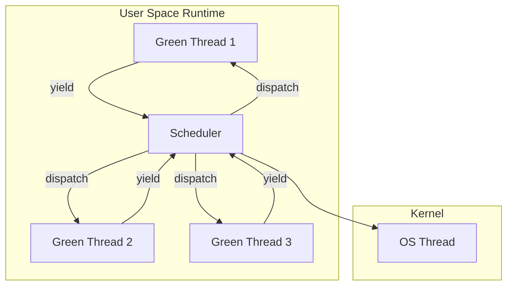
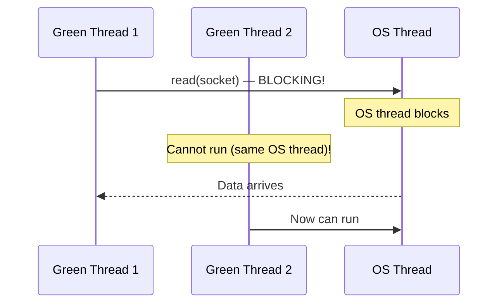

# Green Threads

## Overview

**Green threads** are threads that are scheduled and managed entirely in **user space**, without kernel involvement. The OS kernel sees only a single thread (or a few), while the user-space runtime multiplexes many green threads onto it.

> **Interview one-liner:** "Green threads are user-space-managed threads that the kernel doesn't know about — they're lightweight and fast but can't leverage multiple CPU cores without an M:N model."

## Why "Green"?

The term originated from the Green Team at Sun Microsystems that developed the original Java thread implementation. It has nothing to do with the color — it's a team name.

## Characteristics

| Property | Green Threads | OS Threads (pthreads) |
|----------|--------------|----------------------|
| Managed by | User-space runtime | Kernel |
| Kernel visibility | Invisible | Fully visible |
| Creation cost | ~1 μs | ~10-100 μs |
| Context switch | ~100 ns (no mode switch) | ~1-10 μs (mode switch) |
| Stack size | ~2-8 KB (growable) | ~1-8 MB (fixed) |
| Parallelism | No (M:1) | Yes (1:1) |
| Blocking I/O | Must use async I/O | Can block freely |
| Scheduling | Application-controlled | OS-controlled |

## How Green Threads Work

### Cooperative Scheduling



Green threads yield control at specific points:
- Channel operations
- I/O operations (converted to non-blocking)
- Explicit yield calls
- Function calls (in some implementations)

### Stack Management

```c
// Each green thread has a small, growable stack
// Initial stack: 2-4 KB (vs 1-8 MB for OS threads)
// Grows dynamically as needed

struct green_thread {
    void *stack;           // Stack memory
    size_t stack_size;     // Current size
    void *sp;              // Stack pointer
    void *pc;              // Program counter
    int state;             // RUNNING, READY, BLOCKED
    struct green_thread *next;  // Queue link
};
```

### Context Switch (User Space)

```c
// Simplified green thread context switch
void switch_context(green_thread *from, green_thread *to) {
    // Save current context
    if (setjmp(from->context) == 0) {
        // Restore target context
        longjmp(to->context, 1);
    }
}

// Using ucontext (POSIX)
#include <ucontext.h>

void switch_context_ucontext(ucontext_t *from, ucontext_t *to) {
    swapcontext(from, to);  // Atomic save + restore
}
```

## Implementing Green Threads

### Minimal Implementation with `ucontext`

```c
#include <ucontext.h>
#include <stdio.h>
#include <stdlib.h>

#define STACK_SIZE 8192
#define MAX_THREADS 10

typedef struct {
    ucontext_t context;
    int finished;
} green_thread;

green_thread threads[MAX_THREADS];
int current = 0;
int num_threads = 0;
ucontext_t main_context;

void green_thread_init(green_thread *gt, void (*func)(void)) {
    getcontext(&gt->context);
    gt->context.uc_stack.ss_sp = malloc(STACK_SIZE);
    gt->context.uc_stack.ss_size = STACK_SIZE;
    gt->context.uc_link = &main_context;
    makecontext(&gt->context, func, 0);
    gt->finished = 0;
}

void schedule() {
    int next = (current + 1) % num_threads;
    while (threads[next].finished && next != current) {
        next = (next + 1) % num_threads;
    }
    
    int prev = current;
    current = next;
    swapcontext(&threads[prev].context, &threads[next].context);
}

void green_yield() {
    schedule();
}

void green_exit() {
    threads[current].finished = 1;
    schedule();
}

// Example usage
void thread_func_1() {
    for (int i = 0; i < 5; i++) {
        printf("Thread 1: iteration %d\n", i);
        green_yield();
    }
    green_exit();
}

void thread_func_2() {
    for (int i = 0; i < 5; i++) {
        printf("Thread 2: iteration %d\n", i);
        green_yield();
    }
    green_exit();
}

int main() {
    green_thread_init(&threads[0], thread_func_1);
    green_thread_init(&threads[1], thread_func_2);
    num_threads = 2;
    
    getcontext(&main_context);
    schedule();
    
    printf("All threads finished\n");
    return 0;
}
```

## Modern Green Thread Implementations

### Goroutines (Go)

```go
package main

import (
    "fmt"
    "time"
)

func worker(id int) {
    for i := 0; i < 3; i++ {
        fmt.Printf("Worker %d: iteration %d\n", id, i)
        time.Sleep(100 * time.Millisecond) // Cooperative yield point
    }
}

func main() {
    // These are green threads (goroutines)
    go worker(1)
    go worker(2)
    go worker(3)
    
    time.Sleep(1 * time.Second) // Wait for goroutines
}
```

**Go's goroutines:**
- 2KB initial stack (grows dynamically, up to 1GB)
- M:N model (goroutines mapped to OS threads)
- Cooperative scheduling at function calls + async preemption
- Integrated with Go scheduler and garbage collector

### Python Green Threads (gevent)

```python
import gevent
from gevent import monkey

# Patch standard library to be non-blocking
monkey.patch_all()

def fetch(url):
    import urllib.request
    response = urllib.request.urlopen(url)
    return response.read()

# These run as green threads (coroutines)
jobs = [
    gevent.spawn(fetch, 'http://example.com/1'),
    gevent.spawn(fetch, 'http://example.com/2'),
    gevent.spawn(fetch, 'http://example.com/3'),
]

# Wait for all to complete
gevent.joinall(jobs)
```

### Java Virtual Threads (Project Loom)

```java
// Java 21+ virtual threads
public class GreenThreadExample {
    public static void main(String[] args) throws Exception {
        // Virtual thread = green thread (M:N model)
        Thread.startVirtualThread(() -> {
            System.out.println("Virtual thread running");
            try {
                Thread.sleep(1000); // Yields to scheduler, doesn't block OS thread
            } catch (InterruptedException e) {}
        }).join();
        
        // Can create millions of these
        var threads = new ArrayList<Thread>();
        for (int i = 0; i < 100_000; i++) {
            threads.add(Thread.startVirtualThread(() -> {
                // Each has tiny stack (~1KB)
                // Total memory: ~100MB (vs 100GB for OS threads)
            }));
        }
        for (var t : threads) t.join();
    }
}
```

## The Blocking Problem

Green threads + blocking I/O = disaster:



### Solutions

#### 1. Non-blocking I/O + Event Loop

```c
// Convert blocking calls to non-blocking
int fd = open("/dev/urandom", O_RDONLY | O_NONBLOCK);
// Use epoll/kqueue for readiness notification
```

#### 2. Runtime-integrated I/O (Go, Java Loom)

The runtime intercepts blocking calls and converts them:

```go
// Go runtime automatically converts this:
data, err := conn.Read(buffer)
// Into: non-blocking read + park goroutine + resume when ready
```

```java
// Java Loom "unmounts" virtual thread from carrier:
Thread.sleep(1000);  // Virtual thread parks, carrier thread freed
```

#### 3. Async/Await (Rust, Python, C#)

```rust
async fn fetch_data() -> Vec<u8> {
    let data = socket.read().await;  // Yield point
    data
}

// Compiler transforms into state machine
```

## Performance Comparison

| Metric | OS Threads | Green Threads |
|--------|-----------|--------------|
| Max concurrent | ~10,000 | ~1,000,000+ |
| Memory per thread | 1-8 MB | 2-8 KB |
| Creation time | ~10-100 μs | ~0.1-1 μs |
| Context switch | ~1-10 μs | ~100 ns |
| CPU parallelism | Yes | No (unless M:N) |
| Blocking I/O | Works | Problematic |

## When to Use Green Threads

| Use Case | Green Threads? | Why |
|----------|---------------|-----|
| I/O-bound web server | Yes | Millions of connections, small tasks |
| CPU-bound computation | No | Need OS threads for parallelism |
| Legacy blocking code | No | Green threads can't handle blocking |
| Microservices | Yes | Async I/O, many concurrent requests |
| Real-time systems | No | Scheduling control needed |

## Interview Questions

### Beginner

**Q1: What are green threads?**  
A: Green threads are threads managed entirely in user space by a runtime library, not by the OS kernel. They're lightweight (small stacks, fast creation) but can't use multiple CPU cores in M:1 implementations.

**Q2: What is the main disadvantage of green threads?**  
A: In M:1 implementations, one blocking syscall blocks all green threads because they share a single OS thread. Solutions: M:N models (Go), async I/O, or runtime-integrated blocking (Java Loom).

### Intermediate

**Q3: How do goroutines avoid the blocking problem?**  
A: Go uses M:N threading. The runtime multiplexes goroutines onto multiple OS threads. When a goroutine blocks (I/O, channel, syscall), the OS thread detaches and runs another goroutine. Network I/O is integrated with epoll internally.

**Q4: What is the difference between green threads and coroutines?**  
A: Coroutines are a control flow mechanism — they yield and resume at specific points, typically single-threaded. Green threads are a concurrency mechanism — they're scheduled by a runtime, potentially on multiple OS threads. Coroutines are the building block; green threads are the scheduling abstraction.

**Q5: How does Java's Project Loom implement virtual threads?**  
A: Virtual threads use **continuations** — the JVM can capture and restore the entire call stack. When a virtual thread blocks (I/O, sleep, lock), the JVM saves its continuation and unmounts it from the carrier thread. The carrier thread runs another virtual thread. When the I/O completes, the continuation is restored and resumed on any available carrier thread.

### FAANG-Level

**Q6: Design a green thread runtime for a systems programming language.**  
A: 1) **Stack management:** Start with 4KB, use guard pages for overflow detection, grow with `mremap()`, 2) **Scheduler:** Per-core run queues with work-stealing (like Go), 3) **Context switch:** Use `ucontext` or assembly (save/restore registers, swap stack pointers), 4) **I/O integration:** Intercept syscalls via LD_PRELOAD or compile-time transform, use io_uring for async I/O, 5) **Preemption:** SIGPROF-based async preemption (like Go 1.14), 6) **Memory:** Arena allocator per-core, GC integration if managed language, 7) **Channels:** Lock-free SPSC/MPMC queues for inter-green-thread communication.

**Q7: Compare Go's goroutines, Erlang's processes, and Java's virtual threads.**  
A: **Go goroutines:** 2KB initial stack (grows to 1GB), cooperative + async preemption (Go 1.14+), G-M-P scheduler with work-stealing, integrated GC. **Erlang processes:** 2KB heap, fully preemptive (reduction counting — each function call decrements a counter), per-process GC (no stop-the-world), message-passing only (no shared memory). **Java virtual threads:** Continuation-based, carrier threads (ForkJoinPool), integrates with existing Java APIs, pinned during native calls. All solve M:N, but differ in scheduling, memory, and communication models.

**Q8: A Go service has 100,000 goroutines but high latency. Diagnose.**  
A: 1) **Goroutine leak:** `runtime.NumGoroutine()` — if growing, goroutines aren't finishing. Use `pprof` to find where they're stuck, 2) **Preemption:** Long-running goroutines block others. Check for tight loops without function calls (pre-Go 1.14 issue), 3) **GOMAXPROCS:** Too low (underutilizing CPU) or too high (excessive context switches), 4) **GC pressure:** Many goroutines = many allocations. Tune `GOGC`, use sync.Pool, 5) **Channel contention:** Too many goroutines on one channel. Use sharded channels, 6) **Syscall blocking:** Network/DNS calls blocking M threads. Use netpoll-integrated APIs, 7) **Scheduler tracing:** `GODEBUG=schedtrace=1000` to observe scheduling behavior.

## Common Mistakes

1. **Using blocking I/O with green threads:** Defeats the purpose. Always use async I/O.
2. **Assining green threads give parallelism:** In M:1, they don't. Use M:N or OS threads for CPU-bound work.
3. **Stack overflow with small stacks:** Deep recursion with small green thread stacks. Increase stack size or use iterative algorithms.
4. **Not yielding:** Long-running green threads (tight loops) prevent others from running. Add yield points.
5. **Confusing concurrency with parallelism:** Green threads give concurrency (many tasks in progress) but not necessarily parallelism (many tasks executing simultaneously).

## Summary

| Aspect | Key Point |
|--------|-----------|
| Definition | User-space managed threads, invisible to kernel |
| Stack size | 2-8 KB (vs 1-8 MB for OS threads) |
| Creation | ~1 μs (vs ~10-100 μs for OS threads) |
| Context switch | ~100 ns (vs ~1-10 μs) |
| Max count | ~1,000,000+ (vs ~10,000 for OS threads) |
| Parallelism | No (M:1) or Yes (M:N) |
| Blocking | Problematic — need async I/O or M:N |

## Cross-References

- [User vs Kernel Threads](./user-vs-kernel.md) - Detailed comparison
- [Thread Models](./models.md) - M:1, 1:1, M:N
- [Thread Pools](./pools.md) - Alternative concurrency model
- [Scheduling](../scheduling/README.md) - Kernel scheduling


## Cross References

- [User vs Kernel Threads](../os/threads/user-vs-kernel.md)
- [Coroutines](../concurrency/coroutines.md)
- [Async/Await](../concurrency/async-await.md)
- [Go Channels](../concurrency/go-channels.md)
