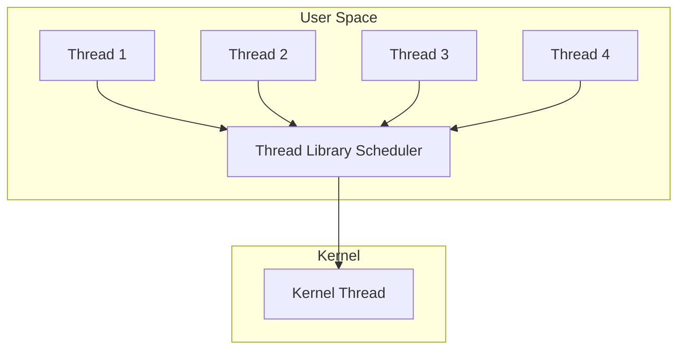
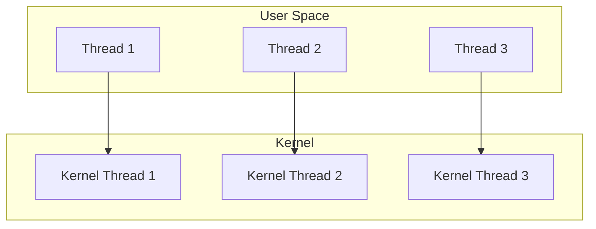
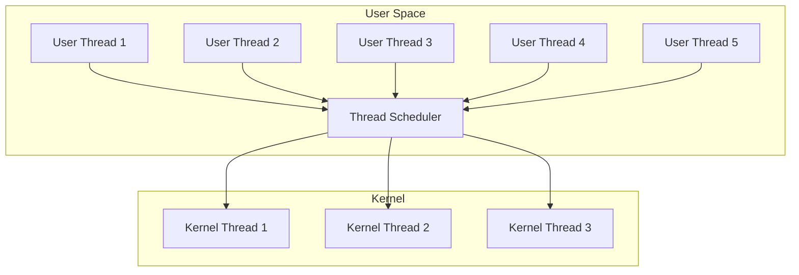
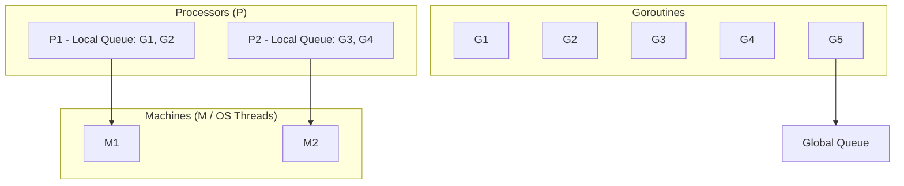

# Thread Models

## Overview

Thread models define how user-level threads (ULT) are mapped to kernel-level threads (KLT). The mapping affects parallelism, blocking behavior, and scheduling overhead. There are three primary models: **Many-to-One (M:1)**, **One-to-One (1:1)**, and **Many-to-Many (M:N)**.

## Many-to-One (M:1)

All user threads are managed by a thread library in user space and mapped to a single kernel thread.



### How It Works
1. Thread library creates and manages all threads in user space
2. Only one thread can access the kernel at a time
3. Thread library switches between threads (cooperative or preemptive)
4. Kernel sees a single execution flow

### Advantages
- Extremely fast thread creation and context switching (no kernel involvement)
- Portable — works on any OS
- Application controls scheduling policy

### Disadvantages
- **No true parallelism** — single kernel thread, single CPU
- **One blocks, all block** — if any thread makes a blocking syscall, all threads block
- Requires non-blocking I/O for responsiveness

### Examples
- Solaris Green Threads
- GNU Portable Threads
- Early Java green threads

## One-to-One (1:1)

Each user thread maps directly to a kernel thread.



### How It Works
1. Each `pthread_create()` creates a kernel thread (via `clone()` on Linux)
2. Kernel schedules each thread independently
3. True parallelism on multi-core systems
4. Blocking one thread doesn't affect others

### Advantages
- **True parallelism** — threads run on multiple CPUs
- **Blocking doesn't affect others** — each thread is independent
- Kernel can apply sophisticated scheduling

### Disadvantages
- **Thread creation is expensive** — involves syscall
- **Context switch is slower** — requires mode switch
- **Overhead for many threads** — kernel resources per thread

### Examples
- Linux NPTL (Native POSIX Thread Library)
- Windows threads
- macOS pthreads
- Modern Java threads

### Linux Implementation

```bash
# Each pthread is a kernel thread via clone()
cat /proc/<PID>/status | grep Threads
# Threads: 8

# View thread details
ls /proc/<PID>/task/
# 1234  1235  1236  1237  1238  1239  1240  1241

# Each has its own status
cat /proc/<PID>/task/1235/status | grep State
# State: S (sleeping)
```

## Many-to-Many (M:N) / Hybrid

M user threads are multiplexed onto N kernel threads, where N ≤ M.



### How It Works
1. User threads are created and managed by a library
2. Library multiplexes M threads onto N kernel threads
3. When a user thread blocks, library moves it off the kernel thread
4. Another user thread can run on the freed kernel thread

### Advantages
- Combines benefits of both M:1 and 1:1
- True parallelism (N kernel threads)
- Efficient for many user threads
- Blocking handled by library (not all threads block)

### Disadvantages
- **Complex implementation** — library and kernel must coordinate
- **Scheduling complexity** — two-level scheduling
- **Debugging difficulty** — kernel tools may not show user threads

### Examples
- Go goroutines (G-M-P model)
- Erlang processes
- Solaris LWP (historical)
- Haskell green threads

## Go's G-M-P Model



| Component | Description |
|-----------|-------------|
| **G (Goroutine)** | Lightweight thread (2KB initial stack) |
| **P (Processor)** | Logical processor, holds local run queue |
| **M (Machine)** | OS thread, executes goroutines |

- `GOMAXPROCS` controls number of Ps (default = CPU cores)
- Each P has a local queue of goroutines
- Work-stealing: idle P steals from another P's queue
- When G blocks (I/O), M detaches from P, another M takes over

## Java Virtual Threads (Project Loom)

Java 21+ introduced virtual threads (M:N model):

```java
// Platform thread (1:1)
Thread platform = Thread.ofPlatform().start(() -> {
    // Runs on OS thread
});

// Virtual thread (M:N)
Thread virtual = Thread.ofVirtual().start(() -> {
    // Runs on carrier thread (OS thread)
    // Can have millions of these
});

// Structured concurrency
try (var scope = StructuredTaskScope.ShutdownOnFailure()) {
    Future<String> user = scope.fork(() -> fetchUser());
    Future<Integer> order = scope.fork(() -> fetchOrder());
    scope.join();
    return new Response(user.resultNow(), order.resultNow());
}
```

## Comparison

| Model | Parallelism | Blocking | Creation Speed | Complexity | Example |
|-------|-------------|----------|----------------|------------|---------|
| M:1 | No | All block | Fastest | Simple | Green threads |
| 1:1 | Yes | Only one | Slowest | Simple | pthreads, Windows |
| M:N | Yes | Only one | Fast | Complex | Go, Erlang, Java Loom |

## Interview Questions

### Beginner

**Q1: What are the three thread models?**  
A: **M:1** — Many user threads, one kernel thread. No parallelism, one blocks all. **1:1** — One user thread per kernel thread. True parallelism, expensive creation. **M:N** — M user threads on N kernel threads. Best of both, but complex.

**Q2: Which model does Linux use?**  
A: Linux uses 1:1 (NPTL — Native POSIX Thread Library). Each pthread maps to a kernel thread created via `clone()`.

### Intermediate

**Q3: How does Go achieve both fast threading and parallelism?**  
A: Go uses M:N threading with the G-M-P model. Goroutines (G) are lightweight (2KB stack) and multiplexed onto processors (P), which run on OS threads (M). This gives fast creation (user-space) + true parallelism (multiple OS threads) + work-stealing for load balancing.

**Q4: What is the problem with M:1 threading?**  
A: Two main problems: 1) **No parallelism** — only one thread runs at a time (single kernel thread), 2) **Blocking problem** — if any thread makes a blocking syscall (disk I/O, network), all threads block because the kernel thread blocks.

**Q5: Why is 1:1 threading expensive for many threads?**  
A: Each thread requires: 1) Kernel thread creation (syscall overhead ~10-100μs), 2) Kernel stack (~8-16KB), 3) Kernel scheduling data structures, 4) Context switch involves mode switch. With 10,000 threads, that's 10,000 kernel objects + 80-160MB kernel stacks.

### FAANG-Level

**Q6: Design a runtime for a language that needs to support 10 million concurrent tasks.**  
A: M:N model (like Go): 1) Each task gets a goroutine-like entity with growable stack (start 4KB), 2) N scheduler threads (= CPU cores), 3) Per-thread local run queue with work-stealing, 4) Cooperative scheduling at safe points (function calls, channel ops), 5) Async preemption for long-running tasks, 6) Non-blocking I/O integrated with scheduler (epoll/io_uring), 7) Channel-based communication (no shared memory by default), 8) Memory: use arena allocator per-P for fast allocation.

**Q7: Compare Go's goroutines, Erlang's processes, and Java's virtual threads.**  
A: **Go goroutines:** 2KB initial stack (grows to 1GB), cooperative + preemptive scheduling, channels for communication, garbage-collected. **Erlang processes:** 2KB heap, fully preemptive (reduction counting), message passing (no shared memory), per-process GC (no stop-the-world). **Java virtual threads:** Built on Project Loom, continuation-based, integrates with existing Java ecosystem, pinned to carrier thread during native calls. All are M:N, but differ in scheduling, communication, and GC strategies.

**Q8: How would you implement thread affinity in an M:N model?**  
A: In M:N, user threads don't directly map to CPUs. Options: 1) **Pinning:** Lock a goroutine to a specific P (and thus M and CPU). Go: `runtime.LockOSThread()`. 2) **Soft affinity:** Prefer scheduling a user thread on the same P (cache warmth). 3) **NUMA-aware scheduling:** Assign Ps to NUMA nodes, schedule user threads based on memory allocation node. 4) **Priority P:** Create a dedicated P for latency-sensitive tasks.

## Common Mistakes

1. **Assuming all threads are kernel threads:** In M:N models, user threads are invisible to the kernel. Debugging tools may not show them.
2. **Blocking in M:1 model:** Any blocking I/O blocks all threads. Use non-blocking I/O or select the right model.
3. **Creating too many 1:1 threads:** Each has kernel overhead. Use thread pools.
4. **Not considering the model when debugging:** Race conditions behave differently in M:1 vs 1:1 vs M:N.

## Summary

| Model | ULT:KLT | Parallelism | Blocking | Use Case |
|-------|---------|-------------|----------|----------|
| M:1 | Many:1 | No | All block | Simple I/O-bound |
| 1:1 | 1:1 | Yes | Only one | General purpose |
| M:N | Many:Many | Yes | Only one | Massive concurrency |

## Cross-References

- [User vs Kernel Threads](./user-vs-kernel.md) - Detailed comparison
- [Green Threads](./green-threads.md) - M:1 implementation
- [Thread Pools](./pools.md) - Efficient thread management
- [Scheduling](../scheduling/README.md) - How threads get CPU time
