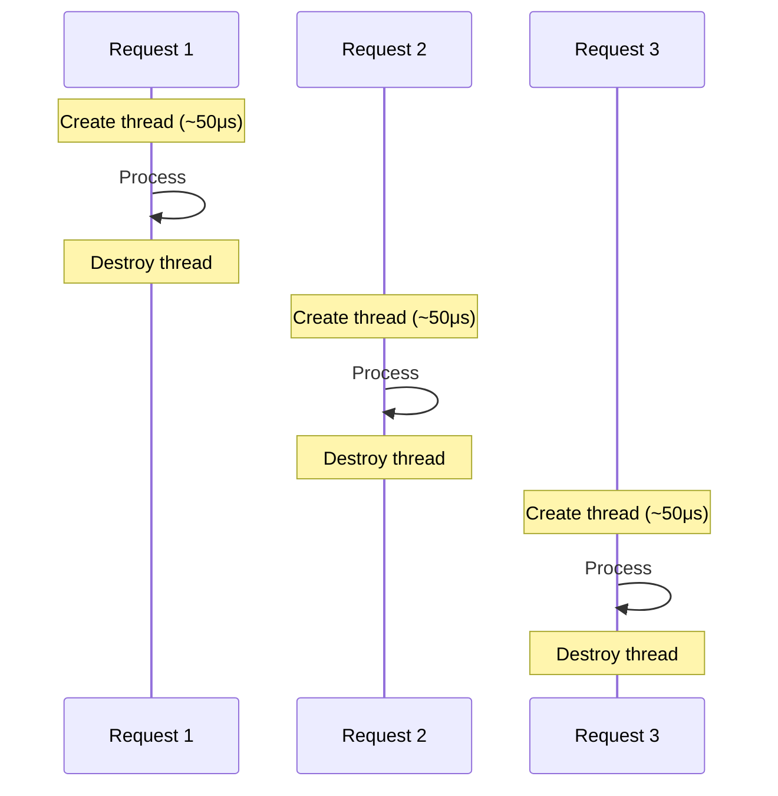
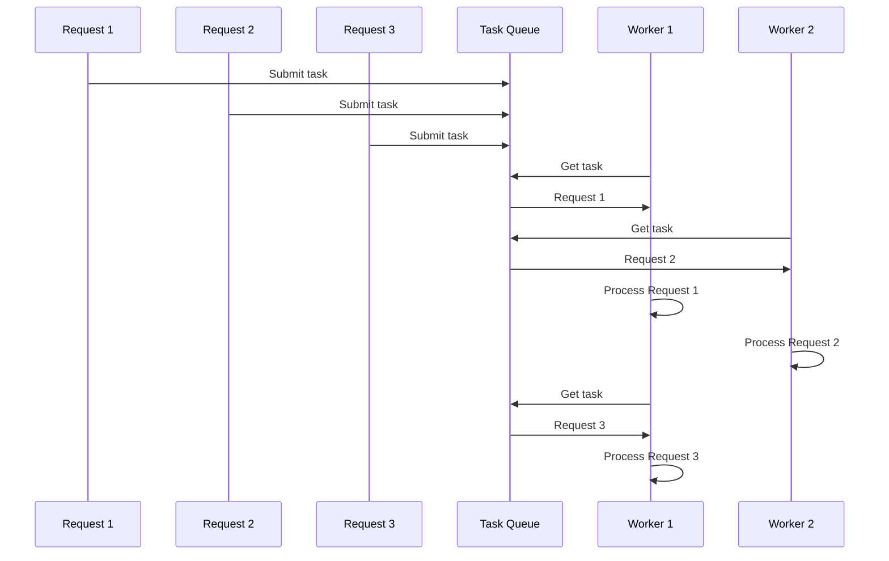
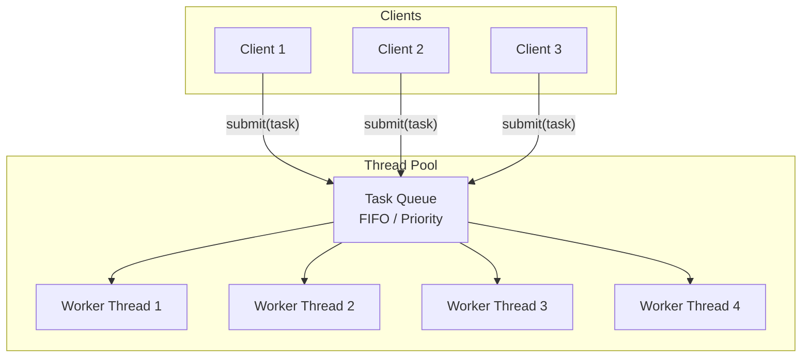
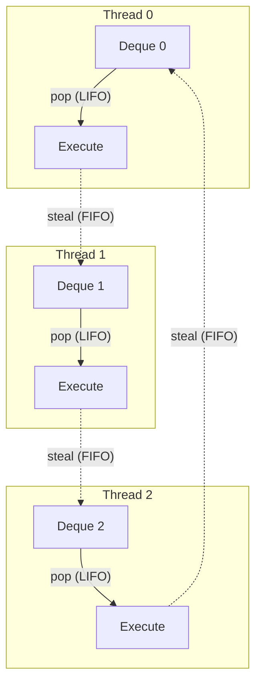

# Thread Pools

## Overview

A **thread pool** is a collection of pre-created worker threads that sit idle, waiting for tasks to be submitted. When a task arrives, it's assigned to an available thread. When the task completes, the thread returns to the pool for reuse.

> **Interview one-liner:** "A thread pool pre-creates N worker threads and maintains a shared task queue — instead of creating a thread per request, you submit tasks to the pool, avoiding the overhead of thread creation/destruction."

## Why Thread Pools?

### The Problem: Thread-per-Request



**Problems:**
- Thread creation overhead (~50-100μs per request)
- Memory overhead (1-8MB stack per thread)
- Thread explosion under load (10,000 requests = 10,000 threads)
- Context switch overhead with many threads

### The Solution: Thread Pool



## Thread Pool Architecture



### Components

| Component | Description |
|-----------|-------------|
| **Worker threads** | Pre-created threads that process tasks |
| **Task queue** | Shared queue holding pending tasks |
| **Mutex** | Protects the task queue |
| **Condition variable** | Signals workers when tasks are available |
| **Lifecycle management** | Shutdown, restart, monitoring |

## Implementation in C (POSIX)

```c
#include <pthread.h>
#include <stdlib.h>
#include <stdio.h>
#include <unistd.h>

// Task structure
typedef struct task {
    void (*function)(void *arg);
    void *arg;
    struct task *next;
} task_t;

// Thread pool structure
typedef struct {
    pthread_t *threads;
    int num_threads;
    task_t *task_head;
    task_t *task_tail;
    pthread_mutex_t mutex;
    pthread_cond_t cond;
    int shutdown;
    int active_tasks;
} thread_pool_t;

// Worker thread function
void *worker(void *arg) {
    thread_pool_t *pool = (thread_pool_t *)arg;
    
    while (1) {
        pthread_mutex_lock(&pool->mutex);
        
        // Wait for tasks or shutdown
        while (!pool->task_head && !pool->shutdown) {
            pthread_cond_wait(&pool->cond, &pool->mutex);
        }
        
        if (pool->shutdown) {
            pthread_mutex_unlock(&pool->mutex);
            pthread_exit(NULL);
        }
        
        // Get task from queue
        task_t *task = pool->task_head;
        pool->task_head = task->next;
        if (!pool->task_head) pool->task_tail = NULL;
        pool->active_tasks++;
        
        pthread_mutex_unlock(&pool->mutex);
        
        // Execute task (outside lock)
        task->function(task->arg);
        free(task);
        
        pthread_mutex_lock(&pool->mutex);
        pool->active_tasks--;
        pthread_mutex_unlock(&pool->mutex);
    }
    
    return NULL;
}

// Create thread pool
thread_pool_t *pool_create(int num_threads) {
    thread_pool_t *pool = malloc(sizeof(thread_pool_t));
    pool->threads = malloc(sizeof(pthread_t) * num_threads);
    pool->num_threads = num_threads;
    pool->task_head = NULL;
    pool->task_tail = NULL;
    pool->shutdown = 0;
    pool->active_tasks = 0;
    
    pthread_mutex_init(&pool->mutex, NULL);
    pthread_cond_init(&pool->cond, NULL);
    
    for (int i = 0; i < num_threads; i++) {
        pthread_create(&pool->threads[i], NULL, worker, pool);
    }
    
    return pool;
}

// Submit task to pool
int pool_submit(thread_pool_t *pool, void (*function)(void *), void *arg) {
    task_t *task = malloc(sizeof(task_t));
    task->function = function;
    task->arg = arg;
    task->next = NULL;
    
    pthread_mutex_lock(&pool->mutex);
    
    if (pool->task_tail) {
        pool->task_tail->next = task;
    } else {
        pool->task_head = task;
    }
    pool->task_tail = task;
    
    pthread_cond_signal(&pool->cond);
    pthread_mutex_unlock(&pool->mutex);
    
    return 0;
}

// Shutdown pool
void pool_destroy(thread_pool_t *pool) {
    pthread_mutex_lock(&pool->mutex);
    pool->shutdown = 1;
    pthread_cond_broadcast(&pool->cond);
    pthread_mutex_unlock(&pool->mutex);
    
    for (int i = 0; i < pool->num_threads; i++) {
        pthread_join(pool->threads[i], NULL);
    }
    
    free(pool->threads);
    pthread_mutex_destroy(&pool->mutex);
    pthread_cond_destroy(&pool->cond);
    free(pool);
}
```

### Usage

```c
void print_task(void *arg) {
    int id = *(int *)arg;
    printf("Task %d processed by thread %lu\n", id, pthread_self());
    usleep(100000);  // Simulate work
}

int main() {
    thread_pool_t *pool = pool_create(4);  // 4 worker threads
    
    int task_ids[20];
    for (int i = 0; i < 20; i++) {
        task_ids[i] = i;
        pool_submit(pool, print_task, &task_ids[i]);
    }
    
    sleep(3);  // Wait for tasks to complete
    pool_destroy(pool);
    
    return 0;
}
```

## Java ThreadPoolExecutor

```java
import java.util.concurrent.*;

public class ThreadPoolExample {
    public static void main(String[] args) {
        // Create thread pool
        ExecutorService pool = new ThreadPoolExecutor(
            4,                      // Core pool size
            8,                      // Maximum pool size
            60L, TimeUnit.SECONDS,  // Keep-alive time
            new LinkedBlockingQueue<>(100),  // Task queue
            new ThreadPoolExecutor.CallerRunsPolicy()  // Rejection policy
        );
        
        // Submit tasks
        for (int i = 0; i < 20; i++) {
            final int id = i;
            pool.submit(() -> {
                System.out.println("Task " + id + " on " + 
                    Thread.currentThread().getName());
            });
        }
        
        pool.shutdown();
        pool.awaitTermination(10, TimeUnit.SECONDS);
    }
}
```

### Java Thread Pool Types

| Factory Method | Description |
|---------------|-------------|
| `Executors.newFixedThreadPool(n)` | Fixed size, unbounded queue |
| `Executors.newCachedThreadPool()` | 0 core, 60s keep-alive, synchronous queue |
| `Executors.newSingleThreadExecutor()` | Single thread, sequential execution |
| `Executors.newScheduledThreadPool(n)` | Supports delayed/periodic tasks |

## Python concurrent.futures

```python
from concurrent.futures import ThreadPoolExecutor, as_completed

def task(n):
    import time
    time.sleep(0.1)
    return n * n

with ThreadPoolExecutor(max_workers=4) as executor:
    futures = {executor.submit(task, i): i for i in range(10)}
    
    for future in as_completed(futures):
        i = futures[future]
        result = future.result()
        print(f"Task {i}: {result}")
```

## Sizing Thread Pools

### CPU-Bound Tasks
```
num_threads = num_cores
```

### I/O-Bound Tasks
```
num_threads = num_cores × (1 + wait_time / compute_time)
```

Example: 8 cores, 90% I/O wait, 10% compute:
```
num_threads = 8 × (1 + 90/10) = 8 × 10 = 80 threads
```

### General Formula
```bash
# Linux: get core count
nproc  # or
cat /proc/cpuinfo | grep processor | wc -l

# Common recommendations
CPU-bound:       num_threads = num_cores
I/O-bound:       num_threads = num_cores * 2 to 5
Mixed:           num_threads = num_cores * 1.5
Database pool:   10-20 connections (limited by DB)
Web server:      100-1000 (depends on I/O patterns)
```

## Advanced: Work-Stealing Pool



Each thread has its own deque:
- **Push/Pop** at the bottom (LIFO — cache-friendly)
- **Steal** from the top (FIFO — load balancing)

Libraries: Java ForkJoinPool, Intel TBB, Go scheduler

## Interview Questions

### Beginner

**Q1: What is a thread pool?**  
A: A thread pool is a collection of pre-created worker threads that wait for tasks. When a task is submitted, it's placed in a queue and executed by the next available thread. This avoids the overhead of creating/destroying threads per task.

**Q2: Why not create a thread for each request?**  
A: Thread creation has overhead (~50-100μs), each thread needs stack memory (~1-8MB), and too many threads cause excessive context switching. Thread pools reuse threads, limiting resource usage and improving throughput.

### Intermediate

**Q3: How do you determine the right pool size?**  
A: CPU-bound: `num_cores` threads (no benefit from more). I/O-bound: `num_cores × (1 + wait/compute)` (threads spend time waiting). Too few: tasks queue up. Too many: context switch overhead. Monitor and tune based on CPU utilization and queue depth.

**Q4: What happens when the task queue is full?**  
A: Rejection policies (Java): 1) `AbortPolicy` — throw exception, 2) `CallerRunsPolicy` — caller thread runs the task, 3) `DiscardPolicy` — silently drop, 4) `DiscardOldestPolicy` — drop oldest unhandled task. `CallerRunsPolicy` provides natural backpressure.

**Q5: What is the difference between a fixed and cached thread pool?**  
A: Fixed pool: N threads, tasks queue if all busy. Predictable resource usage. Cached pool: creates threads as needed, idle threads die after 60s. Good for many short-lived tasks but can create many threads under load.

### FAANG-Level

**Q6: Design a thread pool that handles both CPU-intensive and I/O-intensive tasks.**  
A: Separate pools: 1) CPU pool with `num_cores` threads, 2) I/O pool with `num_cores × 4` threads, 3) Use work-stealing for load balancing, 4) Priority queue for urgent tasks, 5) Dynamic sizing: monitor CPU utilization and queue depth, adjust pool size, 6) Use virtual threads (Java) or goroutines (Go) for massive I/O concurrency, 7) Implement circuit breaker: if queue exceeds threshold, reject new tasks.

**Q7: How would you implement a priority-based thread pool?**  
A: Replace FIFO queue with a priority queue (binary heap or skip list). Each task has a priority field. Workers always dequeue the highest-priority task. Challenges: 1) Priority inversion — low-priority task holds resource needed by high-priority, 2) Starvation — low-priority tasks may never execute (use aging), 3) Priority queue overhead — O(log n) vs O(1) for FIFO.

**Q8: Compare thread pools with event-driven (async) architectures.**  
A: **Thread pools:** Simple blocking code, N threads = N concurrent tasks, overhead per thread, good for moderate concurrency. **Event-driven:** Single-threaded event loop, non-blocking I/O (epoll/io_uring), handles thousands of connections with one thread, but callback spaghetti or async/await complexity. **Best of both:** M:N models (Go, Java Loom) — blocking-style code with event-driven efficiency. Use thread pools for CPU-bound work, async for I/O-bound with massive concurrency.

## Common Mistakes

1. **Too many/too few threads:** Monitor CPU utilization and queue depth. Tune based on workload.
2. **Not shutting down pools:** Worker threads keep running. Always call `shutdown()` or `pool_destroy()`.
3. **Blocking in pool threads:** Long blocking (I/O, locks) ties up worker threads. Use separate pools for I/O.
4. **Unbounded queue:** Can cause memory exhaustion. Use bounded queues with rejection policies.
5. **Thread-local state leaks:** If tasks use thread-local storage, data from one task may leak to another. Clean up after each task.

## Summary

| Aspect | Key Point |
|--------|-----------|
| Purpose | Reuse threads to avoid creation/destruction overhead |
| Components | Worker threads + task queue + synchronization |
| Sizing (CPU) | num_cores threads |
| Sizing (I/O) | num_cores × (1 + wait/compute) |
| Queue bounds | Use bounded queue to prevent memory exhaustion |
| Shutdown | Always clean up threads on exit |

## Cross-References

- [Threads](./README.md) - Thread basics
- [Thread Safety](./safety.md) - Writing correct pool code
- [Scheduling](../scheduling/README.md) - How threads are scheduled
- [Synchronization](../synchronization/README.md) - Mutex, condition variables
