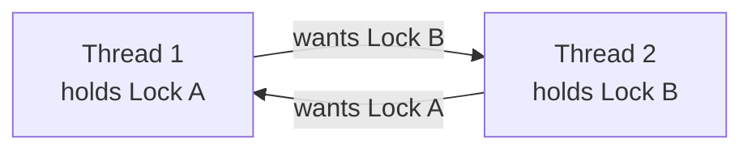

# Thread Safety

## Overview

**Thread safety** means that a function, data structure, or library works correctly when called from multiple threads simultaneously. Without proper care, concurrent access leads to **data races**, **deadlocks**, and **undefined behavior**.

> **Interview one-liner:** "Thread safety means code produces correct results when executed concurrently — it requires protecting shared data with synchronization primitives or eliminating shared state entirely."

## What Makes Code Thread-Unsafe?

### 1. Data Race

Two threads access the same memory location concurrently, and at least one writes:

```c
// UNSAFE: Data race
int counter = 0;

void *increment(void *arg) {
    for (int i = 0; i < 100000; i++) {
        counter++;  // NOT atomic: read, increment, write
    }
    return NULL;
}

// Two threads calling increment():
// Expected: counter = 200000
// Actual:   counter = 137421 (random each time)
```

### 2. Race Condition

Program behavior depends on the non-deterministic ordering of operations:

```c
// UNSAFE: Check-then-act race
if (account->balance >= amount) {  // Thread A checks
    // Thread B checks and withdraws here
    account->balance -= amount;     // Thread A proceeds (overdraft!)
}
```

### 3. TOCTOU (Time of Check to Time of Use)

```c
// UNSAFE: TOCTOU
if (access("/tmp/file", W_OK) == 0) {  // Check permissions
    // Another process could change the file here!
    fd = open("/tmp/file", O_WRONLY);  // Use (file may have changed)
}
```

## Solutions for Thread Safety

### 1. Mutex (Mutual Exclusion)

```c
#include <pthread.h>

pthread_mutex_t mutex = PTHREAD_MUTEX_INITIALIZER;
int counter = 0;

void *safe_increment(void *arg) {
    for (int i = 0; i < 100000; i++) {
        pthread_mutex_lock(&mutex);
        counter++;
        pthread_mutex_unlock(&mutex);
    }
    return NULL;
}
```

### 2. Read-Write Lock

```c
#include <pthread.h>

pthread_rwlock_t rwlock = PTHREAD_RWLOCK_INITIALIZER;
int shared_data = 0;

void *reader(void *arg) {
    pthread_rwlock_rdlock(&rwlock);
    // Multiple readers can enter concurrently
    printf("Data: %d\n", shared_data);
    pthread_rwlock_unlock(&rwlock);
    return NULL;
}

void *writer(void *arg) {
    pthread_rwlock_wrlock(&rwlock);
    // Exclusive access
    shared_data++;
    pthread_rwlock_unlock(&rwlock);
    return NULL;
}
```

### 3. Atomic Operations

```c
#include <stdatomic.h>

atomic_int counter = 0;

void *atomic_increment(void *arg) {
    for (int i = 0; i < 100000; i++) {
        atomic_fetch_add(&counter, 1);  // Lock-free, hardware-supported
    }
    return NULL;
}
```

### 4. Thread-Local Storage (TLS)

```c
#include <pthread.h>

__thread int thread_local_counter = 0;  // Each thread has its own copy

// Or using pthread API:
pthread_key_t key;
pthread_key_create(&key, NULL);
pthread_setspecific(key, value);
void *my_val = pthread_getspecific(key);
```

### 5. Immutability

```c
// SAFE: Immutable data is inherently thread-safe
struct Config {
    const char *hostname;  // Set once, read many
    const int port;
    const int max_connections;
};

// Create once, share freely
const struct Config config = {"localhost", 8080, 100};
```

## Deadlock

### What is Deadlock?



Both threads wait forever — neither can proceed.

### Deadlock Example

```c
// DEADLOCK: Different lock ordering
pthread_mutex_t lock_a = PTHREAD_MUTEX_INITIALIZER;
pthread_mutex_t lock_b = PTHREAD_MUTEX_INITIALIZER;

void *thread1(void *arg) {
    pthread_mutex_lock(&lock_a);  // Acquires A
    sleep(1);                      // Give thread2 time to acquire B
    pthread_mutex_lock(&lock_b);  // Waits for B (held by thread2)
    // DEADLOCK!
    return NULL;
}

void *thread2(void *arg) {
    pthread_mutex_lock(&lock_b);  // Acquires B
    sleep(1);
    pthread_mutex_lock(&lock_a);  // Waits for A (held by thread1)
    // DEADLOCK!
    return NULL;
}
```

### Deadlock Prevention

#### 1. Lock Ordering

```c
// SAFE: Always acquire locks in the same order
void *safe_thread(void *arg) {
    pthread_mutex_lock(&lock_a);  // Always A first
    pthread_mutex_lock(&lock_b);  // Then B
    // Critical section
    pthread_mutex_unlock(&lock_b);
    pthread_mutex_unlock(&lock_a);
    return NULL;
}
```

#### 2. Try-Lock with Backoff

```c
void *safe_transfer(void *arg) {
    while (1) {
        pthread_mutex_lock(&lock_a);
        if (pthread_mutex_trylock(&lock_b) == 0) {
            // Got both locks
            transfer();
            pthread_mutex_unlock(&lock_b);
            pthread_mutex_unlock(&lock_a);
            break;
        }
        // Couldn't get lock_b — release lock_a and retry
        pthread_mutex_unlock(&lock_a);
        usleep(rand() % 1000);  // Random backoff
    }
    return NULL;
}
```

#### 3. Lock Hierarchy

```c
// Define lock levels
enum lock_level {
    LEVEL_RESOURCE = 1,
    LEVEL_MANAGER  = 2,
    LEVEL_SYSTEM   = 3
};

// Thread must acquire locks in increasing level order
// Code that holds LEVEL_RESOURCE cannot acquire LEVEL_SYSTEM directly
```

## Condition Variable Pitfalls

### Spurious Wakeups

```c
// WRONG: May wake up without signal
pthread_cond_wait(&cond, &mutex);
do_work();

// RIGHT: Always check condition in a loop
while (!condition) {
    pthread_cond_wait(&cond, &mutex);
}
do_work();
```

### Signal vs Broadcast

```c
// Signal: wakes ONE waiting thread
pthread_cond_signal(&cond);  // Use when one waiter can proceed

// Broadcast: wakes ALL waiting threads
pthread_cond_broadcast(&cond);  // Use when condition affects all
```

## Common Thread-Safe Patterns

### 1. Monitor Pattern

```c
typedef struct {
    pthread_mutex_t mutex;
    pthread_cond_t cond;
    int data;
    int ready;
} monitor_t;

void monitor_init(monitor_t *m) {
    pthread_mutex_init(&m->mutex, NULL);
    pthread_cond_init(&m->cond, NULL);
    m->ready = 0;
}

void monitor_produce(monitor_t *m, int value) {
    pthread_mutex_lock(&m->mutex);
    m->data = value;
    m->ready = 1;
    pthread_cond_signal(&m->cond);
    pthread_mutex_unlock(&m->mutex);
}

int monitor_consume(monitor_t *m) {
    pthread_mutex_lock(&m->mutex);
    while (!m->ready) {
        pthread_cond_wait(&m->cond, &m->mutex);
    }
    int value = m->data;
    m->ready = 0;
    pthread_mutex_unlock(&m->mutex);
    return value;
}
```

### 2. Thread-Safe Singleton

```c
// C11 approach
#include <threads.h>

static once_flag flag = ONCE_FLAG_INIT;
static int *instance = NULL;

void init_instance(void) {
    instance = malloc(sizeof(int));
    *instance = 42;
}

int *get_instance(void) {
    call_once(&flag, init_instance);
    return instance;
}
```

### 3. Reader-Writer Lock Pattern

```c
// Ideal for read-heavy workloads
typedef struct {
    pthread_rwlock_t lock;
    char *data;
    size_t len;
} shared_buffer_t;

void *reader_thread(void *arg) {
    shared_buffer_t *buf = (shared_buffer_t *)arg;
    pthread_rwlock_rdlock(&buf->lock);  // Multiple readers OK
    // Read buf->data safely
    pthread_rwlock_unlock(&buf->lock);
    return NULL;
}

void *writer_thread(void *arg) {
    shared_buffer_t *buf = (shared_buffer_t *)arg;
    pthread_rwlock_wrlock(&buf->lock);  // Exclusive access
    // Modify buf->data safely
    pthread_rwlock_unlock(&buf->lock);
    return NULL;
}
```

## Thread-Safe Functions in POSIX

POSIX specifies `_r` suffix functions as reentrant (thread-safe):

| Unsafe | Safe | Issue with unsafe |
|--------|------|-------------------|
| `strtok()` | `strtok_r()` | Uses static buffer |
| `rand()` | `rand_r()` | Uses static state |
| `localtime()` | `localtime_r()` | Returns static pointer |
| `gethostbyname()` | `gethostbyname_r()` | Uses static buffer |
| `readdir()` | `readdir_r()` | Uses static buffer |
| `strerror()` | `strerror_r()` | Uses static buffer |
| `asctime()` | `asctime_r()` | Returns static pointer |

## Interview Questions

### Beginner

**Q1: What is thread safety?**  
A: A function is thread-safe if it works correctly when called from multiple threads concurrently. It produces correct results regardless of thread scheduling or interleaving.

**Q2: What is a data race?**  
A: A data race occurs when two threads access the same memory location concurrently, at least one is a write, and there's no synchronization. This leads to undefined behavior.

**Q3: What is a deadlock?**  
A: A deadlock occurs when two or more threads are each waiting for a resource held by the other, creating a cycle of dependency. None can proceed.

### Intermediate

**Q4: How do you prevent deadlocks?**  
A: 1) **Lock ordering:** Always acquire locks in the same global order, 2) **Try-lock with backoff:** Release and retry if can't get all locks, 3) **Lock hierarchy:** Assign levels, acquire only in increasing order, 4) **Timeout:** Use `pthread_mutex_timedlock()`, 5) **Lock-free algorithms:** Avoid locks entirely with atomics.

**Q5: What is the difference between a mutex and a semaphore?**  
A: A mutex has an owner — only the thread that locked it can unlock it. A semaphore has no ownership — any thread can signal it. Mutexes protect critical sections (mutual exclusion). Semaphores coordinate between threads (signaling, counting).

**Q6: When should you use `pthread_cond_signal()` vs `pthread_cond_broadcast()`?**  
A: Use `signal()` when exactly one waiter can proceed (e.g., produce one item, wake one consumer). Use `broadcast()` when the condition change affects all waiters (e.g., shutdown, configuration change). `signal()` is more efficient but `broadcast()` is safer when multiple waiters might need to recheck.

### FAANG-Level

**Q7: How would you make a legacy C library thread-safe?**  
A: 1) Audit for global/static variables (convert to TLS or pass as parameters), 2) Replace unsafe functions with reentrant versions (`strtok_r`, etc.), 3) Add mutex protection around shared data structures, 4) Use reader-writer locks for read-heavy data, 5) Consider lock-free algorithms for hot paths, 6) Document thread-safety guarantees (e.g., "read-safe, write-unsafe"), 7) Use `__attribute__((constructor))` for thread-safe initialization.

**Q8: Design a lock-free hash table for concurrent access.**  
A: 1) Use compare-and-swap (CAS) for atomic updates, 2) **Bucket structure:** Each bucket is an atomic pointer to a linked list, 3) **Insert:** CAS to prepend node to bucket head, 4) **Delete:** Mark node as deleted (logical deletion), then CAS to unlink, 5) **Resize:** Create new table, CAS to redirect, migrate entries incrementally, 6) **Memory reclamation:** Use epoch-based reclamation (EBR) or hazard pointers to safely free nodes, 7) Libraries: Intel TBB `concurrent_hash_map`, Java `ConcurrentHashMap` (segmented locking).

**Q9: Explain the happens-before relationship in C11/C++11 memory model.**  
A: The memory model defines when one thread's writes are visible to another. Key relationships: 1) **Sequenced-before:** Within a thread, statement A before B, 2) **Synchronizes-with:** Unlock of mutex happens-before lock, release-acquire on atomics, 3) **Happens-before:** Transitive closure of sequenced-before and synchronizes-with. If A happens-before B, A's writes are visible to B. This is what makes mutex and atomics work — they establish happens-before relationships.

## Common Mistakes

1. **Forgetting to unlock mutex:** Always use RAII (C++) or cleanup handlers (C).
2. **Double locking same mutex:** Deadlock (non-recursive mutex) or undefined behavior.
3. **Using `if` instead of `while` with condition variables:** Spurious wakeups break the logic.
4. **Protecting reads but not writes:** All accesses to shared data must be synchronized.
5. **False sharing:** Independent variables on the same cache line cause contention. Pad to cache line size.

## Summary

| Problem | Solution |
|---------|----------|
| Data race | Mutex, atomic operations, TLS |
| Deadlock | Lock ordering, try-lock, lock-free |
| Spurious wakeup | `while` loop around `pthread_cond_wait` |
| Performance | Read-write locks, lock-free, TLS |
| Thread-unsafe functions | Use `_r` (reentrant) versions |

## Cross-References

- [Threads](./README.md) - Thread basics
- [Mutexes](../synchronization/mutex.md) - Mutual exclusion
- [Semaphores](../synchronization/semaphores.md) - Counting/binary semaphores
- [Lock-free](../synchronization/lock-free.md) - Lock-free algorithms
- [Compare-and-Swap](../synchronization/cas.md) - Atomic primitives


## Cross References

- [Mutex](../synchronization/mutex.md)
- [Semaphores](../synchronization/semaphores.md)
- [Lock-Free](../synchronization/lock-free.md)
- [Readers-Writers](../synchronization/readers-writers.md)
- [Lock-Free (Concurrency)](../../concurrency/lock-free.md)
