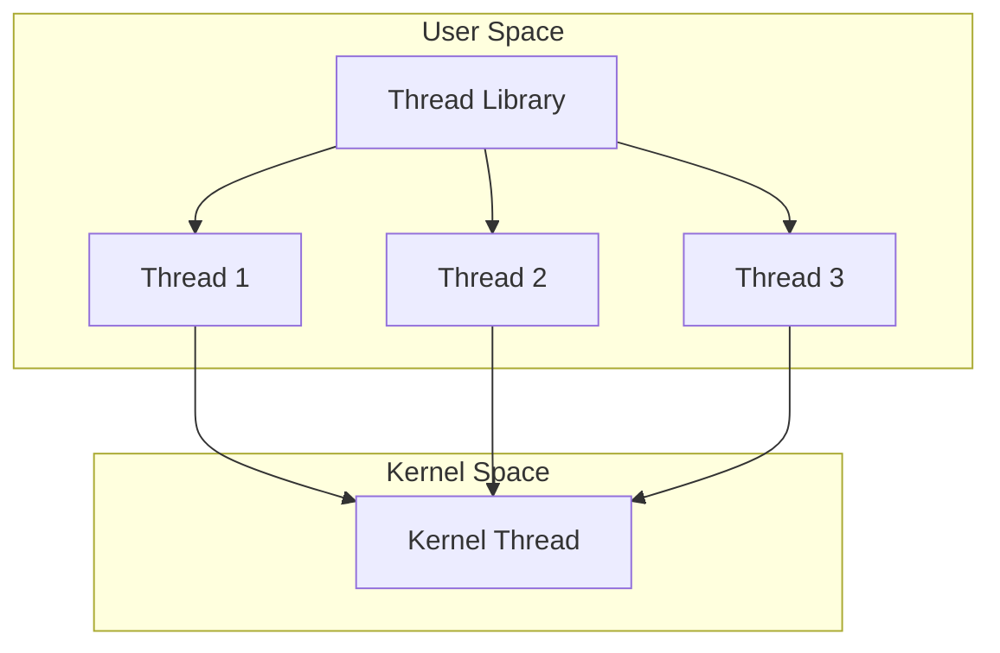
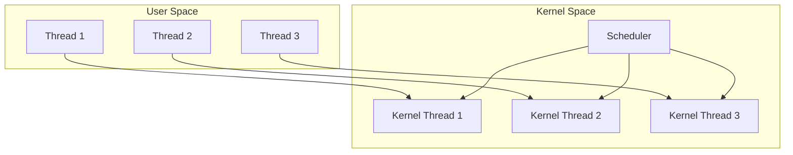
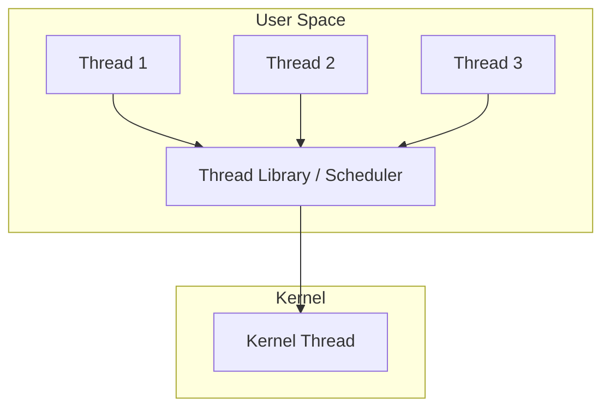
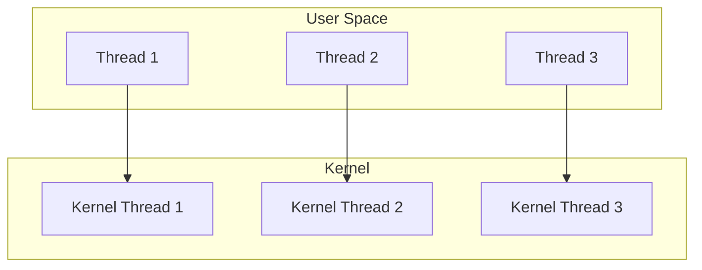
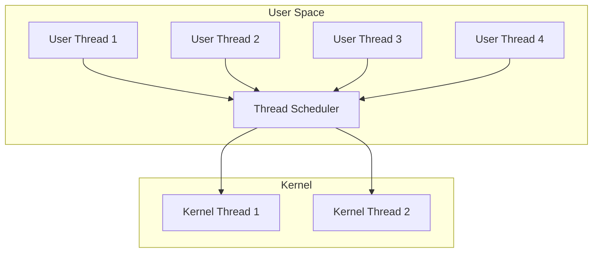

# User-level vs Kernel-level Threads

## Overview

Threads can be implemented at two levels: **user space** (managed by a runtime library) and **kernel space** (managed by the OS). The choice affects performance, parallelism, and how the OS interacts with threads.

> **Interview one-liner:** "User-level threads are managed by a library in user space (fast but can't use multiple cores), while kernel-level threads are managed by the OS (slower but can truly run in parallel)."

## User-level Threads



### Characteristics

| Property | Value |
|----------|-------|
| Management | Thread library (user space) |
| Kernel visibility | Invisible — kernel sees one thread |
| Creation speed | Very fast (~1 μs) |
| Context switch | Very fast (~100 ns) — no mode switch |
| Parallelism | **No true parallelism** (single kernel thread) |
| Blocking | One thread blocks → all block |
| Scheduling | Application-controlled (cooperative or preemptive) |

### Pros and Cons

| Pros | Cons |
|------|------|
| Fast creation and switching | No true parallelism |
| Portable (no kernel support needed) | One blocking syscall blocks all threads |
| Application-controlled scheduling | Requires non-blocking I/O |
| No kernel overhead | Kernel can't optimize scheduling |

### Examples
- Early Java green threads (JVM 1.1)
- GNU Portable Threads
- Ruby (MRI, before fibers)
- Python threads (GIL limits to one thread at a time)

## Kernel-level Threads



### Characteristics

| Property | Value |
|----------|-------|
| Management | OS kernel |
| Kernel visibility | Fully visible |
| Creation speed | Slower (~10-100 μs) |
| Context switch | Slower (~1-10 μs) — requires mode switch |
| Parallelism | **True parallelism** on multi-core |
| Blocking | Only the blocking thread blocks |
| Scheduling | OS-managed |

### Pros and Cons

| Pros | Cons |
|------|------|
| True parallelism on multi-core | Slower creation and switching |
| OS can schedule all threads | Kernel overhead |
| One thread blocks → others continue | Requires OS support |
| Better for CPU-bound work | More resource intensive |

### Examples
- Linux pthreads (NPTL)
- Windows threads
- Java threads (modern JVM)
- macOS pthreads

## Comparison Table

| Aspect | User-level | Kernel-level |
|--------|-----------|--------------|
| Created by | Thread library | OS syscall |
| Managed by | Runtime in user space | Kernel |
| Kernel knows about | Process only | Each thread |
| Creation time | ~1 μs | ~10-100 μs |
| Context switch | ~100 ns | ~1-10 μs |
| Parallelism | No (single kernel thread) | Yes (multi-core) |
| Blocking | All threads block | Only blocking thread |
| Scheduling | Application | OS |
| Portability | High (library only) | OS-dependent |
| Best for | I/O-bound, many threads | CPU-bound, parallel work |

## Multiplexing: Many-to-One (M:1)



- Many user threads mapped to one kernel thread
- Thread library handles scheduling
- **Problem:** One blocking syscall blocks all threads
- Example: Early green threads, Ruby MRI

## One-to-One (1:1)



- Each user thread has a corresponding kernel thread
- True parallelism
- **Problem:** Creating many threads has kernel overhead
- Example: Linux NPTL, Windows, modern Java

## Many-to-Many (M:N) / Hybrid



- M user threads multiplexed onto N kernel threads
- Combines benefits of both approaches
- **Problem:** Complex implementation
- Examples: Go (goroutines on OS threads), Erlang (processes on schedulers), Solaris (historical)

## Linux Threading: NPTL

Linux uses **Native POSIX Thread Library (NPTL)** — a 1:1 model:

```bash
# View threads of a process
ps -T -p <PID>
# or
ls /proc/<PID>/task/

# Thread count
cat /proc/<PID>/status | grep Threads
# Threads: 4

# View thread details
cat /proc/<PID>/task/<TID>/status
```

### How Linux Creates a Thread

Linux uses `clone()` syscall (not `fork()`) with sharing flags:

```c
// Creating a thread (simplified)
clone(fn, stack, CLONE_VM | CLONE_FS | CLONE_FILES | CLONE_SIGHAND | CLONE_THREAD, arg);

// Flags meaning:
// CLONE_VM      - Share memory space
// CLONE_FS      - Share filesystem info
// CLONE_FILES   - Share file descriptors
// CLONE_SIGHAND - Share signal handlers
// CLONE_THREAD  - Same thread group (same tgid)
```

| Operation | `clone()` flags |
|-----------|----------------|
| `fork()` | None (copy everything) |
| `vfork()` | `CLONE_VM` |
| `pthread_create()` | `CLONE_VM | CLONE_FS | CLONE_FILES | CLONE_SIGHAND | CLONE_THREAD` |

## GIL (Global Interpreter Lock)

Some languages (Python, Ruby MRI) have a GIL that prevents true parallelism even with kernel threads:

```
┌─────────────────────────────────────────┐
│           Python Interpreter            │
│  ┌─────────────────────────────────┐    │
│  │         GIL (Lock)              │    │
│  │  ┌──────────┐  ┌──────────┐    │    │
│  │  │ Thread 1 │  │ Thread 2 │    │    │
│  │  │ (holds   │  │ (waiting)│    │    │
│  │  │  GIL)    │  │          │    │    │
│  │  └──────────┘  └──────────┘    │    │
│  └─────────────────────────────────┘    │
└─────────────────────────────────────────┘
```

- Only one thread executes Python bytecode at a time
- GIL released during I/O operations
- Use `multiprocessing` for CPU-bound parallelism in Python
- Alternative: Jython, IronPython (no GIL), or Python 3.13+ (free-threaded mode)

## Interview Questions

### Beginner

**Q1: What is the difference between user-level and kernel-level threads?**  
A: User-level threads are managed by a thread library in user space — the kernel doesn't know about them. Kernel-level threads are managed by the OS — each thread is visible and schedulable by the kernel.

**Q2: Why can't user-level threads use multiple CPU cores?**  
A: Because the kernel only sees one thread (the process). To run on multiple cores, the kernel needs to schedule separate execution units, which requires kernel-level threads.

**Q3: What is the GIL?**  
A: The Global Interpreter Lock (in Python, Ruby MRI) is a mutex that allows only one thread to execute the interpreter at a time. This prevents true parallelism for CPU-bound work, even with multiple kernel threads.

### Intermediate

**Q4: Explain the 1:1, M:1, and M:N thread models.**  
A: **1:1:** Each user thread maps to one kernel thread. True parallelism but expensive creation. **M:1:** Many user threads on one kernel thread. Fast but no parallelism, one blocks all block. **M:N:** M user threads on N kernel threads. Best of both but complex. Most modern OSes use 1:1.

**Q5: Why did Linux switch from LinuxThreads to NPTL?**  
A: LinuxThreads had issues: 1) Each thread had a different PID (broken POSIX semantics), 2) Signal handling was broken, 3) Poor scalability (O(n) for thread operations), 4) `getpid()` returned different values for each thread. NPTL fixed all of these, uses 1:1 model with `clone()`, and scales to thousands of threads.

**Q6: When would you use user-level threads over kernel-level?**  
A: Use user-level (green threads) for: 1) Massive concurrency (millions of lightweight tasks), 2) I/O-bound work (cooperative scheduling with non-blocking I/O), 3) Portability (no kernel dependency), 4) Fast context switching needed. Use kernel threads for: CPU-bound parallelism, blocking I/O, OS-visible scheduling.

### FAANG-Level

**Q7: How does Go implement goroutines?**  
A: Go uses M:N threading (goroutines on OS threads). The Go runtime has: 1) **G (goroutine):** Lightweight stack (2KB, grows dynamically), 2) **M (machine):** OS thread, 3) **P (processor):** Logical processor (GOMAXPROCS). Goroutines are scheduled cooperatively (at function calls, channel ops) and preemptively (async preemption since Go 1.14). The runtime multiplexes Gs onto Ms, with work-stealing between Ps. This gives the performance of user-level threads with the parallelism of kernel threads.

**Q8: Design a system that needs to run 1 million concurrent tasks.**  
A: 1) Use an M:N model (like Go goroutines or Erlang processes), 2) Each task has a small initial stack (~2-8KB, growable), 3) Cooperative scheduling at I/O points (epoll/kqueue), 4) Work-stealing scheduler across N OS threads (= CPU cores), 5) Non-blocking I/O throughout (io_uring on Linux), 6) Channel-based communication between tasks, 7) No mutexes — use message passing for shared state. Alternative: async/await (Rust, Python asyncio) with a single-threaded event loop per core.

**Q9: Compare kernel thread scheduling overhead across operating systems.**  
A: **Linux (NPTL/CFS):** ~1-5μs context switch, 1:1 model, CFS uses red-black tree for O(log n) scheduling. **Windows:** ~1-10μs, 1:1, priority-based preemptive scheduling with 32 priority levels. **macOS (GCD):** Thread pool managed by Grand Central Dispatch, uses libdispatch, M:N-like with kernel threads. **FreeBSD:** Uses 1:1 with ULE scheduler. Key optimization: Linux's `clone()` is faster than `fork()+exec()` for thread creation due to shared resources.

## Common Mistakes

1. **Assuming threads give parallelism in Python/Ruby:** GIL prevents true parallelism for CPU-bound work.
2. **Using too many kernel threads:** Each kernel thread has 1-8MB stack. 10,000 threads = 10-80GB memory.
3. **Not considering blocking I/O:** User-level threads + blocking I/O = all threads blocked.
4. **Confusing concurrency with parallelism:** Concurrency = dealing with multiple things at once. Parallelism = doing multiple things at once.

## Summary

| Feature | User-level | Kernel-level | M:N |
|---------|-----------|--------------|-----|
| Management | Library | OS | Both |
| Speed | Fastest | Slower | Medium |
| Parallelism | No | Yes | Yes |
| Blocking | All block | Only one | Depends |
| Complexity | Simple | Simple | Complex |
| Example | Green threads | pthreads | Go goroutines |

## Cross-References

- [Threads Overview](./README.md) - Thread basics
- [Thread Models](./models.md) - 1:1, M:1, M:N details
- [Green Threads](./green-threads.md) - User-space thread implementation
- [Scheduling](../scheduling/README.md) - How threads get CPU time
- [Context Switching](../processes/context-switching.md) - Switching overhead


## Cross References

- [Thread Models](models.md)
- [Context Switching](../processes/context-switching.md)
- [SMT](../../arch/parallelism/smt.md)
- [Green Threads](green-threads.md)
