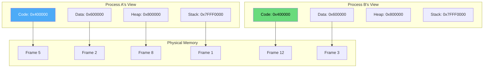
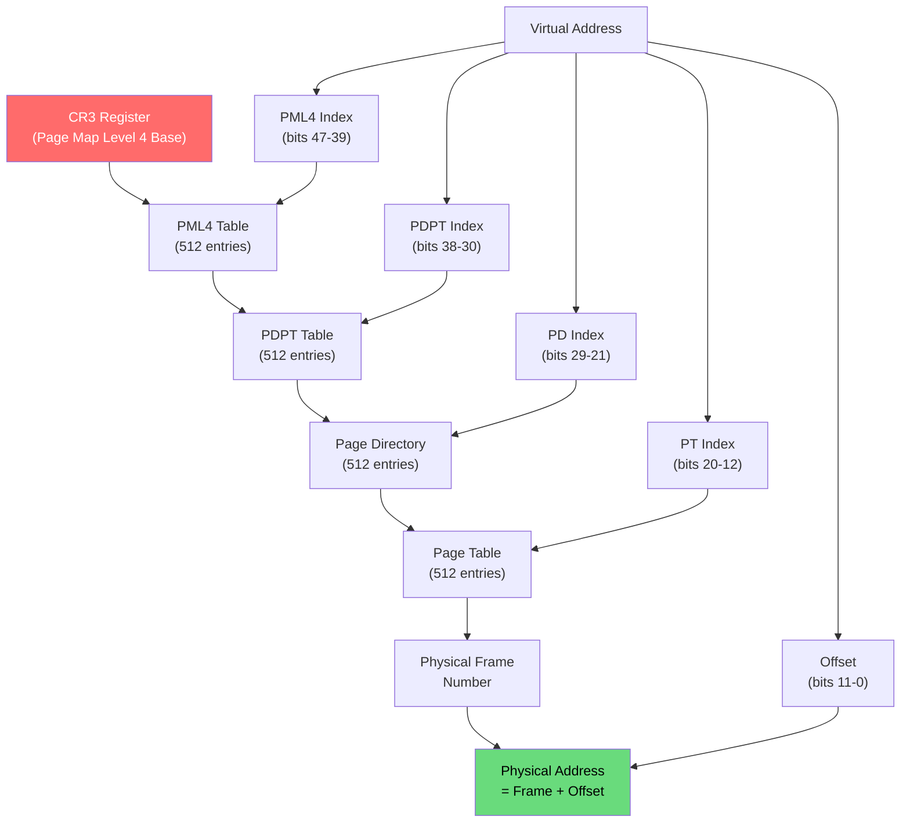
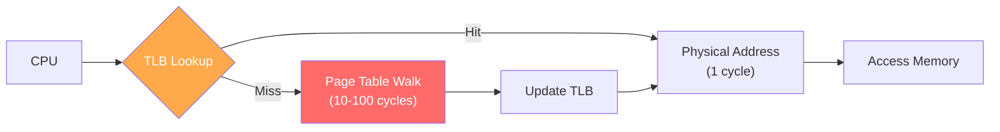
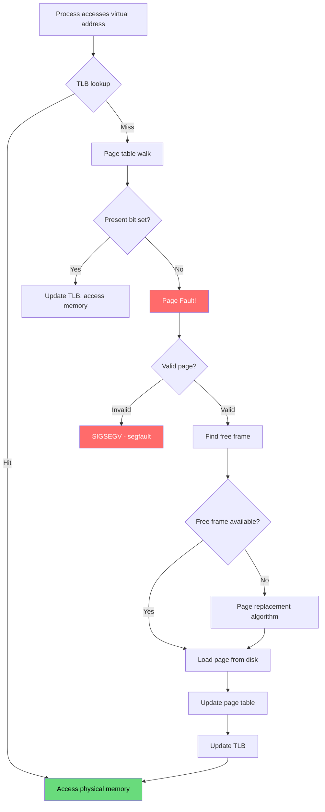
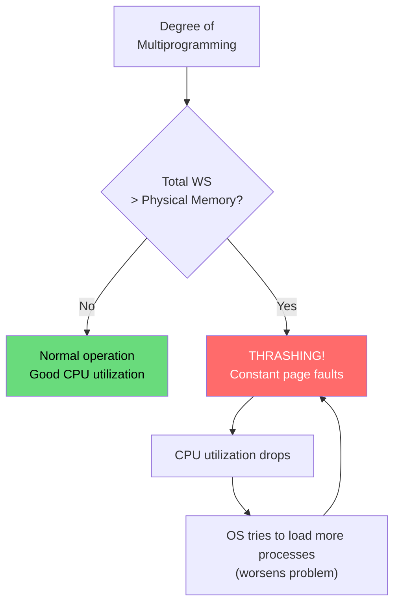
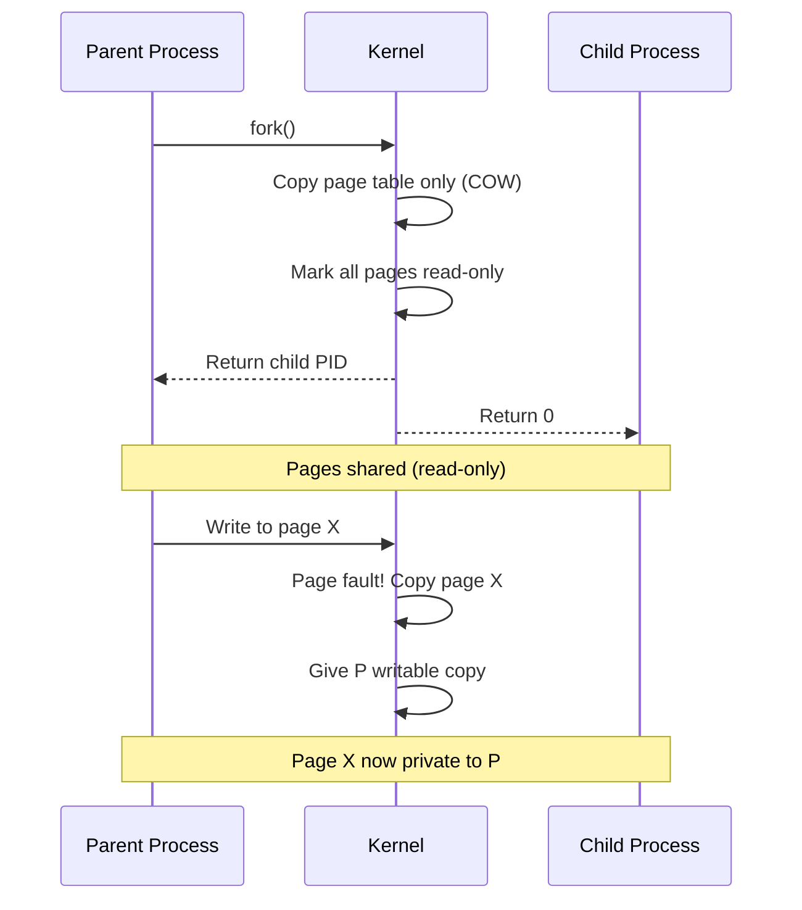
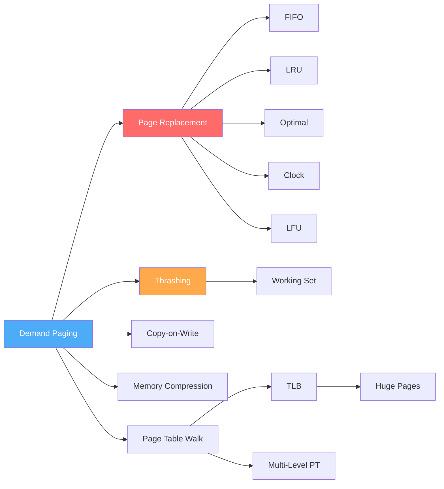

# Virtual Memory

Virtual memory is one of the most important abstractions in modern operating systems. It gives each process the illusion of having its own private, contiguous address space, independent of physical memory constraints.

## What is Virtual Memory?

Virtual memory decouples logical addresses (used by programs) from physical addresses (used by hardware). This enables:

1. **Process isolation** — each process has its own address space
2. **Memory overcommit** — total virtual memory can exceed physical RAM
3. **Simplified programming** — contiguous logical addresses, scattered physical frames
4. **Efficient sharing** — shared libraries mapped once in physical memory
5. **Protection** — per-page permissions (read/write/execute)



## Key Concepts

| Concept | Description |
|---------|-------------|
| **Virtual Address** | Address used by program (logical) |
| **Physical Address** | Actual hardware address (real) |
| **Page** | Fixed-size virtual memory block (typically 4 KB) |
| **Frame** | Fixed-size physical memory block |
| **Page Table** | Maps virtual pages to physical frames |
| **TLB** | Hardware cache for page table entries |
| **Page Fault** | Accessing a page not in physical memory |
| **Working Set** | Pages a process actively uses |
| **Thrashing** | Excessive page faults degrading performance |

## Page Table Walk (x86-64)

On x86-64, address translation uses a **4-level page table** (or 5-level with PML5 for 57-bit addresses). The CPU's MMU performs a "page table walk" to translate virtual addresses to physical addresses.

### Virtual Address Breakdown (48-bit, 4KB pages)

```
63    48 47   39 38   30 29   21 20   12 11        0
┌───────┬───────┬───────┬───────┬───────┬───────────┐
│ Sign  │ PML4  │ PDPT  │  PD   │  PT   │  Offset   │
│Extend │ Index │ Index │ Index │ Index │  (12 bit) │
│(16bit)│(9 bit)│(9 bit)│(9 bit)│(9 bit)│           │
└───────┴───────┴───────┴───────┴───────┴───────────┘
  Sign-extended to 64 bits (canonical address)
```

### 4-Level Page Table Walk



### Step-by-Step Walk

1. **CPU generates virtual address** (e.g., `0x00007FFF12345678`)
2. **TLB lookup** — check if translation is cached
   - **TLB hit** → go to step 7
   - **TLB miss** → proceed to step 3
3. **Read CR3** — get base address of PML4 table (per-process)
4. **PML4 entry** — index into PML4 using bits 47-39 → get PDPT base
5. **PDPT entry** — index using bits 38-30 → get PD base
6. **PD entry** — index using bits 29-21 → get PT base
7. **PT entry** — index using bits 20-12 → get physical frame number
8. **Combine** — physical address = (frame number << 12) | offset

Each level checks the **Present bit**. If not present → **page fault**.

```c
// Simulated page table walk (C pseudocode)
uint64_t translate(uint64_t vaddr, uint64_t cr3) {
    // Extract indices
    uint16_t pml4_idx = (vaddr >> 39) & 0x1FF;
    uint16_t pdpt_idx = (vaddr >> 30) & 0x1FF;
    uint16_t pd_idx   = (vaddr >> 21) & 0x1FF;
    uint16_t pt_idx   = (vaddr >> 12) & 0x1FF;
    uint16_t offset   = vaddr & 0xFFF;
    
    // Level 1: PML4
    uint64_t *pml4 = (uint64_t *)cr3;
    uint64_t pml4e = pml4[pml4_idx];
    if (!(pml4e & 1)) return PAGE_FAULT;  // Not present
    uint64_t *pdpt = (uint64_t *)(pml4e & 0xFFFFFFFFF000);
    
    // Level 2: PDPT
    uint64_t pdpte = pdpt[pdpt_idx];
    if (!(pdpte & 1)) return PAGE_FAULT;
    uint64_t *pd = (uint64_t *)(pdpte & 0xFFFFFFFFF000);
    
    // Level 3: PD
    uint64_t pde = pd[pd_idx];
    if (!(pde & 1)) return PAGE_FAULT;
    uint64_t *pt = (uint64_t *)(pde & 0xFFFFFFFFF000);
    
    // Level 4: PT
    uint64_t pte = pt[pt_idx];
    if (!(pte & 1)) return PAGE_FAULT;
    uint64_t frame = (pte & 0xFFFFFFFFF000);
    
    return frame | offset;
}
```

### Page Table Entry (PTE) Format (x86-64)

```
Bit  | Name          | Description
-----|---------------|----------------------------------
0    | Present       | Page is in physical memory
1    | Read/Write    | 0=readonly, 1=read-write
2    | User/Supervisor| 0=kernel only, 1=user accessible
3    | PWT           | Page-level write-through
4    | PCD           | Page-level cache disable
5    | Accessed      | Set by CPU on read/write
6    | Dirty         | Set by CPU on write
7    | PAT           | Page attribute table
8    | Global        | Don't flush on CR3 write (kernel pages)
9-11 | Available     | OS-defined flags
12-51| Physical addr | Frame number (40 bits for 52-bit PA)
52-62| Available     | OS-defined (e.g., protection keys)
63   | NX            | No-execute bit (if supported)
```

### Page Table Size Problem

For a 48-bit virtual address space with 4KB pages and 8-byte PTEs:
- **One flat page table:** 2^36 entries × 8 bytes = **512 GB** per process!
- **4-level hierarchy:** Only pages that are actually used need page table entries
- **Sparse address spaces:** Typical process uses < 1% of address space → hierarchical tables are tiny

## TLB (Translation Lookaside Buffer)

The TLB is a hardware cache that stores recent virtual→physical address translations. Without TLB, every memory access would require 4 memory reads (page table walk) — a 4x slowdown.

### TLB Organization



| Property | Typical Value |
|----------|--------------|
| TLB entries | 64-1536 (L1), 1024-8192 (L2) |
| TLB hit latency | 1 cycle (L1), 5-10 cycles (L2) |
| TLB miss latency | 10-100 cycles (page table walk) |
| TLB hit rate | 99%+ (good locality) |
| TLB reach | Total addressable memory via TLB |

### TLB Reach

**TLB reach** = (TLB entries) × (page size)

| Configuration | TLB Entries | Page Size | TLB Reach |
|--------------|-------------|-----------|-----------|
| Standard | 64 entries | 4 KB | 256 KB |
| With L2 TLB | 1024 entries | 4 KB | 4 MB |
| With Huge Pages | 64 entries | 2 MB | 128 MB |
| With 1GB Pages | 64 entries | 1 GB | 64 GB |

**Implication:** If working set exceeds TLB reach, TLB misses cause significant performance degradation. This is why **huge pages** matter for large-memory workloads (databases, JVMs).

### Address Space Identifiers (ASIDs)

Modern TLBs tag entries with an **ASID** (process ID) so TLB entries aren't flushed on context switch:

```
Without ASID: Context switch → flush entire TLB → cold start
With ASID:    Context switch → TLB entries retained → warm start
```

### Linux TLB Inspection

```bash
# TLB statistics
grep -i tlb /proc/vmstat

# Per-CPU TLB stats (if available)
cat /proc/sched_debug | grep tlb

# Huge page TLB info
grep -i huge /proc/meminfo

# Enable transparent huge pages
echo always > /sys/kernel/mm/transparent_hugepage/enabled
```

## Demand Paging

**Demand paging** loads pages from disk into memory only when they are first accessed, not at process startup. This is the foundation of virtual memory.

### How Demand Paging Works



### Page Fault Cost

| Source | Latency | Notes |
|--------|---------|-------|
| Minor fault (page in memory) | ~1 μs | Page is in page cache, just need to map |
| Major fault (page on disk - SSD) | ~100 μs | Load from SSD |
| Major fault (page on disk - HDD) | ~5-10 ms | Mechanical seek + rotational latency |
| Major fault (page on swap) | ~5-10 ms | Similar to disk |

**Rule of thumb:** Major page faults are 10,000-10,000,000x slower than a normal memory access.

### Page Replacement Algorithms

When physical memory is full and a new page is needed, the OS must choose a **victim page** to evict:

| Algorithm | Strategy | Implementation | Optimal? |
|-----------|----------|----------------|----------|
| **FIFO** | Evict oldest page | Queue | No (Belady's anomaly) |
| **LRU** | Evict least recently used | Stack or counter | Near-optimal |
| **Optimal** | Evict page not used for longest time | Theoretical only | Yes |
| **Clock** | LRU approximation with reference bit | Circular list | Practical |
| **LFU** | Evict least frequently used | Counter per page | No (cache pollution) |

## Working Set Model

The **working set** is the set of pages a process actively uses during a time window. Understanding it is key to preventing thrashing.

### Definition

```
W(t, Δ) = {pages referenced in the interval (t - Δ, t)}

Where:
  t = current time
  Δ = working set window (number of recent references)
```

### Working Set Example

```
Page reference string: 1, 2, 3, 4, 1, 2, 5, 1, 2, 3, 4, 5
Window Δ = 5

At t=10 (last 5 refs: 5,1,2,3,4): W = {1,2,3,4,5} → size 5
At t=8  (last 5 refs: 2,5,1,2,3): W = {1,2,3,5}   → size 4
At t=5  (last 5 refs: 4,1,2,3,4): W = {1,2,3,4}   → size 4
```

### Working Set and Thrashing



**Thrashing** occurs when the total working set of all processes exceeds physical memory. The system spends more time paging than executing.

**Detection:** High page fault rate + low CPU utilization + high disk I/O

**Solutions:**
1. **Reduce degree of multiprogramming** — swap out entire processes
2. **Working set model** — only keep processes whose working set fits in memory
3. **Page fault frequency (PFF)** — if fault rate too high, allocate more frames; if too low, reclaim frames
4. **Add more RAM** — brute force solution
5. **Use swap** — extend memory to disk (slows things down but prevents OOM)

## Copy-on-Write (COW)



## Virtual Memory in Linux

```bash
# View process virtual memory layout
$ cat /proc/self/maps
55a8c0a00000-55a8c0a24000 r--p 00000000 08:01 131074  /usr/bin/cat
55a8c0a24000-55a8c0a6e000 r-xp 00024000 08:01 131074  /usr/bin/cat
55a8c0a6e000-55a8c0a96000 r--p 0006e000 08:01 131074  /usr/bin/cat
55a8c0a97000-55a8c0a98000 rw-p 00096000 08:01 131074  /usr/bin/cat
7f8c10000000-7f8c10021000 r-xp 00000000 08:01 524300  /lib/libc.so.6
7ffd5e3a0000-7ffd5e3c1000 rw-p 00000000 00:00 0       [stack]

# Fields: address-range perms offset dev inode pathname
# Permissions: r=read, w=write, x=execute, p=private, s=shared

# Virtual memory stats
$ vmstat -s

# Page fault statistics
$ grep fault /proc/vmstat
pgfault 12345678
pgmajfault 1234

# Detailed memory info
$ cat /proc/meminfo

# Watch page faults in real-time
$ perf stat -e page-faults,major-faults,minor-faults ./my_program

# Trace page faults
$ perf record -e page-faults ./my_program
$ perf report
```

## Memory Compression (Linux)

Instead of swapping to disk (slow), Linux can **compress** pages and keep them in RAM:

```bash
# Check if zswap is enabled
cat /sys/module/zswap/parameters/enabled

# Check zswap stats
grep zswap /proc/supported_compressors

# zram — compressed RAM block device
ls /dev/zram*
zramctl
```

**Tradeoff:** Compression uses CPU time but avoids disk I/O. Usually a net win for workloads with moderate memory pressure.

## Study Path



## Interview Questions

### Beginner

**Q1: What is virtual memory?**  
A: Virtual memory is an OS abstraction that gives each process its own private address space, separate from physical memory. The MMU translates virtual addresses to physical addresses. It enables process isolation, memory overcommit, and simplified programming.

**Q2: What is a page fault? Is it always an error?**  
A: A page fault occurs when a process accesses a page not currently in physical memory. It's NOT always an error — demand paging intentionally triggers page faults to load pages on demand. Only "invalid" page faults (accessing unmapped memory) are errors (SIGSEGV).

**Q3: What is the TLB and why is it important?**  
A: The Translation Lookaside Buffer is a hardware cache for page table entries. Without it, every memory access would require a 4-level page table walk (4 extra memory reads). The TLB provides single-cycle address translation for cached entries, achieving 99%+ hit rate.

### Intermediate

**Q4: Walk through a page table translation on x86-64.**  
A: Given virtual address `0x00007FFF12345678`: 1) Extract PML4 index (bits 47-39), 2) Read PML4 entry from table pointed to by CR3, 3) Extract PDPT index (bits 38-30), read PDPT entry, 4) Extract PD index (bits 29-21), read PD entry, 5) Extract PT index (bits 20-12), read PT entry → frame number, 6) Physical address = (frame << 12) | offset. Each level checks Present bit; if 0 → page fault.

**Q5: What is thrashing? How do you detect and prevent it?**  
A: Thrashing occurs when the system spends more time handling page faults than executing. Detection: high page fault rate + low CPU utilization. Prevention: 1) Working set model — ensure total working sets fit in RAM, 2) Page fault frequency — allocate/deallocate frames based on fault rate, 3) Limit degree of multiprogramming, 4) Use swap to extend effective memory.

### FAANG-Level

**Q6: How would you optimize a database server experiencing TLB misses?**  
A: 1) **Huge pages** (2MB/1GB): increase TLB reach from 256KB to 128GB. Use `mmap(MAP_HUGETLB)` or transparent huge pages. 2) **Memory pooling**: allocate all database buffers in a contiguous region to improve TLB locality. 3) **NUMA-aware allocation**: allocate memory on the same NUMA node as the CPU. 4) **Page coloring**: align data structures to cache/TLB set boundaries. 5) **Profile with `perf`**: `perf stat -e dTLB-load-misses,iTLB-load-misses` to measure. 6) **Consider 1GB pages** for very large buffer pools (reduces page table levels from 4 to 3).

**Q7: Design a virtual memory system for a container platform running 1000 containers.**  
A: 1) **Per-container page tables**: each container has its own CR3 (already the case with separate processes). 2) **KSM (Kernel Same-page Merging)**: deduplicate identical pages across containers (common for base images). 3) **Memory cgroups**: per-container memory limits with `memory.max` and `memory.high`. 4) **Swap limits**: `memory.swap.max` per container to prevent one container from hogging swap. 5) **OOM handling**: per-container OOM killer (cgroup-aware) instead of system-wide. 6) **Ballooning**: virtio-balloon to dynamically adjust memory per VM/container. 7) **Huge pages**: for containers running JVMs or databases. 8) **Memory compression**: zswap/zram for containers under memory pressure.

## Virtual Memory Topics

### Core Mechanisms
- **[Demand Paging](./demand-paging.md)** — Load pages only when accessed
- **[Page Replacement](./page-replacement.md)** — Choosing which page to evict

### Replacement Algorithms
- **[FIFO](./fifo.md)** — First In, First Out
- **[LRU](./lru.md)** — Least Recently Used
- **[Optimal](./optimal.md)** — Theoretical best (Belady's algorithm)
- **[Clock](./clock.md)** — LRU approximation (practical)
- **[LFU](./lfu.md)** — Least Frequently Used

### Advanced Topics
- **[Thrashing](./thrashing.md)** — When the system spends more time paging than working
- **[Working Set](./working-set.md)** — Tracking active pages
- **[Copy-on-Write](./cow.md)** — Deferred copying optimization
- **[Memory Compression](./compression.md)** — Compressing pages instead of swapping

## Cross-References

- [Paging](../memory/paging.md)
- [Page Tables](../memory/page-tables.md)
- [Buffer Pool](../../dbms/caching/buffer-pool.md)
- [Cache Hierarchy](../../arch/memory-hierarchy/README.md)

## References

- Silberschatz, A., Galvin, P.B., Gagne, G. *Operating System Concepts*, 10th Edition. Wiley, 2018. (Chapter 10: Virtual Memory)
- Intel. *Intel 64 and IA-32 Architectures Software Developer's Manual*, Volume 3A: System Programming Guide. (Chapter 4: Paging)
- Bovet, D.P., Cesati, M. *Understanding the Linux Kernel*, 3rd Edition. O'Reilly, 2005. (Chapter 9: Process Address Space)
- Gorman, M. *Understanding the Linux Virtual Memory Manager*. Prentice Hall, 2004.
- Denning, P.J. "The Working Set Model for Program Behavior." *Communications of the ACM*, 11(5), 1968.
- `man 2 mmap`, `man 2 mprotect`, `man 2 madvise` — Linux manual pages
