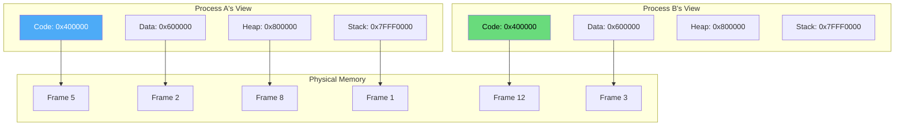
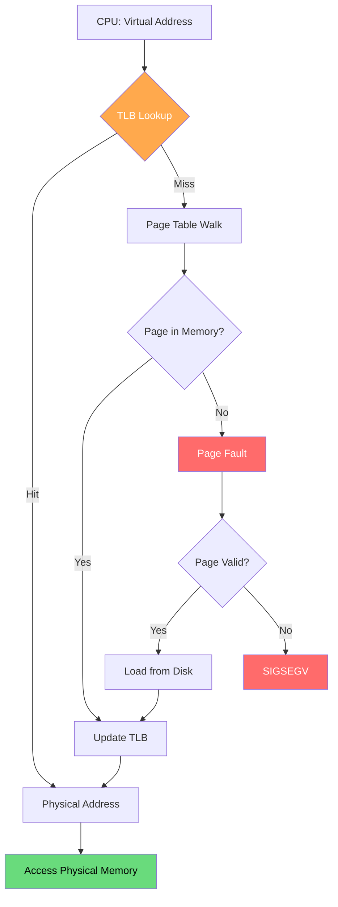
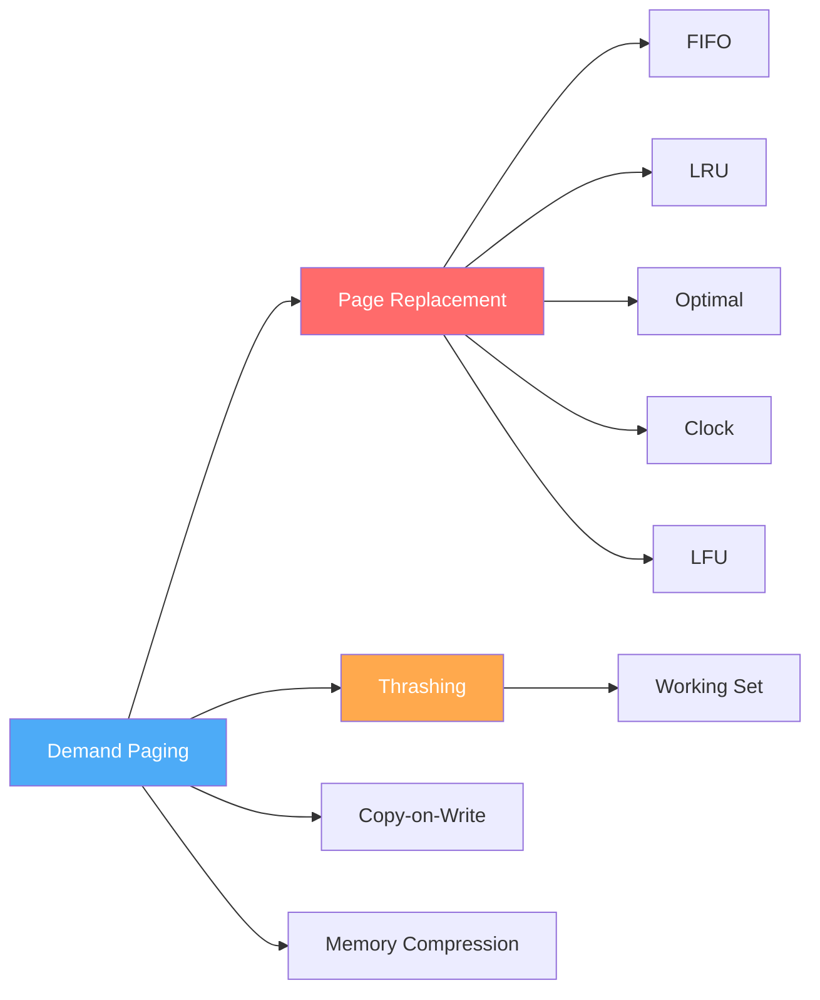

# Virtual Memory

Virtual memory is one of the most important abstractions in modern operating systems. It gives each process the illusion of having its own private, contiguous address space, independent of physical memory constraints.

## What is Virtual Memory?

Virtual memory decouples logical addresses (used by programs) from physical addresses (used by hardware). This enables:

1. **Process isolation** — each process has its own address space
2. **Memory overcommit** — total virtual memory can exceed physical RAM
3. **Simplified programming** — contiguous logical addresses, scattered physical frames
4. **Efficient sharing** — shared libraries mapped once in physical memory
5. **Protection** — per-page permissions (read/write/execute)



## Key Concepts

| Concept | Description |
|---------|-------------|
| **Virtual Address** | Address used by program (logical) |
| **Physical Address** | Actual hardware address (real) |
| **Page** | Fixed-size virtual memory block |
| **Frame** | Fixed-size physical memory block |
| **Page Table** | Maps virtual pages to physical frames |
| **TLB** | Hardware cache for page table entries |
| **Page Fault** | Accessing a page not in physical memory |
| **Working Set** | Pages a process actively uses |
| **Thrashing** | Excessive page faults degrading performance |

## Virtual Memory Topics

### Core Mechanisms
- **[Demand Paging](./demand-paging.md)** — Load pages only when accessed
- **[Page Replacement](./page-replacement.md)** — Choosing which page to evict

### Replacement Algorithms
- **[FIFO](./fifo.md)** — First In, First Out
- **[LRU](./lru.md)** — Least Recently Used
- **[Optimal](./optimal.md)** — Theoretical best (Belady's algorithm)
- **[Clock](./clock.md)** — LRU approximation (practical)
- **[LFU](./lfu.md)** — Least Frequently Used

### Advanced Topics
- **[Thrashing](./thrashing.md)** — When the system spends more time paging than working
- **[Working Set](./working-set.md)** — Tracking active pages
- **[Copy-on-Write](./cow.md)** — Deferred copying optimization
- **[Memory Compression](./compression.md)** — Compressing pages instead of swapping

## Address Translation Flow



## Linux Virtual Memory

```bash
# View process virtual memory layout
$ cat /proc/self/maps
55a8c0a00000-55a8c0a24000 r--p 00000000 08:01 131074  /usr/bin/cat
55a8c0a24000-55a8c0a6e000 r-xp 00024000 08:01 131074  /usr/bin/cat
55a8c0a6e000-55a8c0a96000 r--p 0006e000 08:01 131074  /usr/bin/cat
55a8c0a97000-55a8c0a98000 rw-p 00096000 08:01 131074  /usr/bin/cat
7f8c10000000-7f8c10021000 r-xp 00000000 08:01 524300  /lib/libc.so.6
7ffd5e3a0000-7ffd5e3c1000 rw-p 00000000 00:00 0       [stack]

# Virtual memory stats
$ vmstat -s
  16384000 K total memory
   8192000 K used memory
   4096000 K active memory
   2048000 K inactive memory
   2048000 K free memory
    512000 K buffer memory
   4096000 K swap cache
   8388608 K total swap
   1048576 K used swap
   7340032 K free swap
    123456 non-nice user cpu ticks
     78901 nice user cpu ticks
    234567 system cpu ticks
  12345678 idle cpu ticks
     12345 IO-wait cpu ticks
      1234 IRQ cpu ticks
      5678 softirq cpu ticks
```

## Study Path



Start with demand paging (the foundation), then page replacement algorithms, then advanced topics.


## Cross References

- [Paging](../memory/paging.md)
- [Page Tables](../memory/page-tables.md)
- [Buffer Pool](../../dbms/caching/buffer-pool.md)
- [Cache Hierarchy](../../arch/memory-hierarchy/README.md)
