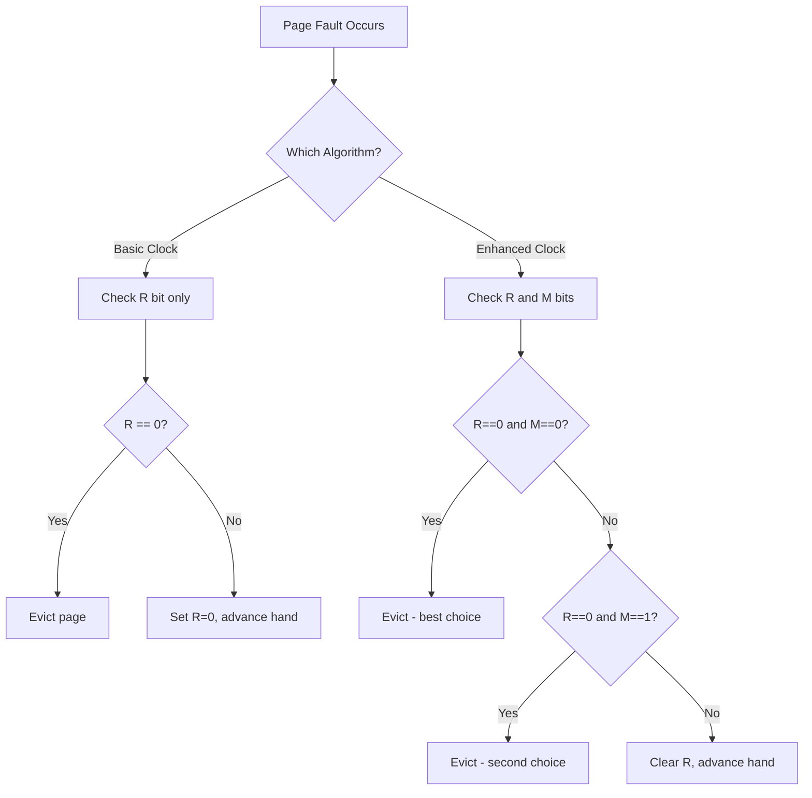

# Clock Page Replacement

## Overview

The **Clock algorithm** (also called **Second-Chance**) is an approximation of LRU that is much cheaper to implement. It uses a circular buffer and a single **reference bit** per page to give pages a "second chance" before eviction.

The **Enhanced Clock algorithm** extends this by also considering the **modify bit** (dirty bit), preferring to evict clean pages over dirty ones (since dirty pages must be written back to disk before replacement).

---

## Clock Algorithm (Second-Chance)

### How It Works

1. Pages are arranged in a **circular buffer** (like a clock face)
2. Each page has a **reference bit** (R bit):
   - Set to **1** when the page is accessed (read or write)
   - Set to **0** periodically by the OS (e.g., on each clock tick)
3. A **clock hand** (pointer) sweeps around the circle
4. When a page fault occurs:
   - Check the page at the clock hand
   - If R = 1: give it a "second chance" — set R = 0, advance the hand
   - If R = 0: this page is selected for replacement

```
Clock State:
        ┌───┐
   ┌────┤ P3│ R=0
   │    └───┘
┌───┐        ┌───┐
│P2 │◄─clock─┤P4 │
│R=1│        │R=0│
└───┘        └───┘
   │    ┌───┐
   └────┤P1 │
        │R=1│
        └───┘

Clock hand points to P4.
- P4: R=0 → EVICT THIS PAGE
```

### Step-by-Step Algorithm

```
clock_replace():
    while true:
        page = pages[clock_hand]
        if page.R == 0:
            // Found victim
            evict page
            load new page at clock_hand
            advance clock_hand
            return
        else:
            // Give second chance
            page.R = 0
            advance clock_hand
```

### Detailed Example

**Given:** 4 frames, reference string: `1, 2, 3, 4, 1, 2, 5, 1, 2, 3, 4, 5`

Initial state: All frames empty, clock hand at position 0.

| Step | Ref | Frames | R bits | Clock Hand | Action |
|------|-----|--------|--------|------------|--------|
| 1 | 1 | [1, -, -, -] | [1, 0, 0, 0] | 0 | Load 1, fault |
| 2 | 2 | [1, 2, -, -] | [1, 1, 0, 0] | 0 | Load 2, fault |
| 3 | 3 | [1, 2, 3, -] | [1, 1, 1, 0] | 0 | Load 3, fault |
| 4 | 4 | [1, 2, 3, 4] | [1, 1, 1, 1] | 0 | Load 4, fault |
| 5 | 1 | [1, 2, 3, 4] | [1, 1, 1, 1] | 0 | Hit, set R=1 |
| 6 | 2 | [1, 2, 3, 4] | [1, 1, 1, 1] | 0 | Hit, set R=1 |
| 7 | 5 | [5, 2, 3, 4] | [1, 1, 1, 1] | 0 | Need to evict |
| | | | | | Scan: P1 R=1→0, P2 R=1→0, P3 R=1→0, P4 R=1→0 |
| | | | | | Back to P1: R=0 → Evict P1, load 5 |
| | | [5, 2, 3, 4] | [1, 0, 0, 0] | 1 | Fault |

*(continues for remaining references)*

---

## Enhanced Clock Algorithm (Not Recently Used)

### Why Enhance?

The basic clock algorithm only considers the reference bit. But writing a dirty page to disk is expensive (requires I/O). The **Enhanced Clock** considers both the **reference bit (R)** and the **modify bit (M/dirty bit)**.

### Page Classes

| Class | R bit | M bit | Description | Priority |
|-------|-------|-------|-------------|----------|
| 0 | 0 | 0 | Not used, not modified | **Best victim** |
| 1 | 0 | 1 | Not used, modified | Second choice |
| 2 | 1 | 0 | Used, not modified | Third choice |
| 3 | 1 | 1 | Used, modified | **Worst victim** |

### Algorithm

```
enhanced_clock_replace():
    // Pass 1: Find (0,0) — not referenced, not modified
    while clock_hand advances:
        if R==0 and M==0:
            evict; return

    // Pass 2: Find (0,1) — not referenced, modified
    //   (clear R bits as we go)
    while clock_hand advances:
        if R==0 and M==1:
            evict; return
        else:
            R = 0

    // Pass 3: Find (0,0) again (R bits cleared in pass 2)
    while clock_hand advances:
        if R==0 and M==0:
            evict; return

    // Pass 4: Find (0,1) again
    while clock_hand advances:
        if R==0 and M==1:
            evict; return
```

### Enhanced Clock Example

```
Clock state (4 pages):

Page   R   M
P0     0   0  ← Clock hand here
P1     1   0
P2     0   1
P3     1   1

Need to replace → Scan from P0:
- P0: R=0, M=0 → Class 0 → EVICT (best choice!)
```

If P0 had R=1:
```
Page   R   M
P0     1   0  ← Clock hand, R=1→0 (give second chance)
P1     0   0
P2     0   1
P3     1   1

Continue scanning:
- P1: R=0, M=0 → Class 0 → EVICT
```

---

## Comparison: Clock vs Enhanced Clock



---

## Implementation

### Basic Clock Algorithm

```python
class ClockPageReplacement:
    def __init__(self, num_frames):
        self.num_frames = num_frames
        self.frames = [None] * num_frames
        self.ref_bits = [0] * num_frames
        self.clock_hand = 0
        self.page_faults = 0

    def access_page(self, page):
        # Check if page is in frames
        for i in range(self.num_frames):
            if self.frames[i] == page:
                self.ref_bits[i] = 1  # Set reference bit
                return False  # Hit

        # Page fault - need to find victim
        self.page_faults += 1
        self._replace_page(page)
        return True  # Fault

    def _replace_page(self, page):
        while True:
            if self.ref_bits[self.clock_hand] == 0:
                # Found victim
                self.frames[self.clock_hand] = page
                self.ref_bits[self.clock_hand] = 1
                self.clock_hand = (self.clock_hand + 1) % self.num_frames
                return
            else:
                # Give second chance
                self.ref_bits[self.clock_hand] = 0
                self.clock_hand = (self.clock_hand + 1) % self.num_frames

# Usage
clock = ClockPageReplacement(4)
references = [1, 2, 3, 4, 1, 2, 5, 1, 2, 3, 4, 5]
for page in references:
    clock.access_page(page)
print(f"Page faults: {clock.page_faults}")
```

### Enhanced Clock Algorithm

```python
class EnhancedClockPageReplacement:
    def __init__(self, num_frames):
        self.num_frames = num_frames
        self.frames = [None] * num_frames
        self.ref_bits = [0] * num_frames
        self.dirty_bits = [0] * num_frames
        self.clock_hand = 0
        self.page_faults = 0

    def access_page(self, page, is_write=False):
        for i in range(self.num_frames):
            if self.frames[i] == page:
                self.ref_bits[i] = 1
                if is_write:
                    self.dirty_bits[i] = 1
                return False  # Hit

        self.page_faults += 1
        self._replace_page(page, is_write)
        return True  # Fault

    def _replace_page(self, page, is_write):
        # Pass 1: Find (0,0)
        victim = self._scan(0, 0)
        if victim is not None:
            self._evict_and_load(victim, page, is_write)
            return

        # Pass 2: Find (0,1), clearing R bits
        victim = self._scan(0, 1, clear_ref=True)
        if victim is not None:
            self._evict_and_load(victim, page, is_write)
            return

        # Pass 3: Find (0,0) again
        victim = self._scan(0, 0)
        if victim is not None:
            self._evict_and_load(victim, page, is_write)
            return

        # Pass 4: Find (0,1) again
        victim = self._scan(0, 1)
        self._evict_and_load(victim, page, is_write)

    def _scan(self, target_r, target_m, clear_ref=False):
        start = self.clock_hand
        while True:
            r = self.ref_bits[self.clock_hand]
            m = self.dirty_bits[self.clock_hand]
            if r == target_r and m == target_m:
                return self.clock_hand
            if clear_ref:
                self.ref_bits[self.clock_hand] = 0
            self.clock_hand = (self.clock_hand + 1) % self.num_frames
            if self.clock_hand == start:
                return None  # Full scan completed

    def _evict_and_load(self, pos, page, is_write):
        self.frames[pos] = page
        self.ref_bits[pos] = 1
        self.dirty_bits[pos] = 1 if is_write else 0
        self.clock_hand = (pos + 1) % self.num_frames
```

---

## Linux Implementation: Access Bits

In Linux, the kernel uses access bits similar to the clock algorithm:

```bash
# Check page access bits (Linux)
# /proc/<pid>/smaps shows per-memory-region stats
cat /proc/self/smaps | head -20

# Clear access bits (requires root)
echo 1 > /proc/<pid>/clear_refs

# Check if pages are young (recently accessed) or old
# young → R bit set, old → R bit cleared
```

### Linux Kernel: PTE Access/Dirty Bits

```
Page Table Entry (PTE):
┌─────────────────────────────────────────┐
│ Physical Frame Number │ Flags           │
│                       │ P R/W U/S PWT   │
│                       │ PCD A D G PAT   │
│                       │ ...             │
└─────────────────────────────────────────┘
                      A = Accessed bit (like R bit)
                      D = Dirty bit (like M bit)
```

- **A (Accessed) bit**: Set by hardware when the page is read or written
- **D (Dirty) bit**: Set by hardware when the page is written to
- The kernel periodically clears these bits and uses them for page replacement decisions

---

## Interview Questions

### Q1: How does the Clock algorithm approximate LRU?
**A:** The Clock algorithm uses a reference bit that is set when a page is accessed. The clock hand sweeps through pages, giving each one a "second chance" (clearing the R bit and moving on). Pages with R=0 haven't been accessed since the last sweep and are evicted first. This approximates LRU by preferring recently-accessed pages, though it's not as precise as true LRU.

### Q2: What is the advantage of Enhanced Clock over basic Clock?
**A:** Enhanced Clock considers both the reference bit (R) and the dirty bit (M). It prefers to evict clean pages (M=0) over dirty pages (M=1) because dirty pages require an expensive disk write before replacement. This reduces I/O overhead significantly in practice.

### Q3: How does the OS clear reference bits?
**A:** The OS periodically clears reference bits by iterating through page table entries and resetting the accessed bit. In Linux, this happens during the page reclaim process. The `/proc/<pid>/clear_refs` file can also be used to manually clear access bits.

### Q4: What is the time complexity of the Clock algorithm?
**A:** In the worst case, the clock hand may need to sweep the entire circle twice (once to clear R bits, once to find a victim with R=0), making it O(n) per replacement. However, in practice, it's much faster because most pages have R=0 after the first sweep.

### Q5: How is the Clock algorithm implemented in real operating systems?
**A:** Linux uses a variant called the **two-list strategy** (active and inactive lists) with access bits in page table entries. The kernel's page reclaim code scans pages, clears access bits, and moves pages between lists based on access patterns. This is more sophisticated than a simple clock but follows the same principle.

---

## Common Mistakes

1. **Confusing Clock with LRU**: Clock is an *approximation* of LRU. It doesn't track exact access times — it only knows if a page was accessed since the last sweep.
2. **Forgetting to clear R bits**: The second-chance mechanism only works if R bits are periodically cleared. Without clearing, every page would have R=1 and the algorithm degenerates to FIFO.
3. **Not considering the dirty bit**: In enhanced clock, always prefer evicting clean pages. A clean page replacement is O(1) (just load new data), while a dirty page replacement requires a disk write (O(ms)).
4. **Assuming clock hand always moves forward**: In some implementations, the clock hand can skip pages or move at variable speeds depending on memory pressure.
5. **Not knowing the worst case**: The worst case for Clock is when all pages have R=1, requiring a full sweep to clear all bits and then another sweep to find a victim.

---

## Summary

| Algorithm | Bits Used | Victim Selection | I/O Awareness |
|---|---|---|---|
| Basic Clock | R (reference) | Oldest with R=0 | No |
| Enhanced Clock | R + M (dirty) | Prefers (R=0, M=0) | Yes |

**Key Takeaway**: The Clock algorithm is a practical, O(1)-per-operation approximation of LRU that uses a circular buffer and reference bits. The Enhanced Clock adds dirty-bit awareness to minimize disk I/O. These algorithms are the basis for page replacement in real operating systems like Linux.

**Key points for interviews:**
- Clock uses a circular queue + reference bit + clock hand
- Enhanced Clock adds dirty bit preference (evict clean before dirty)
- Both are approximations of LRU, not exact LRU
- The 4-class priority: (0,0) → (0,1) → (1,0) → (1,1)
- Worst case: O(n) per replacement (full sweep twice)


## Cross References

- [Page Replacement](page-replacement.md)
- [LRU](lru.md)
- [FIFO](fifo.md)
- [Cache Replacement](../../arch/memory-hierarchy/replacement.md)
