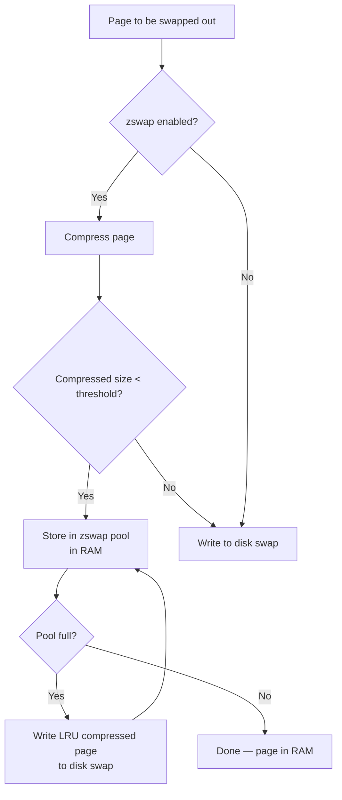
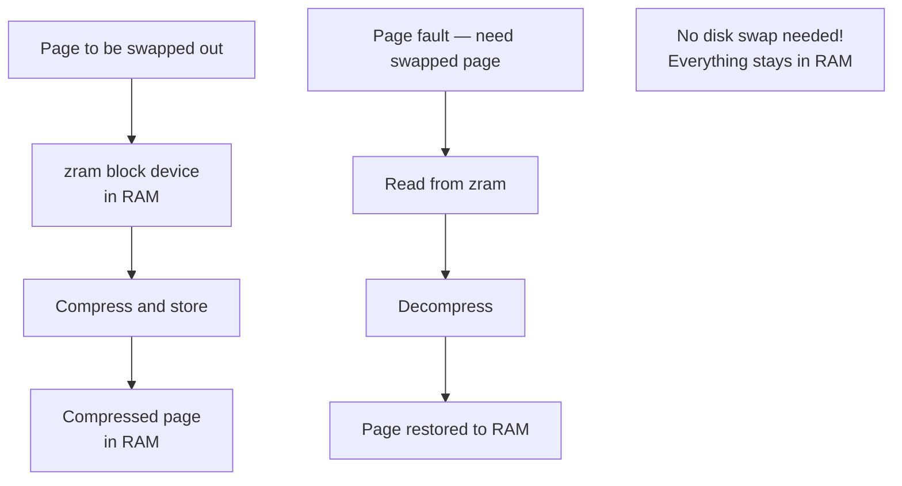
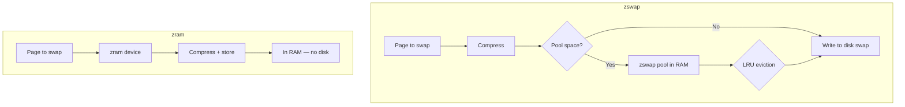

# Memory Compression

## Overview

**Memory compression** is a technique where the operating system compresses rarely-used memory pages in RAM instead of writing them to disk (swap). This provides a middle ground between keeping pages in memory (fast but uses space) and swapping to disk (slow but frees space).

The two main Linux mechanisms are **zswap** and **zram**. Both compress pages in memory, but they serve different purposes and work in different ways.

---

## Why Memory Compression?

### The Problem

```
Traditional approach when memory is full:
┌──────────────┐     ┌──────────────┐
│   RAM         │────▶│   Disk Swap  │
│   (fast)      │     │   (slow!)    │
└──────────────┘     └──────────────┘
                      Latency: ~10ms (HDD) or ~100μs (SSD)
                      vs. ~100ns for RAM
```

Swapping to disk is **orders of magnitude slower** than RAM access. Memory compression avoids this by keeping compressed pages in RAM.

### The Solution

```
With memory compression:
┌──────────────┐     ┌──────────────────┐     ┌──────────────┐
│   RAM         │────▶│ Compressed Cache  │────▶│   Disk Swap  │
│   (fast)      │     │ (in RAM, fast!)   │     │   (last resort)│
└──────────────┘     └──────────────────┘     └──────────────┘
                     Compression: ~10μs
                     Decompression: ~5μs
                     Much faster than disk I/O!
```

### Compression Ratios

Typical memory pages compress well:

| Content Type | Typical Ratio | 4 KB Page Becomes |
|---|---|---|
| Zeroed pages | 1000:1+ | ~4 bytes |
| Text/code | 2:1 to 3:1 | ~1.5 KB |
| Sparse data | 5:1 to 10:1 | ~500 bytes |
| Random data | 1:1 | 4 KB (no savings) |
| Average workload | 2:1 to 3:1 | ~1.5 KB |

---

## zswap

### What is zswap?

**zswap** is a **compressed write-back cache** that sits in front of the traditional swap device. It intercepts pages being swapped out, compresses them, and stores them in a dynamically allocated RAM pool. If the pool is full, the least recently used compressed pages are written to the actual swap device.

### Architecture



### Key Characteristics

1. **Write-back cache**: Pages can be evicted from zswap to disk swap
2. **In front of swap**: Intercepts swap I/O before it hits disk
3. **Dynamic pool size**: Uses a percentage of total RAM
4. **Requires swap**: zswap needs an active swap partition/file
5. **Transparent**: No application changes needed

### Configuration

```bash
# Check if zswap is enabled
cat /sys/module/zswap/parameters/enabled
# Y = enabled, N = disabled

# Enable zswap
echo Y | sudo tee /sys/module/zswap/parameters/enabled

# Configure zswap parameters
# Maximum pool size (% of total RAM)
echo 20 | sudo tee /sys/module/zswap/parameters/max_pool_percent

# Compression algorithm
cat /sys/module/zswap/parameters/compressor
# Default: lz4 (fast) or zstd (better compression)
echo zstd | sudo tee /sys/module/zswap/parameters/compressor

# Zpool backend (how compressed pages are stored)
cat /sys/module/zswap/parameters/zpool
# Options: zbud, z3fold, zsmalloc
echo z3fold | sudo tee /sys/module/zswap/parameters/zpool

# Check zswap statistics
cat /sys/kernel/debug/zswap/
# pool_total_size — current pool size
# stored_pages — number of compressed pages stored
# written_back_pages — pages written to disk swap
# reject_compress_poor — pages rejected (bad compression ratio)
# reject_alloc_fail — allocation failures
# duplicate_entry — duplicate page detections
```

### Make Persistent

```bash
# /etc/modprobe.d/zswap.conf
options zswap enabled=1 max_pool_percent=20 compressor=zstd zpool=z3fold

# Or via kernel boot parameter
# In /etc/default/grub:
GRUB_CMDLINE_LINUX="zswap.enabled=1 zswap.max_pool_percent=20"
# Then: sudo update-grub
```

---

## zram

### What is zram?

**zram** is a **compressed block device in RAM** that acts as a swap device. Instead of swapping to disk, the system swaps to zram — a compressed RAM disk. It's like having a swap partition that lives in memory.

### Architecture



### Key Characteristics

1. **Block device**: Appears as `/dev/zram0`, can be used as swap
2. **No disk swap required**: zram replaces disk swap (can coexist)
3. **No write-back**: Unlike zswap, zram doesn't write to disk
4. **Multiple devices**: Can create multiple zram devices
5. **Also useful for tmpfs**: Can store `/tmp` as compressed RAM

### Configuration

```bash
# Check if zram module is loaded
lsmod | grep zram

# Load zram module
sudo modprobe zram

# Configure zram device
# Set compression algorithm
echo zstd | sudo tee /sys/block/zram0/comp_algorithm

# Set disk size (this is the uncompressed size; actual usage is less)
echo 4G | sudo tee /sys/block/zram0/disksize

# Or set memory limit (how much RAM zram can use for compressed data)
echo 2G | sudo tee /sys/block/zram0/mem_limit

# Create swap on zram
sudo mkswap /dev/zram0
sudo swapon -p 100 /dev/zram0  # Higher priority than disk swap

# Check status
cat /sys/block/zram0/mm_stat
# orig_data_size — uncompressed size
# compr_data_size — compressed size
# mem_used_total — total memory used by zram
# same_pages — pages that couldn't be compressed (count)
# pages_compacted — pages successfully compressed
```

### Automated Setup with zram-generator

```bash
# Install zram-generator (systemd-based)
sudo apt install zram-generator  # Debian/Ubuntu
sudo dnf install zram-generator  # Fedora

# Configure: /etc/systemd/zram-generator.conf
[zram0]
zram-size = ram / 2
compression-algorithm = zstd
swap-priority = 100
fs-type = swap

# Enable
sudo systemctl daemon-reload
sudo systemctl start systemd-zram-setup@zram0.service
```

---

## zswap vs zram



| Feature | zswap | zram |
|---|---|---|
| Type | Compressed write-back cache | Compressed block device |
| Requires disk swap? | Yes | No |
| Write-back to disk? | Yes (when pool full) | No |
| Use case | Systems with existing swap | Systems without/with small swap |
| Memory management | Works with existing swap subsystem | Creates new swap device |
| Compression | On swap-out only | On all writes to device |
| Configuration | Kernel parameters | Block device setup |
| Available since | Linux 3.11 (2013) | Linux 3.14 (2014), earlier versions existed |
| Best for | Servers with disk swap | Embedded, VMs, systems with fast CPUs |

### When to Use Which

```
Use zswap when:
├── You already have disk swap (SSD/HDD)
├── You want to reduce disk swap I/O
├── You want a transparent drop-in improvement
└── Server/workstation with traditional setup

Use zram when:
├── You don't want disk swap at all
├── Embedded systems (no disk or slow flash)
├── VMs where disk I/O is expensive
├── Desktop/laptop with enough RAM
└── You want maximum RAM utilization
```

---

## Compression Algorithms

| Algorithm | Speed (compress) | Speed (decompress) | Ratio | Use Case |
|---|---|---|---|---|
| **lz4** | Very fast | Very fast | Moderate | Default for zram, high-throughput |
| **zstd** | Fast | Very fast | Good | Balanced, recommended for zswap |
| **lzo** | Fast | Fast | Moderate | Legacy default |
| **lzo-rle** | Fast | Fast | Moderate | Improved lzo, default in some kernels |
| **zlib** | Slow | Moderate | Best | Maximum compression |
| **lz4hc** | Slow | Very fast | Good | High compression, fast decompress |

```bash
# Check available algorithms
cat /sys/block/zram0/comp_algorithm
# [lz4] lzo lzo-rle zstd zlib lz4hc

# Set algorithm
echo zstd | sudo tee /sys/block/zram0/comp_algorithm
```

### Performance Comparison

```
Algorithm    Compress Speed    Decompress Speed    Ratio
─────────────────────────────────────────────────────────
lz4          780 MB/s          4000 MB/s           2.1:1
lzo          650 MB/s          850 MB/s            2.1:1
zstd         515 MB/s          1500 MB/s           2.9:1
zlib         38 MB/s           400 MB/s            3.1:1

For swap: decompress speed matters most (every page fault)
→ lz4 or zstd are best choices
```

---

## Linux Example: Full zram Setup

```bash
#!/bin/bash
# Setup zram swap with zstd compression

# Load module
modprobe zram

# Configure
echo zstd > /sys/block/zram0/comp_algorithm
echo 8G > /sys/block/zram0/disksize
echo 4G > /sys/block/zram0/mem_limit

# Create and enable swap
mkswap /dev/zram0
swapon -p 100 /dev/zram0

# Check it's active
swapon --show
# NAME       TYPE      SIZE   USED  PRIO
# /dev/zram0 partition  8G   0B    100

# Monitor compression
cat /sys/block/zram0/mm_stat
# Fields: orig_data_size compr_data_size mem_used_total mem_limit
#         max_used_total same_pages pages_compacted huge_pages
```

---

## Interview Questions

### Q1: What is memory compression in the context of virtual memory?
**A:** Memory compression is a technique where the OS compresses infrequently-used memory pages in RAM instead of swapping them to disk. This keeps the pages in RAM (fast access) while freeing up space. Compression/decompression is much faster than disk I/O.

### Q2: What is the difference between zswap and zram?
**A:** **zswap** is a compressed cache in front of disk swap — it intercepts swap I/O, compresses pages, and stores them in RAM. If the pool fills up, pages are written to disk. **zram** is a compressed block device that acts as a swap device itself — no disk swap is needed. zswap is better when you already have disk swap; zram is better when you want to avoid disk entirely.

### Q3: Why is lz4 preferred over zlib for swap compression?
**A:** Because **decompress speed** is critical for swap — every page fault requires decompression. lz4 decompresses at ~4000 MB/s vs zlib's ~400 MB/s. The compression ratio difference (2.1:1 vs 3.1:1) doesn't compensate for the 10x decompression speed difference. For swap, latency matters more than compression ratio.

### Q4: What happens when zswap's pool is full?
**A:** zswap uses a write-back mechanism. When the pool is full, it selects the least recently used compressed page and writes it to the actual disk swap device, freeing space in the pool for the new compressed page.

### Q5: What compression ratio can you expect from memory compression?
**A:** Typical workloads achieve 2:1 to 3:1 compression. Zeroed pages compress nearly infinitely, text/code achieves 2:1 to 3:1, and random data doesn't compress at all. The average is usually around 2:1, meaning you effectively double your available memory.

---

## Common Mistakes

1. **Confusing zswap and zram**: zswap requires disk swap and acts as a cache. zram IS the swap device and doesn't need disk.
2. **Using zlib for swap**: zlib has great compression but is too slow for swap. Use lz4 or zstd.
3. **Not considering CPU overhead**: Compression uses CPU. On CPU-bound systems, memory compression can hurt performance.
4. **Forgetting to check if enabled**: zswap/zram may not be enabled by default. Check `/sys/module/zswap/parameters/enabled`.
5. **Setting zram size too large**: zram size should be based on expected compression ratio. Setting it to 200% of RAM with 2:1 ratio means you're using 100% of RAM for zram alone.

---

## Summary

Memory compression provides a fast middle ground between keeping pages in RAM and swapping to disk. zswap and zram are the two Linux mechanisms, both transparent to applications.

**Key points for interviews:**
- Memory compression keeps pages in RAM (compressed) instead of swapping to disk
- zswap: compressed write-back cache in front of disk swap
- zram: compressed block device that acts as swap (no disk needed)
- Typical ratio: 2:1 to 3:1 compression
- Best algorithms: lz4 (fastest) or zstd (balanced)
- Decompression speed matters more than compression ratio for swap
- CPU overhead is the trade-off — not ideal for CPU-bound workloads
