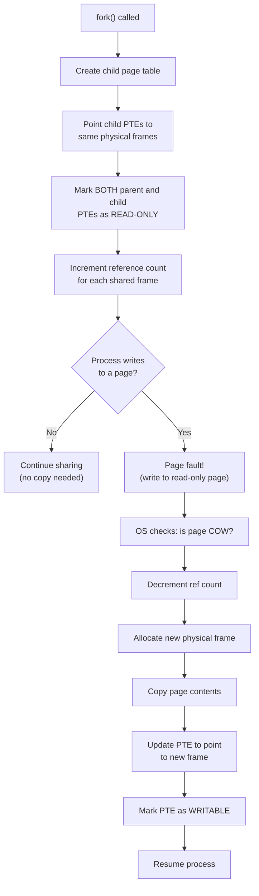

# Copy-on-Write (COW)

## Overview

**Copy-on-Write (COW)** is a memory optimization technique where multiple processes **share** the same physical memory pages until one of them tries to **modify** a page. At that point, and only at that point, the OS creates a **private copy** of the page for the writing process.

COW is most famously used in the `fork()` system call in UNIX/Linux, where the child process initially shares all of the parent's memory pages via COW instead of duplicating them. This makes `fork()` extremely fast, even for processes with large address spaces.

---

## The Problem COW Solves

### Without COW: Naive fork()

```
Parent process (100 MB):
┌────────────────────────┐
│ Code: 10 MB            │
│ Data: 30 MB            │
│ Heap: 40 MB            │
│ Stack: 20 MB           │
└────────────────────────┘

fork() → Child process (100 MB):
┌────────────────────────┐
│ Code: 10 MB  (COPY)    │
│ Data: 30 MB  (COPY)    │
│ Heap: 40 MB  (COPY)    │
│ Stack: 20 MB (COPY)    │
└────────────────────────┘

Total: 200 MB (doubled!)
Time: Proportional to process size (100 MB copy)
```

This is **wasteful** because most `fork()` calls are immediately followed by `exec()`, which replaces the entire address space anyway. The copied memory is never used.

### With COW: Smart fork()

```
Parent process (100 MB):
┌────────────────────────┐
│ Code: 10 MB            │
│ Data: 30 MB            │
│ Heap: 40 MB            │
│ Stack: 20 MB           │
└────────────────────────┘
         │
         │ (shared, read-only)
         ▼
Child process (0 MB extra):
┌────────────────────────┐
│ Page tables point to   │
│ SAME physical frames   │
└────────────────────────┘

Total: 100 MB shared (not doubled!)
Time: O(1) — just copy page tables
```

---

## How COW Works

### Step-by-Step Mechanism



### Detailed Walkthrough

#### Phase 1: After fork()

```
Parent Page Table:          Child Page Table:
┌─────┬──────┬──────┐      ┌─────┬──────┬──────┐
│ VPN │ PFN  │ R/W  │      │ VPN │ PFN  │ R/W  │
├─────┼──────┼──────┤      ├─────┼──────┼──────┤
│  0  │ 100  │ R    │      │  0  │ 100  │ R    │ ← Same frame!
│  1  │ 200  │ R    │      │  1  │ 200  │ R    │ ← Same frame!
│  2  │ 300  │ R    │      │  2  │ 300  │ R    │ ← Same frame!
└─────┴──────┴──────┘      └─────┴──────┴──────┘

Physical Memory:
Frame 100: [shared data]  ref_count = 2
Frame 200: [shared data]  ref_count = 2
Frame 300: [shared data]  ref_count = 2
```

#### Phase 2: Parent writes to page 1

```
1. Parent writes to virtual page 1
2. CPU sees PTE is READ-ONLY → PAGE FAULT
3. OS trap handler:
   a. Check: Is this a COW page? → YES
   b. ref_count(frame 200) = 2 > 1 → must copy
   c. Allocate new frame (e.g., 400)
   d. Copy: memcpy(frame 400, frame 200, PAGE_SIZE)
   e. Update parent PTE: VPN 1 → PFN 400, R/W
   f. Decrement: ref_count(frame 200) = 1
4. Resume parent execution (write succeeds)
```

After parent writes:
```
Parent Page Table:          Child Page Table:
┌─────┬──────┬──────┐      ┌─────┬──────┬──────┐
│ VPN │ PFN  │ R/W  │      │ VPN │ PFN  │ R/W  │
├─────┼──────┼──────┤      ├─────┼──────┼──────┤
│  0  │ 100  │ R    │      │  0  │ 100  │ R    │ ← Still shared
│  1  │ 400  │ R/W  │      │  1  │ 200  │ R    │ ← Separated!
│  2  │ 300  │ R    │      │  2  │ 300  │ R    │ ← Still shared
└─────┴──────┴──────┘      └─────┴──────┴──────┘

Frame 100: ref_count = 2 (shared)
Frame 200: ref_count = 1 (child only)
Frame 300: ref_count = 2 (shared)
Frame 400: ref_count = 1 (parent only)
```

---

## Reference Counting

### Why Reference Counting?

The OS needs to know when it's safe to actually copy a page vs. just change the permissions:

- **ref_count > 1**: Multiple processes share the frame → must copy on write
- **ref_count == 1**: Only one process owns the frame → just mark writable (no copy needed)

### Implementation

```c
// Kernel data structure for page frame
struct page_frame {
    int ref_count;       // Number of processes sharing this frame
    int flags;           // COW, dirty, etc.
    void *physical_addr; // Physical address
};

// On fork():
void fork_cow(struct process *parent, struct process *child) {
    // Copy page table entries (not physical pages)
    for each PTE in parent->page_table:
        child->page_table[i] = parent->page_table[i];
        if (PTE is writable):
            // Mark both as read-only + COW
            parent->page_table[i].writable = 0;
            child->page_table[i].writable = 0;
            parent->page_table[i].cow = 1;
            child->page_table[i].cow = 1;
            frames[PTE.frame].ref_count++;
}

// On page fault (write to COW page):
void handle_cow_fault(struct process *proc, int vpn) {
    int frame = proc->page_table[vpn].frame;

    if (frames[frame].ref_count == 1):
        // Only owner — just mark writable
        proc->page_table[vpn].writable = 1;
        proc->page_table[vpn].cow = 0;
    else:
        // Shared — must copy
        int new_frame = allocate_frame();
        memcpy(new_frame, frame, PAGE_SIZE);
        frames[frame].ref_count--;
        proc->page_table[vpn].frame = new_frame;
        proc->page_table[vpn].writable = 1;
        proc->page_table[vpn].cow = 0;
        frames[new_frame].ref_count = 1;
}
```

---

## fork() + exec() Pattern

The most common use of COW is the `fork()` + `exec()` pattern:

```c
pid_t pid = fork();

if (pid == 0) {
    // Child process
    // COW: shares parent's memory pages
    execl("/bin/ls", "ls", "-la", NULL);
    // exec() replaces entire address space
    // All COW pages are freed (ref_count drops to 0)
} else {
    // Parent process
    wait(NULL);
    // COW pages that were shared are now parent-only
}
```

```
Timeline:
1. fork()        → Child shares all parent pages (COW)
2. exec()        → Child's address space replaced entirely
                   Shared pages' ref_count decremented
3. Parent runs   → May trigger COW faults if it writes
4. Child runs    → Uses new program's pages
```

Without COW, step 1 would copy the entire address space (slow). With COW, step 1 is O(1) — just copy page tables.

---

## Linux Implementation

### COW in Linux Kernel

Linux implements COW in the page fault handler:

```bash
# Check COW pages for a process
cat /proc/<pid>/smaps | grep -i "referenced"

# View page table entries (shows COW flags)
# Requires root
cat /proc/<pid>/page_tables
```

### vfork(): Even Faster (No COW)

Linux also has `vfork()`, which is even faster than COW fork:

```c
pid_t pid = vfork();

if (pid == 0) {
    // Child shares parent's memory WITHOUT COW
    // Child MUST call exec() or _exit() immediately
    // Child MUST NOT modify any memory
    execl("/bin/ls", "ls", NULL);
    _exit(1);
}
```

`vfork()` suspends the parent and lets the child run in the parent's address space. No page table copying, no COW. But the child must not modify memory.

### Linux COW Bug (CVE-2016-5195 "Dirty COW")

A famous vulnerability in the Linux COW implementation:

```bash
# Dirty COW allowed unprivileged users to write to read-only files
# by exploiting a race condition in the COW page fault handler

# The bug: between checking ref_count and copying the page,
# another thread could modify the shared page

# Fixed in Linux kernel 4.8.3
uname -r  # Check kernel version
```

---

## COW in Other Contexts

### 1. File Systems (Btrfs, ZFS)

COW file systems never overwrite data in place:

```
Write to block 100:
1. Allocate new block (200)
2. Write data to block 200
3. Update pointer to point to 200
4. Old block 100 still contains previous version

Benefits:
- Atomic writes (no partial updates)
- Snapshots (old data preserved)
- Better crash consistency
```

```bash
# Check if filesystem uses COW
btrfs filesystem df /mountpoint
# Btrfs is a COW filesystem

# Create snapshot (instant, COW-based)
btrfs subvolume snapshot /mountpoint /mountpoint/.snapshot
```

### 2. Database Systems (SQLite, PostgreSQL)

```
SQLite WAL mode uses COW-like behavior:
- Writes go to WAL (Write-Ahead Log) file
- Readers see old data in main file
- On checkpoint: WAL entries applied to main file
```

### 3. Docker/Container Images

Docker uses COW for container layers:

```
Base Image (read-only)
  └── Container Layer 1 (COW — write here)
  └── Container Layer 2 (COW — write here)

Multiple containers share the same base image.
Only modified files are copied to the container layer.
```

---

## Implementation Example

### Simulating COW fork() in Python

```python
import os

class COWPage:
    def __init__(self, data):
        self.data = data
        self.ref_count = 1

    def write(self, offset, value):
        if self.ref_count > 1:
            # Must copy before writing
            new_page = COWPage(self.data.copy())
            self.ref_count -= 1
            new_page.ref_count = 1
            new_page.data[offset] = value
            return new_page
        else:
            # Only owner — write directly
            self.data[offset] = value
            return self

class COWProcess:
    def __init__(self, pages=None):
        self.pages = pages or {}

    def fork(self):
        """Create child process with COW pages."""
        child = COWProcess()
        for vpn, page in self.pages.items():
            child.pages[vpn] = page
            page.ref_count += 1
        return child

    def write(self, vpn, offset, value):
        """Write to a page (may trigger COW copy)."""
        if vpn in self.pages:
            self.pages[vpn] = self.pages[vpn].write(offset, value)

# Example
parent = COWProcess({
    0: COWPage([1, 2, 3, 4]),
    1: COWPage([5, 6, 7, 8]),
})

# fork() — instant, shares pages
child = parent.fork()

print(f"Frame 0 ref_count: {parent.pages[0].ref_count}")  # 2
print(f"Frame 1 ref_count: {parent.pages[1].ref_count}")  # 2

# Parent writes to page 0 — triggers COW copy
parent.write(0, 0, 99)

print(f"Frame 0 ref_count (parent): {parent.pages[0].ref_count}")  # 1
print(f"Frame 0 ref_count (child): {child.pages[0].ref_count}")    # 1
print(f"Parent page 0 data: {parent.pages[0].data}")  # [99, 2, 3, 4]
print(f"Child page 0 data: {child.pages[0].data}")    # [1, 2, 3, 4]
```

---

## Interview Questions

### Q1: What is Copy-on-Write?
**A:** COW is an optimization where multiple processes share the same physical memory pages until one tries to write. At write time, a private copy is created for the writing process. This avoids expensive copying when pages are only read.

### Q2: How does COW make fork() faster?
**A:** Without COW, fork() copies the entire address space (O(n) where n is process size). With COW, fork() only copies the page table (O(1) per page, typically a few hundred entries). Physical pages are copied lazily, only when written. Since most fork() calls are followed by exec() (which replaces the address space), the copy is often never needed.

### Q3: How does the OS know when to copy a COW page?
**A:** When fork() creates a child, the OS marks all shared pages as **read-only** in both parent and child page tables. When either process writes to a page, a **page fault** occurs. The fault handler checks if the page is COW; if so, it allocates a new frame, copies the data, updates the PTE, and marks it writable.

### Q4: What is reference counting in COW?
**A:** Each physical frame has a reference count tracking how many processes share it. When ref_count > 1, a write requires copying. When ref_count == 1, the sole owner can write directly without copying. ref_count is incremented on fork() and decremented on process exit or COW copy.

### Q5: What was the Dirty COW vulnerability?
**A:** Dirty COW (CVE-2016-5195) was a race condition in Linux's COW implementation. Between checking the reference count and performing the copy, another thread could modify the shared page, allowing an unprivileged user to write to read-only memory-mapped files. It was fixed in kernel 4.8.3.

---

## Common Mistakes

1. **Thinking fork() copies all memory**: With COW, fork() only copies page tables. Physical pages are shared until written.
2. **Forgetting about reference counting**: Without reference counting, the OS doesn't know whether to copy or just mark writable.
3. **Not understanding the page fault mechanism**: COW works by marking pages read-only and handling the resulting write fault. This is a key detail.
4. **Confusing COW with shared memory**: COW starts shared but diverges on write. Explicit shared memory (shmget, mmap MAP_SHARED) stays shared permanently.
5. **Not knowing COW is used beyond fork()**: COW is also used in file systems (Btrfs, ZFS), databases, containers, and other copy-heavy operations.

---

## Summary

Copy-on-Write is a fundamental OS optimization that defers memory copying until absolutely necessary. It makes fork() fast (O(1) instead of O(n)), enables efficient snapshots in file systems, and underpins container image layering.

**Key points for interviews:**
- COW shares pages as read-only, copies on first write
- fork() + exec() is the classic COW use case
- Mechanism: read-only PTE → page fault → copy → mark writable
- Reference counting tracks shared frames (ref_count > 1 → must copy)
- Used in fork(), Btrfs/ZFS, Docker layers, databases
- Dirty COW (CVE-2016-5195) was a famous COW race condition bug


## Cross References

- [Process Creation](../os/processes/creation.md)
- [Paging](../os/memory/paging.md)
- [Fork](../os/processes/creation.md)
- [Memory Barriers](../os/synchronization/memory-barriers.md)
