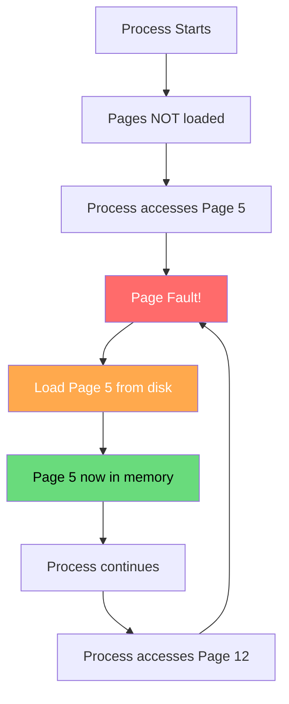
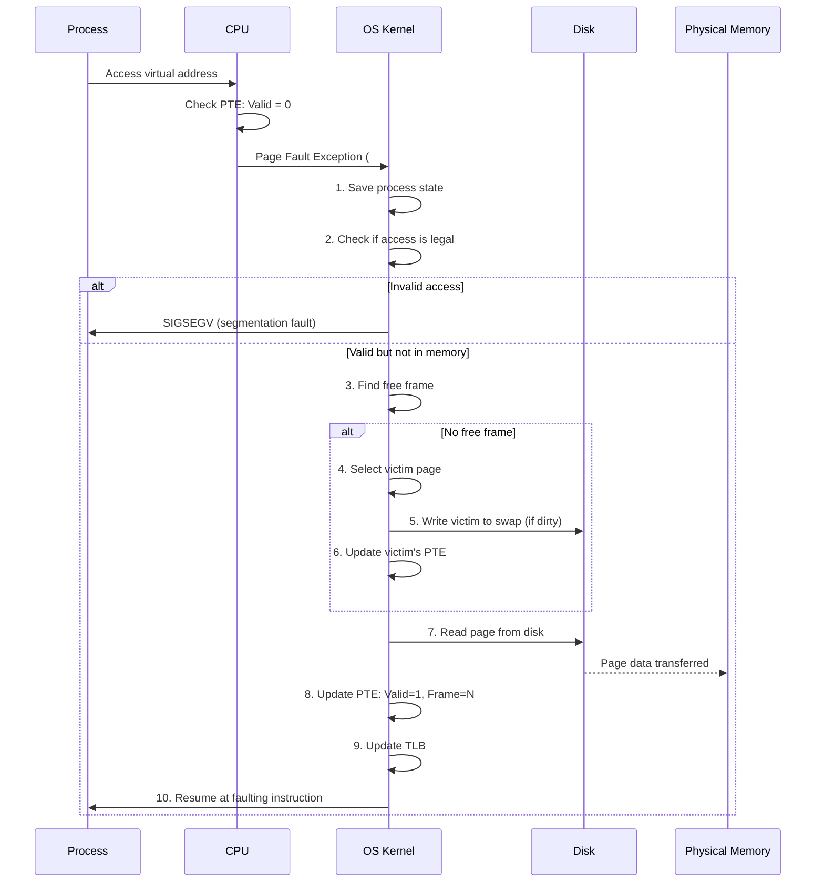
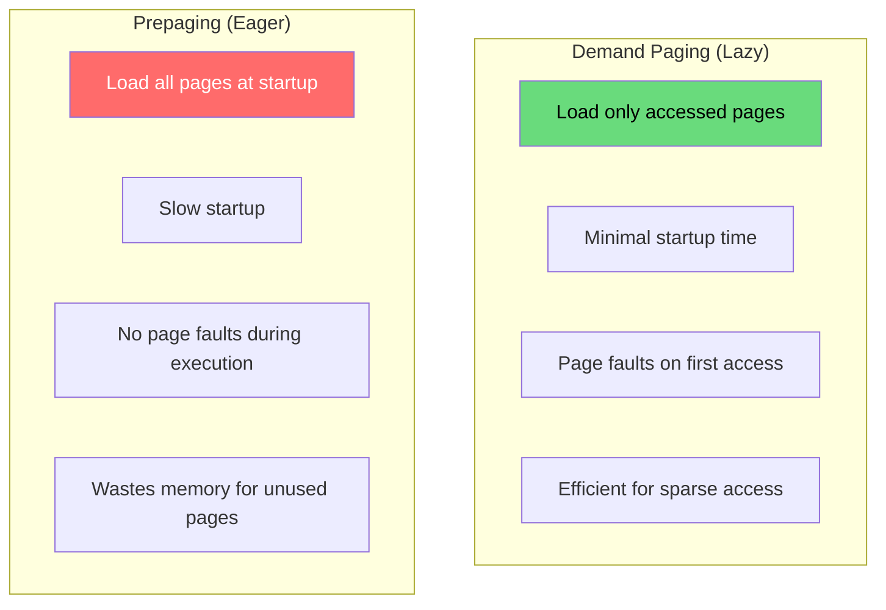
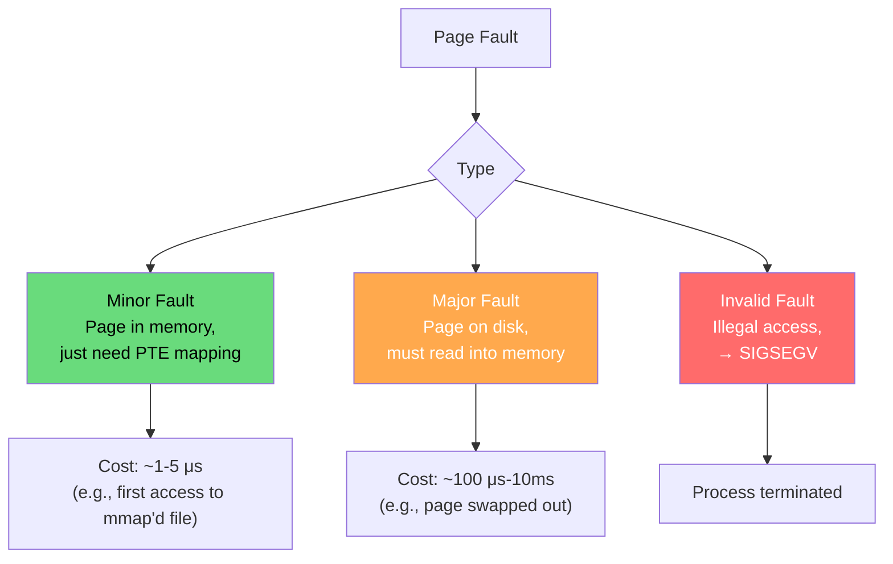
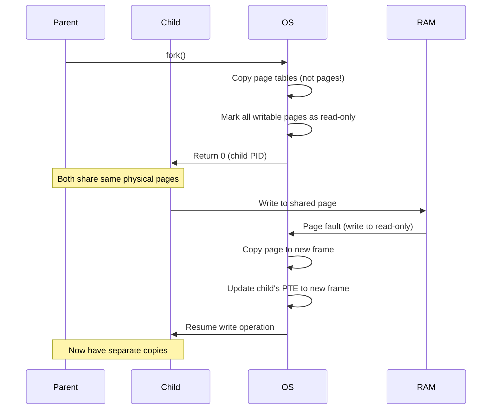

# Demand Paging

Demand paging is the cornerstone of virtual memory: pages are loaded into physical memory only when they are actually accessed, not when they are allocated. This lazy approach dramatically reduces startup time and memory usage.

## Overview



## How Demand Paging Works

### 1. Page Table Entry States

```
PTE when page is NOT in memory (invalid):
┌────────────────────────────────┬──────────┐
│ 0 (or swap location)          │ V = 0    │
└────────────────────────────────┴──────────┘

PTE when page IS in memory (valid):
┌────────────────────────────────┬──────────┐
│ Physical Frame Number          │ V = 1    │
│ + R/W, U/S, D, A flags        │          │
└────────────────────────────────┴──────────┘
```

### 2. Page Fault Handling



## Demand Paging vs Prepaging



| Aspect | Demand Paging | Prepaging |
|--------|--------------|-----------|
| Startup time | Fast | Slow |
| Memory usage | Minimal | Full footprint |
| Page faults | During execution | None after load |
| I/O pattern | On-demand (unpredictable) | Sequential (predictable) |
| Best for | Large programs, sparse access | Small programs, sequential access |

## Page Fault Cost Analysis

```
Page fault cost breakdown:
  1. Trap to OS:                    ~1 μs
  2. Save registers, switch context: ~2 μs
  3. Determine fault reason:         ~1 μs
  4. Disk I/O (SSD):               ~100 μs
  5. Disk I/O (HDD):               ~5-10 ms
  6. Update page table:             ~0.5 μs
  7. TLB update:                    ~0.1 μs
  8. Restore context:               ~2 μs
  ─────────────────────────────────
  Total (SSD):                     ~106 μs
  Total (HDD):                     ~5-10 ms

  vs. Normal memory access:         ~100 ns

  Page fault is 1,000x (SSD) to 100,000x (HDD) slower!
```

## Effective Access Time (EAT)

```
EAT = (1 - p) × memory_access_time + p × page_fault_time

where p = page fault rate

Example (SSD system):
  Memory access: 100 ns
  Page fault: 100 μs = 100,000 ns

  p = 0.001 (1 fault per 1000 accesses):
  EAT = 0.999 × 100 + 0.001 × 100,000
      = 99.9 + 100
      = 199.9 ns (2x slowdown!)

  p = 0.0001 (1 fault per 10,000 accesses):
  EAT = 0.9999 × 100 + 0.0001 × 100,000
      = 99.99 + 10
      = 109.99 ns (10% slowdown)
```

## Types of Page Faults



### Minor Page Fault (Soft Fault)

The page is already in physical memory (e.g., page cache) but not mapped in the process's page table:

```bash
# Example: First access to a shared library already loaded by another process
$ cat /proc/$(pgrep -f bash | head -1)/stat | awk '{print "MinFlt:", $10, "MajFlt:", $11}'
MinFlt: 12345 MajFlt: 67

# Minor faults are common and usually harmless
$ perf stat -e minor-faults,major-faults ls -la
          156      minor-faults
            0      major-faults
```

### Major Page Fault (Hard Fault)

The page must be read from disk:

```bash
# Major faults are expensive
$ perf stat -e major-faults ./memory_intensive_program
           42      major-faults

# Monitor major faults in real-time
$ vmstat 1
procs -----------memory---------- ---swap--
 r  b   swpd   free   buff  cache   si   so
 1  0 102400  512000  12345  45678    5    2
# si = swap in (KB/s), so = swap out (KB/s)
```

## Copy-on-Write (COW) Page Fault

Special case: `fork()` creates COW mappings:



## Real-World: Demand Paging in Linux

### Process Startup

```bash
# When a program starts, only minimal pages are loaded
$ cat /proc/$(./my_program &)/smaps | head -20
55a8c0a00000-55a8c0a24000 r--p 00000000 08:01 131074  /usr/bin/my_program
Size:                144 kB
KernelPageSize:        4 kB
MMUPageSize:           4 kB
Rss:                 144 kB    ← Actually in memory
Pss:                 144 kB
Shared_Clean:          0 kB
Shared_Dirty:          0 kB
Private_Clean:       144 kB
Private_Dirty:         0 kB
Referenced:          144 kB
Anonymous:             0 kB
LazyFree:              0 kB
AnonHugePages:         0 kB
ShmemPmdMapped:        0 kB
FilePmdMapped:         0 kB
Shared_Hugetlb:        0 kB
Private_Hugetlb:       0 kB
Swap:                  0 kB
SwapPss:               0 kB
```

### Monitoring Page Faults

```bash
# Per-process page fault statistics
$ ps -o pid,minflt,majflt,cmd -p $(pgrep -f firefox | head -1)
  PID  MINFL  MAJFL CMD
 1234 567890   1234 /usr/lib/firefox/firefox

# System-wide page fault monitoring
$ sar -B 1 5
16:00:01  pgpgin/s pgpgout/s   fault/s  majflt/s  pgfree/s pgscand/s pgsteal/s
16:00:02     123.45    567.89   1234.56      1.23   5678.90      0.00      0.00

# Detailed fault analysis with perf
$ perf stat -e page-faults,minor-faults,major-faults,dTLB-load-misses ./my_program

# Trace page faults
$ perf record -e page-faults -g ./my_program
$ perf report
```

## Demand Paging Optimizations

### 1. Prefetching (Readahead)

```bash
# Linux readahead: load pages before they're accessed
# Triggered by sequential access patterns

# Check readahead settings
$ blockdev --getra /dev/sda
256  # 256 sectors = 128 KB readahead

# Adjust readahead
$ sudo blockdev --setra 2048 /dev/sda  # 1 MB readahead

# Programmatic hint
#include <fcntl.h>
posix_fadvise(fd, 0, 0, POSIX_FADV_SEQUENTIAL);  // Enable readahead
posix_fadvise(fd, 0, 0, POSIX_FADV_RANDOM);       // Disable readahead
```

### 2. Madvise Hints

```c
#include <sys/mman.h>

void *ptr = mmap(NULL, size, PROT_READ, MAP_PRIVATE, fd, 0);

// Tell kernel about access pattern
madvise(ptr, size, MADV_WILLNEED);      // Will need soon (prefetch)
madvise(ptr, size, MADV_SEQUENTIAL);     // Sequential access
madvise(ptr, size, MADV_RANDOM);         // Random access (no readahead)
madvise(ptr, size, MADV_DONTNEED);       // Won't need (free pages)

// Example: Prefetch next chunk of a large file
for (off_t offset = 0; offset < file_size; offset += CHUNK_SIZE) {
    madvise(ptr + offset, CHUNK_SIZE, MADV_WILLNEED);
    // Process current chunk
    process_chunk(ptr + offset, CHUNK_SIZE);
}
```

### 3. MAP_POPULATE (Pre-fault)

```c
// Pre-fault all pages at mmap time
void *ptr = mmap(NULL, size, PROT_READ | PROT_WRITE,
                 MAP_PRIVATE | MAP_ANONYMOUS | MAP_POPULATE,
                 -1, 0);
// All pages are loaded immediately, no page faults later
```

## C Implementation: Demand Paging Simulator

```python
import random

class DemandPagingSimulator:
    def __init__(self, num_frames, page_size):
        self.num_frames = num_frames
        self.page_size = page_size
        self.frames = {}  # frame_num -> page_num
        self.page_table = {}  # page_num -> (frame_num, valid, dirty)
        self.page_faults = 0
        self.disk_reads = 0
        self.disk_writes = 0
    
    def access_page(self, page_num, write=False):
        """Simulate accessing a page."""
        if page_num in self.page_table and self.page_table[page_num][1]:
            # Page is in memory (valid)
            frame = self.page_table[page_num][0]
            if write:
                self.page_table[page_num] = (frame, True, True)
            return {'fault': False, 'frame': frame}
        
        # Page fault!
        self.page_faults += 1
        
        # Find a free frame
        free_frame = self._find_free_frame()
        
        if free_frame is None:
            # Need to evict a page
            victim = self._select_victim()
            victim_frame = self.page_table[victim][0]
            
            if self.page_table[victim][2]:  # If dirty
                self.disk_writes += 1  # Write back to disk
            
            # Invalidate victim
            self.page_table[victim] = (None, False, False)
            del self.frames[victim_frame]
            free_frame = victim_frame
        
        # Load page from disk
        self.disk_reads += 1
        self.frames[free_frame] = page_num
        self.page_table[page_num] = (free_frame, True, write)
        
        return {'fault': True, 'frame': free_frame}
    
    def _find_free_frame(self):
        for f in range(self.num_frames):
            if f not in self.frames:
                return f
        return None
    
    def _select_victim(self):
        """Simple FIFO victim selection."""
        # Find oldest page (first loaded)
        oldest_page = None
        for page, (frame, valid, dirty) in self.page_table.items():
            if valid:
                oldest_page = page
                break
        return oldest_page
    
    def stats(self):
        return {
            'page_faults': self.page_faults,
            'disk_reads': self.disk_reads,
            'disk_writes': self.disk_writes,
            'fault_rate': self.page_faults / max(1, self.page_faults + sum(1 for p in self.page_table.values() if p[1]))
        }


# Simulation
sim = DemandPagingSimulator(num_frames=4, page_size=4096)

# Access pattern: working set of 3 pages, occasional access to page 7
accesses = [0, 1, 2, 0, 1, 2, 0, 1, 7, 0, 1, 2, 0, 1, 2]

for page in accesses:
    result = sim.access_page(page, write=(page == 2))
    print(f"Access page {page}: {'FAULT' if result['fault'] else 'HIT'}, "
          f"frame={result['frame']}")

print(f"\nStats: {sim.stats()}")
```

## Interview Questions

### Beginner

**Q1: What is demand paging?**
A: Loading pages into physical memory only when they are actually accessed, not when the process starts. When a process accesses a page not in memory, a page fault occurs, and the OS loads the page from disk.

**Q2: What happens during a page fault?**
A: The CPU traps to the OS kernel. The kernel: (1) checks if the access is valid, (2) finds a free frame (evicting a page if needed), (3) loads the page from disk, (4) updates the page table, (5) resumes the faulting instruction.

**Q3: What is the difference between a minor and major page fault?**
A: Minor fault: the page is already in physical memory (e.g., in page cache) but not mapped in the process's page table. Fast (~μs). Major fault: the page must be read from disk. Slow (~ms).

### Intermediate

**Q4: How does demand paging affect program startup time?**
A: Dramatically reduces it. Instead of loading the entire program (which could be GB), only the pages actually accessed are loaded. A program that uses 10% of its code saves 90% of load time. The trade-off is occasional page faults during execution.

**Q5: What is Copy-on-Write and how does it relate to demand paging?**
A: COW is a demand paging optimization used by `fork()`. Instead of copying all pages, parent and child share pages marked read-only. When either writes, a page fault triggers copying only the modified page. This makes fork() nearly instant.

**Q6: How does the OS decide which page to evict when a page fault occurs and memory is full?**
A: Using page replacement algorithms. Common ones: FIFO (oldest page), LRU (least recently used), Clock (LRU approximation). The OS uses accessed/dirty bits in PTEs and maintains page lists (active/inactive) to approximate LRU.

### Advanced / FAANG-Level

**Q7: Design a system that reduces page fault latency for a database with 100 GB of data on a 16 GB machine.**
A: 
1. **Huge pages**: 2MB pages reduce TLB misses and page table overhead
2. **Prefetching**: Use `madvise(MADV_WILLNEED)` to prefetch predicted pages
3. **NUMA awareness**: Allocate pages on the local NUMA node
4. **Buffer pool management**: Database manages its own cache, minimizing OS page cache conflicts
5. **Direct I/O**: Bypass OS page cache for database buffer pool
6. **Memory pinning**: `mlock()` critical pages to prevent eviction
7. **Async I/O**: Use `io_uring` for non-blocking page loads
8. **Compression**: Compress cold pages in memory instead of swapping to disk

**Q8: A program has 1% page fault rate with 100ns memory access and 10ms disk access. Is this acceptable?**
A: Calculate EAT:
- EAT = 0.99 × 100ns + 0.01 × 10,000,000ns = 99ns + 100,000ns = 100,099ns
- That's ~1000x slower than pure memory access!
- **Not acceptable** for most workloads. Solutions: increase working set in memory, use SSD (reduces fault cost to ~100μs), optimize access patterns, use huge pages.

**Q9: Explain how the Linux kernel handles a demand page fault for an mmap'd file, including all the data structures involved.**
A: 
1. CPU raises #PF, saves faulting address in CR2
2. `exc_page_fault()` → `handle_mm_fault()` → `__handle_mm_fault()`
3. Kernel walks page table: `pgd_offset()` → `p4d_offset()` → `pud_offset()` → `pmd_offset()` → `pte_offset_map()`
4. PTE shows page not present → `handle_pte_fault()`
5. VMA lookup: `find_vma()` in process's `mm_struct` → `vm_area_struct`
6. VMA has `vm_ops->fault` pointing to file system's fault handler
7. `filemap_fault()` called:
   a. Search page cache (xarray/radix tree) for the page
   b. If found → minor fault, just map it
   c. If not found → allocate page, add to page cache, start async read
   d. Wait for I/O completion
8. Fill PTE with frame number + flags (Present=1, R/W per VMA)
9. Add to TLB
10. Return to user space, re-execute instruction

## Common Mistakes

1. **Confusing demand paging with swapping** — Demand paging loads individual pages on access; swapping moves entire processes.
2. **Ignoring page fault cost** — Each fault is expensive; minimize them through good access patterns.
3. **Not understanding COW** — fork() doesn't copy pages; it marks them COW. Writing triggers the copy.
4. **Forgetting about readahead** — Linux prefetches sequential pages; random access defeats this.
5. **Assuming all faults are bad** — Minor faults are normal; only excessive major faults indicate a problem.

## Summary

| Aspect | Details |
|--------|---------|
| **Mechanism** | Load pages on first access |
| **Page Fault** | Trap to OS, load page, resume |
| **Minor Fault** | Page in memory, just need mapping (~μs) |
| **Major Fault** | Page on disk, must read (~ms) |
| **COW** | Shared pages, copy on write |
| **Optimization** | Prefetching, madvise, MAP_POPULATE |
| **Cost** | 1000-100,000x slower than normal access |

## Cross-References

- **Prerequisite**: [Paging](../memory/paging.md) — basic paging mechanism
- **Next**: [Page Replacement](./page-replacement.md) — choosing which page to evict
- **See Also**: [Copy-on-Write](./cow.md) — COW page fault handling
- **See Also**: [Thrashing](./thrashing.md) — too many page faults
- **Related**: [Working Set](./working-set.md) — minimizing page faults
