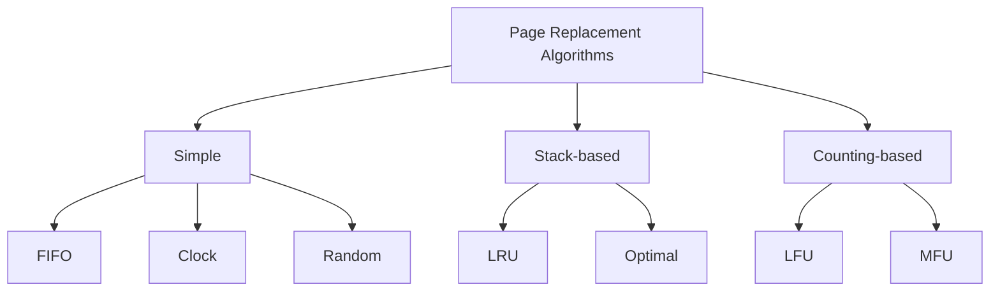

# FIFO Page Replacement

## Overview

**FIFO (First-In, First-Out)** is the simplest page replacement algorithm. When a page fault occurs and all frames are occupied, the page that was loaded **earliest** (the "oldest" page in memory) is selected for replacement.

FIFO is primarily used as a **teaching tool** and baseline for comparison. It is rarely used in production due to its poor performance and a pathological behavior called **Belady's anomaly**.

---

## How FIFO Works

### Algorithm

1. Maintain a **queue** of pages currently in memory
2. When a page fault occurs and all frames are full:
   - **Dequeue** the page at the front of the queue (the oldest page)
   - Replace it with the new page
   - **Enqueue** the new page at the back
3. If the page is already in memory (hit), do nothing to the queue

### Data Structure

```
Queue (front = oldest, back = newest):
┌─────┬─────┬─────┬─────┐
│  P1 │  P3 │  P7 │  P2 │   ← P1 is the oldest, will be replaced next
└─────┴─────┴─────┴─────┘
  front                  back
```

---

## Detailed Example

**Given:** 3 page frames, reference string: `7, 0, 1, 2, 0, 3, 0, 4, 2, 3, 0, 3, 2, 1, 2, 0, 1, 7, 0, 1`

| Step | Reference | Frame 0 | Frame 1 | Frame 2 | Queue (oldest→newest) | Page Fault? |
|------|-----------|---------|---------|---------|----------------------|-------------|
| 1 | 7 | **7** | - | - | [7] | ✅ Fault |
| 2 | 0 | 7 | **0** | - | [7, 0] | ✅ Fault |
| 3 | 1 | 7 | 0 | **1** | [7, 0, 1] | ✅ Fault |
| 4 | 2 | **2** | 0 | 1 | [0, 1, 2] | ✅ Fault (replaces 7) |
| 5 | 0 | 2 | 0 | 1 | [0, 1, 2] | ❌ Hit |
| 6 | 3 | 2 | **3** | 1 | [1, 2, 3] | ✅ Fault (replaces 0) |
| 7 | 0 | 2 | 3 | **0** | [2, 3, 0] | ✅ Fault (replaces 1) |
| 8 | 4 | **4** | 3 | 0 | [3, 0, 4] | ✅ Fault (replaces 2) |
| 9 | 2 | 4 | **2** | 0 | [0, 4, 2] | ✅ Fault (replaces 3) |
| 10 | 3 | 4 | 2 | **3** | [4, 2, 3] | ✅ Fault (replaces 0) |
| 11 | 0 | **0** | 2 | 3 | [2, 3, 0] | ✅ Fault (replaces 4) |
| 12 | 3 | 0 | 2 | 3 | [2, 3, 0] | ❌ Hit |
| 13 | 2 | 0 | 2 | 3 | [2, 3, 0] | ❌ Hit |
| 14 | 1 | 0 | **1** | 3 | [3, 0, 1] | ✅ Fault (replaces 2) |
| 15 | 2 | 0 | 1 | **2** | [0, 1, 2] | ✅ Fault (replaces 3) |
| 16 | 0 | 0 | 1 | 2 | [0, 1, 2] | ❌ Hit |
| 17 | 1 | 0 | 1 | 2 | [0, 1, 2] | ❌ Hit |
| 18 | 7 | **7** | 1 | 2 | [1, 2, 7] | ✅ Fault (replaces 0) |
| 19 | 0 | 7 | **0** | 2 | [2, 7, 0] | ✅ Fault (replaces 1) |
| 20 | 1 | 7 | 0 | **1** | [7, 0, 1] | ✅ Fault (replaces 2) |

**Total page faults: 15** (out of 20 references)

---

## Belady's Anomaly

### What is Belady's Anomaly?

**Belady's anomaly** (discovered by László Bélády in 1969) is the counterintuitive phenomenon where **increasing the number of page frames** causes **more page faults** (instead of fewer) under the FIFO replacement algorithm.

This violates the intuition that more memory should always mean fewer page faults.

### Example of Belady's Anomaly

**Reference string:** `1, 2, 3, 4, 1, 2, 5, 1, 2, 3, 4, 5`

#### With 3 frames:

| Ref | F1 | F2 | F3 | Fault? |
|-----|----|----|-----|--------|
| 1 | 1 | - | - | ✅ |
| 2 | 1 | 2 | - | ✅ |
| 3 | 1 | 2 | 3 | ✅ |
| 4 | 4 | 2 | 3 | ✅ (replace 1) |
| 1 | 4 | 1 | 3 | ✅ (replace 2) |
| 2 | 4 | 1 | 2 | ✅ (replace 3) |
| 5 | 5 | 1 | 2 | ✅ (replace 4) |
| 1 | 5 | 1 | 2 | ❌ Hit |
| 2 | 5 | 1 | 2 | ❌ Hit |
| 3 | 3 | 1 | 2 | ✅ (replace 5) |
| 4 | 3 | 4 | 2 | ✅ (replace 1) |
| 5 | 3 | 4 | 5 | ✅ (replace 2) |

**Total: 9 page faults**

#### With 4 frames:

| Ref | F1 | F2 | F3 | F4 | Fault? |
|-----|----|----|----|----|--------|
| 1 | 1 | - | - | - | ✅ |
| 2 | 1 | 2 | - | - | ✅ |
| 3 | 1 | 2 | 3 | - | ✅ |
| 4 | 1 | 2 | 3 | 4 | ✅ |
| 1 | 1 | 2 | 3 | 4 | ❌ Hit |
| 2 | 1 | 2 | 3 | 4 | ❌ Hit |
| 5 | 5 | 2 | 3 | 4 | ✅ (replace 1) |
| 1 | 5 | 1 | 3 | 4 | ✅ (replace 2) |
| 2 | 5 | 1 | 2 | 4 | ✅ (replace 3) |
| 3 | 5 | 1 | 2 | 3 | ✅ (replace 4) |
| 4 | 4 | 1 | 2 | 3 | ✅ (replace 5) |
| 5 | 4 | 5 | 2 | 3 | ✅ (replace 1) |

**Total: 10 page faults** ❗

With **4 frames**, we get **10 faults** — worse than the **9 faults** with only **3 frames**. This is Belady's anomaly.

### Why Does Belady's Anomaly Happen?

The anomaly occurs because FIFO is **not a stack algorithm**. A stack algorithm maintains the property that the set of pages in *n* frames is always a subset of the pages in *n+1* frames. FIFO doesn't have this property — increasing frames can change which pages get evicted in unexpected ways.

```
3 frames: {4, 1, 2} → next evicts 4
4 frames: {1, 2, 3, 4} → next evicts 1

With 3 frames, page 3 was already evicted, so it doesn't affect future decisions.
With 4 frames, page 3 is still present, causing a different eviction pattern.
```

### Which Algorithms Have Belady's Anomaly?

| Algorithm | Has Belady's Anomaly? |
|---|---|
| FIFO | ✅ Yes |
| LRU | ❌ No (stack algorithm) |
| Optimal | ❌ No (stack algorithm) |
| LFU | ✅ Yes |
| Clock | ✅ Yes |
| Random | ✅ Yes |

---

## FIFO Implementation

### Simple Queue-Based

```python
def fifo(page_references, num_frames):
    frames = []
    page_faults = 0
    queue = []  # tracks insertion order

    for page in page_references:
        if page not in frames:
            page_faults += 1
            if len(frames) >= num_frames:
                # Replace oldest page
                oldest = queue.pop(0)
                frames.remove(oldest)
            frames.append(page)
            queue.append(page)
        # On hit: no change to queue

    return page_faults
```

### Using a Deque (More Efficient)

```python
from collections import deque

def fifo_deque(page_references, num_frames):
    frames = set()
    queue = deque()
    page_faults = 0

    for page in page_references:
        if page not in frames:
            page_faults += 1
            if len(frames) >= num_frames:
                evicted = queue.popleft()
                frames.remove(evicted)
            frames.add(page)
            queue.append(page)

    return page_faults
```

---

## FIFO vs Other Algorithms



| Property | FIFO | LRU | Optimal |
|---|---|---|---|
| Complexity | O(1) | O(1) amortized | O(n) |
| Implementation | Queue | Stack/hash | Requires future knowledge |
| Belady's Anomaly | Yes | No | No |
| Performance | Poor | Good | Best (theoretical) |
| Practical use | None (teaching only) | Widely used | Benchmark only |

---

## Simulation

```python
def fifo_simulation():
    """Simulate FIFO page replacement with detailed output."""
    reference_string = [7, 0, 1, 2, 0, 3, 0, 4, 2, 3, 0, 3, 2, 1, 2, 0, 1, 7, 0, 1]
    num_frames = 3

    frames = []
    queue = []
    page_faults = 0

    print(f"Reference String: {reference_string}")
    print(f"Number of Frames: {num_frames}")
    print(f"{'Step':<5} {'Ref':<5} {'Frames':<20} {'Queue':<20} {'Result'}")
    print("-" * 75)

    for i, page in enumerate(reference_string):
        if page in frames:
            result = "HIT"
        else:
            page_faults += 1
            if len(frames) >= num_frames:
                evicted = queue.pop(0)
                frames.remove(evicted)
            frames.append(page)
            queue.append(page)
            result = f"FAULT (evict {evicted if len(queue) >= 0 else '-'})"

        print(f"{i+1:<5} {page:<5} {str(frames):<20} {str(queue):<20} {result}")

    print(f"\nTotal Page Faults: {page_faults}")
    print(f"Fault Rate: {page_faults}/{len(reference_string)} = {page_faults/len(reference_string):.1%}")

# fifo_simulation()
```

---

## Interview Questions

### Q1: What is FIFO page replacement?
**A:** FIFO replaces the page that has been in memory the longest (the first one that was loaded). It uses a simple queue: new pages enter at the back, and when replacement is needed, the page at the front (oldest) is evicted.

### Q2: What is Belady's anomaly?
**A:** Belady's anomaly is when increasing the number of page frames causes more page faults under FIFO. It occurs because FIFO is not a stack algorithm — the set of pages in *n* frames is not necessarily a subset of pages in *n+1* frames.

### Q3: Which algorithms suffer from Belady's anomaly?
**A:** FIFO, LFU, Clock, and Random can exhibit Belady's anomaly. LRU and Optimal are **stack algorithms** and are provably free from the anomaly.

### Q4: Why is FIFO not used in practice?
**A:** FIFO performs poorly because it ignores **usage patterns** — it can evict a heavily-used page just because it was loaded early. It doesn't consider how recently or frequently a page is accessed. Additionally, Belady's anomaly means adding memory can paradoxically worsen performance.

### Q5: How would you implement FIFO page replacement?
**A:** Use a queue (FIFO data structure) and a set for O(1) lookup. On a page fault, dequeue the oldest page, remove it from the set, enqueue the new page, and add it to the set. On a hit, do nothing.

---

## Common Mistakes

1. **Confusing FIFO with LRU**: FIFO evicts based on **load time**, not **last access time**. A page loaded long ago but used recently is still evicted under FIFO.
2. **Not recognizing Belady's anomaly**: In interviews, you may be asked to trace FIFO with different frame counts. Always check if more frames actually helps.
3. **Forgetting to handle hits**: On a cache hit, FIFO does nothing — the queue order doesn't change.
4. **Assuming FIFO is always bad**: While poor in practice, FIFO's O(1) simplicity makes it useful as a comparison baseline.
5. **Not knowing the formal definition**: FIFO replaces the page with the **earliest arrival time**, not the page that has been unused the longest.

---

## Summary

FIFO is the simplest page replacement algorithm — evict the oldest page. Its simplicity makes it easy to understand and implement (O(1) with a queue), but its poor performance and Belady's anomaly make it unsuitable for real systems. The key takeaway for interviews is understanding **Belady's anomaly** and why it occurs: FIFO is not a stack algorithm, so increasing frames can change eviction patterns and increase faults.

**Key formulas:**
- Page fault rate = (Total faults) / (Total references)
- Belady's anomaly: `faults(n frames) > faults(n-1 frames)` is possible with FIFO
- Stack algorithm property: `S(n) ⊆ S(n+1)` for all reference strings (LRU and Optimal satisfy this; FIFO does not)


## Cross References

- [Page Replacement](../os/virtual-memory/page-replacement.md)
- [LRU](../os/virtual-memory/lru.md)
- [Clock Algorithm](../os/virtual-memory/clock.md)
- [Cache Replacement](../arch/memory-hierarchy/replacement.md)
